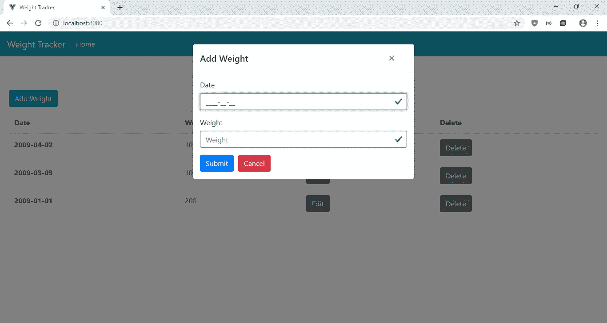
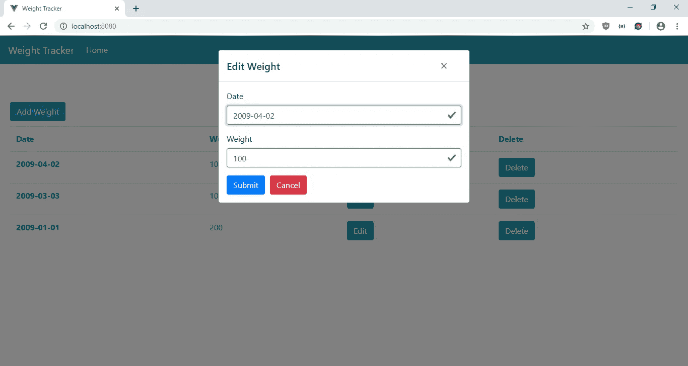
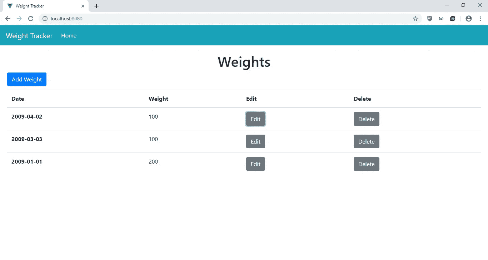
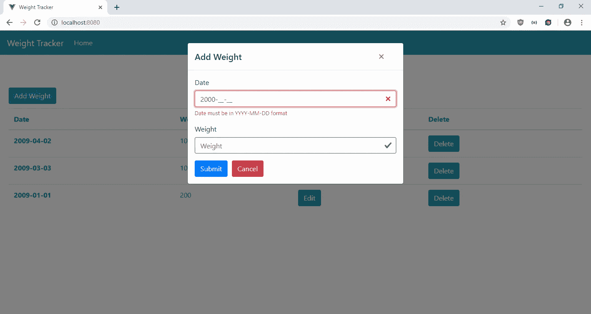

# 如何添加输入掩码以强制输入格式

> 原文：<https://javascript.plainenglish.io/how-to-add-input-mask-to-enforce-input-format-e2bf72cad17f?source=collection_archive---------0----------------------->

设置输入验证总是很麻烦。输入掩码是一种以简单的方式强制用户输入格式的方法。当输入掩码应用于输入元素时，只能输入设定格式的输入。

例如，如果电话的输入掩码为，则区号可能有 3 个数字，后面是破折号，然后是前缀的 3 个数字，再后面是另一个破折号，然后是剩余的 4 个数字。

有许多 JavaScript 库可以向输入字段添加输入任务。如果我们正在编写一个 Vue.js 应用程序，我们可以使用位于[https://github.com/scleriot/vue-inputmask](https://github.com/scleriot/vue-inputmask)的 Vue-InputMask。

在本文中，我们将构建体重跟踪器，让用户以 YYYY-MM-DD 格式输入日期和用户的体重。然后，输出将显示在一个按时间倒序排序的表格中。我们也将让用户编辑和删除条目。

为了开始构建项目，我们将使用 Vue CLI。我们运行`npx @vue/cli create weight-tracker`来启动向导。然后，我们选择“手动选择功能”，并从列表中选择 Babel、Vuex 和 Vuex 路由器。

接下来，我们安装 Axios 进行 HTTP 请求，安装 Bootstrap Vue 进行样式设计，安装 Vee-Validate 进行表单验证，安装 Vue-Filter-Date-Format 显示日期，安装 Vue-Inputmask 作为输入掩码。为了安装它们，我们运行`npm i axios bootstrap-vue vee-validate vue-filter-date-format vue-inputmask`。

完成后，我们继续构建添加和编辑体重数据的表单。为此，我们在`components`文件夹中创建一个`WeightForm.vue`文件，并添加:

```
<template>
  <ValidationObserver ref="observer" v-slot="{ invalid }">
    <b-form [@submit](http://twitter.com/submit).prevent="onSubmit" novalidate>
      <b-form-group label="Date">
        <ValidationProvider name="date" rules="required|date" v-slot="{ errors }">
          <b-form-input
            type="text"
            :state="errors.length == 0"
            v-model="form.date"
            required
            placeholder="Date"
            name="date"
            v-mask="'9999-99-99'"
          ></b-form-input>
          <b-form-invalid-feedback :state="errors.length == 0">{{errors.join('. ')}}</b-form-invalid-feedback>
        </ValidationProvider>
      </b-form-group> <b-form-group label="Weight">
        <ValidationProvider
          name="weight"
          rules="required|min_value:0|max_value:9999"
          v-slot="{ errors }"
        >
          <b-form-input
            type="text"
            :state="errors.length == 0"
            v-model="form.weight"
            required
            placeholder="Weight"
            name="weight"
          ></b-form-input>
          <b-form-invalid-feedback :state="errors.length == 0">{{errors.join('. ')}}</b-form-invalid-feedback>
        </ValidationProvider>
      </b-form-group><b-button type="submit" variant="primary" style="margin-right: 10px">Submit</b-button>
      <b-button type="reset" variant="danger" [@click](http://twitter.com/click)="cancel()">Cancel</b-button>
    </b-form>
  </ValidationObserver>
</template><script>
import { requestsMixin } from "@/mixins/requestsMixin";export default {
  name: "WeightForm",
  mixins: [requestsMixin],
  props: {
    edit: Boolean,
    weight: Object
  },
  data() {
    return {
      form: {}
    };
  },
  methods: {
    async onSubmit() {
      const isValid = await this.$refs.observer.validate();
      if (!isValid) {
        return;
      }
      const offDate = new Date(this.form.date);
      const correctedDate = new Date(
        offDate.getTime() + Math.abs(offDate.getTimezoneOffset() * 60000)
      );const params = {
        ...this.form,
        date: correctedDate
      }; if (this.edit) {
        await this.editWeight(params);
      } else {
        await this.addWeight(params);
      }
      const { data } = await this.getWeights();
      this.$store.commit("setWeights", data);
      this.$emit("saved");
    },
    cancel() {
      this.$emit("cancelled");
    }
  },
  watch: {
    weight: {
      handler(val) {
        this.form = JSON.parse(JSON.stringify(val || {}));
      },
      deep: true,
      immediate: true
    }
  }
};
</script>
```

在这个文件中，我们有一个让用户输入体重的表单。我们使用 Vee-Validate 来验证我们的输入。我们使用`ValidationObserver`组件来观察组件内部表单的有效性，使用`ValidationProvider`来检查组件内部输入值的有效性规则。在`ValidationProvider`中，我们为文本输入字段提供了 BootstrapVue 输入。在`b-form-input`组件中，我们用 Vue-InputMask 将输入掩码添加到日期输入中。很简单。我们所要做的就是像在代码中一样使用 Vue-InputMask 提供的`v-mask`指令。我们还添加了 Vee-Validate 验证，以确保用户在提交之前填写了日期。在`weight`字段中，我们在 Vee-Validate 的帮助下强制最小和最大值，正如我们在`rules`中所写的。

在`onSubmit`函数中，我们通过添加时区偏移量来修正日期。我们只需要这个，因为我们有一个 YYYY-MM-DD 格式的日期，根据堆栈溢出【https://stackoverflow.com/a/14569783/6384091。之后，我们提交数据并获取最新的数据，然后将它们放入我们的 Vuex 商店。然后，我们通过向`Home.vue`组件发出`saved`事件来关闭该模态，我们将在后面对其进行修改。

我们有`watch`块来观看`weight`道具，我们将需要它来进行编辑。

接下来，我们创建一个`mixins`文件夹，并将`requestsMixin.js`添加到`mixins`文件夹中。在文件中，我们添加了:

```
const APIURL = "[http://localhost:3000](http://localhost:3000)";
const axios = require("axios");export const requestsMixin = {
  methods: {
    getWeights() {
      return axios.get(`${APIURL}/weights`);
    }, addWeight(data) {
      return axios.post(`${APIURL}/weights`, data);
    }, editWeight(data) {
      return axios.put(`${APIURL}/weights/${data.id}`, data);
    }, deleteWeight(id) {
      return axios.delete(`${APIURL}/weights/${id}`);
    }
  }
};
```

这些是我们在组件中用来发出 HTTP 请求以获取和保存数据的函数。

接下来在`Home.vue`中，将现有代码替换为:

```
<template>
  <div class="page">
    <h1 class="text-center">Weights</h1>
    <b-button-toolbar class="button-toolbar">
      <b-button [@click](http://twitter.com/click)="openAddModal()" variant="primary">Add Weight</b-button>
    </b-button-toolbar> <b-table-simple responsive>
      <b-thead>
        <b-tr>
          <b-th sticky-column>Date</b-th>
          <b-th>Weight</b-th>
          <b-th>Edit</b-th>
          <b-th>Delete</b-th>
        </b-tr>
      </b-thead>
      <b-tbody>
        <b-tr v-for="w in weights" :key="w.id">
          <b-th sticky-column>{{ new Date(w.date) | dateFormat('YYYY-MM-DD') }}</b-th>
          <b-td>{{w.weight}}</b-td>
          <b-td>
            <b-button [@click](http://twitter.com/click)="openEditModal(w)">Edit</b-button>
          </b-td>
          <b-td>
            <b-button [@click](http://twitter.com/click)="deleteOneWeight(w.id)">Delete</b-button>
          </b-td>
        </b-tr>
      </b-tbody>
    </b-table-simple> <b-modal id="add-modal" title="Add Weight" hide-footer>
      <WeightForm [@saved](http://twitter.com/saved)="closeModal()" [@cancelled](http://twitter.com/cancelled)="closeModal()" :edit="false" />
    </b-modal> <b-modal id="edit-modal" title="Edit Weight" hide-footer>
      <WeightForm
        [@saved](http://twitter.com/saved)="closeModal()"
        [@cancelled](http://twitter.com/cancelled)="closeModal()"
        :edit="true"
        :weight="selectedWeight"
      />
    </b-modal>
  </div>
</template><script>
// @ is an alias to /src
import WeightForm from "@/components/WeightForm.vue";
import { requestsMixin } from "@/mixins/requestsMixin";export default {
  name: "home",
  components: {
    WeightForm
  },
  mixins: [requestsMixin],
  computed: {
    weights() {
      return this.$store.state.weights.sort(
        (a, b) => +new Date(b.date) - +new Date(a.date)
      );
    }
  },
  beforeMount() {
    this.getAllWeights();
  },
  data() {
    return {
      selectedWeight: {}
    };
  },
  methods: {
    openAddModal() {
      this.$bvModal.show("add-modal");
    },
    openEditModal(weight) {
      this.$bvModal.show("edit-modal");
      this.selectedWeight = weight;
    },
    closeModal() {
      this.$bvModal.hide("add-modal");
      this.$bvModal.hide("edit-modal");
      this.selectedWeight = {};
    },
    async deleteOneWeight(id) {
      await this.deleteWeight(id);
      this.getAllWeights();
    },
    async getAllWeights() {
      const { data } = await this.getWeights();
      this.$store.commit("setWeights", data);
    }
  }
};
</script><style scoped>
</style>
```

我们有一个用 BootstrapVue 表显示输入数据的表。在每一行中，都有一个编辑和删除按钮来打开编辑模式并将数据传递给`WeightForm`，并分别删除条目。

当页面加载时，我们通过在`beforeMount`钩子中调用`getAllWeights`函数来获取所有输入的数据。在`getAllWeights`函数中，我们将所有内容都放在 Vuex 存储中。然后在这里，我们通过在代码的`computed`块中放入`this.$store.state.weights`来获得商店的最新状态。在那里，我们也按时间倒序对重量数据进行排序。

接下来在`App.vue`中，我们将现有代码替换为:

```
<template>
  <div id="app">
    <b-navbar toggleable="lg" type="dark" variant="info">
      <b-navbar-brand to="/">Weight Tracker</b-navbar-brand> <b-navbar-toggle target="nav-collapse"></b-navbar-toggle> <b-collapse id="nav-collapse" is-nav>
        <b-navbar-nav>
          <b-nav-item to="/" :active="path  == '/'">Home</b-nav-item>
        </b-navbar-nav>
      </b-collapse>
    </b-navbar>
    <router-view />
  </div>
</template><script>
export default {
  data() {
    return {
      path: this.$route && this.$route.path
    };
  },
  watch: {
    $route(route) {
      this.path = route.path;
    }
  }
};
</script><style lang="scss">
.page {
  padding: 20px;
}button,
.btn.btn-primary {
  margin-right: 10px !important;
}.button-toolbar {
  margin-bottom: 10px;
}
</style>
```

在页面顶部添加一个引导导航条，并添加一个`router-view`来显示我们定义的路线。此`style`部分没有限定范围，因此样式将全局应用。在`.page`选择器中，我们给页面添加一些填充。我们在剩余的`style`代码中给按钮添加一些填充。

然后在`main.js`中，将现有代码替换为:

```
import Vue from "vue";
import App from "./App.vue";
import router from "./router";
import store from "./store";
import BootstrapVue from "bootstrap-vue";
import "bootstrap/dist/css/bootstrap.css";
import "bootstrap-vue/dist/bootstrap-vue.css";
import { ValidationProvider, extend, ValidationObserver } from "vee-validate";
import { required, min_value, max_value } from "vee-validate/dist/rules";
import VueFilterDateFormat from "vue-filter-date-format";
const VueInputMask = require("vue-inputmask").default;Vue.use(VueInputMask);
Vue.use(VueFilterDateFormat);
extend("required", required);
extend("min_value", min_value);
extend("max_value", max_value);
extend("date", {
  validate: value =>
    /([12]\d{3}-(0[1-9]|1[0-2])-(0[1-9]|[12]\d|3[01]))/.test(value),
  message: "Date must be in YYYY-MM-DD format"
});
Vue.component("ValidationProvider", ValidationProvider);
Vue.component("ValidationObserver", ValidationObserver);
Vue.use(BootstrapVue);Vue.config.productionTip = false;new Vue({
  router,
  store,
  render: h => h(App)
}).$mount("#app");
```

我们在这里添加了我们需要的所有库，包括 BootstrapVue JavaScript 和 CSS，Vee-Validate 组件以及验证规则，Vue-InputMask 库和 Vue-Filter-Date-Format 库都添加到这里，供我们的应用程序使用。添加了`min_value`和`max_value`规则来验证重量，我们制定了一个`date`规则来验证日期是否为 YYYY-MM-DD 格式。

在`router.js`中，我们将现有代码替换为:

```
import Vue from "vue";
import Router from "vue-router";
import Home from "./views/Home.vue";Vue.use(Router);export default new Router({
  mode: "history",
  base: process.env.BASE_URL,
  routes: [
    {
      path: "/",
      name: "home",
      component: Home
    }
  ]
});
```

将主页包含在我们的路线中，以便用户可以看到该页面。

在`store.js`中，我们将现有代码替换为:

```
import Vue from "vue";
import Vuex from "vuex";Vue.use(Vuex);export default new Vuex.Store({
  state: {
    weights: []
  },
  mutations: {
    setWeights(state, payload) {
      state.weights = payload;
    }
  },
  actions: {}
});
```

将我们的`weights` 状态添加到存储中，这样我们就可以在`WeightForm` 和`HomePage`组件的`computed`块中观察到它。我们有`setWeights` 函数来更新`passwords`状态，我们通过调用`this.$store.commit(“setWeights”, data);`在组件中使用它，就像我们在`WeightForm`中做的那样。

最后，在`index.html`中，我们将现有代码替换为:

```
<!DOCTYPE html>
<html lang="en">
  <head>
    <meta charset="utf-8" />
    <meta http-equiv="X-UA-Compatible" content="IE=edge" />
    <meta name="viewport" content="width=device-width,initial-scale=1.0" />
    <link rel="icon" href="<%= BASE_URL %>favicon.ico" />
    <title>Weight Tracker</title>
  </head>
  <body>
    <noscript>
      <strong
        >We're sorry but vue-input-mask-tutorial-app doesn't work properly
        without JavaScript enabled. Please enable it to continue.</strong
      >
    </noscript>
    <div id="app"></div>
    <!-- built files will be auto injected -->
  </body>
</html>
```

更改我们应用程序的标题。

经过所有的努力，我们可以通过运行`npm run serve`来启动我们的应用程序。

为了启动后端，我们首先通过运行`npm i json-server`来安装`json-server`包。然后，转到我们的项目文件夹并运行:

```
json-server --watch db.json
```

在`db.json`中，将文本改为:

```
{
  "weights": [
  ]
}
```

所以我们有了定义在可用的`requests.js`中的`weights`端点。

经过所有的努力，我们得到了:

