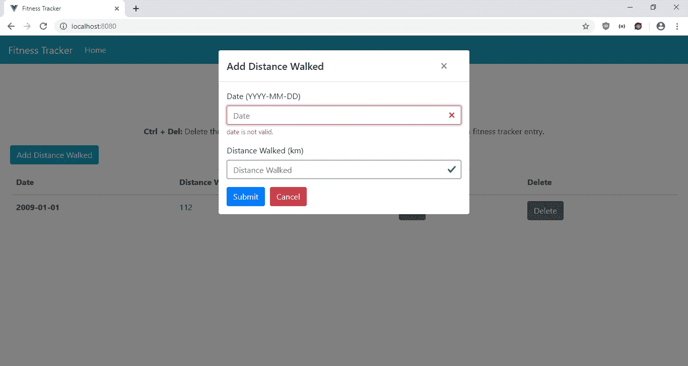
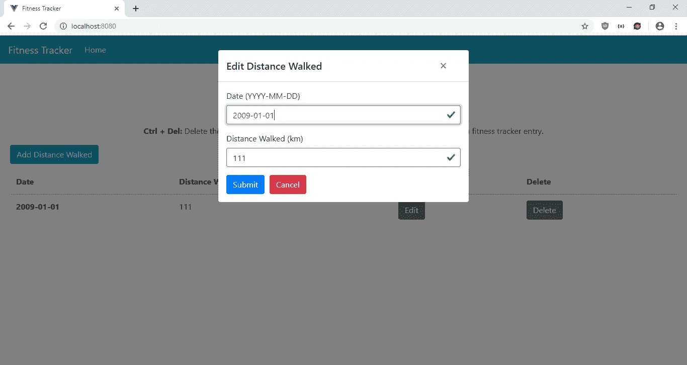
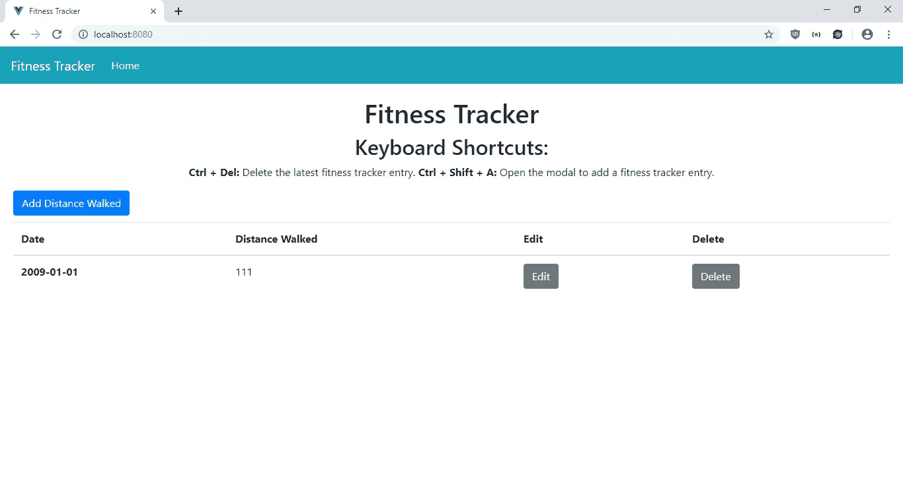

# 如何向 Vue.js 应用程序添加键盘快捷键

> 原文：<https://javascript.plainenglish.io/how-to-add-keyboard-shortcuts-to-your-vue-js-app-bef84afbe8aa?source=collection_archive---------0----------------------->

键盘快捷键对用户来说是一个非常方便的功能。这使得他们无需点击鼠标就能完成工作，从而提高了工作效率。通过位于[https://github.com/Dafrok/v-hotkey](https://github.com/Dafrok/v-hotkey)的 V-Hotkey 插件，可以很容易地将键盘快捷键处理添加到 Vue.js 应用程序中。

在本文中，我们将编写一个健身追踪器应用程序，让用户输入他们在某一天行走的距离。他们可以使用键盘快捷键来打开模式以添加条目，也可以删除最新的条目。为了启动项目，我们通过运行以下命令来运行 Vue CLI:

```
npx @vue/cli create fitness-tracker
```

在 Vue CLI 向导中，选择“手动选择功能”,然后选择 Babel、Vuex、Vue 路由器和 CSS 预处理器。

然后我们安装几个库。我们将安装 Axios 进行 HTTP 请求，BootstrapVue 进行样式设计，V-Hotkey 用于定义键盘快捷键，Moment 用于格式化日期，Vue-Filter-Date-Format 用于格式化日期。要安装它们，我们运行:

```
npm i axios bootstrap-vue v-hotkey vee-validate vue-filter-date-format moment
```

接下来，我们开始编写应用程序。我们首先创建一个表单来添加和编辑他们的步行距离条目。在`components`文件夹中创建一个名为`FitnessForm.vue`的文件，并添加:

```
<template>
  <ValidationObserver ref="observer" v-slot="{ invalid }">
    <b-form [@submit](http://twitter.com/submit).prevent="onSubmit" novalidate>
      <b-form-group label="Date (YYYY-MM-DD)">
        <ValidationProvider name="date" rules="required|date" v-slot="{ errors }">
          <b-form-input
            type="text"
            :state="errors.length == 0"
            v-model="form.date"
            required
            placeholder="Date"
            name="date"
          ></b-form-input>
          <b-form-invalid-feedback :state="errors.length == 0">{{errors.join('. ')}}</b-form-invalid-feedback>
        </ValidationProvider>
      </b-form-group> <b-form-group label="Distance Walked (km)">
        <ValidationProvider
          name="distance"
          rules="required|min_value:0|max_value:9999"
          v-slot="{ errors }"
        >
          <b-form-input
            type="text"
            :state="errors.length == 0"
            v-model="form.distance"
            required
            placeholder="Distance Walked"
            name="distance"
          ></b-form-input>
          <b-form-invalid-feedback :state="errors.length == 0">{{errors.join('. ')}}</b-form-invalid-feedback>
        </ValidationProvider>
      </b-form-group> <b-button type="submit" variant="primary" style="margin-right: 10px">Submit</b-button>
      <b-button type="reset" variant="danger" [@click](http://twitter.com/click)="cancel()">Cancel</b-button>
    </b-form>
  </ValidationObserver>
</template><script>
import { requestsMixin } from "@/mixins/requestsMixin";
import * as moment from 'moment';export default {
  name: "FitnessForm",
  mixins: [requestsMixin],
  props: {
    edit: Boolean,
    distance: Object
  },
  data() {
    return {
      form: {}
    };
  },
  methods: {
    async onSubmit() {
      const isValid = await this.$refs.observer.validate();
      if (!isValid) {
        return;
      }
      const offDate = new Date(this.form.date);
      const correctedDate = new Date(
        offDate.getTime() + Math.abs(offDate.getTimezoneOffset() * 60000)
      );const params = {
        ...this.form,
        date: correctedDate
      };if (this.edit) {
        await this.editDistance(params);
      } else {
        await this.addDistance(params);
      }
      const { data } = await this.getDistances();
      this.$store.commit("setDistances", data);
      this.$emit("saved");
    },
    cancel() {
      this.$emit("cancelled");
    }
  },
  watch: {
    distance: {
      handler(val) {
        this.form = JSON.parse(JSON.stringify(val || {}));
        this.form.date = moment(this.form.date).format("YYYY-MM-DD");
      },
      deep: true,
      immediate: true
    }
  }
};
</script>
```

在这个文件中，我们有一个表单让用户输入他们在每个日期行走的距离。我们使用 Vee-Validate 来验证我们的输入。我们使用`ValidationObserver`组件来观察组件内部表单的有效性，使用`ValidationProvider`来检查组件内部输入值的有效性规则。在`ValidationProvider`中，我们为文本输入字段提供了 BootstrapVue 输入。在`b-form-input`组件中。我们还添加了 Vee-Validate 验证，以确保用户在提交之前已经填写了日期。在`distance`字段中，我们在`rules`中所写的 Vee-Validate 的帮助下执行最小值和最大值。

在`onSubmit`函数中，我们通过在日期上添加时区偏移量来修正日期。根据堆栈溢出[https://stackoverflow.com/a/14569783/6384091](https://stackoverflow.com/a/14569783/6384091)，我们只需要这个，因为我们有一个 YYYY-MM-DD 格式的日期。之后，我们提交数据并获取最新的数据，然后将它们放入我们的 Vuex 商店。然后，我们通过向`Home.vue`组件发出`saved`事件来关闭该模式，我们将在后面对其进行修改。

我们有`watch`块来观看`distance`道具，我们将需要它来进行编辑。如果日期存在，我们用 Moment.js 格式化日期，使其符合 YYYY-MM-DD 格式。我们这样做是为了让编辑表单为日期字段显示正确的值。我们运行`JSON.stringify`然后`JSON.parse`来制作`distance`道具的深层副本，这样在保存之前我们不会修改原始道具。

接下来，我们创建一个`mixins`文件夹，并将`requestsMixin.js`添加到`mixins`文件夹中。在文件中，我们添加了:

```
const APIURL = "[http://localhost:3000](http://localhost:3000)";
const axios = require("axios");export const requestsMixin = {
  methods: {
    getDistances() {
      return axios.get(`${APIURL}/distances`);
    }, addDistance(data) {
      return axios.post(`${APIURL}/distances`, data);
    }, editDistance(data) {
      return axios.put(`${APIURL}/distances/${data.id}`, data);
    }, deleteDistance(id) {
      return axios.delete(`${APIURL}/distances/${id}`);
    }
  }
};
```

这些是我们在组件中用来发出 HTTP 请求以获取和保存数据的函数。

接下来在`Home.vue`中，将现有代码替换为:

```
<template>
  <div class="page" v-hotkey="keymap">
    <div class="text-center">
      <h1>Fitness Tracker</h1>
      <h2>Keyboard Shortcuts:</h2>
      <p>
        <b>Ctrl + Del:</b> Delete the latest fitness tracker entry.
        <b>Ctrl + Shift + A:</b> Open the modal to add a fitness tracker entry.
      </p>
    </div>
    <b-button-toolbar class="button-toolbar">
      <b-button [@click](http://twitter.com/click)="openAddModal()" variant="primary">Add Distance Walked</b-button>
    </b-button-toolbar><b-table-simple responsive>
      <b-thead>
        <b-tr>
          <b-th sticky-column>Date</b-th>
          <b-th>Distance Walked</b-th>
          <b-th>Edit</b-th>
          <b-th>Delete</b-th>
        </b-tr>
      </b-thead>
      <b-tbody>
        <b-tr v-for="d in distances" :key="d.id">
          <b-th sticky-column>{{ new Date(d.date) | dateFormat('YYYY-MM-DD') }}</b-th>
          <b-td>{{d.distance}}</b-td>
          <b-td>
            <b-button [@click](http://twitter.com/click)="openEditModal(d)">Edit</b-button>
          </b-td>
          <b-td>
            <b-button [@click](http://twitter.com/click)="deleteOneWeight(d.id)">Delete</b-button>
          </b-td>
        </b-tr>
      </b-tbody>
    </b-table-simple><b-modal id="add-modal" title="Add Distance Walked" hide-footer>
      <FitnessForm [@saved](http://twitter.com/saved)="closeModal()" [@cancelled](http://twitter.com/cancelled)="closeModal()" :edit="false" />
    </b-modal><b-modal id="edit-modal" title="Edit Distance Walked" hide-footer>
      <FitnessForm
        [@saved](http://twitter.com/saved)="closeModal()"
        [@cancelled](http://twitter.com/cancelled)="closeModal()"
        :edit="true"
        :distance="selectedDistance"
      />
    </b-modal>
  </div>
</template><script>
// @ is an alias to /src
import FitnessForm from "@/components/FitnessForm.vue";
import { requestsMixin } from "@/mixins/requestsMixin";export default {
  name: "home",
  components: {
    FitnessForm
  },mixins: [requestsMixin],
  computed: {
    distances() {
      return this.$store.state.distances.sort(
        (a, b) => +new Date(b.date) - +new Date(a.date)
      );
    },
    keymap() {
      return {
        "ctrl+del": this.deleteLatest,
        "ctrl+shift+a": this.openAddModal
      };
    }
  },
  beforeMount() {
    this.getAllDistances();
  },
  data() {
    return {
      selectedDistance: {}
    };
  },
  methods: {
    openAddModal() {
      this.$bvModal.show("add-modal");
    },
    openEditModal(Distance) {
      this.$bvModal.show("edit-modal");
      this.selectedDistance = Distance;
    },
    closeModal() {
      this.$bvModal.hide("add-modal");
      this.$bvModal.hide("edit-modal");
      this.selectedDistance = {};
    },
    async deleteOneDistance(id) {
      await this.deleteDistance(id);
      this.getAllDistances();
    },
    async getAllDistances() {
      const { data } = await this.getDistances();
      this.$store.commit("setDistances", data);
    },
    deleteLatest() {
      this.deleteOneDistance(this.distances[0].id);
    }
  }
};
</script>
```

我们有一个用 BootstrapVue 表显示输入数据的表。在每一行中，都有一个编辑和删除按钮来打开编辑模式并将数据传递给`FitnessForm`，并分别删除条目。

当页面加载时，我们通过在`beforeMount`钩子中调用`getAllDistances`函数来获取所有输入的数据。在`getAllDistances`函数中，我们将所有内容都放在 Vuex 存储中。然后在这里，我们通过在代码的`computed`块中放入`this.$store.state.distances`来获得商店的最新状态。在那里，我们也按时间倒序对重量数据进行排序。

在`script`部分，我们用计算出的`keymap`属性来定义快捷键组合。我们将该对象传递给`v-hotkey`指令来启用键盘快捷键。`keymap`属性的按键有键盘组合，值有运行的功能。所以如果我们同时按 Ctrl 和 Delete，我们运行`this.deleteLatest`来删除最新的条目。如果我们同时按下 Ctrl、Shift 和 A，我们就调用`this.openAddModal`来打开模态来添加一个新条目。

接下来在`App.vue`中，我们将现有代码替换为:

```
<template>
  <div id="app">
    <b-navbar toggleable="lg" type="dark" variant="info">
      <b-navbar-brand to="/">Fitness Tracker</b-navbar-brand><b-navbar-toggle target="nav-collapse"></b-navbar-toggle><b-collapse id="nav-collapse" is-nav>
        <b-navbar-nav>
          <b-nav-item to="/" :active="path  == '/'">Home</b-nav-item>
        </b-navbar-nav>
      </b-collapse>
    </b-navbar>
    <router-view />
  </div>
</template><script>
export default {
  data() {
    return {
      path: this.$route && this.$route.path
    };
  },
  watch: {
    $route(route) {
      this.path = route.path;
    }
  }
};
</script><style lang="scss">
.page {
  padding: 20px;
}button,
.btn.btn-primary {
  margin-right: 10px !important;
}.button-toolbar {
  margin-bottom: 10px;
}
</style>
```

在页面顶部添加一个引导导航条，并添加一个`router-view`来显示我们定义的路线。这个`style`部分没有限定范围，所以样式将全局应用。在`.page`选择器中，我们给页面添加一些填充。我们在剩余的`style`代码中给按钮添加一些填充。

然后在`main.js`中，将现有代码替换为:

```
import Vue from "vue";
import App from "./App.vue";
import router from "./router";
import store from "./store";
import BootstrapVue from "bootstrap-vue";
import "bootstrap/dist/css/bootstrap.css";
import "bootstrap-vue/dist/bootstrap-vue.css";
import { ValidationProvider, extend, ValidationObserver } from "vee-validate";
import { required, min_value, max_value } from "vee-validate/dist/rules";
import VueFilterDateFormat from "vue-filter-date-format";
import VueHotkey from "v-hotkey";Vue.use(VueHotkey);
Vue.use(VueFilterDateFormat);
extend("required", required);
extend("min_value", min_value);
extend("max_value", max_value);
extend("date", {
  validate: value =>
    /([12]\d{3}-(0[1-9]|1[0-2])-(0[1-9]|[12]\d|3[01]))/.test(value),
  message: "Date must be in YYYY-MM-DD format"
});
Vue.component("ValidationProvider", ValidationProvider);
Vue.component("ValidationObserver", ValidationObserver);
Vue.use(BootstrapVue);Vue.config.productionTip = false;new Vue({
  router,
  store,
  render: h => h(App)
}).$mount("#app");
```

我们在这里添加了我们需要的所有库，包括 BootstrapVue JavaScript 和 CSS、Vee-Validate 组件以及验证规则、V-Hotkey 库和 Vue-Filter-Date-Format 库，这些库都是为了在我们的应用程序中使用而添加的。添加了`min_value`和`max_value`规则来验证重量，我们制定了`date`规则来验证日期是否为 YYYY-MM-DD 格式。

在`router.js`中，我们将现有代码替换为:

```
import Vue from "vue";
import Router from "vue-router";
import Home from "./views/Home.vue";Vue.use(Router);export default new Router({
  mode: "history",
  base: process.env.BASE_URL,
  routes: [
    {
      path: "/",
      name: "home",
      component: Home
    }
  ]
});
```

将主页包含在我们的路线中，以便用户可以看到该页面。

在`store.js`中，我们将现有代码替换为:

```
import Vue from "vue";
import Vuex from "vuex";Vue.use(Vuex);export default new Vuex.Store({
  state: {
    distances: []
  },
  mutations: {
    setDistances(state, payload) {
      state.distances = payload;
    }
  },
  actions: {}
});
```

将我们的`distances` 状态添加到存储中，这样我们就可以在`FitnessForm` 和`HomePage`组件的`computed`块中观察到它。我们有`setDistances`函数来更新`distances` 状态，我们通过调用`this.$store.commit(“setDistances”, data);`在组件中使用它，就像我们在`FitnessForm`中做的那样。

最后，在`index.html`中，我们将现有代码替换为:

```
<!DOCTYPE html>
<html lang="en">
  <head>
    <meta charset="utf-8" />
    <meta http-equiv="X-UA-Compatible" content="IE=edge" />
    <meta name="viewport" content="width=device-width,initial-scale=1.0" />
    <link rel="icon" href="<%= BASE_URL %>favicon.ico" />
    <title>Fitness Tracker</title>
  </head>
  <body>
    <noscript>
      <strong
        >We're sorry but vue-hotkey-tutorial-app doesn't work properly without
        JavaScript enabled. Please enable it to continue.</strong
      >
    </noscript>
    <div id="app"></div>
    <!-- built files will be auto injected -->
  </body>
</html>
```

更改我们应用程序的标题。

在所有的努力之后，我们可以通过运行`npm run serve`来启动我们的 app。

为了启动后端，我们首先通过运行`npm i json-server`来安装`json-server`包。然后，转到我们的项目文件夹并运行:

```
json-server --watch db.json
```

在`db.json`中，将文本更改为:

```
{
  "distances": [
  ]
}
```

所以我们有了在`requests.js`中定义的`distances`端点。

经过所有的努力，我们得到了:

