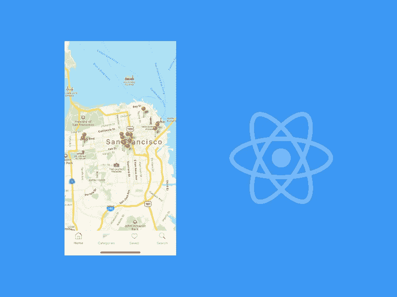
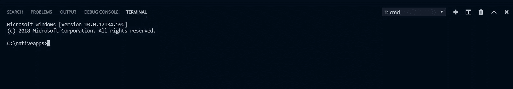
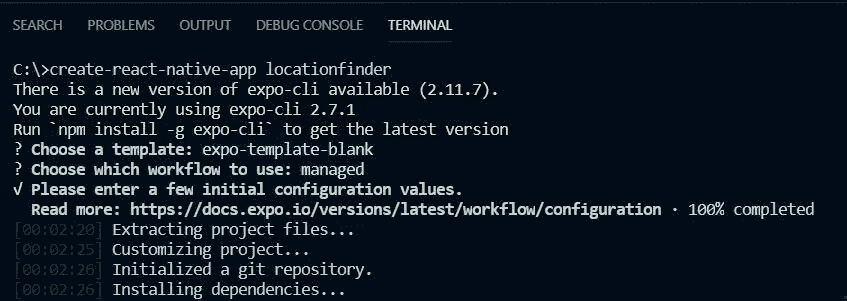
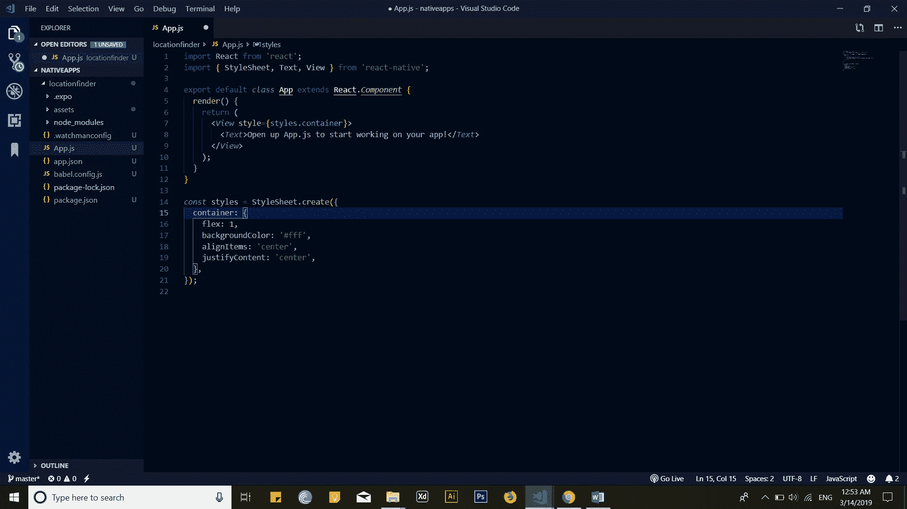
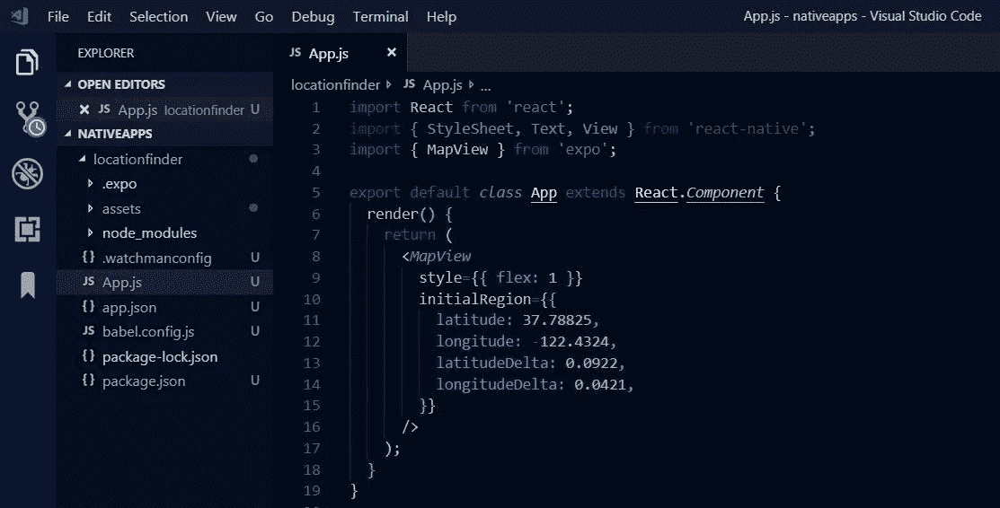
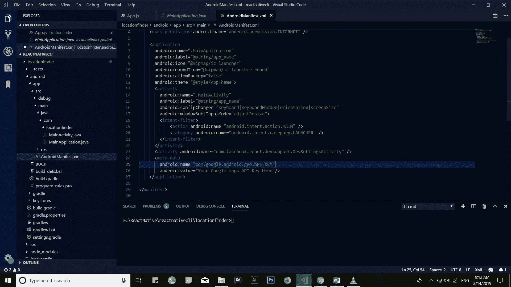
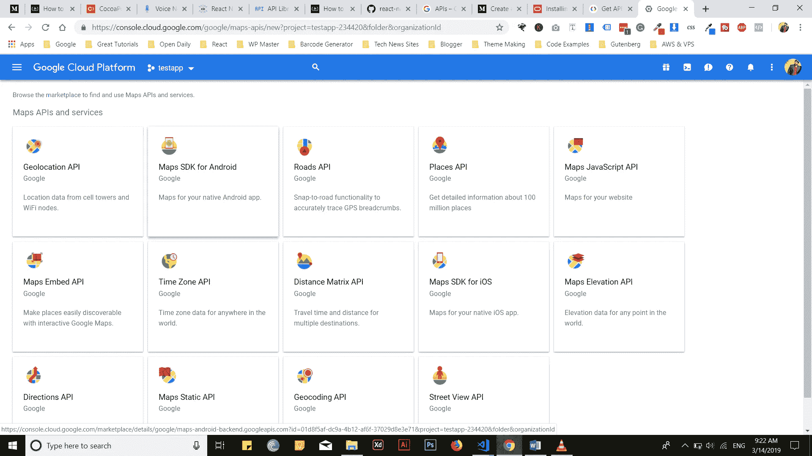
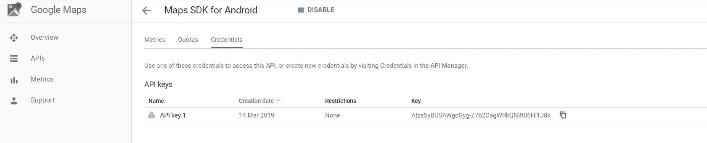
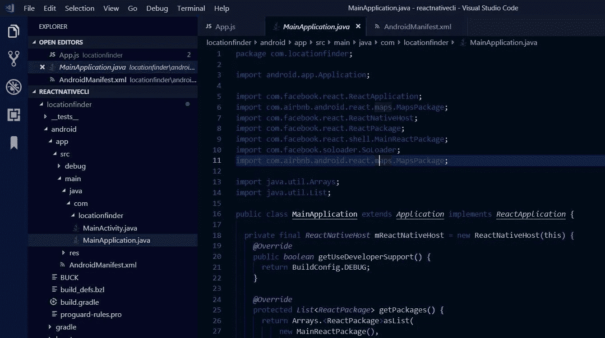
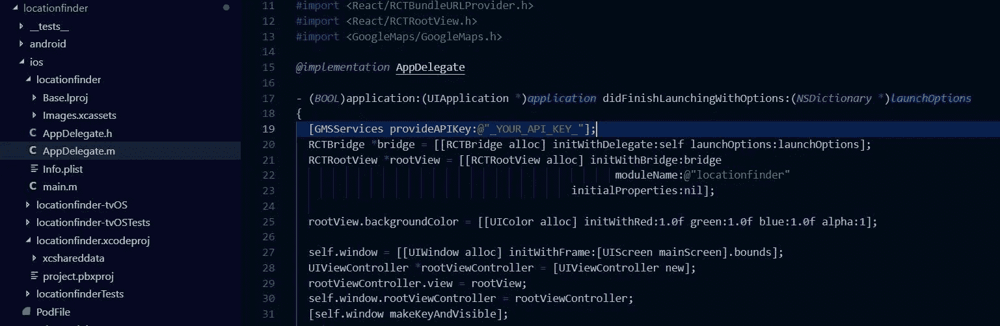

# 如何在 React Native 中添加地图

> 原文：<https://javascript.plainenglish.io/how-to-add-maps-in-react-native-be49348987e?source=collection_archive---------14----------------------->



如今，你可能已经在几乎所有的应用程序中看到了谷歌地图。一些手机应用程序显示他们的商店位置，跟踪用户(如优步)，显示附近的地方等。由此可见，地图支持在移动应用中的重要性。今天，我们将使用流行的 React 原生地图包，逐步将谷歌地图集成到 React 原生应用中。

在 Instamobile，我们在许多 [React 原生模板](https://www.instamobile.io/app-templates)中使用了这种精确的实现，例如[商店定位器应用模板](https://www.instamobile.io/app-templates/react-native-store-locator-app-template/)。

作为开发者或者公司，管理好自己 app 的代码库是非常重要的。因此，目前在移动应用程序开发中，有像 React Native 这样的平台，您可以为 iOS 和 Android 应用程序。我不会在文章中深入探讨 react 和 react native 的内容，相反，我们将更多地关注 iOS 和 Android 平台应用程序上的谷歌地图集成。

有两种方法可以将谷歌地图集成到 React 原生移动应用程序中:

我想澄清一下这两者之间的一些差异。

**react-native-cli** 是开发者友好的，并且提供了使用本地组件的灵活性。但是有了这个，你必须配置应用程序中的每一个细节。除此之外，如果你想测试你的应用程序，那么你必须使用真实的设备，或者你必须使用 iOS 和 Android 的模拟器。在安装和配置各种 rpm 包时，您可能会产生许多错误。

**create-react-native-app，**可以 expo SDK 内置模块。这是一个可以更快开发应用程序的无障碍环境。你不需要任何设备(甚至模拟器)来运行和测试应用程序。你只需要开发代码，并使用为 Android 和 iOS 构建的 expo 应用进行测试。您只需要使用 *npm start* 运行时应用程序生成的二维码。

在 Java 或 swift 等原生代码库中集成这样的模块非常容易。我想说的是，在阅读完整个教程后，你可以很容易地将谷歌地图与 React Native 集成在一起。您还将学习如何从头开始构建一个全新的 React 原生应用程序。那么，事不宜迟，让我们开始吧。

## 先决条件

我们假设您至少具备 JavaScript、React & React Native 的基础或中级知识。先从 ***创建-反应-原生-app*** 说起。

**集成 React 原生地图需要哪些东西？**

1.**文本编辑器或 IDE** (我们使用的是 Visual Studio 代码)

2.**节点 JS** (总是需要安装包&其他东西)

3. **create-react-native-app，**(一个 CLI 命令行工具，用于在您的系统上安装 React Native。)

如何在本地系统上安装 React Native？让我们在我们的系统上安装 React Native。在 Windows 中使用 VS 代码打开你的命令行或者进入菜单上的终端，点击 ***添加一个新的终端*** 。



运行命令:

**> npm 安装-g 创建-反应-本机-应用**

*   npm: (节点软件包管理器，管理从安装到删除的所有软件包)。
*   **install:** Install 用于向 NPM 发出安装软件包的命令。也可以用-I 代替这个。
*   **-g:** 表示或说 NPM 在系统中全局安装 create-react-native-app。这意味着在这个命令之后，它将在您的所有系统中可用，并且您可以在任何目录中创建一个 react 本机应用程序。
*   **create-react-Native-app:**React 原生开发者制作的一款工具，让在 React 原生中启动一个新的移动应用变得更加省事。它会生成所有需要的样板代码，让您立即开始应用程序开发过程。

那么，让我们进入下一步。

现在是深入研究项目实质的时候了。我们将建立一个集成谷歌地图的应用程序。我们的应用程序的名称是什么？**姑且称之为“定位仪”。**

## 让我们创建一个定位应用程序

在您的终端中运行以下命令:

```
create-react-native-app locationfinder
```

你会看到很多依赖项的安装，并且需要一些时间在你的系统上安装，如图所示。



当你在命令行中按回车键时。它会问你你想要什么:一个空白模板或选项卡式模板。再次按回车键选择应用程序空白模板。之后，它会问你的应用程序名称，也显示鼻涕虫给你。别担心，输入你想要的名字。

在安装完成之前，你可以去喝杯咖啡。通常需要几分钟。

现在，你的应用终于创建好了。如果要运行并测试安装，请在命令行中键入:

**>光盘定位仪**(进入 app 文件夹)

**> npm 启动**

您可以通过扫描命令生成的二维码，使用**E**xpo app 测试使用。否则，您可以使用 iOS 的模拟器和 Android 的模拟器。要使用它们，在 iOS 上按“I”，在 Android 上按“a”。您可以使用任何第三方仿真器，如 Gennymotion。

这是一个地图实施项目。当我们制作这个项目时，这个项目的依赖项是:

**1。“博览会”:“. 0.0”，2。“反应”:“16.5.0”，3。" react-native": " .0.0"4。" react-native-maps ":" 0 . 22 . 0 "**

默认情况下，Expo 使用 Airbnb 的 react-native-maps。目前 Expo SDK 使用的是 0.22.0 版本。因为这个内置了 create-react-native-app 和 expo。

您可以在 VS 代码中看到类似的文件夹结构，如下所示:



正如我前面所说，我们将使用 Expo SDK，react-native-maps 是 Expo SDK 中集成谷歌地图的内置功能之一。您不需要像在 react-native-cli 中那样单独为 Android 和 iOS 安装和配置 react-native-maps。

## 将 React 本机地图集成到 React 本机应用程序中

现在您已经安装了所有需要的依赖项，您可以在 React 本地应用程序中导入 MapView。您需要对 ***app.js*** 文件进行如下修改:

```
import React, { Component } from 'react';
import { Platform, StyleSheet, Text, View } from 'react-native';
import MapView, { PROVIDER_GOOGLE } from 'react-native-maps';
export default
class App extends React.Component {
  render() {
    return (
      <MapView
         style={{ flex: 1 }}
         provider={PROVIDER_GOOGLE}
         showsUserLocation
         initialRegion={{
         latitude: 37.78825,
         longitude: -122.4324,
         latitudeDelta: 0.0922,
         longitudeDelta: 0.0421}}
      />
    );
  }
}
```



伟大的里程碑！现在，谷歌地图已经集成到您的移动应用程序中。有几种方法可以让它更直观。您可以在地图中添加的功能，例如您可以要求用户提供对其当前位置的访问权限。你也可以追踪用户的位置。你也可以在谷歌地图上看到的地方添加标记和标签。您还可以根据需要自定义地图。

纬度和经度用来表示物体的位置。l *atitudeDelta* 和 *longitudeDelta* 用于提供地图中的缩放选项。

**我在 Android 上试过，效果不错。你可以在 iPhone 设备上试用，然后在评论区告诉我。随便贴个你的应用截图炫耀一下吧。**

**(或者)使用 react-native-cli 创建 Rect Native App****步骤 1:安装 react-native-cli 并创建 App**

让我们使用 react-native-cli 从头开始制作同一个应用程序。您需要按照相同的方式安装 react-native-cli。在终端中，运行:

**NPM install-g react-native-CLI**

这需要一点时间。之后，运行另一个命令来创建应用程序:

**react-native init location finder**

这在安装时也需要一些时间。安装后，使用***>CD location finder*进入文件夹。**你只能在 Android 或 iOS 模拟器上运行这个应用程序，对 iOS 使用这些命令，***react-native run-iOS***和对 Android***react-native run-Android***。

**第二步:安装 react-native-maps 包**

Airbnb 创建的 react-native-maps。它是开源的，任何人都可以用它来访问谷歌地图。要在应用程序中安装它:

**> locationfinder/npm 安装-保存 react-native-maps**

安装完成后。您需要将此包与您当前的应用程序链接，以便可以在您的应用程序中使用该包的方法。

所以，让我们为 Android 和 iOS 配置地图文件。

## 为 Android 配置 React-Native-Maps

我们正在详细描述这些步骤，但是我建议您也查看一下官方文档。你只需要在一些文件中做一些小的改动，但是其余的由 **react-native-cli** 自动处理。

你必须进入**安卓**文件夹**里面。**在那里，你要在***androidmanifest . XML***文件中进行修改。在这个文件中，您必须配置 **Google Maps API 键。**你可以在**Android/app/src/main/Android manifest . XML 中找到这个文件**

```
<application>
  <meta-data
     android:name=”com.google.android.geo.API_KEY”
     android:value=”Your Google maps API Key Here”/>
</application>
```

确保应用程序的元数据在应用程序标签下。用 API 键值替换 *android:value* 。



**要找到 Google API 密钥，你必须进入 [Google 的 Android 地图 SDK](https://cloud.google.com/maps-platform)如图所示。你也可以在那里看到说明。之后上谷歌的云平台如图:**



点击 Android 版地图软件开发套件，然后进入其中。您将看到下一个屏幕，在这里您可以找到**凭证。**点击它，生成类似于下图所示的 API 密匙。



在***MainApplication.java***中的变化你也可以在 ***安卓*** 文件夹中找到。文件夹树如图所示。在那里你必须导入***react-native-maps***包:

***导入 com . Airbnb . Android . react . maps . maps package；***

这个文件中还有一点需要修改。在函数中添加 ***新 MapsPackage()*** ，如下图所示

```
@Override
protected List<ReactPackage> getPackages() {
return Arrays.<ReactPackage>asList(
    new MainReactPackage(),
     new MapsPackage()
   );
}
```



**终于，一切都为安卓做好了。**现在你必须重新构建应用程序。为此，使用 react-native run-android 命令。

## 为 iOS 配置 React 本机地图

我们需要在 iOS 中添加一个 ***Podfile*** 来实现 Cocoapods。要设置，您需要进入 iOS 的*文件夹，创建一个名为的文件并粘贴下面提供的代码。在这个 ***PodFile*** 中有几个地方需要修改。*

*首先，通过移除取消注释 **# platform: ios，' 9.0'** 。接下来，您需要将**TARGET ' _ YOUR _ PROJECT _ TARGET _ ' do**更改为您的 app 名称，如—***TARGET ' location finder ' do***。之后，取消所有***react-native-maps***依赖项的注释。*

*完成所有这些更改后，保存文件。然后，进入命令行，进入 ***ios*** 文件夹，使用 ***cd ios*** 。在这个文件夹中，您必须再运行一个命令 **pod install。**这将安装所有需要的必要文件。*

```
*# Uncomment the next line to define a global platform for your project
# platform :ios, '9.0'
target '_YOUR_PROJECT_TARGET_' do
rn_path = '../node_modules/react-native'
rn_maps_path = '../node_modules/react-native-maps'
# See http://facebook.github.io/react-native/docs/integration-with-existing-apps.html#configuring-cocoapods-dependencies

pod 'yoga', path: "#{rn_path}/ReactCommon/yoga/yoga.podspec"
pod 'React', path: rn_path, subspecs: [
    'Core',
    'CxxBridge',
    'DevSupport',
    'RCTActionSheet',
    'RCTAnimation',
    'RCTGeolocation',
    'RCTImage',
    'RCTLinkingIOS',
    'RCTNetwork',
    'RCTSettings',
    'RCTText',
    'RCTVibration',
    'RCTWebSocket',
]
# React Native third party dependencies podspecs
pod 'DoubleConversion', :podspec => "#{rn_path}/third-party-podspecs/DoubleConversion.podspec"
pod 'glog', :podspec => "#{rn_path}/third-party-podspecs/glog.podspec"
# If you are using React Native <0.54, you will get the following error:
# "The name of the given podspec `GLog` doesn't match the expected one `glog`"
# Use the following line instead:
#pod 'GLog', :podspec => "#{rn_path}/third-party-podspecs/GLog.podspec"
pod 'Folly', :podspec => "#{rn_path}/third-party-podspecs/Folly.podspec"
# react-native-maps dependencies
pod 'react-native-maps', path: rn_maps_path
# pod 'react-native-google-maps', path: rn_maps_path  # Uncomment this line if you want to support GoogleMaps on iOS
# pod 'GoogleMaps'  # Uncomment this line if you want to support GoogleMaps on iOS
# pod 'Google-Maps-iOS-Utils' # Uncomment this line if you want to support GoogleMaps on iOS
end
post_install do |installer|
    installer.pods_project.targets.each do |target|
       if target.name == 'react-native-google-maps'
           target.build_configurations.each do |config|
           config.build_settings['CLANG_ENABLE_MODULES'] = 'No'
        end
    end
        if target.name == "React"
          target.remove_from_project
        end
     end
end*
```

*现在，我们必须启用 iOS 版谷歌地图。要做到这一点，我们必须将我们的 API 密钥集成到***app delegate . m***文件中。*

**

*现在我们准备在 iOS 中实现地图。所以，我们开始吧。只需粘贴下面的代码并重新构建您的应用程序。*

```
*import React, {Component} from 'react';
import {Platform, StyleSheet, Text, View} from 'react-native';
import MapView, { PROVIDER_GOOGLE } from 'react-native-maps';
export default class App extends React.Component {
render() {
  return (
    <MapView
      style={{ flex: 1 }}
      provider={PROVIDER_GOOGLE}
      showsUserLocation
      initialRegion={{
          latitude: 37.78825,
          longitude: -122.4324,
          latitudeDelta: 0.0922,
          longitudeDelta: 0.0421,
      }}
    />
  );
 }
}*
```

## *最后的话*

*在本 react 原生教程中，我们学习了如何将 React 原生地图添加到移动应用程序中。我试图解释如何在 react 原生应用中实现谷歌地图的几乎所有细节。希望你喜欢这篇文章，它有助于你的应用程序开发。如果你被困在某个地方，请在下面评论，不要犹豫，分享这篇文章。它可能会帮助其他人。*

**原载于 2020 年 3 月 16 日*[*https://www . insta mobile . io*](https://www.instamobile.io/react-native-tutorials/react-native-maps/)*。**

## ***说白了***

*你知道我们有四种出版物吗？通过[**plain English . io**](https://plainenglish.io/)找到他们——通过关注我们的出版物和 [**订阅我们的 YouTube 频道**](https://www.youtube.com/channel/UCtipWUghju290NWcn8jhyAw) **来表达你的爱吧！***