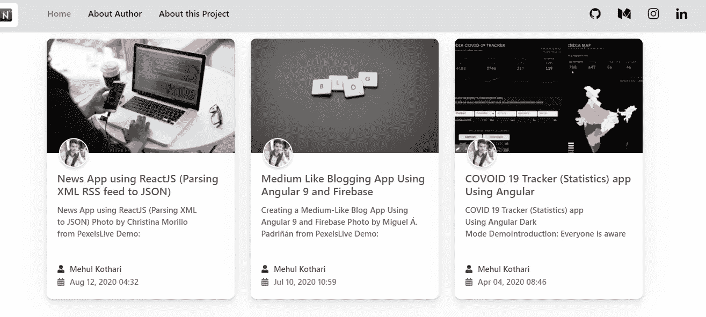
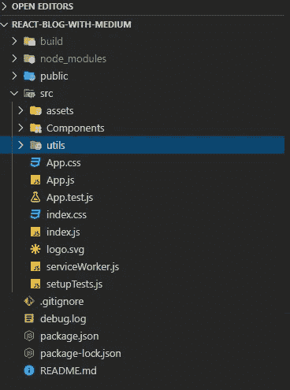
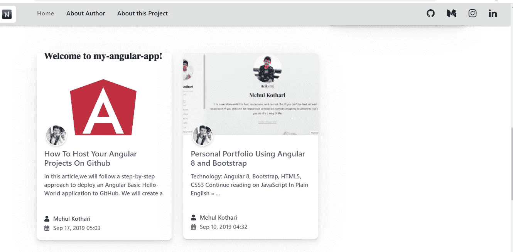

# 如何在 React 应用上添加中型博客

> 原文：<https://javascript.plainenglish.io/how-to-add-medium-blogs-on-your-react-app-a3898a729aad?source=collection_archive---------2----------------------->

## 如何在 React 应用和其他网站上嵌入中型博客

Medium 正在成为写博客、写你的项目等等的流行平台。另一方面，React 在开发人员中也变得非常流行，用来创建动态响应的 web 应用程序。在这篇文章中，我将展示如何使用 API 在 react 应用上嵌入中型博客。使用相同的 API，你可以在任何前端网络应用程序中嵌入中型博客。在这篇文章中，我要说的是如何从零开始。



## 步骤 1:设置 React 项目

首先，我们需要创建 react 应用程序。为此，请在您的 shell/终端的特定文件夹(例如，桌面)中运行以下命令

```
npx create-react-app medium-blogs-on-react
```

将使用您在命令中给出的名称创建一个新文件夹。所以对我来说，这就是媒体博客。然后你可以选择你的 IDE 来处理它。我个人使用 VS 代码

## 步骤 2:管理你的文件夹结构

所以你可以根据你的选择来选择你的文件夹结构。我个人更喜欢移动组件文件夹中的所有组件，如下所示



在组件文件夹中，我创建了两个组件。博客和显示博客。博客组件的目的是使用一个 API，获取所有的文章，并将其作为道具传递给博客组件

## 第三步:写下获取博客的逻辑

要从 Medium 获取我们的博客，我们需要一个 API 端点。因此，介质提供的 API 端点如下所示

```
mediumURL ="https://api.rss2json.com/v1/api.json?rss_url=https://medium.com/feed/@your-medium-username";
```

在 API 端点中，在 URL 的末尾替换您的介质用户名。URL 的第一部分用于将我们的 XML RSS 提要转换成 JSON 格式。这样，我们就可以编写从媒体获取博客的逻辑了。

所以在上面的代码中，我们首先初始化状态，配置文件将维护配置文件数据，项目数组将保存我们的博客。接下来，我们在生命周期方法中进行 API 调用，并存储我们的数据。然后，我们分离我们的配置文件数据并更新状态。在 render 方法中更新状态后，我们循环遍历存储在 items 数组中的所有博客项，并将所有数据作为道具传递给 ShowBlog 组件。下一步，我们将为 Show 组件编写代码来显示我们的博客。

## 步骤 4:编写代码以在 ShowBlog 组件中显示博客

在这一步中，我们将编写代码来显示我们从 API 获取的所有博客并显示出来。

## 步骤 5:最后将 ShowBlog 添加到我们的应用程序组件中

## 演示图像



# 结论

在这篇文章中，我描述了如何使用 Medium 提供的 API 将中型博客添加到任何前端网站。如果你用这个，你就不用花钱去嵌入媒体了，同时也不会浪费时间。然而，当你遵循这些方法时，你将无法在你的博客中显示你的相关文章。您可以从这个[链接](https://github.com/mehulk05/Medium-Blog-On-React-App)克隆回购

快乐编码😊

**git hub Link:**[**https://github.com/mehulk05/Medium-Blog-On-React-App**](https://github.com/mehulk05/Medium-Blog-On-React-App)

**Live Url:**[**https://mehulk05.github.io/Medium-Blog-On-React-App#/**](https://mehulk05.github.io/Medium-Blog-On-React-App/#/)

## 进一步阅读

[](https://bit.cloud/blog/how-to-build-a-composable-blog-l1jkl9f4) [## 如何构建可组合的博客

### 从头开始创建一个博客需要很多。有许多移动部件结合在一起形成了一个…

bit.cloud](https://bit.cloud/blog/how-to-build-a-composable-blog-l1jkl9f4) 

*多内容于* [***中。*报名参加我们的**](https://plainenglish.io/) **[***免费周报***](http://newsletter.plainenglish.io/) *。在*[](https://twitter.com/inPlainEngHQ)*[***上追随我们，领英***](https://www.linkedin.com/company/inplainenglish/)*[***YouTube***](https://www.youtube.com/channel/UCtipWUghju290NWcn8jhyAw)*和**********T60**不和 *对成长黑客感兴趣？查看* [***电路***](https://circuit.ooo/) ***。******