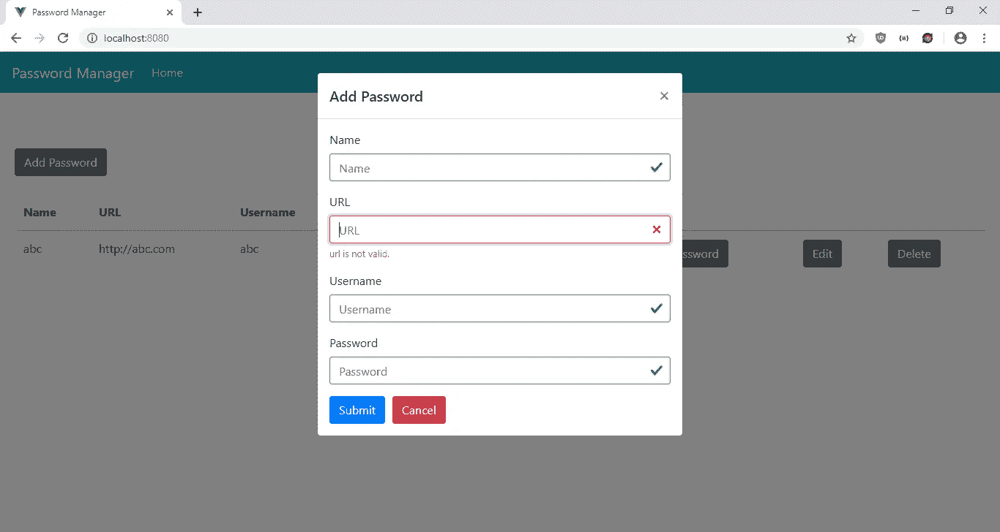
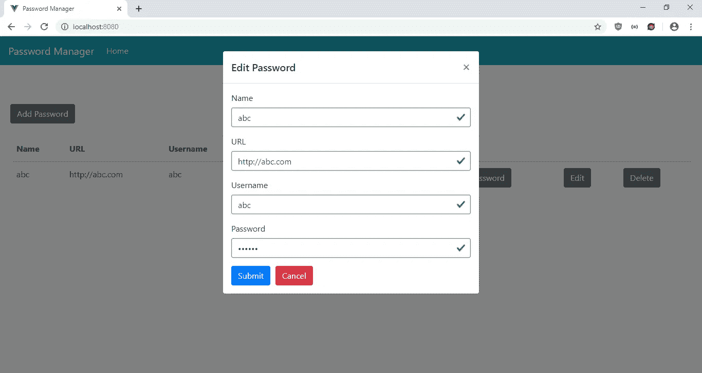
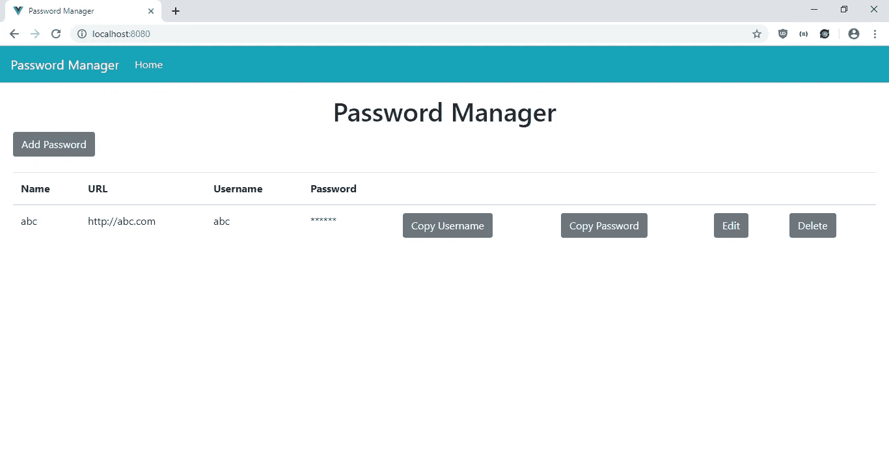
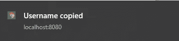

# 如何向您的 Vue.js 应用程序添加原生通知

> 原文：<https://javascript.plainenglish.io/how-to-add-native-notifications-to-your-vue-js-app-f080af932ac1?source=collection_archive---------0----------------------->

通过 HTML5 通知 API，浏览器可以向用户显示本地弹出通知。使用通知，您可以显示文本和图标，还可以播放声音。选项的完整列表位于[https://developer . Mozilla . org/en-US/docs/Web/API/notification](https://developer.mozilla.org/en-US/docs/Web/API/notification)。当用户访问 web 应用程序以查看浏览器通知时，他们必须授予显示通知的权限。

如果我们使用 React，开发人员已经为我们做了艰苦的工作，因为 React 组件是为了显示浏览器通知而创建的。位于[https://www.npmjs.com/package/vue-native-notification](https://www.npmjs.com/package/vue-native-notification)的 Vue-Native-Notification 包可以让我们显示弹出窗口，并处理与显示通知相关的事件，如用户点击通知或处理显示通知的许可或授予或拒绝的情况。

在这篇文章中，我们将建立一个密码管理器，让您输入，编辑和删除网站的密码，并显示通知，每当这些行动被采取。我们将使用 Vue.js 来构建应用程序。

首先，我们通过运行`npx @vue/cli create password-manager`来创建项目。在向导中，选择“手动选择功能”，并选择在我们的应用程序中包括 Babel、Vue 路由器和 Vuex。

接下来，我们安装一些我们需要的库。我们需要 Axios 进行 HTTP 请求，Bootstrap Vue 进行样式设计，V-Clipboard 用于复制到剪贴板功能，Vue-Native-Notification 用于显示本机浏览器通知，Vee-Validate 用于表单验证。我们通过运行以下命令来安装它们:

```
npm i axios bootstrap-vue v-clipboard vee-validate vue-native-notification
```

安装完库之后，我们就可以开始构建应用程序了。首先在`components`文件夹中，为我们的密码表单创建一个名为`PasswordForm.vue`的文件。然后在那里，我们加上:

```
<template>
  <ValidationObserver ref="observer" v-slot="{ invalid }">
    <b-form [@submit](http://twitter.com/submit).prevent="onSubmit" novalidate>
      <b-form-group label="Name">
        <ValidationProvider name="name" rules="required" v-slot="{ errors }">
          <b-form-input
            type="text"
            :state="errors.length == 0"
            v-model="form.name"
            required
            placeholder="Name"
            name="name"
          ></b-form-input>
          <b-form-invalid-feedback :state="errors.length == 0">Name is requied.</b-form-invalid-feedback>
        </ValidationProvider>
      </b-form-group> <b-form-group label="URL">
        <ValidationProvider name="url" rules="required|url" v-slot="{ errors }">
          <b-form-input
            type="text"
            :state="errors.length == 0"
            v-model="form.url"
            required
            placeholder="URL"
            name="url"
          ></b-form-input>
          <b-form-invalid-feedback :state="errors.length == 0">{{errors.join('. ')}}</b-form-invalid-feedback>
        </ValidationProvider>
      </b-form-group> <b-form-group label="Username">
        <ValidationProvider name="username" rules="required" v-slot="{ errors }">
          <b-form-input
            type="text"
            :state="errors.length == 0"
            v-model="form.username"
            required
            placeholder="Username"
            name="username"
          ></b-form-input>
          <b-form-invalid-feedback :state="errors.length == 0">Username is requied.</b-form-invalid-feedback>
        </ValidationProvider>
      </b-form-group> <b-form-group label="Password">
        <ValidationProvider name="password" rules="required" v-slot="{ errors }">
          <b-form-input
            type="password"
            :state="errors.length == 0"
            v-model="form.password"
            required
            placeholder="Password"
            name="password"
          ></b-form-input>
          <b-form-invalid-feedback :state="errors.length == 0">Password is requied.</b-form-invalid-feedback>
        </ValidationProvider>
      </b-form-group> <b-button type="submit" variant="primary" style="margin-right: 10px">Submit</b-button>
      <b-button type="reset" variant="danger" [@click](http://twitter.com/click)="cancel()">Cancel</b-button>
    </b-form>
  </ValidationObserver>
</template><script>
import { requestsMixin } from "@/mixins/requestsMixin";export default {
  name: "PasswordForm",
  mixins: [requestsMixin],
  props: {
    edit: Boolean,
    password: Object
  },
  methods: {
    async onSubmit() {
      const isValid = await this.$refs.observer.validate();
      if (!isValid) {
        return;
      } if (this.edit) {
        await this.editPassword(this.form);
        this.$notification.show(
          "Password edited",
          {
            body: "Password edited"
          },
          {}
        );
      } else {
        await this.addPassword(this.form);
        this.$notification.show(
          "Password added",
          {
            body: "Password added"
          },
          {}
        );
      }
      const response = await this.getPasswords();
      this.$store.commit("setPasswords", response.data);
      this.$emit("saved");
    },
    cancel() {
      this.$emit("cancelled");
    }
  },
  data() {
    return {
      form: {}
    };
  },
  watch: {
    password: {
      handler(p) {
        this.form = JSON.parse(JSON.stringify(p || {}));
      },
      deep: true,
      immediate: true
    }
  }
};
</script>
```

我们在这个组件中有密码表单。该表单包括名称、URL、用户名和密码字段。都是必须的。我们使用 Vee-Validate 来验证表单字段。`ValidationObserver`组件用于验证整个表单，而`ValidationProvider`组件用于验证它所包装的表单字段。验证规则由每个字段的`rule`属性指定。我们对 URL 字段有一个特殊的`url`规则。当作用域插槽中的`errors`对象的长度不为零时，我们会显示验证错误消息。`state`道具用于设置验证状态，当`errors`长度为 0 时显示绿色，否则显示红色。错误信息显示在`b-form-invalid-feedback`组件中。

当用户点击保存按钮时，调用`onSubmit`功能。我们通过使用 `this.$refs.observer.validate();`获得表单的验证状态。ref 是指`ValidationObserver`的 ref。如果它解析为`true`，那么我们根据`edit`属性调用`addPassword`或`editPassword`来保存条目。然后我们通过调用`getPasswords`获得密码，然后通过调度`setPasswords`变异将密码放入我们的 Vuex 存储中。然后我们发出`saved`事件来关闭主页中的模态。通过调用 Vue-Native-Notification 提供的`this.$notification.show`来显示通知。第一个参数是通知标题，第二个参数包含正文，第三个参数是可选的事件处理程序，您可以根据需要添加。事件处理者的完整名单在 https://www.npmjs.com/package/vue-native-notification 上。

我们有一个主要在编辑现有条目时使用的`watch`块，我们获得`password`属性，并通过复制属性将其设置为`this.form`，这样我们只更新`form`对象，当数据被绑定时什么也不更新。

接下来，我们创建一个`mixins`文件夹，并在其中添加`requestsMixin.js`。在文件中，添加:

```
const APIURL = "[http://localhost:3000](http://localhost:3000)";
const axios = require("axios");export const requestsMixin = {
  methods: {
    getPasswords() {
      return axios.get(`${APIURL}/passwords`);
    },addPassword(data) {
      return axios.post(`${APIURL}/passwords`, data);
    },editPassword(data) {
      return axios.put(`${APIURL}/passwords/${data.id}`, data);
    },deletePassword(id) {
      return axios.delete(`${APIURL}/passwords/${id}`);
    }
  }
};
```

这包含在后端发出 HTTP 请求的代码。我们将这个 mixin 包含在我们的组件中，这样我们就可以从它们发出后端请求。

接下来在`Home.vue`中，我们将现有代码替换为:

```
<template>
  <div class="page">
    <h1 class="text-center">Password Manager</h1>
    <b-button-toolbar>
      <b-button [@click](http://twitter.com/click)="openAddModal()">Add Password</b-button>
    </b-button-toolbar>
    <br />
    <b-table-simple responsive>
      <b-thead>
        <b-tr>
          <b-th>Name</b-th>
          <b-th>URL</b-th>
          <b-th>Username</b-th>
          <b-th>Password</b-th>
          <b-th></b-th>
          <b-th></b-th>
          <b-th></b-th>
          <b-th></b-th>
        </b-tr>
      </b-thead>
      <b-tbody>
        <b-tr v-for="p in passwords" :key="p.id">
          <b-td>{{p.name}}</b-td>
          <b-td>{{p.url}}</b-td>
          <b-td>{{p.username}}</b-td>
          <b-td>******</b-td>
          <b-td>
            <b-button
              v-clipboard="() => p.username"
              [@click](http://twitter.com/click)="notify('Username copied', 'Username copied')"
            >Copy Username</b-button>
          </b-td>
          <b-td>
            <b-button
              v-clipboard="() => p.password"
              [@click](http://twitter.com/click)="notify('Password copied', 'Password copied')"
            >Copy Password</b-button>
          </b-td>
          <b-td>
            <b-button [@click](http://twitter.com/click)="openEditModal(p)">Edit</b-button>
          </b-td>
          <b-td>
            <b-button [@click](http://twitter.com/click)="deleteOnePassword(p.id)">Delete</b-button>
          </b-td>
        </b-tr>
      </b-tbody>
    </b-table-simple><b-modal id="add-modal" title="Add Password" hide-footer>
      <PasswordForm [@saved](http://twitter.com/saved)="closeModal()" [@cancelled](http://twitter.com/cancelled)="closeModal()" :edit="false"></PasswordForm>
    </b-modal><b-modal id="edit-modal" title="Edit Password" hide-footer>
      <PasswordForm
        [@saved](http://twitter.com/saved)="closeModal()"
        [@cancelled](http://twitter.com/cancelled)="closeModal()"
        :edit="true"
        :password="selectedPassword"
      ></PasswordForm>
    </b-modal>
  </div>
</template><script>
import { requestsMixin } from "@/mixins/requestsMixin";
import PasswordForm from "@/components/PasswordForm";export default {
  name: "home",
  components: {
    PasswordForm
  },
  mixins: [requestsMixin],
  computed: {
    passwords() {
      return this.$store.state.passwords;
    }
  },
  beforeMount() {
    this.getAllPasswords();
  },
  data() {
    return {
      selectedPassword: {}
    };
  },
  methods: {
    notify(title, body) {
      this.$notification.show(
        title,
        {
          body
        },
        {}
      );
    },
    openAddModal() {
      this.$bvModal.show("add-modal");
    },
    openEditModal(password) {
      this.$bvModal.show("edit-modal");
      this.selectedPassword = password;
    },
    closeModal() {
      this.$bvModal.hide("add-modal");
      this.$bvModal.hide("edit-modal");
      this.selectedPassword = {};
    },
    async deleteOnePassword(id) {
      await this.deletePassword(id);
      this.$notification.show(
        "Password deleted",
        {
          body: "Password deleted"
        },
        {}
      );
      this.getAllPasswords();
    },
    async getAllPasswords() {
      const response = await this.getPasswords();
      this.$store.commit("setPasswords", response.data);
    }
  }
};
</script>
```

在这个文件中，我们有一个表来显示密码条目的列表，并让用户打开和关闭添加和编辑模式。我们在每一行都有按钮来复制用户名和密码，还可以让用户编辑或删除每个条目。

在`scripts`部分，我们用`beforeMount`钩子在页面加载期间用我们在 mixin 中编写的`getPasswords`函数获取所有密码条目。当编辑按钮被点击时，`selectedPassword`变量被设置，我们将它传递给`PasswordForm`进行编辑。

要删除密码，我们在 mixin 中调用`deletePassword`向后端发出请求。

此处添加了复制到剪贴板功能。对于复制用户名和密码按钮，我们使用`v-clipboard`指令让我们在点击按钮时分别将用户名和密码复制到剪贴板。

我们这里有删除条目的通知。它们的名称与`PasswordForm`中的相同。此外，我们添加了一个`notify`功能，这样我们可以在用户名或密码被复制时通过点击相应的按钮来显示通知。

接下来在`App.vue`中，我们将现有代码替换为:

```
<template>
  <div id="app">
    <b-navbar toggleable="lg" type="dark" variant="info">
      <b-navbar-brand href="#">Password Manager</b-navbar-brand><b-navbar-toggle target="nav-collapse"></b-navbar-toggle><b-collapse id="nav-collapse" is-nav>
        <b-navbar-nav>
          <b-nav-item to="/" :active="path  == '/'">Home</b-nav-item>
        </b-navbar-nav>
      </b-collapse>
    </b-navbar>
    <router-view />
  </div>
</template><script>
export default {
  data() {
    return {
      path: this.$route && this.$route.path
    };
  },
  watch: {
    $route(route) {
      this.path = route.path;
    }
  }
};
</script><style lang="scss">
.page {
  padding: 20px;
}button {
  margin-right: 10px;
}
</style>
```

在页面顶部添加一个引导导航条，并添加一个`router-view`来显示我们定义的路线。

接下来在`main.js`中，将代码替换为:

```
import Vue from "vue";
import App from "./App.vue";
import router from "./router";
import store from "./store";
import BootstrapVue from "bootstrap-vue";
import { ValidationProvider, extend, ValidationObserver } from "vee-validate";
import Clipboard from "v-clipboard";
import { required } from "vee-validate/dist/rules";
import VueNativeNotification from "vue-native-notification";
import "bootstrap/dist/css/bootstrap.css";
import "bootstrap-vue/dist/bootstrap-vue.css";extend("required", required);
extend("url", {
  validate: value => {
    return /^(http:\/\/www\.|https:\/\/www\.|http:\/\/|https:\/\/)?[a-z0-9]+([\-\.]{1}[a-z0-9]+)*\.[a-z]{2,5}(:[0-9]{1,5})?(\/.*)?$/.test(
      value
    );
  },
  message: "URL is invalid."
});
Vue.use(BootstrapVue);
Vue.use(Clipboard);
Vue.component("ValidationProvider", ValidationProvider);
Vue.component("ValidationObserver", ValidationObserver);
Vue.use(VueNativeNotification, {
  requestOnNotify: true
});
Vue.config.productionTip = false;new Vue({
  router,
  store,
  render: h => h(App)
}).$mount("#app");
```

因此，我们将安装的库添加到我们的应用程序中，这样我们就可以在组件中使用它。我们从 Vee-Validate 调用`extend`来添加我们想要使用的表单验证规则。此外，我们在这里添加了 V-Clipboard 库，这样我们就可以在我们的主页中使用它。

我们在这里添加了 Vue-Native-Notification 库:

```
Vue.use(VueNativeNotification, {
  requestOnNotify: true
});
```

如果设置为`true`，则`requestOnNotify`设置用于在第一次通知时显示许可提示。

在`router.js`中，我们将现有代码替换为:

```
import Vue from 'vue'
import Router from 'vue-router'
import Home from './views/Home.vue'Vue.use(Router)export default new Router({
  mode: 'history',
  base: process.env.BASE_URL,
  routes: [
    {
      path: '/',
      name: 'home',
      component: Home
    }
  ]
})
```

只包含我们的主页。

然后在`store.js`中，我们将现有代码替换为:

```
import Vue from "vue";
import Vuex from "vuex";Vue.use(Vuex);export default new Vuex.Store({
  state: {
    passwords: []
  },
  mutations: {
    setPasswords(state, payload) {
      state.passwords = payload;
    }
  },
  actions: {}
});
```

将我们的`passwords`状态添加到存储中，这样我们就可以在`PasswordForm`和`HomePage`组件的`computed`块中观察到它。我们有`setPasswords`函数来更新`passwords`状态，我们通过调用`this.$store.commit(“setPasswords”, response.data);`在组件中使用它，就像我们在`PasswordForm`中做的那样。此外，我们在这个文件中导入了引导 CSS 来获取样式。

最后，在`index.html`中，将现有代码替换为:

```
<!DOCTYPE html>
<html lang="en">
  <head>
    <meta charset="utf-8" />
    <meta http-equiv="X-UA-Compatible" content="IE=edge" />
    <meta name="viewport" content="width=device-width,initial-scale=1.0" />
    <link rel="icon" href="<%= BASE_URL %>favicon.ico" />
    <title>Password Manager</title>
  </head>
  <body>
    <noscript>
      <strong
        >We're sorry but vue-clipboard-tutorial-app doesn't work properly
        without JavaScript enabled. Please enable it to continue.</strong
      >
    </noscript>
    <div id="app"></div>
    <!-- built files will be auto injected -->
  </body>
</html>
```

改一下标题。

在所有的努力之后，我们可以通过运行`npm start`来启动我们的 app。

为了启动后端，我们首先通过运行`npm i json-server`来安装`json-server`包。然后，转到我们的项目文件夹并运行:

```
json-server --watch db.json
```

在`db.json`中，将文本改为:

```
{
  "passwords": [
  ]
}
```

所以我们有了在可用的`requests.js`中定义的`passwords` 端点。

经过所有的努力，我们得到了:

