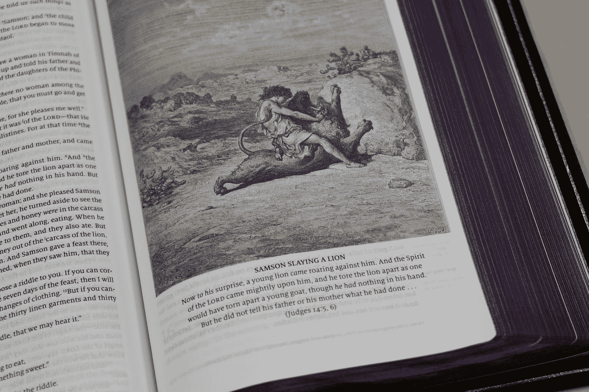
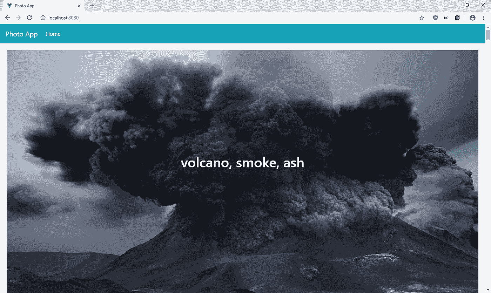
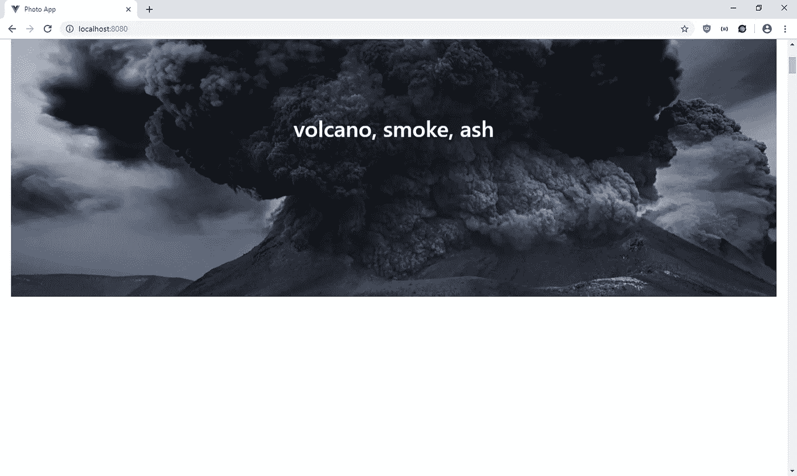

# 如何给你的 Vue.js 应用添加视差滚动

> 原文：<https://javascript.plainenglish.io/how-to-add-parallax-scrolling-to-your-vue-js-app-5c045ad83c26?source=collection_archive---------1----------------------->



Photo by [Humble Lamb](https://unsplash.com/@humblelamb?utm_source=medium&utm_medium=referral) on [Unsplash](https://unsplash.com?utm_source=medium&utm_medium=referral)

视差滚动的效果是背景图像比前景中的元素滚动得慢，从而产生页面深度的错觉。

网站通常在信息页面中使用这种方式，在这种页面中，一些文本在前景中，一个图像在背景中，滚动得更慢，为用户创造更有趣的体验。

[https://www . mock plus . com/blog/post/parallax-scrolling-websites](https://www.mockplus.com/blog/post/parallax-scrolling-websites)有一些视差滚动的网页例子。

有了 React，使用位于[https://github.com/apertureless/vue-parallax](https://github.com/apertureless/vue-parallax)的 [V](https://www.npmjs.com/package/react-parallax) ue-Parallaxy 库创建视差滚动效果变得快速简单。

在本文中，我们将制作一个应用程序，在背景中显示图像列表，在前景中显示标签文本。图像将由 Pixabay API 提供。你可以在 [Pixabay](https://pixabay.com/api/docs/) 注册一个 API 密匙。

为了启动项目，我们通过运行以下命令来创建项目:

```
npx @vue/cli create photo-app
```

然后，我们选择“手动选择功能”，然后选择包括 Babel 和 Vue 路由器。

我们需要安装 Axios 来从 Pixabay API 获取图像，安装 BootstrapVue 来进行造型，安装 Vue-Parallaxy 来创建视差滚动效果。要安装软件包，请运行:

```
npm i axios bootstra-vue vue-parallaxy
```

安装好所有的包后，我们就可以开始构建应用程序了。首先，我们添加一个 mixin 来发出 HTTP 请求。在`src`文件夹中创建一个`mixins`文件夹，然后在该文件夹中创建`requestsMixins.js`。在文件中，添加:

```
const axios = require("axios");
const APIURL = "[https://pixabay.com/api](https://pixabay.com/api)";export const requestsMixin = {
  methods: {
    getImages(page = 1) {
      return axios.get(
        `${APIURL}/?page=${page}&key=${process.env.VUE_APP_API_KEY}`
      );
    }
  }
};
```

接下来在`Home.vue`中，用以下代码替换现有代码:

```
<template>
  <div class="page">
    <div v-for="(img, i) of images" :key="i" class="parallax-container">
      <parallax :speed-factor="0.5" direction="down" :parallax="true">
        <div>
          
          <h1 class="parallax-title">{{img.tags}}</h1>
        </div>
      </parallax>
      <br />
    </div>
  </div>
</template><script>
// @ is an alias to /src
import { requestsMixin } from "../mixins/requestsMixin";
import Parallax from "vue-parallaxy";export default {
  name: "home",
  mixins: [requestsMixin],
  components: {
    Parallax
  },
  data() {
    return {
      images: []
    };
  },
  methods: {
    async getImagesByPage() {
      const response = await this.getImages();
      this.images = response.data.hits;
    }
  },
  beforeMount() {
    this.getImagesByPage();
  }
};
</script><style>
.parallax-container {
  position: relative;
  height: 1000px;
}.parallax-title {
  position: absolute;
  top: 30%;
  left: 0;
  right: 0;
  padding: 20px;
  color: white;
  text-align: center;
}.image {
  height: 700px;
}
</style>
```

我们通过在`components`对象中添加`Parallax`将 Vue-Parallaxy 组件包含在这个组件中。然后，我们通过调用刚刚创建的`requestsMixin`中的`this.getImages`函数来获取图像。当页面加载时，我们调用`beforeMount`钩子中的`getImagesByPage`函数来获取图像。

在模板中，我们使用 Vue-Parallaxy 提供的`parallax` 组件来创建视差滚动效果。`parallax`作为视差效果的容器。我们用`speed-factor`道具使滚动的速度不同于前景，我们将`direction`设置为向下，这样它就会向下滚动。`parallax`道具设置为`true`，这样我们就可以得到前景和背景不同的滚动速度。

我们将`parallax-container`div 的高度更改为 1000 像素，图像的高度更改为 700 像素，以保持间距一致。

在组件中，我们遍历图像并显示来自 Pixbay API 的一些文本。我们通过指定以下内容来定位照片中的文本:

```
<style>
.parallax-container {
  position: relative;
}.parallax-title {
  position: absolute;
  top: 30%;
  left: 0;
  right: 0;
  padding: 20px;
  color: white;
  text-align: center;
}
</style>
```

我们将文本放在图像的中心，并将文本颜色改为白色。

接下来在`App.vue`中，我们将现有代码替换为:

```
<template>
  <div id="app">
    <b-navbar toggleable="lg" type="dark" variant="info">
      <b-navbar-brand href="#">Photo App</b-navbar-brand> <b-navbar-toggle target="nav-collapse"></b-navbar-toggle> <b-collapse id="nav-collapse" is-nav>
        <b-navbar-nav>
          <b-nav-item to="/" :active="path == '/'">Home</b-nav-item>
        </b-navbar-nav>
      </b-collapse>
    </b-navbar>
    <router-view />
  </div>
</template><script>
export default {
  data() {
    return {
      path: this.$route && this.$route.path
    };
  },
  watch: {
    $route(route) {
      this.path = route.path;
    }
  }
};
</script><style lang="scss">
.page {
  padding: 20px;
}
</style>
```

我们使用`page`类向页面添加一些填充，并在页面顶部添加 BootstrapVue 导航栏。此外，我们有`router-view`以便我们看到主页。

接下来在`main.js`中，我们将现有代码替换为:

```
import Vue from 'vue'
import App from './App.vue'
import router from './router'
import store from './store'
import "bootstrap/dist/css/bootstrap.css";
import "bootstrap-vue/dist/bootstrap-vue.css";
import BootstrapVue from "bootstrap-vue";Vue.config.productionTip = false
Vue.use(BootstrapVue);new Vue({
  router,
  store,
  render: h => h(App)
}).$mount('#app')
```

向应用程序添加 BootstrapVue 库和样式，以便我们可以在应用程序中使用代码，并在整个应用程序中查看样式。

然后在`router.js`中，将现有代码替换为:

```
import Vue from "vue";
import Router from "vue-router";
import Home from "./views/Home.vue";Vue.use(Router);export default new Router({
  mode: "history",
  base: process.env.BASE_URL,
  routes: [
    {
      path: "/",
      name: "home",
      component: Home
    }
  ]
});
```

我们添加了主页路径，这样我们就可以看到我们构建的页面。

然后在项目的根文件夹中，我们添加了一个`.env`文件来存储 API 密钥:

```
VUE_APP_API_KEY='Pixabay API key'
```

我们可以像在`requestsMixin.js`中一样通过引用`process.env.VUE_APP_API_KEY`来使用这个 keep。

接下来在`index.html`中，将现有代码替换为:

```
<!DOCTYPE html>
<html lang="en">
  <head>
    <meta charset="utf-8" />
    <meta http-equiv="X-UA-Compatible" content="IE=edge" />
    <meta name="viewport" content="width=device-width,initial-scale=1.0" />
    <link rel="icon" href="<%= BASE_URL %>favicon.ico" />
    <title>Photo App</title>
  </head>
  <body>
    <noscript>
      <strong
        >We're sorry but vue-parallax-scrolling-tutorial-app doesn't work
        properly without JavaScript enabled. Please enable it to
        continue.</strong
      >
    </noscript>
    <div id="app"></div>
    <!-- built files will be auto injected -->
  </body>
</html>
```

改一下标题。

最后，运行`npm run serve`，您将看到:



请注意，这两张图片的底部是不同的。上图底部被切掉了。我们已经实现了视差滚动的预期效果。