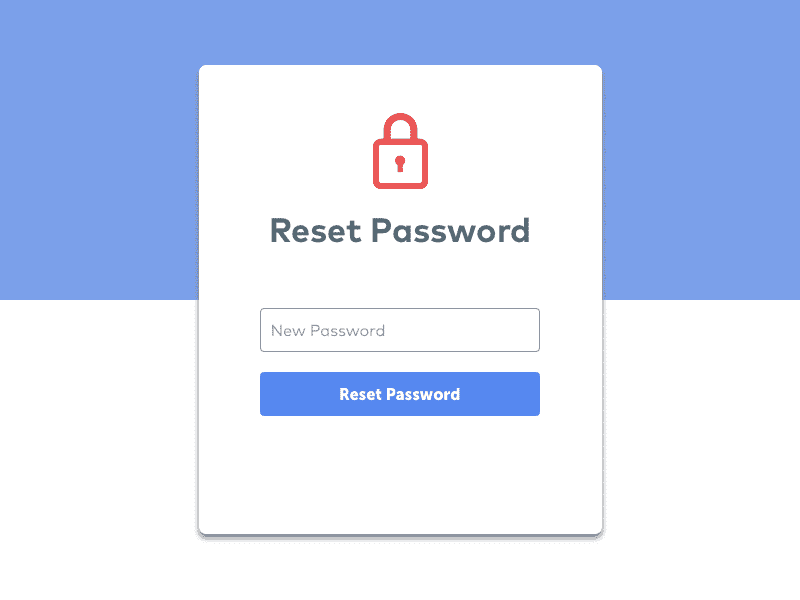

# 如何向您的应用程序添加密码重置功能

> 原文：<https://javascript.plainenglish.io/how-to-add-password-reset-functionality-to-your-app-5d1a18bc9dd8?source=collection_archive---------1----------------------->



# 随着单页面前端应用程序和移动应用程序比以往任何时候都更受欢迎，前端与后端分离。

由于几乎所有的 web 应用程序都需要身份验证，因此前端或移动应用程序需要一种安全的方式来存储用户身份数据。

## 由于许多用户最终会忘记他们的密码，大多数应用程序都有密码重置功能。

幸运的是，这是一个很容易添加的特性。为了确保密码重置功能的安全，我们会在用户请求重置密码时即时生成一个密码重置令牌，然后我们会向用户注册时使用的电子邮件地址发送一封包含重置密码链接的电子邮件，用户可以打开该电子邮件，单击该链接，如果密码重置令牌有效，他们就可以重置密码。

对于身份验证特性，我们发布并验证 JSON Web 令牌，以便客户端 Web 应用程序、移动应用程序和其他后端应用程序可以使用带有令牌的 API。

# 概观

对于后端，我们将使用运行在 Node.js 上的 Express 框架，对于前端，我们将使用 Angular 框架。两者都有自己的 JWT 插件。在后端，我们有用于生成和验证令牌的`jsonwebtoken`包。

在前端，我们有用于角度的`@auth0/angular-jwt`模块。在我们的应用程序中，当用户输入用户名和密码，并且它们在我们的数据库中时，就会从我们的密钥中生成一个 JWT，返回给用户，并存储在本地存储的前端应用程序中。每当用户需要访问后端经过身份验证的路由时，他们都需要令牌。

在后端应用程序中会有一个名为中间件的功能来检查有效的令牌。一个有效的令牌是一个没有过期的令牌，并且根据我们的秘密密钥验证是有效的。除了登录页面之外，还将有注册和用户凭证设置页面。

# 构建应用程序

有了这个计划，我们就可以开始了。

首先，我们创建前端和后端应用程序文件夹。每人做一个。

然后我们开始写后端的 app。首先，我们安装一些包并生成我们的 Express 框架代码。我们运行`npx express-generator`来生成代码。然后我们必须安装一些软件包。我们通过运行`npm i @babel/register express-jwt sequelize bcrypt sequelize-cli dotenv jsonwebtoken body-parser cors crypto @sendgrid/mail`来做到这一点。`@babel/register`允许我们使用最新的 JavaScript 特性。

`express-jwt`生成 JWT 并根据密钥进行验证。`bcrypt`对我们的密码进行哈希和加盐处理。`sequelize`是我们做 CRUD 的 ORM。`cors`通过允许跨域通信，允许我们的 Angular app 与我们的后端进行通信。`dotenv`允许我们在一个`.env`文件中存储环境变量。Express 需要使用`body-parser`来解析 JSON 请求。我们使用`crypto`库来生成我们的密码重置令牌。我们使用 `@sendgrid/mail`通过 SendGrid 发送电子邮件。这项服务使发送电子邮件变得非常容易。你不必自己做邮件服务器。

然后我们进行数据库迁移。首先，我们运行`npx sequelize-cli init`来生成数据库到对象映射的框架代码。然后我们运行:

```
npx sequelize-cli model:generate --name User --attributes username:string, password:string, email:string, passwordResetToken:string
```

我们进行另一次迁移，并输入:

```
'use strict';module.exports = {
  up: (queryInterface, Sequelize) => {
    return Promise.all([
      queryInterface.addConstraint(
        "Users",
        ["email"],
        {
          type: "unique",
          name: 'emailUnique'
        }),queryInterface.addConstraint(
        "Users",
        ["userName"],
        {
          type: "unique",
          name: 'userNameUnique'
        }),
  }, down: (queryInterface, Sequelize) => {
    return Promise.all([
      queryInterface.removeConstraint(
        "Users",
        'emailUnique'
      ),queryInterface.removeConstraint(
        "Users",
        'userNameUnique'
      ),
    ])
  }
};
```

这确保我们不会有两个相同用户名或电子邮件的条目。

这将创建用户模型，并在我们运行`npx sequelize-cli db:migrate`时创建用户表。

然后我们写一些代码。首先，我们将以下内容放入`app.js`:

```
require("[@babel/register](http://twitter.com/babel/register)");
require("babel-polyfill");
require('dotenv').config();
const express = require('express');
const bodyParser = require('body-parser');
const cors = require('cors');
const user = require('./controllers/userController');
const app = express();app.use(cors())
app.use(bodyParser.urlencoded({ extended: true }));
app.use(bodyParser.json());app.use((req, res, next) => {
  res.locals.session = req.session;
  next();
});app.use('/user', user);app.get('*', (req, res) => {
  res.redirect('/home');
});app.listen((process.env.PORT || 8080), () => {
  console.log('App running on port 8080!');
});
```

我们需要:

```
require("[@babel/register](http://twitter.com/babel/register)");
require("babel-polyfill");
```

使用 JavaScript 的最新特性。

我们需要:

```
require('dotenv').config();
```

读取我们在`.env`文件中的配置。

这是切入点。我们将很快在`controllers`文件夹中创建`userController`。

`app.use(‘/user’, user);`将任何以`user`开头的 URL 路由到`userController`文件。

接下来，我们添加`userController.js`文件:

```
const express = require('express');
const bcrypt = require('bcrypt');
const router = express.Router();
const models = require('../models');
const jwt = require('jsonwebtoken');
import { saltRounds } from '../exports';
import { authCheck } from '../middlewares/authCheck';router.post('/login', async (req, res) => {
    const secret = process.env.JWT_SECRET;
    const userName = req.body.userName;
    const password = req.body.password;
    if (!userName || !password) {
        return res.send({
            error: 'User name and password required'
        })
    }
    const users = await models.User.findAll({
        where: {
            userName
        }
    })        const user = users[0];
    if (!user) {
        res.status(401);
        return res.send({
            error: 'Invalid username or password'
        });
    }    try {
        const compareRes = await bcrypt.compare(password, user.hashedPassword);
        if (compareRes) {
            const token = jwt.sign(
                {
                    data: {
                        userName,
                        userId: user.id
                    }
                },
                secret,
                { expiresIn: 60 * 60 }
            );
            return res.send({ token });
        }
        else {
            res.status(401);
            return res.send({
                error: 'Invalid username or password'
            });
        }
    }
    catch (ex) {
        logger.error(ex);
        res.status(401);
        return res.send({
            error: 'Invalid username or password'
        });
    }});router.post('/signup', async (req, res) => {
    const userName = req.body.userName;
    const email = req.body.email;
    const password = req.body.password;
    try {
        const hashedPassword = await bcrypt.hash(password, saltRounds)
        await models.User.create({
            userName,
            email,
            hashedPassword
        })
        return res.send({ message: 'User created' });
    }
    catch (ex) {
        logger.error(ex);
        res.status(400);
        return res.send({ error: ex });
    }
});router.put('/updateUser', authCheck, async (req, res) => {
    const userName = req.body.userName;
    const email = req.body.email;
    const token = req.headers.authorization;
    const decoded = jwt.verify(token, process.env.JWT_SECRET);
    const userId = decoded.data.userId;
    try {
        await models.User.update({
            userName,
            email
        }, {
                where: {
                    id: userId
                }
            })
        return res.send({ message: 'User created' });
    }
    catch (ex) {
        logger.error(ex);
        res.status(400);
        return res.send({ error: ex });
    }});router.put('/updatePassword', authCheck, async (req, res) => {
    const token = req.headers.authorization;
    const password = req.body.password;
    const decoded = jwt.verify(token, process.env.JWT_SECRET);
    const userId = decoded.data.userId;
    try {
        const hashedPassword = await bcrypt.hash(password, saltRounds)
        await models.User.update({
            hashedPassword
        }, {
                where: {
                    id: userId
                }
            })
        return res.send({ message: 'User created' });
    }
    catch (ex) {
        logger.error(ex);
        res.status(400);
        return res.send({ error: ex });
    }});router.post('/passwordResetRequest', async (req, res) => {
    const email = req.body.email;
    const buffer = await crypto.randomBytes(32);
    const passwordResetToken = buffer.toString("hex");
    try {
        await models.User.update(
            {
                passwordResetToken
            }, {
                where: {
                    email
                }
            }
        )
        const passwordResetUrl = `${process.env.FRONTEND_URL}/passwordReset?passwordResetToken=${passwordResetToken}`;
        sgMail.setApiKey(process.env.SENDGRID_API_KEY);
        const msg = {
            to: email,
            from: process.env.FROM_EMAIL,
            subject: 'Password Reset Request',
            text: `
            Dear user,You can reset your password by going to ${passwordResetUrl}
        `,
            html: `
            <p>Dear user,</p><p>
                You can reset your password by going to
                <a href="${passwordResetUrl}">this link</a>
            </p>
        `,
        };
        sgMail.send(msg);
        res.send({ message: 'Successfully sent email' });
    }
    catch (ex) {
        logger.error(ex);
        res.send(ex, 500);
    }
});router.post('/passwordReset', async (req, res) => {
    const password = req.body.password;
    const passwordResetToken = req.body.passwordResetToken;
    const hashedPassword = await bcrypt.hash(password, saltRounds);
    const buffer = await crypto.randomBytes(32);
    const newPasswordResetToken = buffer.toString("hex");
    try {
        await models.User.update(
            {
                hashedPassword,
                passwordResetToken: newPasswordResetToken
            }, {
                where: {
                    passwordResetToken
                }
            }
        )
        res.send({ message: 'Successfully reset password' });
    }
    catch (ex) {
        logger.error(ex);
        res.send(ex, 500);
    }});module.exports = router;
```

`login`路线搜索用户输入。如果找到了，它就用`bcrypt`的`compare` 函数检查散列密码。如果两者都成功，则生成一个 JWT。`signup`路由获取用户名和密码的 JSON 负载并保存。

请注意，在保存之前，会对密码进行哈希和加盐处理。密码不应以纯文本形式存储。

这第一个是纯文本密码，第二个是一些盐轮。

`updatePassword`路由是经过认证的路由。它检查令牌，如果它是有效的，它将通过从解码的令牌中搜索带有用户 id 的`User`来继续保存用户的密码。

当路由被调用时，`passwordResetRequest`路由生成密码重置令牌，并将其保存到我们的`Users`表的`passwordResetToken`列中。然后发送一封电子邮件，在 URL 中包含密码重置令牌。由于电子邮件发送到用户的注册电子邮件，只有用户可以看到电子邮件，并使用电子邮件中的链接来重置他们的密码。

然后，当调用`passwordReset`时，用户的密码在使用该块检查其密码重置令牌后被重置:

```
where: {
  passwordResetToken
}
```

在`await models.User.update`函数调用中。如果找不到带`passwordResetToken`的用户，密码不会被重置。当用户重置其密码时，还会生成一个新的密码重置令牌，以便旧的密码无法再次使用。

接下来我们将添加`authCheck`中间件。我们创建一个`middlewares`文件夹，并在其中创建`authCheck.js`。

```
const jwt = require('jsonwebtoken');
const secret = process.env.JWT_SECRET;export const authCheck = (req, res, next) => {
    if (req.headers.authorization) {
        const token = req.headers.authorization;
        jwt.verify(token, secret, (err, decoded) => {
            if (err) {
                res.send(401);
            }
            else {
                next();
            }
        });
    }
    else {
        res.send(401);
    }
}
```

您应该使用相同的`process.env.JWT_SECRET`来生成和验证令牌。否则，验证将失败。这个秘密不应该在任何地方共享，也不应该签入版本控制。

这允许我们在经过身份验证的路由中检查身份验证，而无需重复代码。我们通过导入和引用它，将它放在每个认证路由的 URL 和主路由代码之间。

我们做一个后端 app 文件夹根目录的`.env`文件，内容如下。(这不应该签入版本控制。)

```
DB_HOST='localhost'
DB_NAME='login-app'
DB_USERNAME='db-username'
DB_PASSWORD='db-password'
JWT_SECRET='secret'
```

后端应用程序现在已经完成。现在我们可以使用前端应用程序、移动应用程序或任何 HTTP 客户端进行登录。如果需要，他们还可以安全地重置密码。

**现在就在**[**http://jauyeung.net/subscribe/**](http://jauyeung.net/subscribe/)**订阅我的邮箱列表获取更多教程。**

**在推特上关注我**【https://twitter.com/AuMayeung】