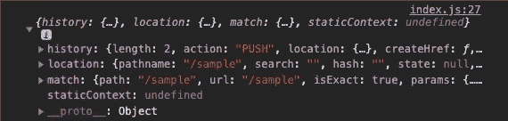

# 如何将 React 路由器添加到 React 应用程序中

> 原文：<https://javascript.plainenglish.io/how-to-add-react-router-to-your-react-app-bf764a776122?source=collection_archive---------0----------------------->

## React 应用程序中的实现


Image from [https://github.com/ReactTraining/react-router](https://github.com/ReactTraining/react-router)

React-router 是一个可以在 React 应用程序之上实现的工具。React 本身并不支配任何路由。路由可以将应用程序与 URL 以及浏览器提供的导航功能(如地址栏和导航按钮)同步，从而增强 React 应用程序的功能。React router 提供了一种编写代码的方法，这样，只有当路由与定义的内容匹配时，才会呈现特定的组件。

在本指南中，我们将介绍如何在 react 应用程序中实现 react-router。

# 服务器端与客户端路由

在我们开始实现 react-router 之前，让我们讨论一下服务器端和客户端路由的区别。服务器端是更传统的方法，我们在服务器上定义路由。客户端是更现代的方法，我们使用客户端 Javascript 来动态改变屏幕上显示的内容。通过客户端路由，我们可以处理应用程序的呈现。

服务器端的流程是客户端向服务器发出请求，服务器用要呈现的 HTML 进行响应。客户端的过程包括观察 URL 的变化，并基于这些变化，为路径呈现特定的组件。

在客户端，当用户点击不同的页面或基于某个动作被重定向时，这将由客户端 Javascript 处理，这意味着我们不需要在服务器上往返以重新进入页面。相反，我们使用浏览器提供的 HTML 历史 API，它允许我们观察 URL 的变化，并在发生变化时运行一些 Javascript 代码。

借助 react-router，我们能够使用客户端 Javascript 动态呈现应用程序，这将允许我们创建一个单页面应用程序，我们可以在其中切换组件来模拟“页面更改”

# 入门指南

要开始实现 react-router，您需要有一个 react 应用程序。如果您需要创建一个，您可以使用以下命令来生成一个并更改到生成的目录中:

```
npx create-react-app <app_name>
cd <app_name>
```

React-router 有三个包:`react-router`、`react-router-dom`、`react-router-native`。`React-router`几乎不需要安装，而`react-router-dom`是特定于浏览器的，而`react-router-native`是特定于本地反应的。我们将关注网站，因此需要安装`react-router-dom`,使用:

```
npm install react-router-dom
```

# 实现反应路由器

假设你已经用`npx create-react-app`生成了一个 React 应用，打开`index.js`，可以在`/src/index.js`下找到。在文件的顶部，我们将从`react-router-dom`包中导入一个命名的导出，`BrowserRouter`。我们希望用`BrowserRouter`包装整个 React 应用程序，即`App`组件。我们在`index.js`中的文件结构应该看起来像这样:

index.js

现在我们的整个应用程序都用`BrowserRouter`包装起来了，我们可以启用客户端路由了。让我们打开`App.js`，它也可以在`/src/App.js`下找到。这将是一个文件，我们在其中定义路线和应该呈现什么组件。让我们从`react-router-dom`导入命名的导出`Route`，它将用于每条路径。让我们也导入每个路径所需的组件。

## 转换

我们需要从`react-router-dom`、`Switch`再导入一个指定的导出。它不需要任何道具。`Switch`将按顺序遍历每个`Route`，一旦找到匹配的路径，它将呈现相关的组件。在`return`语句中，在`div`容器中，我们将包含`Switch`并在其中定义路线。

## 途径

一个`Route`一般用两个道具来定义，`path`和`component`。`path`表示我们正在监听的 URL 路由，而`component`将接收将在该路径上呈现的组件。如果某条路线的`path`仅设置为`"/"`，那么`Switch`将始终为所有路径渲染该路线，因为它是匹配的。例如，如果我们所在的路径是`/sample`，那么该路径确实包含一个`/`。只要包含该字符，就会被认为是匹配的，**包含嵌套路线的**有哪些。

为了防止这种情况，我们为该路线添加了另一个道具，`exact`。顾名思义，路径必须完全相同。如果一个`Route`没有提供`path`道具，它将在没有匹配时被渲染。这对于处理未在路径中定义但以某种方式被访问的路径非常理想。

## 渲染道具

然而，对于`Route`的`component`道具，如果我们需要的话，我们无法将道具传递给实际的组件。如果一个组件确实需要传递给它的道具，我们将使用`render`道具。我们没有传递组件，而是传递一个在位置匹配时调用的函数。

该函数接收原始路由器属性作为参数，使它们可用于您的渲染组件。我们可以利用 spread 运算符来复制路由器属性的内容。而常规道具可以像法线一样传递给组件。

## 再直接的

关于`render`这个话题，我们也可以利用`react-router-dom`、`Redirect`的另一个资源。渲染一个`Redirect`会导航到一个新的位置。新位置将覆盖历史堆栈中的当前位置。`Redirect`需要一个属性`to`，它可以是要重定向到的 URL 的字符串。

这是目前为止我们的`App.js`应该看起来的样子。

App.js

访问每个定义的路径应该呈现适当的组件。否则，它将默认为没有路径的`Route`,并呈现相关组件。目前，我们已经实现了客户端路由。然而，react-router 附带了一些工具，允许我们与路由进行交互。

# 路线之间的链接

目前，我们正在通过直接在 URL 上键入来更改路线。通常，`a` HTML 标签处理允许我们点击改变 URL 的功能。然而，点击一个`a`标签会触发一个对服务器端的请求。相反，我们将利用来自 react-router`Link`的资源。

## 环

在`App.js`中，让我们从`react-router-dom`导入资源`Link`。在幕后，`Link`是一个`a` HTML 标签，但是 Javascript 覆盖了浏览器的默认行为。`Link`期望里面的文本以及一个属性`to`，通知它点击时重定向到哪里。

```
<Link to="/sample">Click to get redirected</Link>
```

点击`Link`后，不需要刷新整个页面。相反，Javascript 会动态交换组件，并进行新的调用来做出反应和重新呈现。

## Navlink

一个`Link`的替代品是`NavLink`，另一个来自`react-router-dom`的资源。使用`NavLink`，我们可以附加一个道具`activeClassName`，它允许我们提供一个类名。只有当我们在`to`道具上定义的路线上时，它才适用于链接。

```
<NavLink to="/sample" activeClassName="active">Click to get redirected</Link>
```

两者都是`Link`和`NavLink`一模一样。一个对 CSS 样式更有利，但是选择一个不会错。我们有能力使用链接来改变 URL 路由。让我们对`App.js`进行修改以反映这些变化。

App.js with NavLink (also works with Link)

需要注意的是，期望在每条路线上看到的元素或组件必须在`Switch`之外定义，比如`Header`或`Footer`组件。

# 查询字符串和 URL 参数

提醒一下，在`Route`中，一旦一个路径被匹配，它就会呈现相关组件的一个实例。不仅组件被渲染，来自`react-router` 的`props`也被传递给这些组件。在被渲染的组件的文件中，我们可以`console.log(props)`确定到底提供了什么。在我的例子中，我会把它放在`src/components/Sample.js`中定义的函数/类中。

让我们来看看这些道具:



Props provided passed down from Route

## 历史

我们正在接收三个键值对。先从`history`说起吧。它的值是一个包含允许我们操作历史的方法的对象。它还允许我们通过 Javascript 以编程方式重定向用户。例如，使用方法`props.history.push("/another_route")`来改变路线。

## 比赛

对于`match`，它的值是一个包含关于`params`对象的有用信息的对象。它包含为什么当前路由被视为匹配的信息。

## 位置

而`location`有一个包含当前 URL 信息的值，组织散列值如`/#contact-us`和查询字符串如`?query=hello`。

拥有这样的信息对我们的 React 应用程序有什么好处呢？在设置`Route`时，动态路由也是可能的。例如，我们可以有一个`Route`,

```
<Route path="/photos/:id" component={SpecificPhotoComponent}/> 
```

来自 URL 的`id`可以用来从组件的状态中提取特定的信息。这可能是我们需要的另一种储存信息的方式。

# 结束语

React-router 是一个强大的工具，可以增强任何 React 应用程序。它可以帮助组织基于路线呈现哪些组件。本指南涵盖了由`react-router-dom`提供的精选资源及其实施。如需更深入的信息，请参考 [react-router 文档](https://reactrouter.com/web/api/Link)和我的代码示例，

Code Sandbox React-Router Practice

感谢您的阅读！