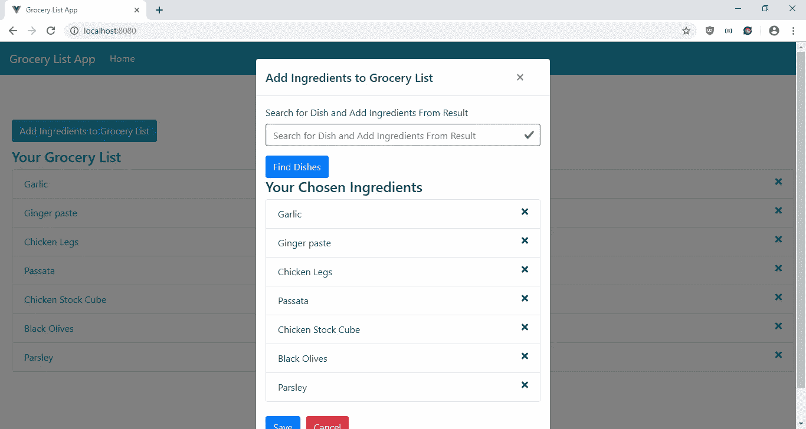
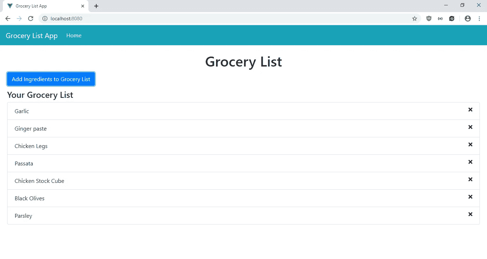
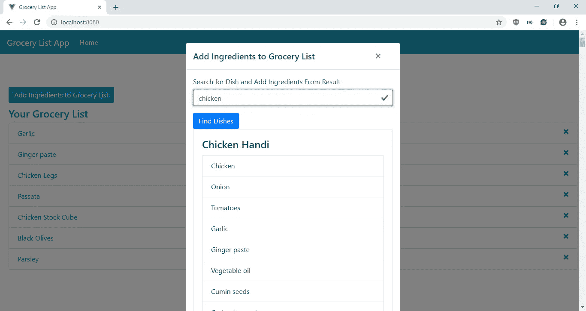
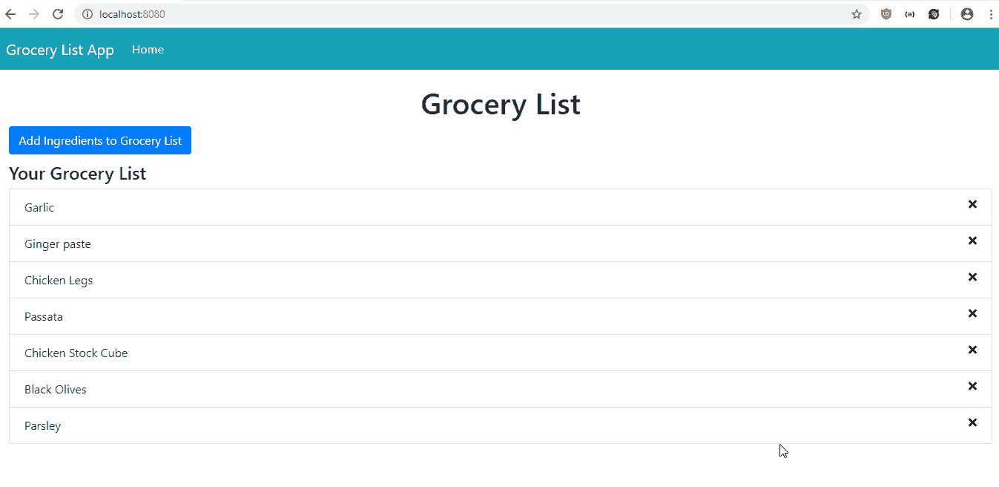

# 如何在你的 Vue.js 应用中给 UI 元素添加涟漪效果

> 原文：<https://javascript.plainenglish.io/how-to-add-ripple-effect-to-ui-elements-in-your-vue-js-app-5417307866bc?source=collection_archive---------3----------------------->

涟漪效应是指某样东西开始向内，然后向外移动。在 web 应用程序中，这是颜色从内部变化，然后向外扩散的情况。你可以用 Vue-Ripple-Directive 给你的 Vue.js 应用添加涟漪效果。关于它的更多细节位于[https://github.com/PygmySlowLoris/vue-ripple-directive](https://github.com/PygmySlowLoris/vue-ripple-directive)。

在本文中，我们将制作一个杂货清单应用程序，用户可以使用 MealDB API 搜索他们想要烹饪的菜肴，并从中添加他们想要的食材。我们将为按钮和列表项添加涟漪效果，以便在鼠标指针经过它们时高亮显示它们。

为了开始构建应用程序，我们通过运行`npx @vue/cli grocery-app`来运行 Vue CLI。在向导中，选择“手动选择功能”，然后选择 Babel、Vuex、Vue 路由器和 CSS 预处理器。接下来，我们安装一些我们需要的包。我们需要 Axios 进行 HTTP 请求，BootstrapVue 进行样式设计，Vue Font Awesome 用于添加图标，Vee-Validate 用于表单验证，Vue Ripple Directive 用于添加涟漪效果。要安装它们，我们运行:

```
npm i axios @fortawesome/fontawesome-svg-core @fortawesome/free-solid-svg-icons @fortawesome/vue-fontawesome axios bootstrap-vue vee-validate vue-ripple-directive
```

安装好所有的包后，我们就可以开始编写应用程序了。我们首先添加一个用于添加杂货的表单。在 components 文件夹中创建一个`GroceryForm.vue`文件，并添加:

```
<template>
  <div>
    <ValidationObserver ref="observer" v-slot="{ invalid }">
      <b-form [@submit](http://twitter.com/submit).prevent="onSubmit" novalidate>
        <b-form-group label="Search for Dish and Add Ingredients From Result">
          <ValidationProvider name="keyword" rules="required" v-slot="{ errors }">
            <b-form-input
              type="text"
              :state="errors.length == 0"
              v-model="form.keyword"
              required
              placeholder="Search for Dish and Add Ingredients From Result"
              name="keyword"
            ></b-form-input>
            <b-form-invalid-feedback :state="errors.length == 0">{{errors.join('. ')}}</b-form-invalid-feedback>
          </ValidationProvider>
        </b-form-group> <b-button v-ripple.mouseover.500 type="submit" variant="primary">Find Dishes</b-button>
      </b-form>
    </ValidationObserver> <b-card v-for="(m, i) in meals" :title="m.strMeal" :key="i">
      <b-card-text>
        <b-list-group>
          <b-list-group-item
            v-for="(key, index) in Object.keys(m).filter(k => k.includes('strIngredient') && m[k])"
            :key="index"
            v-ripple.mouseover="'rgba(255, 255, 255, 0.35)'"
          >{{m[key]}}</b-list-group-item>
        </b-list-group>
      </b-card-text>
      <b-button
        v-ripple.mouseover.500
        variant="primary"
        [@click](http://twitter.com/click)="addToGroceryList(i)"
      >Add Ingredients to Grocery List</b-button>
    </b-card> <h4>Your Chosen Ingredients</h4>
    <b-list-group>
      <b-list-group-item v-for="(ingredient, i) of ingredients" :key="i" v-ripple.mouseover>
        {{ingredient}}
        <font-awesome-icon icon="times" class="float-right" [@click](http://twitter.com/click)="removeIngredient(i)" />
      </b-list-group-item>
    </b-list-group><br /><b-button v-ripple.mouseover.500 type="button" variant="primary" [@click](http://twitter.com/click)="saveGroceryList()">Save</b-button>
    <b-button v-ripple.mouseover.500 type="reset" variant="danger" [@click](http://twitter.com/click)="cancel()">Cancel</b-button>
  </div>
</template><script>
import { requestsMixin } from "@/mixins/requestsMixin";
import { faTimes } from "[@fortawesome/free-solid-svg-icons](http://twitter.com/fortawesome/free-solid-svg-icons)";export default {
  name: "GroceryForm",
  mixins: [requestsMixin],
  components: {
    faTimes
  },
  data() {
    return {
      form: {},
      meals: [],
      ingredients: []
    };
  },
  computed: {
    grocery() {
      return this.$store.state.grocery;
    }
  },
  methods: {
    cancel() {
      this.$emit("cancelled");
    }, async onSubmit() {
      const isValid = await this.$refs.observer.validate();
      if (!isValid) {
        return;
      }
      const { data } = await this.findDishes(this.form.keyword);
      this.meals = data.meals;
    }, addToGroceryList(index) {
      const meal = this.meals[index];
      const keys = Object.keys(meal).filter(
        k => k.includes("strIngredient") && meal[k]
      );
      const ingredients = keys.map(k => meal[k]);
      this.ingredients = Array.from(
        new Set(this.ingredients.concat(ingredients))
      );
    }, removeIngredient(index) {
      this.ingredients.splice(index, 1);
    }, async saveGroceryList() {
      const payload = { ingredients: this.ingredients };
      if (!this.groceryListId) {
        await this.addGrocery(payload);
      } else {
        await this.editGrocery(payload);
      }
      const { data } = await this.getGrocery();
      this.$store.commit("setGrocery", data);
      this.$emit("saved");
    }
  },
  watch: {
    grocery: {
      handler(val) {
        this.ingredients = val.ingredients || [];
      },
      deep: true,
      immediate: true
    }
  }
};
</script><style lang="scss" scoped>
.delete {
  cursor: pointer;
}
</style>
```

该表单允许用户使用给定的关键字搜索菜肴，然后返回菜肴的配料列表，然后用户可以将它们添加到删除重复项的列表中。我们使用 Vee-Validate 来验证我们的输入。我们使用`ValidationObserver`组件来观察组件内部表单的有效性，使用`ValidationProvider`来检查组件内部输入值的有效性规则。在`ValidationProvider`中，我们为文本输入字段提供了 BootstrapVue 输入。在`b-form-input`组件中。我们还添加了 Vee-Validate 验证，以确保用户在提交之前已经填写了日期。我们将`rules`属性中的`keyword`字段设为必填字段，以便用户在搜索前必须输入一些内容。

我们在表单底部的列表中有按钮，其中有成分列表，可以删除每一种成分。这就是为什么我们在这里导入了`faTimes`图标，它显示为一个‘x’，这样用户可以点击它并删除它。如果该元素被单击，则调用`removeIngredient`函数。然后用户点击表单底部的 Save，然后调用`saveGroceryList`函数，将列表保存到我们的后端。

在这个组件中，我们还有一个`watch`块来观察`grocery`值，该值是从我们必须构建的 Vuex 商店中获得的。随着`grocery`值的更新，我们得到了最新的配料列表。

我们将波纹效果应用到按钮和带有 Vue 波纹的列表行。`v-ripple.mouseover.500`表示当鼠标停留在带有此指令的元素上时，涟漪效应将显示 500 毫秒。为了给波纹效果应用不同于默认的颜色，我们也可以像在`v-ripple.mouseover=”’rgba(255, 255, 255, 0.35)’”`中一样，在指令的参数中指定颜色值。波纹将具有指定的颜色。

我们用`cursor:pointer`设计删除表单的元素，这样鼠标图标会显示一只手而不是箭头。

接下来，我们创建一个`mixins`文件夹，并将`requestsMixin.js`添加到`mixins`文件夹中。在文件中，我们添加了:

```
const APIURL = "[http://localhost:3000](http://localhost:3000)";
const MEAL_DB_URL = "[https://www.themealdb.com/api/json/v1/1/search.php?s=](https://www.themealdb.com/api/json/v1/1/search.php?s=)";const axios = require("axios");export const requestsMixin = {
  methods: {
    getGrocery() {
      return axios.get(`${APIURL}/grocery`);
    }, addGrocery(data) {
      return axios.post(`${APIURL}/grocery`, data);
    }, editGrocery(data) {
      return axios.put(`${APIURL}/grocery`, data);
    }, findDishes(keyword) {
      return axios.get(`${MEAL_DB_URL}${keyword}`);
    }
  }
};
```

我们在组件中使用这些函数来发出 HTTP 请求，以获取和保存我们的杂货数据，并在膳食数据库 API 中搜索菜肴。

接下来在`Home.vue`中，将现有代码替换为:

```
<template>
  <div class="page">
    <h1 class="text-center">Grocery List</h1>
    <b-button-toolbar class="button-toolbar">
      <b-button
        v-ripple.mouseover.500
        [@click](http://twitter.com/click)="openAddModal()"
        variant="primary"
      >Add Ingredients to Grocery List</b-button>
    </b-button-toolbar> <h4>Your Grocery List</h4>
    <b-list-group>
      <b-list-group-item
        v-for="(ingredient, i) of grocery.ingredients"
        :key="i"
        v-ripple.mouseover="'rgba(255, 255, 255, 0.35)'"
      >
        {{ingredient}}
        <font-awesome-icon icon="times" class="float-right" [@click](http://twitter.com/click)="removeIngredient(i)" />
      </b-list-group-item>
    </b-list-group> <b-modal id="add-modal" title="Add Ingredients to Grocery List" hide-footer>
      <GroceryForm
        [@saved](http://twitter.com/saved)="closeModal()"
        [@cancelled](http://twitter.com/cancelled)="closeModal()"
        :edit="false"
        :groceryListId="grocery.id"
      />
    </b-modal>
  </div>
</template><script>
// @ is an alias to /src
import GroceryForm from "@/components/GroceryForm.vue";
import { requestsMixin } from "@/mixins/requestsMixin";export default {
  name: "home",
  components: {
    GroceryForm
  },
  mixins: [requestsMixin],
  computed: {
    grocery() {
      return this.$store.state.grocery;
    }
  },
  data() {
    return {
      ingredients: []
    };
  },
  beforeMount() {
    this.getGroceryList();
  },
  methods: {
    openAddModal() {
      this.$bvModal.show("add-modal");
    },
    closeModal() {
      this.$bvModal.hide("add-modal");
    },
    async getGroceryList() {
      const { data } = await this.getGrocery();
      this.$store.commit("setGrocery", data);
    },
    async removeIngredient(index) {
      this.ingredients.splice(index, 1);
      const payload = { id: this.grocery.id, ingredients: this.ingredients };
      await this.editGrocery(payload);
      const { data } = await this.getGrocery();
      this.$store.commit("setGrocery", data);
    }
  },
  watch: {
    grocery: {
      handler(val) {
        this.ingredients = val.ingredients || [];
      },
      deep: true,
      immediate: true
    }
  }
};
</script>};
```

这是主页的组成部分。我们在这里显示从我们的后端获得的选择的成分列表。此外，我们有一个按钮，用我们之前创建的`GroceryForm`打开一个模态，将配料添加到我们的杂货列表中。获取数据在`getGroceryList`功能中完成。我们将获得的数据放入函数最后一行的 Vuex 存储中。

此外，我们允许用户使用`removeIngredient`函数删除他们保存到该页面列表中的配料。我们在`this.ingredients`数组上调用`splice`，它是我们从存储中的`grocery`状态得到的，然后被设置为`grocery`的`watch`块的`handler`中的当前值。

同样，我们将波纹效果应用到按钮和带有 Vue 波纹的列表行。`v-ripple.mouseover.500`显示按钮和`v-ripple.mouseover=”’rgba(255, 255, 255, 0.35)’”`的 500 毫秒波纹效果。波纹将具有列表项目中指定的颜色，就像我们在`GroceryForm`中所做的那样。

接下来在`App.vue`中，我们将现有代码替换为:

```
<template>
  <div id="app">
    <b-navbar toggleable="lg" type="dark" variant="info">
      <b-navbar-brand to="/">Grocery List App</b-navbar-brand> <b-navbar-toggle target="nav-collapse"></b-navbar-toggle> <b-collapse id="nav-collapse" is-nav>
        <b-navbar-nav>
          <b-nav-item to="/" :active="path  == '/'">Home</b-nav-item>
        </b-navbar-nav>
      </b-collapse>
    </b-navbar>
    <router-view />
  </div>
</template><script>
export default {
  data() {
    return {
      path: this.$route && this.$route.path
    };
  },
  watch: {
    $route(route) {
      this.path = route.path;
    }
  }
};
</script><style lang="scss">
.page {
  padding: 20px;
}button,
.btn.btn-primary {
  margin-right: 10px !important;
}.button-toolbar {
  margin-bottom: 10px;
}
</style>
```

在页面顶部添加一个引导导航条，并添加一个`router-view`来显示我们定义的路线。此`style`部分没有限定范围，因此样式将全局应用。在`.page`选择器中，我们给页面添加一些填充。我们在剩余的`style`代码中给按钮添加一些填充。

然后在`main.js`中，将现有代码替换为:

```
import Vue from "vue";
import App from "./App.vue";
import router from "./router";
import store from "./store";
import BootstrapVue from "bootstrap-vue";
import "bootstrap/dist/css/bootstrap.css";
import "bootstrap-vue/dist/bootstrap-vue.css";
import { ValidationProvider, extend, ValidationObserver } from "vee-validate";
import { required, min_value, max_value } from "vee-validate/dist/rules";
import Ripple from "vue-ripple-directive";
import { FontAwesomeIcon } from "[@fortawesome/vue-fontawesome](http://twitter.com/fortawesome/vue-fontawesome)";
import { library } from "[@fortawesome/fontawesome-svg-core](http://twitter.com/fortawesome/fontawesome-svg-core)";
import { faTimes } from "[@fortawesome/free-solid-svg-icons](http://twitter.com/fortawesome/free-solid-svg-icons)";library.add(faTimes);
Vue.component("font-awesome-icon", FontAwesomeIcon);
Vue.directive("ripple", Ripple);
extend("required", required);
Vue.component("ValidationProvider", ValidationProvider);
Vue.component("ValidationObserver", ValidationObserver);
Vue.use(BootstrapVue);Vue.config.productionTip = false;new Vue({
  router,
  store,
  render: h => h(App)
}).$mount("#app");
```

我们在这里添加了我们需要的所有库，包括 BootstrapVue JavaScript 和 CSS、Vee-Validate 组件以及验证规则、Vue-Ripple 库和 Vue Font Awesome 包。通过 Vue Font Awesome 的`library.add`功能将`faTimes`添加到我们的应用程序中，以便我们可以在我们的应用程序中使用它。

在`router.js`中，我们将现有代码替换为:

```
import Vue from "vue";
import Router from "vue-router";
import Home from "./views/Home.vue";Vue.use(Router);export default new Router({
  mode: "history",
  base: process.env.BASE_URL,
  routes: [
    {
      path: "/",
      name: "home",
      component: Home
    }
  ]
});
```

将主页包含在我们的路线中，以便用户可以看到该页面。

在`store.js`中，我们将现有代码替换为:

```
import Vue from "vue";
import Vuex from "vuex";Vue.use(Vuex);export default new Vuex.Store({
  state: {
    grocery: {}
  },
  mutations: {
    setGrocery(state, payload) {
      state.grocery = payload;
    }
  },
  actions: {}
});
```

将我们的杂货状态添加到商店中，这样我们就可以在`GroceryForm` 和`HomePage`组件的`computed`块中观察到它。我们有`setGrocery` 函数来更新`grocery` 状态，我们通过调用`this.$store.commit(“setGrocery”, data);`在组件中使用它，就像我们在`GroceryForm`和`HomePage`中所做的那样。

最后，在`index.html`中，我们将现有代码替换为:

```
<!DOCTYPE html>
<html lang="en">
  <head>
    <meta charset="utf-8" />
    <meta http-equiv="X-UA-Compatible" content="IE=edge" />
    <meta name="viewport" content="width=device-width,initial-scale=1.0" />
    <link rel="icon" href="<%= BASE_URL %>favicon.ico" />
    <title>Grocery List App</title>
  </head>
  <body>
    <noscript>
      <strong
        >We're sorry but vue-ripple-tutorial-app doesn't work properly without
        JavaScript enabled. Please enable it to continue.</strong
      >
    </noscript>
    <div id="app"></div>
    <!-- built files will be auto injected -->
  </body>
</html>
```

更改我们应用程序的标题。

在所有的努力之后，我们可以通过运行`npm run serve`来启动我们的 app。

为了启动后端，我们首先通过运行`npm i json-server`来安装`json-server`包。然后，转到我们的项目文件夹并运行:

```
json-server --watch db.json
```

在`db.json`中，将文本改为:

```
{
  "grocery": {}
}
```

所以我们有了在`requests.js`中定义的`grocery` 端点。

经过所有的努力，我们得到了:

