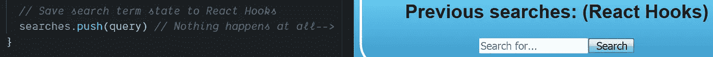
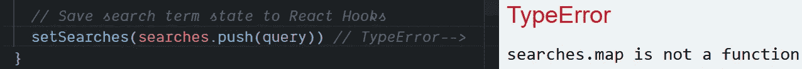
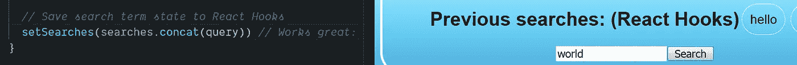

# 如何使用钩子在反应状态下添加到数组中

> 原文：<https://javascript.plainenglish.io/how-to-add-to-an-array-in-react-state-3d08ddb2e1dc?source=collection_archive---------0----------------------->

## `.push()`函数将不起作用，但是当状态是一个 JavaScript 数组时,`.concat()`函数可以更新 React 中的状态——扩展操作符`…`也可以。

Photo by [Glenn Carstens-Peters](https://unsplash.com/@glenncarstenspeters?utm_source=medium&utm_medium=referral) on [Unsplash](https://unsplash.com?utm_source=medium&utm_medium=referral)

> “最常见的问题之一是如何在 React 状态下将项目添加到数组中。因为不允许直接改变状态，所以不能简单地将一个项推送到数组中。— [Robin Wieruch](https://medium.com/u/a8b7f59b1b73?source=post_page-----3d08ddb2e1dc--------------------------------) 在一篇 [2018 博客文章](https://www.robinwieruch.de/react-state-array-add-update-remove)

W 当 [React state](https://reactjs.org/docs/faq-state.html) 是一个数组时，如何向数组中添加条目并不明显，比如当试图使用 [React 钩子](https://reactjs.org/docs/hooks-intro.html)更新状态时。

当 state 是一个项目列表时，可能会出现这个问题。在本文中，我探索了一个用户最近输入的搜索查询的例子。

一个更复杂的例子是将 JavaScript 对象列表作为数组存储在 React 状态中，比如学生记录。

问题是如何在 React 状态下将一个项目添加到数组中？

Photo by [Emma Matthews](https://unsplash.com/@emmamatthews?utm_source=medium&utm_medium=referral) on [Unsplash](https://unsplash.com?utm_source=medium&utm_medium=referral)

# 将反应状态创建为数组

一个使用 [React 钩子](https://reactjs.org/docs/hooks-overview.html)来保存条目列表的典型代码示例将使用类似`useState([])`的调用来初始化 React 状态。

> “`useState`是一个钩子[……]我们在一个函数组件内部调用它来给它添加一些本地状态。React 将在重新渲染之间保持这种状态。— [反应文件](https://reactjs.org/docs/hooks-overview.html)

用 `[useState](https://reactjs.org/docs/hooks-state.html)` [钩](https://reactjs.org/docs/hooks-state.html)称之为[。在这个例子中，命令`useState([])`初始化状态以包含空数组`[]`。](https://reactjs.org/docs/hooks-state.html)

数组[是传递给](https://daveceddia.com/usestate-hook-examples/) `[useState()](https://daveceddia.com/usestate-hook-examples/)`的有效参数，如下所示:

在下一节中，我将尝试各种方法来添加到当前处于 React 状态的数组中——通过`searches`可以访问，通过`setSearches`可以改变。

Photo by [Giammarco Boscaro](https://unsplash.com/@giamboscaro?utm_source=medium&utm_medium=referral) on [Unsplash](https://unsplash.com?utm_source=medium&utm_medium=referral)

# 如何推入处于反应状态的数组

我的第一个想法是使用`[.push()](https://developer.mozilla.org/en-US/docs/Web/JavaScript/Reference/Global_Objects/Array/push)`将一个项目添加到 React 状态，这是一个典型的 JavaScript 方法，用于添加到数组的末尾。

`.push()`方法是在 [Array.prototype](https://developer.mozilla.org/en-US/docs/Web/JavaScript/Reference/Global_Objects/Array) 上定义的，所以在数组上使用[点引用操作符](https://medium.com/dailyjs/dot-notation-vs-bracket-notation-eedea5fa8572)调用它，如下所示:

我想在 React 状态下添加到数组中，所以尝试在列表末尾添加一个新项目，从而更新状态，这似乎是有意义的。

不幸的是，代码`searches.push()`在 React 中不起作用:

难就难在当我真的试图以这种方式保存 React State 搜索词时，什么也没发生——没有错误，什么也没有。这是怎么回事？

Photo by [Kelly Sikkema](https://unsplash.com/@kellysikkema?utm_source=medium&utm_medium=referral) on [Unsplash](https://unsplash.com?utm_source=medium&utm_medium=referral)

# 我忘记使用 React 钩子设置器了

它不工作的原因是我试图直接修改 React 状态——虽然`.push()`确实修改了在变量`searches`中找到的数组，但是修改没有“挂钩”到 React 来更新重新渲染。

React 钩子需要一个特定的 setter 函数，这是最初从`useState`调用返回的第二部分，我称之为`setSearches`。

> "`useState`返回一对:当前的*状态值和一个让你更新它的函数。"— [反应文件](https://reactjs.org/docs/hooks-overview.html)*

换句话说，在 React 中，[状态应该被认为是不可变的](https://www.freecodecamp.org/news/handling-state-in-react-four-immutable-approaches-to-consider-d1f5c00249d5/)，因此不应该被直接改变(或变异)。

这就是为什么 React 状态本身(`searches`变量和`setSearches`钩子)被定义为使用`const`的常量——作为提醒。

这是有意的，这意味着用 React 钩子更新状态涉及到由`useState()`返回的相关 setter 函数。

Photo by [Daria Nepriakhina](https://unsplash.com/@epicantus?utm_source=medium&utm_medium=referral) on [Unsplash](https://unsplash.com?utm_source=medium&utm_medium=referral)

# `setSearches(searches.push(query))`不起作用

从 React 钩子中敲击 setter 函数中的`.push()`也不起作用，尽管看起来似乎应该这样。

事实上，`setSearches(searches.push(query))`与`[TypeError](https://developer.mozilla.org/en-US/docs/Web/JavaScript/Reference/Global_Objects/TypeError)`一起崩溃:

在这种情况下，**app 坏了**我大概是**慌了！**

幸运的是，工作方案与上面非常相似，只是用`.concat()`代替了`.push()`函数调用。

但是为什么`searches.push()`会失败，为什么`.concat()`会工作？

Photo by [Roman Synkevych](https://unsplash.com/@synkevych?utm_source=medium&utm_medium=referral) on [Unsplash](https://unsplash.com?utm_source=medium&utm_medium=referral)

# 为什么`.push()`用 React 钩子会失败？

前面的代码示例不起作用，因为`.push()`返回的是修改后数组的长度，而不是数组本身。

React Hooks setter 函数`setSearches()`，也被称为 reducer 的[，将当前状态更新为传入的值。](https://redux.js.org/basics/reducers)

在上面的例子中，状态已经从一个数组更新为一个数字——这就是为什么`TypeError`是那个`searches.map is not a function`。

反应状态`searches`从其状态`[]`被替换为跟随`.push` — `.length`的数组长度变为 1，因此搜索现在是`1`。

虽然`[][.map()](https://developer.mozilla.org/en-US/docs/Web/JavaScript/Reference/Global_Objects/Array/map)`工作正常，但是代码`1[.map()](https://developer.mozilla.org/en-US/docs/Web/JavaScript/Reference/Global_Objects/Array/map)`在 JavaScript 中是无意义的。

我需要将更新后的状态直接传递给 React Hooks 状态设置器(reducer 函数)，`setSearches`，而不是直接改变旧的状态。

Photo by [Lukas Blazek](https://unsplash.com/@goumbik?utm_source=medium&utm_medium=referral) on [Unsplash](https://unsplash.com?utm_source=medium&utm_medium=referral)

# 解决方法是。concat()

到救援就是`[Array.prototype.concat()](https://developer.mozilla.org/en-US/docs/Web/JavaScript/Reference/Global_Objects/Array/concat)` [方法](https://developer.mozilla.org/en-US/docs/Web/JavaScript/Reference/Global_Objects/Array/concat)，简称*串联*，工作原理和`.push()`差不多，只是有点曲折。

`.concat()`更新状态的原因是`.concat()`创建一个新数组，保持旧数组不变，然后返回改变后的数组。

另一方面，`.push()`就地对旧数组进行变异，但返回变异后数组的长度，而不是变异后数组本身。

因此，使用`.push()`意味着状态被新数组的长度覆盖——这是一个简单的错误，因为不知道`.push()`返回了什么。

下面的代码将起作用，因为`.concat()`返回一个新的、更新的数组:

考虑到 React 中状态的不变性，我使用了`.concat()`来实现在 React 状态下将一个项目添加到数组末尾的结果。

如果我想把这个项目放在列表的前面，我只需要像这样颠倒操作的顺序:

但是，我遗漏了一个重要的步骤——**使用“包装函数”可以防止快速更新的 React 组件中的错误**。

我将在下一节解释如何使用 ES6 特性`…`(扩展操作符)以及 ***包装函数*** 的潜在好处。

Photo by [Mike Kenneally](https://unsplash.com/@asthetik?utm_source=medium&utm_medium=referral) on [Unsplash](https://unsplash.com?utm_source=medium&utm_medium=referral)

# 最佳解决方案:展开操作符`…` &一个包装器

在复制和组合数组时，The[JavaScript spread 运算符](https://medium.com/coding-at-dawn/how-to-use-the-spread-operator-in-javascript-b9e4a8b06fab) ( `…`)会有所帮助，因此它也可以用于在 React 状态下向数组添加一个项。

*   `[...searches, query]`将一个项目追加到数组的末尾
*   `[query, ...searches]`在数组前面添加一个项目

注意，在代码示例中，我还使用了一个 ***包装函数***——我没有传递状态，而是传递了一个接受当前状态的回调函数。

*   `setSearches(searches => searches.concat(query))`同`.concat()`
*   `setSearches(searches => [...searches, query])` 同`…`展开

在传递给`setSearches`钩子的 ***包装函数*** 中，我通过使用`.concat()`或`[...searches, query]`使用[扩展运算符](https://medium.com/coding-at-dawn/how-to-use-the-spread-operator-in-javascript-b9e4a8b06fab) `[…](https://medium.com/coding-at-dawn/how-to-use-the-spread-operator-in-javascript-b9e4a8b06fab)`返回更新后的状态`searches`。

Photo by [Bench Accounting](https://unsplash.com/@benchaccounting?utm_source=medium&utm_medium=referral) on [Unsplash](https://unsplash.com?utm_source=medium&utm_medium=referral)

# 为什么要使用 ***包装函数*** ？

U 唱一个 ***包装函数*** 在 React Hooks setter 函数里面是一个比仅仅使用`[.concat()](https://developer.mozilla.org/en-US/docs/Web/JavaScript/Reference/Global_Objects/Array/concat)` 或者`…`实现更好的解决方案。

[Jasper Dunn](https://medium.com/u/549bf5d1e531?source=post_page-----3d08ddb2e1dc--------------------------------) 写了[来回应](https://medium.com/@jasperdunn93/in-most-situations-its-best-to-use-the-state-param-inside-the-setter-function-itself-2e054c6c3734)这篇关于在使用 React 状态时总是使用 ***包装函数*** 的优点的文章:

> 从初始挂钩访问的“searches”的值可能与预期的不同，这可能会[导致]不必要的副作用。— [贾斯珀·邓恩](https://medium.com/u/549bf5d1e531?source=post_page-----3d08ddb2e1dc--------------------------------)

强烈建议使用 ***包装函数*** ，以便在重新渲染实际发生时访问当前状态，而不是在其他时间。

***包装函数*** 也被称为[回调函数](https://developer.mozilla.org/en-US/docs/Glossary/Callback_function)，因为它指的是将一个函数传递给另一个函数。

Photo by [Kim S. Ly](https://unsplash.com/@lykims?utm_source=medium&utm_medium=referral) on [Unsplash](https://unsplash.com?utm_source=medium&utm_medium=referral)

# 概述:如何在状态中添加数组

通过掌握 ***包装函数*** ，我终于用三个简单的步骤解决了如何在 React 状态下添加数组的问题:

1.  使用`useState([])`钩子将状态设置为`[]`并获取状态设置函数
2.  将 ***包装函数*** 传递给状态设置器函数(作为回调函数)
3.  使用`.concat`更新数组或者在 ***包装函数*** 内传播`…`

但是我仍然想知道为什么 React 状态首先是不可变的？

Photo by [Andrew Neel](https://unsplash.com/@andrewtneel?utm_source=medium&utm_medium=referral) on [Unsplash](https://unsplash.com?utm_source=medium&utm_medium=referral)

# 为什么`.concat()`或…是 React 中的正确工具

tate 在 React 中应该是不可变的。例如，这就是为什么 React 钩子通常被定义为`[const](https://medium.com/javascript-in-plain-english/how-to-use-let-var-and-const-in-javascript-cdf42b48d70)`——作为不要触摸的提醒。

为什么会这样呢？[埃斯特万·埃勒](https://blog.logrocket.com/author/ehrrera/)在[博客](https://blog.logrocket.com/immutability-in-react-ebe55253a1cc/)上解释道:

> 对于两个大小相同的数组，知道它们是否相等的唯一方法是比较每个元素。大型阵列的高成本操作。
> 
> 最简单的解决方案是使用不可变对象。
> 
> 如果对象需要更新，必须创建一个具有新值的新对象，因为原来的对象是不可变的，不能更改。"

因为状态是不可变的，React 确切地知道状态何时改变——何时创建新值并将其分配给 React 状态。

使用`.concat()`或扩展操作符`…`将状态复制到一个新数组中，我们传递该数组作为更新后的状态。

React 不必更新状态并重新呈现屏幕，直到它被 React Hooks setter 函数告知状态实际上发生了变化。

这对 React 应用程序的性能有好处。

Photo by [Ross Findon](https://unsplash.com/@rossf?utm_source=medium&utm_medium=referral) on [Unsplash](https://unsplash.com?utm_source=medium&utm_medium=referral)

# 不变性的好处

很明显，在应用程序的某个时刻，我们正在更新状态——这只是通过提供一个新的状态，覆盖旧的状态。

这意味着我们不能就地改变状态，我们通过用新的状态替换它来更新它——对于一个数组，使用`.concat()`或 spread `…`。

使用不可变状态有助于防止我们的代码出现错误，此外，当引用发生变化时，还会通知虚拟 DOM 进行更新。

不变性确保我们只在实际需要时改变状态——而不是意外地，在这种情况下，我们可能会丢失用户数据或在生产中发生其他可怕的事情。😱

Photo by [Chris Lawton](https://unsplash.com/@chrislawton?utm_source=medium&utm_medium=referral) on [Unsplash](https://unsplash.com?utm_source=medium&utm_medium=referral)

# 你自己试试

我在文章的最后提供了一个现场演示及其完整的代码，演示了一个简单的 React 应用程序，它可以保存状态中的搜索词。

每个短语都用`…`扩展操作符和一个包装函数添加到 React 状态，如上所示。

这是它实际运行时的屏幕截图:

Photo by [Kyle Glenn](https://unsplash.com/@kylejglenn?utm_source=medium&utm_medium=referral) on [Unsplash](https://unsplash.com?utm_source=medium&utm_medium=referral)

# CodeSandbox.io 现场演示

# 现场演示的源代码

# 进一步阅读

*   [Robin Wieruch](https://medium.com/u/a8b7f59b1b73?source=post_page-----3d08ddb2e1dc--------------------------------) 在他的博客上详细解释了数组和反应状态[:](https://www.robinwieruch.de/react-state-array-add-update-remove)

 [## 如何管理阵列的反应状态— RWieruch

### 了解如何使用 JavaScript 数组方法(如 concat、map 和 filter)在 React 状态下操作数组。鉴于…

www.robinwieruch.de](https://www.robinwieruch.de/react-state-array-add-update-remove) 

*   [Jason Arnold](https://medium.com/u/4c949e4f0837?source=post_page-----3d08ddb2e1dc--------------------------------) 在他的媒体博客上解释了如何使用 spread 操作符来实现相同的效果——在 React 状态下向数组添加一个项目。

 [## 在 React setState 中使用扩展运算符

### 我目前正在使用 React.js 构建一个应用程序，遇到了一个让我困惑的问题。当应用程序中的一个按钮…

medium.com](https://medium.com/@thejasonfile/using-the-spread-operator-in-react-setstate-c8a14fc51be1) 

*   [弗拉维奥·科普斯](https://medium.com/u/fe1c14f6cde?source=post_page-----3d08ddb2e1dc--------------------------------)在他的博客上清晰地解释了不变性[:](https://flaviocopes.com/react-immutability/)

 [## 反应概念:不变性

### 学习有什么反应？下载我的免费 React 手册🔥在 React 中编程时，您可能会遇到的一个概念是…

flaviocopes.com](https://flaviocopes.com/react-immutability/) 

*   史蒂文·德·萨拉斯在他的博客中写道[不变性被高估了:](https://desalasworks.com/article/immutability-in-javascript-a-contrarian-view/)

 [## JavaScript 中的不变性:一个相反的观点

### 所以如果每个人都说不变性是好的，那就意味着变异对象是不好的，对吗？我写这篇文章最初是作为…

desalasworks.com](https://desalasworks.com/article/immutability-in-javascript-a-contrarian-view/) 

*   戴夫·塞德迪亚在他的博客上教我们`setState`钩子[的四种用法:](https://daveceddia.com/usestate-hook-examples/)

 [## 4 个使用状态钩子的例子

### 有很多 React 钩子，但是 useState 是其中的主力。在本文中，我们将讨论使用状态…

daveceddia.com](https://daveceddia.com/usestate-hook-examples/) 

Photo by [Robin Benzrihem](https://unsplash.com/@robinoode?utm_source=medium&utm_medium=referral) on [Unsplash](https://unsplash.com?utm_source=medium&utm_medium=referral)

[德里克·奥斯汀博士](https://www.linkedin.com/in/derek-austin/)是《职业规划:如何在 6 个月内成为一名成功的 6 位数程序员 》一书的作者，该书现已在亚马逊上架。