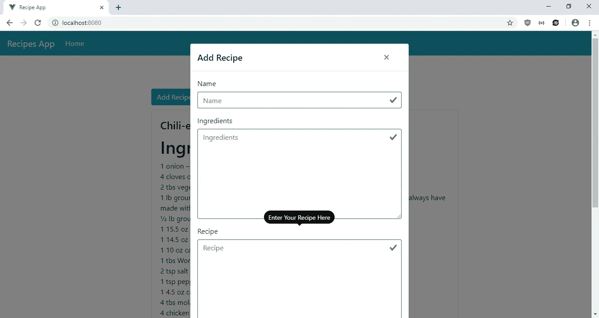
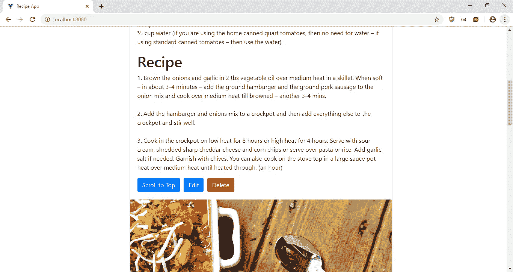
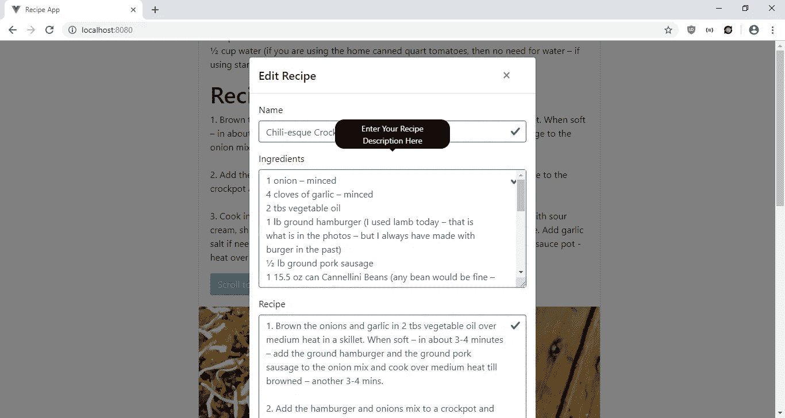
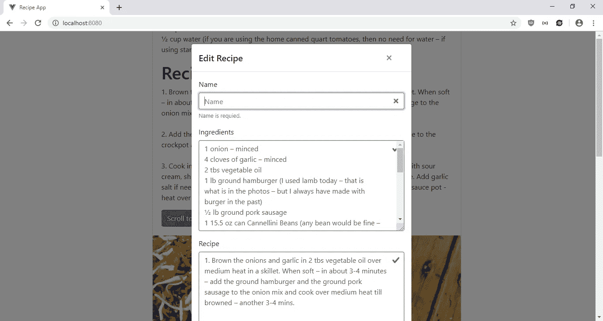

# 如何向您的 Vue.js 应用程序添加工具提示

> 原文：<https://javascript.plainenglish.io/how-to-add-tool-tips-to-your-vue-js-app-678c41747789?source=collection_archive---------3----------------------->

工具提示通常用于提示如何使用 web 应用程序的不同部分。它易于添加，有助于用户更好地理解应用程序。它们对于显示过长文本也很有用。

在 Vue.js 中，通过位于[https://github.com/Akryum/v-tooltip](https://github.com/Akryum/v-tooltip)的 V-Tooltip 指令，添加工具提示很容易。它是可配置工具提示的指令。您可以更改颜色、文本、显示延迟以及许多其他与工具提示相关的选项。

在本文中，我们将构建一个食谱应用程序，它有工具提示来指导用户如何将食谱添加到表单中。用户可以输入他们的菜名、配料、步骤，并上传照片。我们将使用 Vue.js 构建应用程序

我们通过运行 Vue CLI 开始构建应用程序。我们通过输入以下命令来运行它:

```
npx @vue/cli create recipe-app
```

然后选择“手动选择功能”。接下来，我们在列表中选择 Babel、Vue 路由器、Vuex 和 CSS 预处理程序。之后，我们安装一些软件包。我们将安装 Axios 向我们的后端发出 HTTP 请求。BootstrapVue 用于样式化，V-Tooltip 用于工具提示，Vee-Validate 用于表单验证。我们通过运行`npm i axios bootstrap-vue v-tooltip vee-validate`来安装这些包。

现在我们继续创建组件。在`components`文件夹中创建一个名为`RecipeForm.vue`的文件，并添加:

```
<template>
  <ValidationObserver ref="observer" v-slot="{ invalid }">
    <b-form [@submit](http://twitter.com/submit).prevent="onSubmit" novalidate>
      <b-form-group
        label="Name"
        v-tooltip="{
          content: 'Enter Your Recipe Name Here',
          classes: ['info'],
          targetClasses: ['it-has-a-tooltip'],
        }"
      >
        <ValidationProvider name="name" rules="required" v-slot="{ errors }">
          <b-form-input
            type="text"
            :state="errors.length == 0"
            v-model="form.name"
            required
            placeholder="Name"
            name="name"
          ></b-form-input>
          <b-form-invalid-feedback :state="errors.length == 0">Name is requied.</b-form-invalid-feedback>
        </ValidationProvider>
      </b-form-group><b-form-group
        label="Ingredients"
        v-tooltip="{
          content: 'Enter Your Recipe Description Here',
          classes: ['info'],
          targetClasses: ['it-has-a-tooltip'],
        }"
      >
        <ValidationProvider name="ingredients" rules="required" v-slot="{ errors }">
          <b-form-textarea
            :state="errors.length == 0"
            v-model="form.ingredients"
            required
            placeholder="Ingredients"
            name="ingredients"
            rows="8"
          ></b-form-textarea>
          <b-form-invalid-feedback :state="errors.length == 0">Ingredients is requied.</b-form-invalid-feedback>
        </ValidationProvider>
      </b-form-group><b-form-group
        label="Recipe"
        v-tooltip="{
          content: 'Enter Your Recipe Here',
          classes: ['info'],
          targetClasses: ['it-has-a-tooltip'],
        }"
      >
        <ValidationProvider name="recipe" rules="required" v-slot="{ errors }">
          <b-form-textarea
            :state="errors.length == 0"
            v-model="form.recipe"
            required
            placeholder="Recipe"
            name="recipe"
            rows="15"
          ></b-form-textarea>
          <b-form-invalid-feedback :state="errors.length == 0">Recipe is requied.</b-form-invalid-feedback>
        </ValidationProvider>
      </b-form-group><b-form-group label="Photo">
        <input type="file" style="display: none" ref="file" [@change](http://twitter.com/change)="onChangeFileUpload($event)" />
        <b-button
          [@click](http://twitter.com/click)="$refs.file.click()"
          v-tooltip="{
            content: 'Upload Photo of Your Dish Here',
            classes: ['info'],
            targetClasses: ['it-has-a-tooltip'],
          }"
        >Upload Photo</b-button>
      </b-form-group><br /><b-button type="submit" variant="primary" style="margin-right: 10px">Submit</b-button>
      <b-button type="reset" variant="danger" [@click](http://twitter.com/click)="cancel()">Cancel</b-button>
    </b-form>
  </ValidationObserver>
</template><script>
import { requestsMixin } from "@/mixins/requestsMixin";export default {
  name: "RecipeForm",
  mixins: [requestsMixin],
  props: {
    edit: Boolean,
    recipe: Object
  },
  methods: {
    async onSubmit() {
      const isValid = await this.$refs.observer.validate();
      if (!isValid || !this.form.photo) {
        return;
      }if (this.edit) {
        await this.editRecipe(this.form);
      } else {
        await this.addRecipe(this.form);
      }
      const { data } = await this.getRecipes();
      this.$store.commit("setRecipes", data);
      this.$emit("saved");
    },
    cancel() {
      this.$emit("cancelled");
    },
    onChangeFileUpload($event) {
      const file = $event.target.files[0];
      const reader = new FileReader();
      reader.onload = () => {
        this.$refs.photo.src = reader.result;
        this.form.photo = reader.result;
      };
      reader.readAsDataURL(file);
    }
  },
  data() {
    return {
      form: {}
    };
  },
  watch: {
    recipe: {
      handler(val) {
        this.form = JSON.parse(JSON.stringify(val || {}));
      },
      deep: true,
      immediate: true
    }
  }
};
</script><style>
.photo {
  width: 100%;
  margin-bottom: 10px;
}
</style>
```

在这个文件中，我们有一个表单让用户输入他们的食谱。我们有文本输入和一个文件上传文件，让用户上传照片。我们使用 Vee-Validate 来验证我们的输入。我们使用`ValidationObserver`组件来监视组件内部表单的有效性，使用`ValidationProvider`来检查组件内部输入值的有效性规则。在`ValidationProvider`中，我们为文本输入字段提供了 BootstrapVue 输入。

每个表单域都有一个带有附加说明的工具提示。指令是由 V-Tooltip 库提供的。我们在这里设置工具提示的内容和类，我们可以设置其他选项，比如显示延迟，工具提示的位置和背景颜色。完整的选项列表可在 https://github.com/Akryum/v-tooltip 获得。

照片上传的工作原理是让用户用上传照片按钮打开文件上传对话框。当点击上传照片按钮时，该按钮将点击隐藏文件输入。用户选择一个文件后，就会调用`onChangeFileUpload`函数。在这个函数中，我们有`FileReader`对象，它设置了`img`标签的`src`属性来显示上传的图像，还有`this.form.photo`字段。`readAsDataUrl`将图像读入一个字符串，这样我们就可以轻松提交了。

这个表单也用于编辑食谱，所以我们有一个`watch`块来监视`recipe`属性，当有需要编辑的内容时，我们会将它传递给这个组件。

接下来，我们创建一个`mixins`文件夹，并将`requestsMixin.js`添加到`mixins`文件夹中。在文件中，我们添加了:

```
const APIURL = "[http://localhost:3000](http://localhost:3000)";
const axios = require("axios");export const requestsMixin = {
  methods: {
    getRecipes() {
      return axios.get(`${APIURL}/recipes`);
    },addRecipe(data) {
      return axios.post(`${APIURL}/recipes`, data);
    },editRecipe(data) {
      return axios.put(`${APIURL}/recipes/${data.id}`, data);
    },deleteRecipe(id) {
      return axios.delete(`${APIURL}/recipes/${id}`);
    }
  }
};
```

这些是我们在组件中用来发出 HTTP 请求以获取和保存数据的函数。

接下来在`Home.vue`中，将现有代码替换为:

```
<template>
  <div class="page">
    <h1 class="text-center">Recipes</h1>
    <b-button-toolbar class="button-toolbar">
      <b-button [@click](http://twitter.com/click)="openAddModal()" variant="primary">Add Recipe</b-button>
    </b-button-toolbar><b-card
      v-for="r in recipes"
      :key="r.id"
      :title="r.name"
      :img-src="r.photo"
      img-alt="Image"
      img-top
      tag="article"
      class="recipe-card"
      img-bottom
    >
      <b-card-text>
        <h1>Ingredients</h1>
        <div class="wrap">{{r.ingredients}}</div>
      </b-card-text><b-card-text>
        <h1>Recipe</h1>
        <div class="wrap">{{r.recipe}}</div>
      </b-card-text><b-button [@click](http://twitter.com/click)="openEditModal(r)" variant="primary">Edit</b-button><b-button [@click](http://twitter.com/click)="deleteOneRecipe(r.id)"  variant="danger">Delete</b-button>
    </b-card><b-modal id="add-modal" title="Add Recipe" hide-footer>
      <RecipeForm [@saved](http://twitter.com/saved)="closeModal()" [@cancelled](http://twitter.com/cancelled)="closeModal()" :edit="false" />
    </b-modal><b-modal id="edit-modal" title="Edit Recipe" hide-footer>
      <RecipeForm
        [@saved](http://twitter.com/saved)="closeModal()"
        [@cancelled](http://twitter.com/cancelled)="closeModal()"
        :edit="true"
        :recipe="selectedRecipe"
      />
    </b-modal>
  </div>
</template><script>
// @ is an alias to /src
import RecipeForm from "@/components/RecipeForm.vue";
import { requestsMixin } from "@/mixins/requestsMixin";export default {
  name: "home",
  components: {
    RecipeForm
  },
  mixins: [requestsMixin],
  computed: {
    recipes() {
      return this.$store.state.recipes;
    }
  },
  beforeMount() {
    this.getAllRecipes();
  },
  data() {
    return {
      selectedRecipe: {}
    };
  },
  methods: {
    openAddModal() {
      this.$bvModal.show("add-modal");
    },
    openEditModal(recipe) {
      this.$bvModal.show("edit-modal");
      this.selectedRecipe = recipe;
    },
    closeModal() {
      this.$bvModal.hide("add-modal");
      this.$bvModal.hide("edit-modal");
      this.selectedRecipe = {};
    },
    async deleteOneRecipe(id) {
      await this.deleteRecipe(id);
      this.getAllRecipes();
    },
    async getAllRecipes() {
      const { data } = await this.getRecipes();
      this.$store.commit("setRecipes", data);
    }
  }
};
</script><style scoped>
.recipe-card {
  width: 95vw;
  margin: 0 auto;
  max-width: 700px;
}.wrap {
  white-space: pre-wrap;
}
</style>
```

在这个文件中，我们有一个 BootstrapVue 卡片列表来显示配方条目列表，并让用户打开和关闭添加和编辑模式。我们在每张卡上都有按钮，让用户编辑或删除每个条目。每张卡的底部都有一张输入食谱时上传的食谱图片。

在`scripts`部分，我们用`beforeMount`钩子在页面加载期间用我们在 mixin 中编写的`getRecipes`函数获取所有密码条目。当编辑按钮被点击时，`selectedRecipe`变量被设置，我们将它传递给`RecipeForm`进行编辑。

要删除一个食谱，我们在 mixin 中调用`deleteRecipe`向后端发出请求。

`wrap`类中的 CSS 用于将换行符呈现为换行符。

接下来在`App.vue`中，我们将现有代码替换为:

```
<template>
  <div id="app">
    <b-navbar toggleable="lg" type="dark" variant="info">
      <b-navbar-brand to="/">Recipes App</b-navbar-brand><b-navbar-toggle target="nav-collapse"></b-navbar-toggle><b-collapse id="nav-collapse" is-nav>
        <b-navbar-nav>
          <b-nav-item to="/" :active="path  == '/'">Home</b-nav-item>
        </b-navbar-nav>
      </b-collapse>
    </b-navbar>
    <router-view />
  </div>
</template><script>
export default {
  data() {
    return {
      path: this.$route && this.$route.path
    };
  },
  watch: {
    $route(route) {
      this.path = route.path;
    }
  }
};
</script><style lang="scss">
.page {
  padding: 20px;
  margin: 0 auto;
  max-width: 700px;
}button {
  margin-right: 10px !important;
}.button-toolbar {
  margin-bottom: 10px;
}.tooltip {
  display: block !important;
  z-index: 10000;.tooltip-inner {
    background: black;
    color: white;
    border-radius: 16px;
    padding: 5px 10px 4px;
  }.tooltip-arrow {
    width: 0;
    height: 0;
    border-style: solid;
    position: absolute;
    margin: 5px;
    border-color: black;
  }&[x-placement^="top"] {
    margin-bottom: 5px;.tooltip-arrow {
      border-width: 5px 5px 0 5px;
      border-left-color: transparent !important;
      border-right-color: transparent !important;
      border-bottom-color: transparent !important;
      bottom: -5px;
      left: calc(50% - 5px);
      margin-top: 0;
      margin-bottom: 0;
    }
  }&[x-placement^="bottom"] {
    margin-top: 5px;.tooltip-arrow {
      border-width: 0 5px 5px 5px;
      border-left-color: transparent !important;
      border-right-color: transparent !important;
      border-top-color: transparent !important;
      top: -5px;
      left: calc(50% - 5px);
      margin-top: 0;
      margin-bottom: 0;
    }
  }&[x-placement^="right"] {
    margin-left: 5px;.tooltip-arrow {
      border-width: 5px 5px 5px 0;
      border-left-color: transparent !important;
      border-top-color: transparent !important;
      border-bottom-color: transparent !important;
      left: -5px;
      top: calc(50% - 5px);
      margin-left: 0;
      margin-right: 0;
    }
  }&[x-placement^="left"] {
    margin-right: 5px;.tooltip-arrow {
      border-width: 5px 0 5px 5px;
      border-top-color: transparent !important;
      border-right-color: transparent !important;
      border-bottom-color: transparent !important;
      right: -5px;
      top: calc(50% - 5px);
      margin-left: 0;
      margin-right: 0;
    }
  }&[aria-hidden="true"] {
    visibility: hidden;
    opacity: 0;
    transition: opacity 0.15s, visibility 0.15s;
  }&[aria-hidden="false"] {
    visibility: visible;
    opacity: 1;
    transition: opacity 0.15s;
  }
}
</style>
```

在页面顶部添加一个引导导航条，并添加一个`router-view`来显示我们定义的路线。另外，我们在`style`部分有 V-Tooltip 样式。这个`style`部分没有限定范围，所以样式将适用于全球。在`.page`选择器中，我们给页面添加一些填充，并将`max-width`设置为 700 像素，这样卡片就不会太宽。我们还在按钮上添加了一些边距。

接下来在`main.js`中，我们将现有代码替换为:

```
import Vue from "vue";
import App from "./App.vue";
import router from "./router";
import store from "./store";
import BootstrapVue from "bootstrap-vue";
import VTooltip from "v-tooltip";
import "bootstrap/dist/css/bootstrap.css";
import "bootstrap-vue/dist/bootstrap-vue.css";
import { ValidationProvider, extend, ValidationObserver } from "vee-validate";
import { required } from "vee-validate/dist/rules";
extend("required", required);
Vue.component("ValidationProvider", ValidationProvider);
Vue.component("ValidationObserver", ValidationObserver);
Vue.use(BootstrapVue);
Vue.use(VTooltip);Vue.config.productionTip = false;new Vue({
  router,
  store,
  render: h => h(App)
}).$mount("#app");
```

我们在这里添加了我们需要的所有库，包括 BootstrapVue JavaScript 和 CSS、Vee-Validate 组件以及验证规则，以及我们在组件中使用的 V-Tooltip 指令。

在`router.js`中，我们将现有代码替换为:

```
import Vue from "vue";
import Router from "vue-router";
import Home from "./views/Home.vue";Vue.use(Router);export default new Router({
  mode: "history",
  base: process.env.BASE_URL,
  routes: [
    {
      path: "/",
      name: "home",
      component: Home
    }
  ]
});
```

将主页包含在我们的路线中，以便用户可以看到该页面。

在`store.js`中，我们将现有代码替换为:

```
import Vue from "vue";
import Vuex from "vuex";Vue.use(Vuex);export default new Vuex.Store({
  state: {
    recipes: []
  },
  mutations: {
    setRecipes(state, payload) {
      state.recipes = payload;
    }
  },
  actions: {}
});
```

将我们的`recipes`状态添加到存储中，这样我们就可以在`RecipeForm`和`HomePage`组件的`computed`块中观察到它。我们有`setRecipes`函数来更新`passwords`状态，我们通过调用`this.$store.commit(“setRecipes”, response.data);`在组件中使用它，就像我们在`RecipeForm`中做的那样。

最后，在`index.html`中，我们将现有代码替换为:

```
<!DOCTYPE html>
<html lang="en">
  <head>
    <meta charset="utf-8" />
    <meta http-equiv="X-UA-Compatible" content="IE=edge" />
    <meta name="viewport" content="width=device-width,initial-scale=1.0" />
    <link rel="icon" href="<%= BASE_URL %>favicon.ico" />
    <title>Recipe App</title>
  </head>
  <body>
    <noscript>
      <strong
        >We're sorry but vue-tooltip-tutorial-app doesn't work properly without
        JavaScript enabled. Please enable it to continue.</strong
      >
    </noscript>
    <div id="app"></div>
    <!-- built files will be auto injected -->
  </body>
</html>
```

改一下标题。

在所有的努力之后，我们可以通过运行`npm run serve`来启动我们的 app。

为了启动后端，我们首先通过运行`npm i json-server`来安装`json-server`包。然后，转到我们的项目文件夹并运行:

```
json-server --watch db.json
```

在`db.json`中，将文本改为:

```
{
  "recipes": [
  ]
}
```

所以我们有了在`requests.js`中定义的`recipes` 端点。

经过所有的努力，我们得到了:

