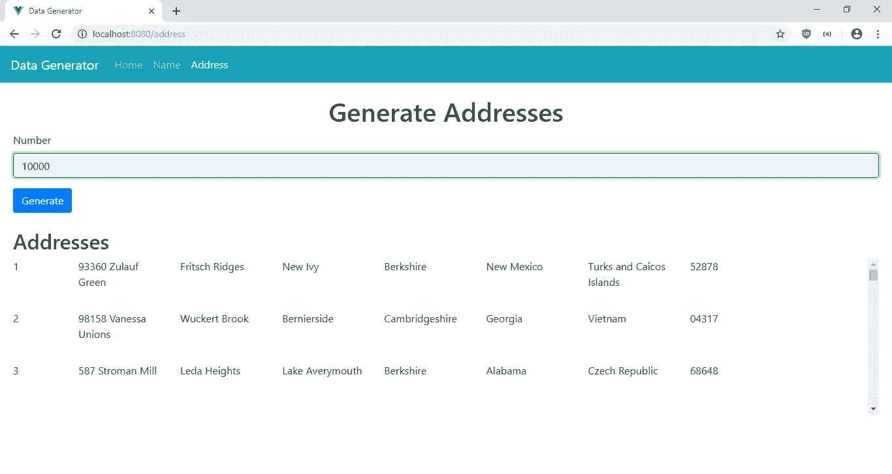
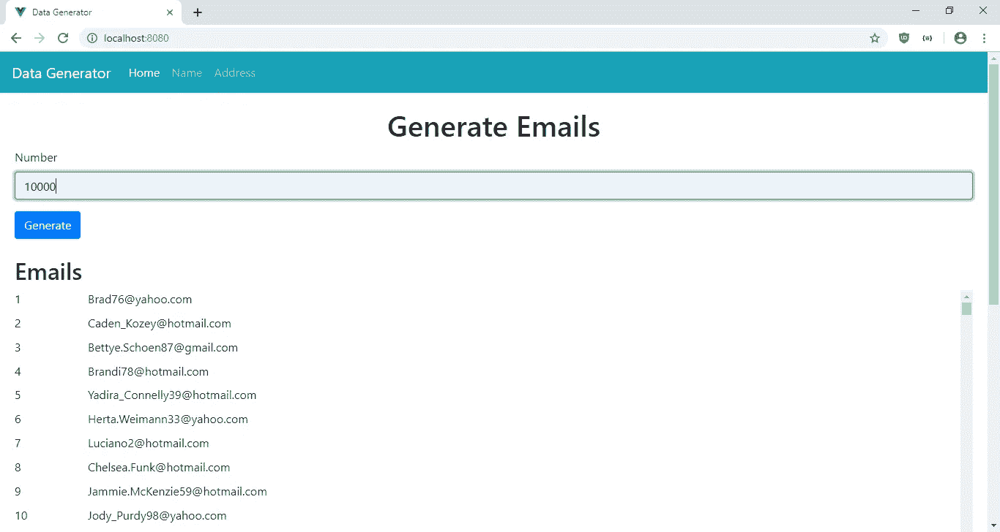
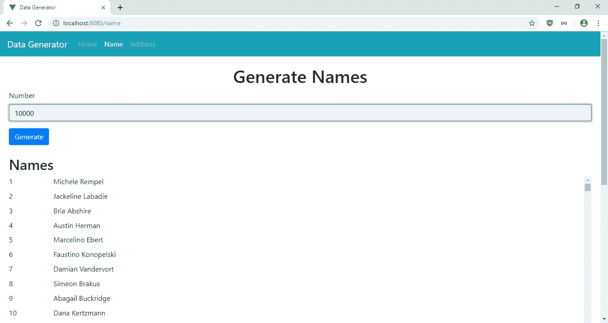

# 如何向 Vue 应用添加虚拟滚动

> 原文：<https://javascript.plainenglish.io/how-to-add-virtual-scrolling-to-a-vue-app-19c21d55b3bc?source=collection_archive---------3----------------------->

要在应用程序中显示大量数据，一次加载所有内容并不是一个好的解决方案。加载一个大列表会消耗用户计算机的资源。因此，我们需要一个更好的解决方案。最有效的解决方案是一次加载少量数据。应该只加载屏幕上显示的内容。这种解决方案被称为虚拟滚动。

有了 Vue.js，我们可以使用位于[https://www.npmjs.com/package/vue-virtual-scroll-list](https://www.npmjs.com/package/vue-virtual-scroll-list)的 vue-virtual-scroll-list 包将虚拟滚动添加到我们的 Vue.js 应用中。这是用于此目的的最简单的软件包之一。

在这篇文章中，我们将制作一个应用程序，让我们生成大量的虚假数据，并将它们显示在虚拟的滚动列表中。它会询问用户想要创建多少个条目，然后在用户提交数字时创建。

首先，我们用 Vue CLI 创建 Vue.js 项目。我们运行`npx @vue/cli create data-generator`来创建应用程序。在向导中，我们选择“手动选择功能”，然后选择包括 Babel 和 Vue-Router。

接下来，我们需要安装一些软件包。我们需要 BootstrapVue 来设计样式，需要 Faker 来创建假数据，需要 Vee-Validate 来验证用户输入，需要 Vue-Virtual-Scroll-List 来显示虚拟滚动列表中的项目列表。我们通过运行以下命令来安装它们:

```
npm i bootstrap-vue faker vee-validate vue-virtual-scrolling-list
```

安装完软件包后，我们添加页面。首先，我们在`views`文件夹中创建`Address.vue`，并添加:

```
<template>
  <div class="page">
    <h1 class="text-center">Generate Addresses</h1>
    <ValidationObserver ref="observer" v-slot="{ invalid }">
      <b-form [@submit](http://twitter.com/submit).prevent="onSubmit" novalidate>
        <b-form-group label="Number" label-for="number">
          <ValidationProvider
            name="number"
            rules="required|min_value:1|max_value:100000"
            v-slot="{ errors }"
          >
            <b-form-input
              :state="errors.length == 0"
              v-model="form.number"
              type="text"
              required
              placeholder="Number"
              name="number"
            ></b-form-input>
            <b-form-invalid-feedback :state="errors.length == 0">{{errors.join('. ')}}</b-form-invalid-feedback>
          </ValidationProvider>
        </b-form-group>
        <b-button type="submit" variant="primary">Generate</b-button>
      </b-form>
    </ValidationObserver><br /><h2>Addresses</h2><virtual-list :size="itemHeight" :remain="3">
      <div v-for="(item, index) of list" :key="index" class="result-row">
        <div class="index">{{index + 1}}</div>
        <div class="column">{{item.streetAddress}}</div>
        <div class="column">{{item.streetName}}</div>
        <div class="column">{{item.city}}</div>
        <div class="column">{{item.county}}</div>
        <div class="column">{{item.state}}</div>
        <div class="column">{{item.country}}</div>
        <div class="column">{{item.zipCode}}</div>
      </div>
    </virtual-list>
  </div>
</template><script>
const faker = require("faker");
import virtualList from "vue-virtual-scroll-list";export default {
  name: "home",
  data() {
    return {
      form: {},
      list: [],
      itemHeight: 80
    };
  },
  components: { "virtual-list": virtualList },
  methods: {
    async onSubmit() {
      const isValid = await this.$refs.observer.validate();
      if (!isValid) {
        return;
      }
      this.list = Array.from({ length: this.form.number }).map((l, i) => {
        return {
          city: faker.address.city(),
          streetName: faker.address.streetName(),
          streetAddress: faker.address.streetAddress(),
          county: faker.address.county(),
          state: faker.address.state(),
          country: faker.address.country(),
          zipCode: faker.address.zipCode()
        };
      });
    }
  }
};
</script><style scoped>
.column {
  padding-right: 20px;
  width: calc(80vw / 7);
  overflow: hidden;
  text-overflow: ellipsis;
}.result-row {
  height: 80px;
}
</style>
```

在这个页面中，我们让用户通过输入一个从 1 到 100000 的数字来生成假地址，然后一旦用户输入了这个数字，就会调用`onSubmit`来生成条目。Faker 库用于生成项目。表单验证是通过在`ValidationObserver`组件中包装表单和在`ValidationProvider`组件中包装输入来完成的。我们在`ValidationProvider`的`rules`道具中提供了验证规则。稍后会在`main.js`中添加规则。

错误信息显示在`b-form-invalid-feedback`组件中。我们从`ValidationProvider`的作用域槽中得到错误。这就是我们得到`errors`对象的地方。

当用户提交数字时，调用`onSubmit`函数。这就是`ValidationObserver`变得有用的地方，因为它为我们提供了`this.$refs.observer.validate()`函数来检查表单的有效性。

如果`isValid`解析为`true`，那么我们通过使用`Array.from`方法映射生成一个具有用户输入长度的数组(`this.form.number`)来生成列表，然后将每个条目映射到假地址行。

我们在`script`部分添加了来自 Vue-Virtual-Scroll-List 的`virtual-list`组件，这样我们就可以在模板中使用它了。这些项目在`virtual-list`组件中，所以我们一次只显示几个。`remain`道具是我们指定一次在屏幕上显示的项目数量的地方。`size`支柱用于设置每行的高度。

接下来在`Home.vue`中，我们将现有代码替换为:

```
<template>
  <div class="page">
    <h1 class="text-center">Generate Emails</h1>
    <ValidationObserver ref="observer" v-slot="{ invalid }">
      <b-form [@submit](http://twitter.com/submit).prevent="onSubmit" novalidate>
        <b-form-group label="Number" label-for="number">
          <ValidationProvider
            name="number"
            rules="required|min_value:1|max_value:100000"
            v-slot="{ errors }"
          >
            <b-form-input
              :state="errors.length == 0"
              v-model="form.number"
              type="text"
              required
              placeholder="Number"
              name="number"
            ></b-form-input>
            <b-form-invalid-feedback :state="errors.length == 0">{{errors.join('. ')}}</b-form-invalid-feedback>
          </ValidationProvider>
        </b-form-group>
        <b-button type="submit" variant="primary">Generate</b-button>
      </b-form>
    </ValidationObserver> <br /> <h2>Emails</h2> <virtual-list :size="itemHeight" :remain="30">
      <div v-for="(item, index) of list" :key="index" class="result-row">
        <div class="index">{{index + 1}}</div>
        <div>{{item}}</div>
      </div>
    </virtual-list>
  </div>
</template><script>
const faker = require("faker");
import virtualList from "vue-virtual-scroll-list";export default {
  name: "home",
  data() {
    return {
      form: {},
      list: [],
      itemHeight: 30
    };
  },
  components: { "virtual-list": virtualList },
  methods: {
    async onSubmit() {
      const isValid = await this.$refs.observer.validate();
      if (!isValid) {
        return;
      }
      this.list = Array.from({ length: this.form.number }).map((l, i) => {
        return faker.internet.email();
      });
    }
  }
};
</script>
```

它的工作方式与`Address.vue`非常相似，除了我们生成的是电子邮件而不是地址。

接下来在`views`文件夹中创建一个`Name.vue`文件，并添加:

```
<template>
  <div class="page">
    <h1 class="text-center">Generate Names</h1>
    <ValidationObserver ref="observer" v-slot="{ invalid }">
      <b-form [@submit](http://twitter.com/submit).prevent="onSubmit" novalidate>
        <b-form-group label="Number" label-for="number">
          <ValidationProvider
            name="number"
            rules="required|min_value:1|max_value:100000"
            v-slot="{ errors }"
          >
            <b-form-input
              :state="errors.length == 0"
              v-model="form.number"
              type="text"
              required
              placeholder="Number"
              name="number"
            ></b-form-input>
            <b-form-invalid-feedback :state="errors.length == 0">{{errors.join('. ')}}</b-form-invalid-feedback>
          </ValidationProvider>
        </b-form-group>
        <b-button type="submit" variant="primary">Generate</b-button>
      </b-form>
    </ValidationObserver> <br /> <h2>Names</h2> <virtual-list :size="itemHeight" :remain="30">
      <div v-for="(item, index) of list" :key="index" class="result-row">
        <div class="index">{{index + 1}}</div>
        <div>{{item.firstName}} {{item.lastName}}</div>
      </div>
    </virtual-list>
  </div>
</template><script>
const faker = require("faker");
import virtualList from "vue-virtual-scroll-list";export default {
  name: "home",
  data() {
    return {
      form: {},
      list: [],
      itemHeight: 30
    };
  },
  components: { "virtual-list": virtualList },
  methods: {
    async onSubmit() {
      const isValid = await this.$refs.observer.validate();
      if (!isValid) {
        return;
      }
      this.list = Array.from({ length: this.form.number }).map((l, i) => {
        return {
          firstName: faker.name.firstName(),
          lastName: faker.name.lastName()
        };
      });
    }
  }
};
</script>
```

在用户输入他们想要的项目数量后，我们在这个文件中生成假的名和姓。

然后在`App.vue`中，将现有代码替换为:

```
<template>
  <div id="app">
    <b-navbar toggleable="lg" type="dark" variant="info">
      <b-navbar-brand to="/">Data Generator</b-navbar-brand><b-navbar-toggle target="nav-collapse"></b-navbar-toggle><b-collapse id="nav-collapse" is-nav>
        <b-navbar-nav>
          <b-nav-item to="/" :active="path  == '/'">Home</b-nav-item>
          <b-nav-item to="/name" :active="path  == '/name'">Name</b-nav-item>
          <b-nav-item to="/address" :active="path  == '/address'">Address</b-nav-item>
        </b-navbar-nav>
      </b-collapse>
    </b-navbar>
    <router-view />
  </div>
</template><script>
export default {
  data() {
    return {
      path: this.$route && this.$route.path
    };
  },
  watch: {
    $route(route) {
      this.path = route.path;
    }
  }
};
</script><style lang="scss">
.page {
  padding: 20px;
}.result-row {
  display: flex;
  height: calc(50vh / 10);
}.index {
  padding-right: 20px;
  min-width: 100px;
}
</style>
```

添加带有页面链接的 BootstrapVue 导航栏。在顶栏中，我们为链接设置了`active`属性，这样我们就可以突出显示当前页面的链接。在`scripts`部分，我们观察 Vue Router 为 app 当前路径提供的`$route`对象，并将其分配给`this.path`，这样我们就可以用它来设置`active`道具。

接下来在`main.js`中，我们将现有代码替换为:

```
import Vue from "vue";
import App from "./App.vue";
import router from "./router";
import store from "./store";
import BootstrapVue from "bootstrap-vue";
import "bootstrap/dist/css/bootstrap.css";
import "bootstrap-vue/dist/bootstrap-vue.css";
import { ValidationProvider, extend, ValidationObserver } from "vee-validate";
import { required } from "vee-validate/dist/rules";
import { min_value } from "vee-validate/dist/rules";
import { max_value } from "vee-validate/dist/rules";extend("required", required);
extend("min_value", min_value);
extend("max_value", max_value);
Vue.component("ValidationProvider", ValidationProvider);
Vue.component("ValidationObserver", ValidationObserver);
Vue.use(BootstrapVue);
Vue.config.productionTip = false;new Vue({
  router,
  store,
  render: h => h(App)
}).$mount("#app");
```

我们在这里添加了我们在之前的文件中使用的验证规则，并包括了我们在应用程序中使用的所有库。我们通过调用`Vue.component`注册了`ValidationProvider`和`ValidationObserver`，这样我们就可以在我们的组件中使用它们。Vee-Validate 提供的验证规则包含在应用程序中，因此模板可以通过从 Vee-Validate 调用`extend`来使用这些规则。我们调用`Vue.use(BootstrapVue)`在我们的应用程序中使用 BootstrapVue。

在`router.js`中，我们将现有代码替换为:

```
import Vue from "vue";
import Router from "vue-router";
import Home from "./views/Home.vue";
import Name from "./views/Name.vue";
import Address from "./views/Address.vue";Vue.use(Router);export default new Router({
  mode: "history",
  base: process.env.BASE_URL,
  routes: [
    {
      path: "/",
      name: "home",
      component: Home
    },
    {
      path: "/name",
      name: "name",
      component: Name
    },
    {
      path: "/address",
      name: "address",
      component: Address
    }
  ]
});
```

将我们创建的页面包含在路由中，以便用户可以通过顶部栏中的链接或直接键入 URL 来访问它们。

接下来在`index.html`中，我们将现有代码替换为:

```
<!DOCTYPE html>
<html lang="en">
  <head>
    <meta charset="utf-8" />
    <meta http-equiv="X-UA-Compatible" content="IE=edge" />
    <meta name="viewport" content="width=device-width,initial-scale=1.0" />
    <link rel="icon" href="<%= BASE_URL %>favicon.ico" />
    <title>Data Generator</title>
  </head>
  <body>
    <noscript>
      <strong
        >We're sorry but vue-virtual-scroll-tutorial-app doesn't work properly
        without JavaScript enabled. Please enable it to continue.</strong
      >
    </noscript>
    <div id="app"></div>
    <!-- built files will be auto injected -->
  </body>
</html>
```

更改应用程序的标题。

最后，我们运行`npm run serve`得到以下屏幕:

