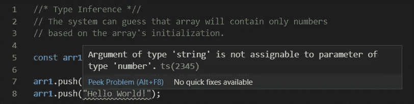
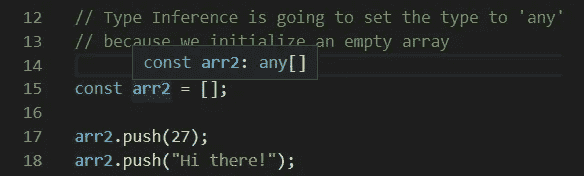
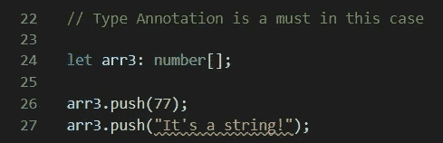

# 如何采用静态类型

> 原文：<https://javascript.plainenglish.io/how-to-adopt-a-static-typing-c59de0973cca?source=collection_archive---------10----------------------->

## 静态打字并不适合所有人！

## TypeScript 为团队提供了协同作用

Photo by [Glenn Carstens-Peters](https://unsplash.com/@glenncarstenspeters?utm_source=unsplash&utm_medium=referral&utm_content=creditCopyText) on [Unsplash](https://unsplash.com/s/photos/typing-machine?utm_source=unsplash&utm_medium=referral&utm_content=creditCopyText)

“变得有条理是自尊的表现。” —加贝·伯恩斯坦

用 JavaScript 编程的全部思想是理解系统。一个优秀程序员的关键标志之一是**总是知道他在和哪些类型的人一起工作**。我们正在**不断调整编码风格**，这将使我们的变量及其类型更加明显。

# 静态类型给了我们什么？

截至 2012 年，我们使用 JavaScript 时没有任何语法上的麻烦。2012 年， [TypeScript](https://www.typescriptlang.org/) (缩写 TS)由[微软](https://channel9.msdn.com/posts/Anders-Hejlsberg-Introducing-TypeScript)推出，作为一种新工具，它通过向语言添加类型来扩展 JavaScript。TS 的主要目标是**限制可以进入类型比较**的值的种类。

我认为**添加静态类型可以提高你的代码质量**不管你喜不喜欢。如果你不喜欢静态打字系统，你可以试试 [Linter](https://eslint.org/) 。这是一个很好的工具，它给你一个选项来决定哪个规则将适用。

考虑到 Linter 的可配置性，有经验的开发人员可能更喜欢使用它。你可以很容易地抓住所有你不想做的事情。你可以建立一个强大的插件，它可以解决你的大部分错误。请记住，您不能用这个工具来防止逻辑错误。

当你独自工作时，Linter 是一个完美的工具。但是，如果你是团队的一员呢？团队必须民主地决定哪种工具是合适的。没有一种工具能适合每个团队。如你所见，没有个人独裁者替所有人做决定的空间！

在我看来，静态打字工具如 **TypeScript** 和 **Flow** 都是很棒的工具，我很高兴它们的存在。我没有使用它们，因为我没有在团队中工作。我个人不需要它们，因为它们解决了我没有的问题。一切都在于视角。

我没有说我不用 TS，因为我没有障碍。然而，我解决这些问题的方式不同。因为 TS 是一个抽象概念，所以会有一些复杂性，你不会学到 JavaScript 引擎是如何在幕后工作的。在我看来，我不喜欢用自己不了解的系统。

如果我们想讨论 TypeScript，我们将首先解释使用静态类型系统的好处:

1.  TypeScript 将捕捉与类型相关的错误。有必要避免产生类型错误。每个开发人员都希望有一个工具能够理解他的意图，从而帮助他正确地完成任务。
2.  **TypeScript 在推断类型的时候超级聪明。**我们可以说，这有助于我们编写对其他开发人员来说更容易上手的代码。这个系统的主要意图是我们称之为[类型注释](https://www.typescriptlang.org/docs/handbook/typescript-tooling-in-5-minutes.html#type-annotations)的东西——一个建立在 JavaScript 代码之上的特性。
3.  最酷的是一个进入源代码的选项。我知道这对开源软件来说很常见，但是如果我们开始使用[类型定义](https://www.typescriptlang.org/docs/handbook/2/type-declarations.html#external-definitions)文件，就会显示出全部能力。我们可以浏览这些文件，了解我们正在使用的库的流程——我们甚至不需要使用文档。
4.  **因为这些很酷的类型定义特性，我们可以分析工具生态系统，它可以在我们的 IDE 中实时显示。**不要忘记自动完成特性和采用面向对象范例的可能性。
5.  **TypeScript 集成到**[**IDE**](https://en.wikipedia.org/wiki/Integrated_development_environment)**令人印象深刻，尤其是** [**Visual Studio 代码**](https://code.visualstudio.com/) **。你必须记住 VS Code 和 TypeScript 都是微软的产品。**

TypeScript 并不是提供这些强大功能的唯一工具。我前面提到了心流。 [Flow](https://flow.org/) 是脸书在 2014 年开始的一个项目。它不像 TypeScript 那样在社区中被接受，但我毫不怀疑它将很快成为一个不错的竞争对手。

# 总有不好的一面！

像每个系统一样，TypeScript 也有它的警告。我说过类型推理是这个系统最强的王牌之一。但是，这是一个依赖于一些参数的算法。我们不能完全依赖他，因为这是一种猜测，而不是保证。

我们无法确定编译时会发生什么。在这种情况下，你设计系统的能力就凸显出来了。如果你有一个糟糕的设计，并让系统推断类型，你可能不会从中得到任何好处。如果系统不能猜出变量类型，它将把它设置为默认值- *any* 。

**如果 TS 猜不出类型，那就说明我们有问题。**这可能导致不好的做法，因为 TypeScript 建议避免将值标记为 type *any* 。如果你喜欢用 any 类型操作，类型系统是没用的，因为用纯 JavaScript 也能达到同样的效果。

也许你不是来自打字世界，你不能理解我在说什么，所以我将给出一个简单的[例子](https://gist.github.com/alenvlahovljak/db8cb937f2b9491125a737503c5e211b):

TypeScript’s Type Inference in action

正如我们所看到的，类型推断基于数组的初始化来猜测类型。从现在开始，这个数组只能**包含数字:**

Type Inference has its power

请看，**我们不能向数组中添加字符串或任何其他类型，只能添加数字**。如果我们做下一件事，事情就会变得混乱:

Type Inference’s default type is ‘any’

因为我们初始化了一个空数组，所以系统无法猜测我们在做什么。在这些情况下，TypeScript 将设置一个默认值，即 *any* 。为了解决这个问题，我们必须注释类型:

TypeScript’s Type Annotation in action

结论:**没有注释的每一种类型，不管是我们使用的代码还是库，都可能导致问题，并导致错误的安全感。我们必须非常小心类型推断。**