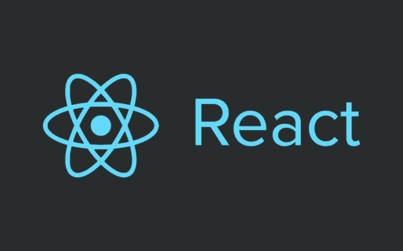

# 如何在离开 React 页面之前提醒用户

> 原文：<https://javascript.plainenglish.io/how-to-alert-a-user-before-leaving-a-page-in-react-a2858104ca94?source=collection_archive---------0----------------------->



在过去的一周里，我必须弄清楚如何在用户离开特定页面播放音乐会之前阻止他们，如果他们选择关闭标签或导航到不同的页面，就点击 API 端点结束音乐会。

这是一个困难的问题，因为用户可以通过多种方式离开一个网站的一个页面，而这些方式是不相关的。关闭标签页、转到不同的 URL、甚至刷新页面都不同于点击*主页*或*个人资料*按钮。

此外，我找不到任何方法来定制这些提醒，或者隐藏默认的浏览器消息并创建自己的提醒。最终，我发现，至少在 React 中，试图在用户离开页面之前拦截他们是一件令人沮丧的事情。小心行事。

当我着手解决这个问题时，我的第一个想法是将这个任务所需的任何逻辑放在一个`useEffect`回调函数的返回值中，如下所示:

```
useEffect(() => {
  return () => {
    // hit endpoint to end show
  }
}, [])
```

空数组意味着这个返回的函数只在组件卸载时运行。但是，我需要给用户留在页面上的选项。据我所知，没有办法取消卸载。经过一番挖掘，我发现了 React 路由器的`Prompt`组件。

# 提示组件

`Prompt`组件是 React 路由器 API 中一个很好的组件。你所要做的就是告诉`Prompt`组件`when`去*提示*或者警告用户，以及在警告中显示什么消息。然后，只需将`Prompt`放在组件的顶部；

```
const Component = () => (
  <Container>
    <Prompt
      when={isPrompt()}
      message={() => 'Are you sure you want to leave this page?'}
    />
    <h1>This is a component.</h1>
  </Container>
)
```

然后，我将结束音乐会的逻辑放在我的`useEffect`回调函数的清理函数中，就像我之前讨论的那样:

```
useEffect(() => {
  return () => handleEndConcert()
}, [])const handleEndConcert = async () => {
  await fetcher({
    url: endConcert(concert.id),
    method: 'PUT'
  })
}
```

不幸的是，除了消息内容之外，没有办法定制`Prompt`或者隐藏警告框并创建自己的警告框。对于这个问题，我发现最流行的解决方案是给任何链接/按钮添加一个点击监听器，这些链接/按钮路由到触发定制警告框的不同页面。

我选择此时不这样做，因为这听起来工作量很大，而且还没有涵盖用户离开页面的所有方式。为了在用户关闭标签页或转到不同的网站之前拦截他们，我必须使用完全不同的 API。

# 卸载前和卸载事件

要检测用户是否正在关闭标签页或导航到不同的网站，您必须使用一些好的普通 JavaScript。要在关闭选项卡/窗口、刷新页面或输入不同的 URL 之前警告用户，请向监听`beforeunload`的`window`添加一个事件监听器:

```
useEffect(() => {
  window.addEventListener('beforeunload', alertUser)
  return () => {
    window.removeEventListener('beforeunload', alertUser)
  }
}, [])const alertUser = e => {
  e.preventDefault()
  e.returnValue = ''
}
```

在回调函数`alertUser`中，我阻止了默认行为，在这种情况下，默认行为将是关闭选项卡或以其他方式离开页面。我不知道为什么将`returnValue`设置为空字符串是必要的，但是在我添加它之前，它没有工作。

这将在关闭标签前停止用户，并显示默认的*如果您离开此页面，更改可能不会保存*消息(或类似消息)，您可能已经在其他网站上看到了。

我现在已经在离开页面前警告过用户了。为了在他们选择离开页面后运行一些逻辑，我需要向`window`添加另一个事件侦听器，这次是针对`unload`事件:

```
useEffect(() => {
  window.addEventListener('beforeunload', alertUser)
  window.addEventListener('unload', handleEndConcert)
  return () => {
    window.removeEventListener('beforeunload', alertUser)
    window.removeEventListener('unload', handleEndConcert)
  }
}, [])const handleEndConcert = async () => {
  await fetcher({
    url: endConcert(concert.id),
    method: 'PUT'
  })
}
```

如果页面卸载，则`handleEndConcert`功能运行。

将所有东西都包含在一起，最基本的`Component`看起来像这样:

```
const Component = () => {
  useEffect(() => {
    window.addEventListener('beforeunload', alertUser)
    window.addEventListener('unload', handleEndConcert)
    return () => {
      window.removeEventListener('beforeunload', alertUser)
      window.removeEventListener('unload', handleEndConcert)
      handleEndConcert()
    }
  }, []) const alertUser = e => {
    e.preventDefault()
    e.returnValue = ''
  } const handleEndConcert = async () => {
    await fetcher({
      url: endConcert(concert.id),
      method: 'PUT'
    })
  } return (
    <Container>
      <Prompt
        when={isPrompt()}
        message={() => 'Are you sure you want to leave this page?'}
      />
    </Container>
  )
}
```