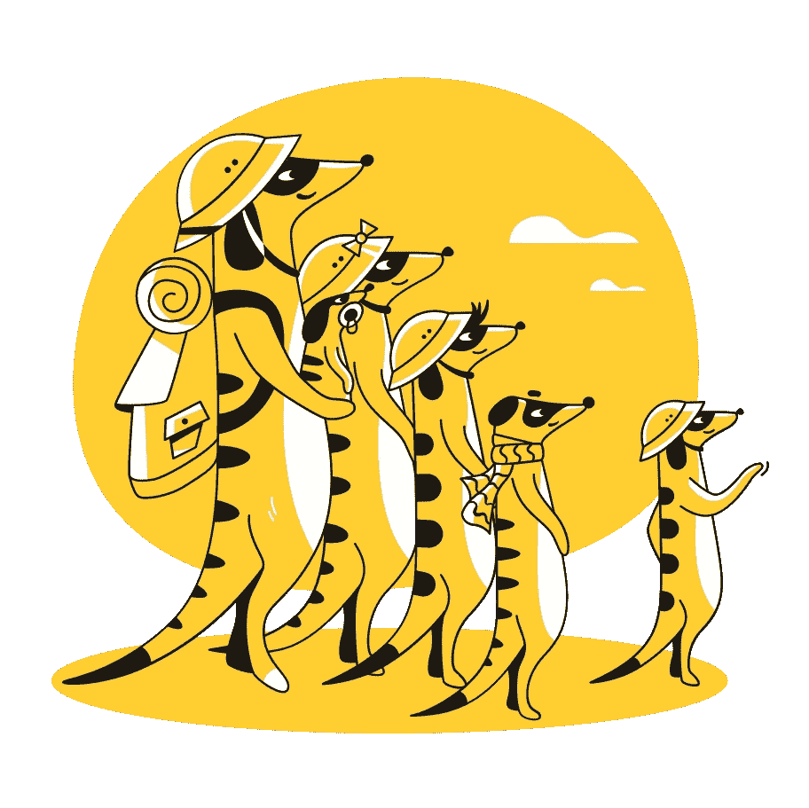
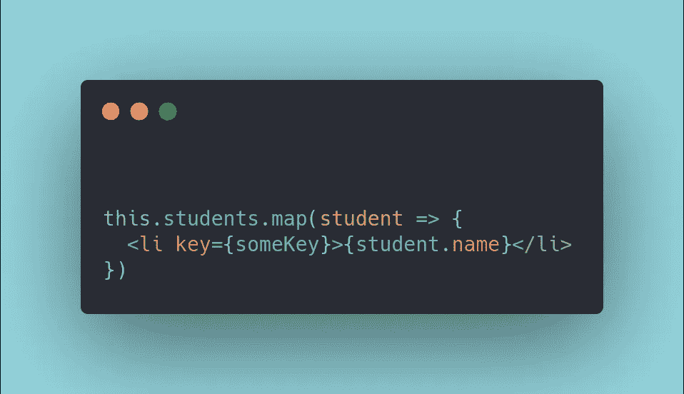
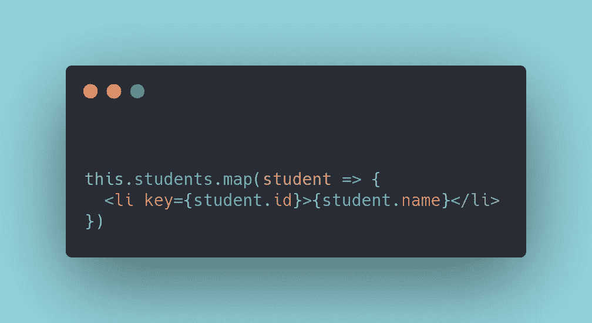
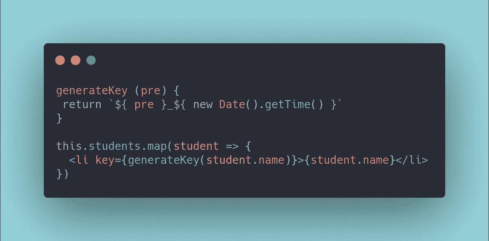
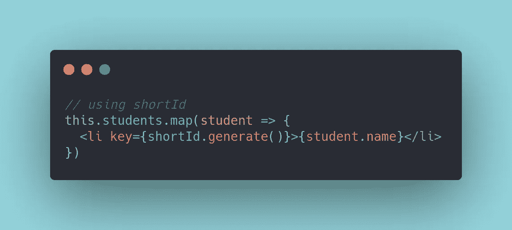

# 如何总是为你的反应列表找到一个键

> 原文：<https://javascript.plainenglish.io/how-to-always-find-a-key-for-your-react-lists-ae4c855f544e?source=collection_archive---------4----------------------->

## 不再盯着屏幕寻找灵感

Family. Source [Icons8](https://icons8.it/ouch/illustration/taxi-family)

你曾经经历过仅仅盯着你的代码编辑器的沮丧经历吗？疯狂地从脑海中搜寻如何解决问题的想法。一个看似简单的*能给这种混乱增加多少挫败感呢？*

*在现代框架中，打印列表的方式发生了巨大的变化。动态方法已经取代了静态方法。还有，**说到反应列表，可能会出现一点小问题**。*

*正如你可能已经阅读了数百篇文章或者仅仅是普通的 [React 文档](https://reactjs.org/docs/lists-and-keys.html#:~:text=We%20don't%20recommend%20using,an%20index%20as%20a%20key.)，你需要为你的列表中的每一项使用一个`key`。这有助于库唯一地标识其中的每个项目，并了解哪些项目被*更改/更新/删除*。*

**

*Printing lists*

*但是不幸的是，你们中的一些人可能已经注意到了，**给列表项分配一个键并不总是一个简单的过程**。什么被认为是好的实践，什么不是？当我不知道我的案例中应该是什么样的`key`时，该怎么办？*

*让我们试着回答这些问题。*

## *简单的反模式路线*

*请抵制简单地使用循环索引作为键的诱惑。这被认为是真正的*反模式*，React 文档本身并不推荐这种方法。事实上，这可能会导致一些不稳定的组件行为，或者对您的应用程序产生负面影响。*

*   *[为什么使用索引作为键可能不是一个好主意](https://medium.com/@vraa/why-using-an-index-as-key-in-react-is-probably-a-bad-idea-7543de68b17c)。*
*   *[反应关于此做法的文件](https://reactjs.org/docs/lists-and-keys.html#:~:text=We%20don't%20recommend%20using,an%20index%20as%20a%20key.)。*

## *使用 id*

*这将很快成为你最喜欢的列表。因为您经常会打印与一些数据库实体相关的数据。而这些物件，在很多场合，会给你提供一个 *id* 道具。就像你在大学里看到的一群学生。*

*一个 *id* 的想法本身就非常适合钥匙。因为它用来唯一地标识一个实体。所以如果可以的话，就用一个。*

**

*Using an Id as a key*

> ****注:*** *你不是被强制使用* id *道具的。你只需要在物品中找到满足独特性和持久性条件的东西。**

## *自己生成数据*

*为什么不自己生成一些独特的数据呢？例如，您可以创建一个基于前缀生成一些数据的函数。此前缀将是您的列表项中的一条信息。保证了它的唯一性。*

**

*Generating your own key*

## *使用图书馆*

*这是一种更健壮的方法，实际上最适合生产环境。事实上，您可以使用一些现有的库，如 [shortid](https://www.npmjs.com/package/shortid) 或 [uniqid](https://www.npmjs.com/package/uniqid) 来生成这样的数据。*

**

*Using a library to generate an id*

## *结论*

*这篇文章的目的是为你提供一个应急机制的基础，当你没有一个简单的方法来实现你的反应列表时。希望这能帮你节省一些时间。*

*——*皮耶罗**

## ***简单英语的 JavaScript***

*喜欢这篇文章吗？如果有，通过 [**订阅我们的 YouTube 频道**](https://www.youtube.com/channel/UCtipWUghju290NWcn8jhyAw) **获取更多类似内容！***