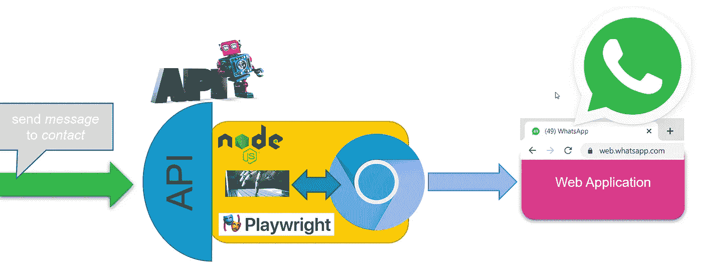
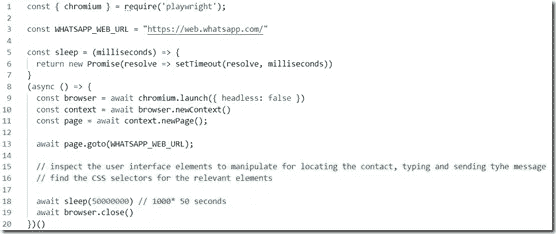
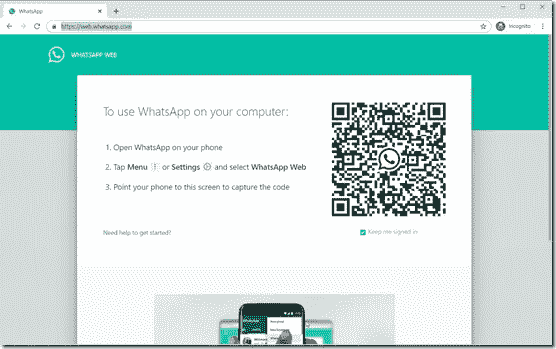
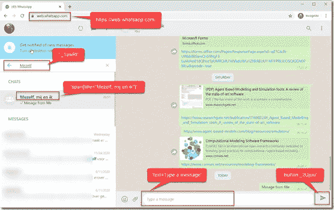

# 我构建了一个 API 来发送和接收 WhatsApp 消息

> 原文：<https://javascript.plainenglish.io/how-to-apify-whatsapp-programmatic-interaction-with-whatsapp-from-node-using-playwright-227326796bf6?source=collection_archive---------8----------------------->

从服务和应用程序发送 WhatsApp 消息是我们的客户经常提出的要求。这也是我希望在研讨会和演示中使用的东西。它对人们有吸引力。然而，WhatsApp 没有提供用于发送或接收消息的开放 API。

公司可以通过全球解决方案提供商利用一项业务服务，前提是合同到位。对于简单的用例来说太模糊了——如果你能进入的话。有一个 B 计划:一个非常简单的方法来为 WhatsApp 构建自己的 API 在 WhatsApp Web UI 之上使用一个简单的节点应用程序，并利用剧作家浏览器自动化库。注意，剧作家也可以用于 Python、Go、C#和 Java。

在我之前的文章[中可以读到对剧作家的广泛介绍，如果你有一个免费的、不知疲倦的浏览器操作者，你会做什么？！介绍剧作家。](https://technology.amis.nl/2020/12/21/what-you-could-do-if-you-had-a-free-tireless-browser-operator-introducing-playwright/)简而言之:剧作家是一个开源软件库，它在 machina 中给了我们一个*deus—*我们浏览器中的一个机器人确实执行了幂运算。这为从自动化测试到战术集成和 RPA(机器人过程自动化)以及从深度

链接书签、屏幕抓取、web 应用健康监控(smoketests)和定制的 web 应用。剧作家是一个相当新的(2020 年)，开源的，基于 JavaScript 的，用于端到端测试的跨浏览器自动化库，由微软的一个团队创建——该团队曾在谷歌工作，并创建了流行的木偶工具。



Putting an API on top of the WhatsApp Web UI using Node and Playwright

本文描述了一个节点应用程序，它通过剧作家运行嵌入式浏览器。这个浏览器被导航到 WhatsApp 网络应用。然后，节点应用程序以编程方式在网页中定位要向其发送消息的联系人，并将要发送的消息键入文本框中。最后，它点击发送按钮来发布消息。

节点应用程序可以处理许多发送消息的请求。很容易用附加功能扩展该模块——用于检索消息、发送图像、向多个联系人发送消息、用于拼写检查和扩展首字母缩写词和缩写词、用于翻译和收听到来的消息以及当它们到达时发布事件。将模块包装在真正的 REST API 中也很容易，可以在集成和应用程序中使用。

# 创建与 WhatsApp Web 对话的节点应用程序

通过剧作家创建一个与 WhatsApp Web 协同工作的节点应用程序当然需要一个安装了剧作家的节点运行时环境。然后创建一个节点应用程序，导航到 WhatsApp Web 并保持浏览器长时间运行。



```
const { chromium } = require('playwright');
const WHATSAPP_WEB_URL = "https://web.whatsapp.com/"const sleep = (milliseconds) => {
  return new Promise(resolve => setTimeout(resolve, milliseconds))
}(async () => {const browser = await chromium.launch({ headless: false })
const context = await browser.newContext()
const page = await context.newPage();await page.goto(WHATSAPP_WEB_URL);// inspect the user interface elements to manipulate for locating the contact, typing and sending tyhe message// find the CSS selectors for the relevant elementawait sleep(50000000) // 1000* 50 seconds
await browser.close()
})()
```

当执行这个应用程序时，会打开一个匿名浏览器窗口，并显示一个 QR 码。你需要在手机上的 WhatsApp 应用中扫描这个二维码——每次重启节点应用的时候。



我想知道是否在 cookies 或本地存储中存储了 QR 码验证的确认，如果是，它可以由节点应用程序初始化，因此可以跳过这一手动步骤。

验证成功后，WhatsApp Web UI 打开。现在是时候拿出浏览器开发工具(ctrl+shift+i)并检查相关元素来发现 CSS 选择器了。下图描述了我确定的选择器:



选择器`._1awRl`用于定位输入联系人姓名的搜索字段。我们使用`span[title=”${whatsappContact}”]`来查找联系人的元素，单击该元素可以在右窗格中显示最近的消息列表。

用`text=Type a message`我们找到一个可以输入新信息的盒子。最后`button._2Ujuu`用于识别点击发送按钮提交消息。有了这四个选择器，就没什么可编程的了:

*   在搜索栏中输入联系人姓名
*   点击联系人姓名
*   在文本框中输入消息
*   点击按钮发送消息

处理这一问题的代码如下所示:

```
const { chromium } = require('playwright');
const WHATSAPP_WEB_URL = "https://web.whatsapp.com/"// replace with your contact name and message
const whatsappContact = "Mezelf, mij en ik"
const message = "My message from the WhatsApp robot"const sleep = (milliseconds) => {
  return new Promise(resolve => setTimeout(resolve, milliseconds))
}(async () => {const browser = await chromium.launch({ headless: false })
const context = await browser.newContext()
const page = await context.newPage();await page.goto(WHATSAPP_WEB_URL);// wait for element search box
await page.waitForSelector('._1awRl')// enter name of contact in search box
await page.fill('._1awRl', whatsappContact);// page filters list of contacts
await page.waitForSelector(`span[title="${whatsappContact}"]`)
// click on the contact - this refreshes the right pane with recent messages and a box for sending new messages
await page.click(`span[title="${whatsappContact}"]`)// wait for the field to send a message
await page.waitForSelector('text=Type a message')
// type the message to send
await page.type('text=Type a message', message)// click button to send message
await page.click('button._2Ujuu')await browser.close()})()
```

# 资源

本文在 GitHub 上的代码:[https://GitHub . com/lucasjellema/剧作家-场景/tree/main/whatsapp](https://github.com/lucasjellema/playwright-scenarios/tree/main/whatsapp)

我之前的文章:对剧作家的广泛介绍[如果你有一个免费的、不知疲倦的浏览器运营商，你能做什么？！介绍剧作家](https://lucasjellema.medium.com/what-you-could-do-if-you-had-a-free-tireless-browser-operator-introducing-playwright-1ecd31ace3ad?source=your_stories_page-------------------------------------)

*原载于 2020 年 12 月 22 日*[*https://technology . amis . nl*](https://technology.amis.nl/2020/12/22/how-to-apify-whatsapp-programmatic-interaction-with-whatsapp-from-node-using-playwright/)*。*