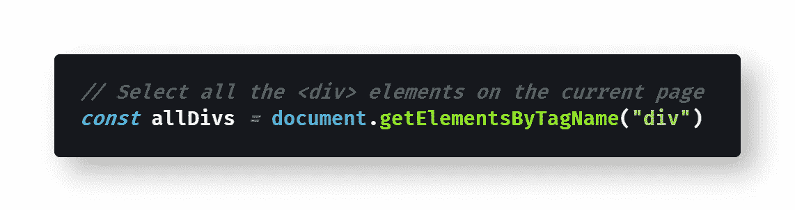
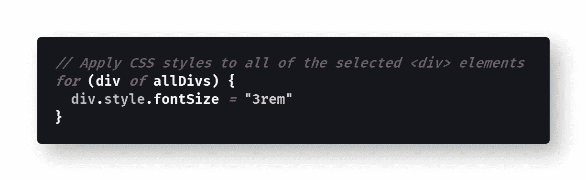
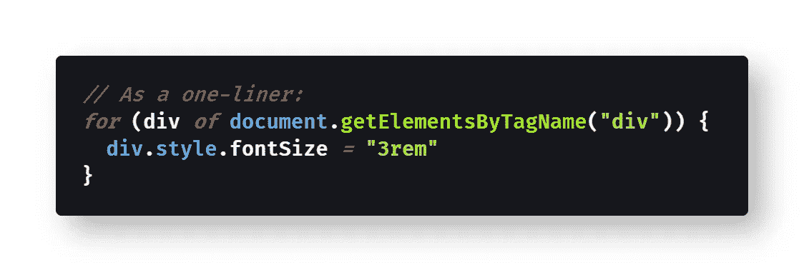
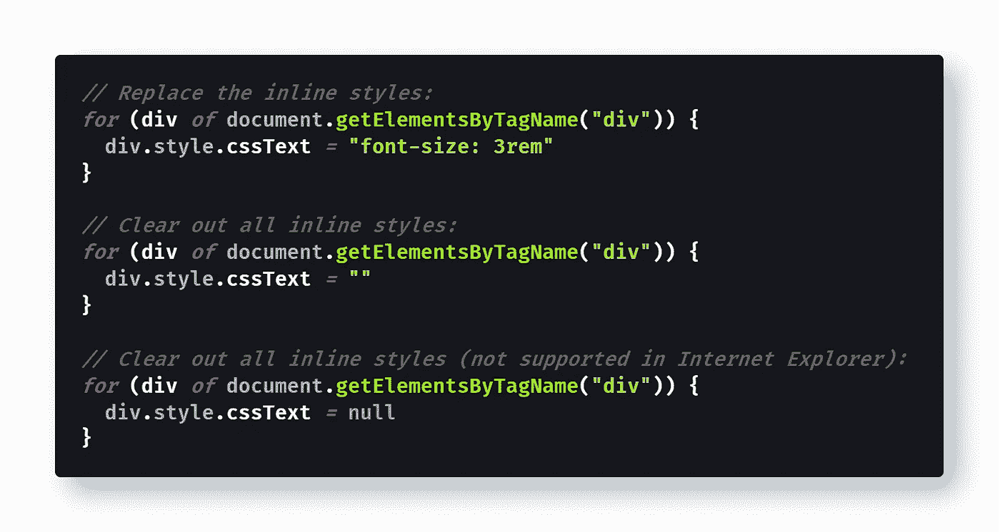

# 如何使用 JavaScript 将 CSS 样式应用于页面元素

> 原文：<https://javascript.plainenglish.io/how-to-apply-css-styles-to-page-elements-using-javascript-e6d4a22a40de?source=collection_archive---------1----------------------->

## 您不需要 jQuery 使用 JavaScript 将 CSS 动态应用于网页上的样式元素。以下是如何在没有任何外部库或框架的情况下做到这一点。

Photo by [Greg Rakozy](https://unsplash.com/@grakozy?utm_source=medium&utm_medium=referral) on [Unsplash](https://unsplash.com?utm_source=medium&utm_medium=referral)

# 用 JavaScript 更改内联 CSS 样式

It 想要使用 JavaScript 操纵页面的 [CSS 样式](https://developer.mozilla.org/en-US/docs/Web/HTML/Element/style)是一个常见的任务。在过去，您可能已经使用了 [jQuery](https://jquery.com/) 来完成这个任务，因为它有一个内置的`[.css()](https://api.jquery.com/css/)`选择器，允许您操作样式。

令人欣慰的是，普通的 JavaScript 使得使用内置方法改变页面上的[内联 CSS 样式](https://developer.mozilla.org/en-US/docs/Learn/CSS/First_steps/How_CSS_is_structured#Inline_styles)变得很容易——不需要 jQuery！

首先，您需要使用 JavaScript 在页面上[选择 HTML 元素，这是我最近在《数据驱动投资者:](https://medium.com/datadriveninvestor/how-to-select-all-div-elements-on-a-page-using-javascript-9b2cd16af740)

 [## 如何使用 JavaScript 选择页面上的所有元素

### 如果您使用过 jQuery，语法会非常熟悉——但是没有必要加载一个外部库来选择…

medium.com](https://medium.com/datadriveninvestor/how-to-select-all-div-elements-on-a-page-using-javascript-9b2cd16af740) 

这看起来像下面的代码片段:

[View the raw code](https://gist.github.com/djD-REK/ff43e2b13a36d49334d3a8c01bf30431) as a GitHub gist

然后，您需要通过在那个 [HTMLElement](https://developer.mozilla.org/en-US/docs/Web/API/HTMLElement) 的`[.style](https://medium.com/@happymishra66/objects-in-javascript-2980a15e9e71#7a77)`对象上设置一个属性来设置这些元素的样式。这样做会给它们添加新的内联样式。

> “`**style**`属性用于获取和设置元素的*内联* 样式。当获取时，它返回一个`[CSSStyleDeclaration](https://developer.mozilla.org/en-US/docs/Web/API/CSSStyleDeclaration)`对象，该对象包含该元素的所有样式属性的列表，这些属性的值被分配给元素的内联`[style](https://developer.mozilla.org/en-US/docs/Web/HTML/Global_attributes/style)` [属性](https://developer.mozilla.org/en-US/docs/Web/HTML/Global_attributes/style)中定义的属性。[……]样式不应该通过直接给`style`属性分配一个字符串来设置(如在`elt.style = "color: blue;"`中)，因为它被认为是只读的，因为样式属性返回一个也是只读的`CSSStyleDeclaration`对象。”— [MDN 文档](https://developer.mozilla.org/en-US/docs/Web/API/ElementCSSInlineStyle/style)

因此，您可以用一个`[for...of](https://developer.mozilla.org/en-US/docs/Web/JavaScript/Reference/Statements/for...of)`循环遍历您的`[
](https://developer.mozilla.org/en-US/docs/Web/HTML/Element/div)`元素，并对每个元素应用 CSS 样式:

[View the raw code](https://gist.github.com/djD-REK/2f5d988748af5090c70dd152d9ef9252) as a GitHub gist

将所有这些放在一起，您可以在一行中完成所有操作，如下例所示:

[View the raw code](https://gist.github.com/djD-REK/e180f9d69193bad0083255f74d1d2f0c) as a GitHub gist

您也可以通过更改整个“样式”对象来清除所有现有的(内联)样式，尽管这通常不是您想要的行为:

[View the raw code](https://gist.github.com/djD-REK/8f6b5b6274af48a1680542b3722a1249) as a GitHub gist

如上所述，您可以将`.cssText`属性设置为空的[字符串](https://medium.com/javascript-in-plain-english/how-to-check-for-a-string-in-javascript-a16b196915ff) `""`或`[null](https://medium.com/javascript-in-plain-english/how-to-check-for-null-in-javascript-dffab64d8ed5)`来移除所有当前的内嵌样式，尽管在 Internet Explorer 中使用`null`不起作用。

在您的浏览器控制台中尝试一下，并让我知道您的想法！😄

# 连字符怎么了？

我应该注意到，样式属性需要写在[茶色](https://medium.com/better-programming/string-case-styles-camel-pascal-snake-and-kebab-case-981407998841#1249)，而不是连字符[烤肉串](https://medium.com/better-programming/string-case-styles-camel-pascal-snake-and-kebab-case-981407998841#a084)。这意味着 CSS 属性“ [font-size](https://developer.mozilla.org/en-US/docs/Web/CSS/font-size) ”成为 JavaScript `.style`对象的属性“fontSize”。

camelCase 约定在整个[“CSS-in-JS”库](https://cssinjs.org/)(也称为 [JSS](https://cssinjs.org/) 库)中使用——像[风格的组件、](https://styled-components.com/) [迷人的](https://glamorous.rocks/)和[阿芙罗狄蒂](https://github.com/Khan/aphrodite)。这是因为 JavaScript [不支持对象上的](https://medium.com/@happymishra66/objects-in-javascript-2980a15e9e71#7a77)连字符属性名:

> 对象属性名可以是任何有效的 JavaScript 字符串，或者任何可以转换为字符串的内容，包括空字符串。但是，任何不是有效的 Javascript 标识符的属性名(例如，包含空格或连字符的属性名，或者以数字开头的属性名)都只能使用方括号符号““[RUP esh Mishra](https://medium.com/u/b2d3629d2415?source=post_page-----e6d4a22a40de--------------------------------)T24”来访问并添加到 object 属性中

换句话说，虽然您可以有一个带有连字符属性名(`object["font-size"]`)的理论对象，但是您不能用。点符号(`object.font-size` ) —所以约定是对 JavaScript 对象属性使用 camelCase ( `object.fontSize`)。

编码快乐！😊💻👩‍💼⌨️👨‍💼🖥️🔥👍

# 延伸阅读:用 JavaScript 操作 CSS

*   Kirupa Chinnathambi 有一个关于使用 JS 设置 CSS 样式的视频:

 [## 使用 JavaScript 设置 CSS 样式

### 了解使用 JavaScript 设计内容样式的两种绝佳方式。

www.kirupa.com](https://www.kirupa.com/html5/setting_css_styles_using_javascript.htm) 

*   [Chris Ferdinandi](https://gomakethings.com/about/) 在他的博客上比较了内联 CSS 样式和全局样式[:](https://gomakethings.com/two-ways-to-set-an-elements-css-with-vanilla-javascript/)

 [## 用普通 JavaScript 设置元素 CSS 的两种方法

### 昨天，我们看了如何用普通的 JavaScript 获得元素的 CSS 属性。有一件事我忽略了…

gomakethings.com](https://gomakethings.com/two-ways-to-set-an-elements-css-with-vanilla-javascript/) 

*   [JavaScript 教程](https://www.javascripttutorial.net/javascript-dom/javascript-style/)列出了所有 camelCase 属性的名称:

 [## JavaScript 样式:设置 HTML 元素的内联 CSS 属性

### 摘要:在本教程中，您将学习如何使用 style 属性来操作 HTML……

www.javascripttutorial.net](https://www.javascripttutorial.net/javascript-dom/javascript-style/) 

*   Trapti Rahangdale 在 Soshace 博客上有一个关于 CSS [的全面指导:](https://blog.soshace.com/setting-css-styles-with-javascript/)

 [## 用 JavaScript 设置 CSS 样式

### 在 Javascript 中设置样式是很常见的。从事 HTML、CSS 和 Javascript 工作四年，有很多…

blog.soshace.com](https://blog.soshace.com/setting-css-styles-with-javascript/) 

*   [Les James](https://medium.com/u/affa131f653b?source=post_page-----e6d4a22a40de--------------------------------) 深入探讨 CSS-Tricks 上 Sass + JSON [的复杂性:](https://css-tricks.com/making-sass-talk-to-javascript-with-json/)

 [## 用 JSON | CSS-Tricks 让 Sass 与 JavaScript 对话

### 以下是 Les James 的客座博文。像我们许多人一样，Les 一直在寻找一个响应图像的解决方案…

css-tricks.com](https://css-tricks.com/making-sass-talk-to-javascript-with-json/) 

# 延伸阅读:JavaScript 中的 CSS(JSS)

*   [Oleg Isonen](https://medium.com/u/7c635fc6907?source=post_page-----e6d4a22a40de--------------------------------) 在他的媒体博客上介绍了 CSS-in-JS [:](https://medium.com/dailyjs/what-is-actually-css-in-js-f2f529a2757)

 [## 什么是真正的 CSS-in-JS？

### CSS-in-JS 指的是用 CSS 解决复杂问题的思想集合。

medium.com](https://medium.com/dailyjs/what-is-actually-css-in-js-f2f529a2757) 

*   Indrek Lasn 在他的媒体博客上谈论 JSS [的利弊:](https://medium.com/better-programming/all-you-need-to-know-about-css-in-js-984a72d48ebc)

 [## 关于 CSS-in-JS 你需要知道的

medium.com](https://medium.com/better-programming/all-you-need-to-know-about-css-in-js-984a72d48ebc) 

*   [Gajus Kuizinas](https://medium.com/u/ff373ec56620?source=post_page-----e6d4a22a40de--------------------------------) 在他的媒体博客上认为是时候停止使用 JSS 而不是[:](https://medium.com/@gajus/stop-using-css-in-javascript-for-web-development-fa32fb873dcc)

 [## 停止在 JavaScript 中使用 CSS 进行 web 开发

### 9 个童话故事

medium.com](https://medium.com/@gajus/stop-using-css-in-javascript-for-web-development-fa32fb873dcc) 

*   [Heydon](https://medium.com/u/fbee25a1f240?source=post_page-----e6d4a22a40de--------------------------------) 在他的博客中将 JSS 比作用 JS [操纵 CSS:](https://medium.com/@Heydon/css-a-new-kind-of-javascript-fcf730d33ce7)

 [## 统一的风格语言

### 在过去的几年中，我们已经看到了 CSS-in-JS 的兴起，主要来自 React 社区内部——但是为什么呢？

medium.com](https://medium.com/seek-blog/a-unified-styling-language-d0c208de2660) 

*   [Artur Siery](https://medium.com/u/5fd4e1434f16?source=post_page-----e6d4a22a40de--------------------------------) 在 [WarsawJS](https://medium.com/u/3000a5f52ac8?source=post_page-----e6d4a22a40de--------------------------------) [博客](https://medium.com/warsawjs/css-in-js-in-real-life-e0b50bbbd740)上提供了真实世界的代码示例[:](https://medium.com/warsawjs/css-in-js-in-real-life-e0b50bbbd740)

 [## 现实生活中 JS 中的 CSS

### 作者:阿图尔·西里

medium.com](https://medium.com/warsawjs/css-in-js-in-real-life-e0b50bbbd740) 

Photo by [Pankaj Patel](https://unsplash.com/@pankajpatel?utm_source=medium&utm_medium=referral) on [Unsplash](https://unsplash.com?utm_source=medium&utm_medium=referral)

德里克·奥斯汀博士是《职业规划:如何在 6 个月内成为成功的 6 位数程序员 的作者，该书现已在亚马逊上架。