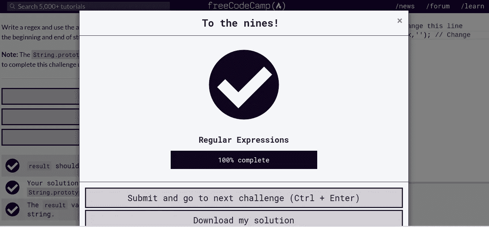

# 初学者如何接近编码？

> 原文：<https://javascript.plainenglish.io/how-to-approach-coding-as-a-beginner-1a235cde5a95?source=collection_archive---------9----------------------->

freeCodeCamp JS regular expressions completion by Mathews

众所周知，软件工程在 21 世纪正成为越来越有趣的工作，你可能正试图加入夜猫子(程序员)的行列，但你不知道从哪里开始，在这篇文章中，我已经指出了一些平台和地方，如果你想很快赶上编码，你需要找到它们。

现在让我首先告诉你最好的编码方法，我相信它几乎对每个人都有效，我认为应该是这样。你首先要做的是

*   超文本标记语言
*   半铸钢ˌ钢性铸铁(Cast Semi-Steel)
*   Java Script 语言

大多数初学者对他们读到的一些成功的程序员感到困惑，根据我自己的经验，我甚至在对 HTML、CSS 和 JavaScript 有基本了解之前就开始学习 PHP 了。这是因为我读到了关于马克·扎克伯格如何通过用 PHP 编写脸书代码来创办他的脸书公司的**的文章，我认为我必须学习 PHP。即使你计划成为一名后端工程师，你仍然需要了解前端技术的基础知识。如果你在寻找开发人员的工作岗位上看到某种技能，你可能会注意到一定数量的技术，但这不适合作为初学者的你，现在还不要，不要根据一些雇主在他们的工作描述中列出的内容开始学习像 React、Vue.js、Angular 等框架。**

**现在，在你很好地掌握并完成了一些 CRUD min 项目后，你可以开始申请仅拥有这三项技术的工作，一些开发人员的收入达到了六位数。**

**那么，Mateo，我开始学习 HTML、CSS 和 JavaScript 的最佳平台是什么？我知道一个最好的平台是免费的，是的，免费的，它的[免费代码营](https://www.freecodecamp.org/)我可以推荐这个平台有很多原因，其中一个非常重要的原因是实践的方法，而不是看教程，当你完成了它，你认为你已经理解了一切，而不是练习，免费代码营的学习方式是通过做，而不是只看你的导师为你提出的编码挑战。当你学习的时候，这个平台提供了例子和挑战，这些挑战是你在日常工作中将要解决的实际问题。**

**此外，你可以在 Hackerrank 或 Codewars 开始解决问题，这些平台可以帮助你将你对数据结构和算法的理解付诸实践。数据结构和算法是计算机科学非常重要的一部分，我建议你认真练习。**

**我发现的另一件事是和有经验的开发人员在一起。由于脸书介绍了脸书开发人员圈子，有很多开发人员社区。这个社区发展很快。了解社区网络中的开发者聚会非常重要，因为这将使你的求职变得容易，你也可以利用 [Dev.to](https://dev.to/) 和 Twitter，通过流动一些高级程序员，如 [Francesco](https://dev.to/francescoxx) 和 [Pato](http://twitter.com/devpato) 。**

**结论**

**总之，在您对 HTML、CSS 和 JavaScript 这三个基础有了更好的理解之后，您现在可以开始添加其他框架了。 [React](https://reactjs.org/docs/getting-started.html) and [Vue.js](https://vuejs.org/v2/guide/) 是世界上许多大型科技公司正在使用的最流行的 JavaScript 库之一。**

**你可以用来练习解决问题的资源包括 [Hackerrank](http://hackerrank.com/) 和 [Codewars](https://www.codewars.com/) 。**

## ****用简单英语写的 JavaScript 的注释:****

**我们已经推出了三种新的出版物！请关注我们的新出版物:[**AI in Plain English**](https://medium.com/ai-in-plain-english)[**UX in Plain English**](https://medium.com/ux-in-plain-english)[**Python in Plain English**](https://medium.com/python-in-plain-english)**—谢谢，继续学习！****