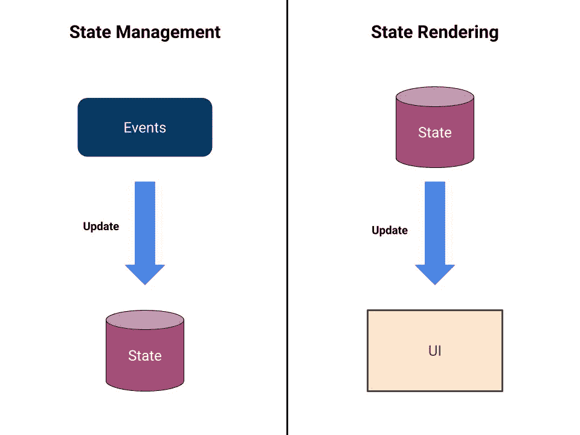
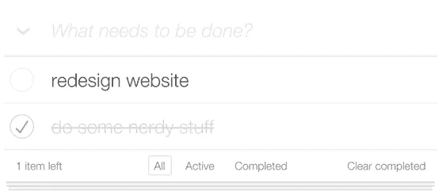

# 如何对待 React 任务，两种心态。

> 原文：<https://javascript.plainenglish.io/how-to-approach-react-tasks-a95f8c7b38ec?source=collection_archive---------1----------------------->


## 将您的任务一分为二:状态管理和状态呈现。

# 您应该将任务至少分成两部分:状态管理和状态呈现。



My playing with Google Drawings :)

你可以把它想象成解决任务时使用的不同的帽子。我不是处于**状态管理模式**就是**状态渲染模式**。

# 状态管理

其中一个拆分就是*状态管理*。我不是说只有反应状态。当谈到 Redux 状态时，我应用了同样的方法。


在这一部分，我只考虑更新状态。大多数情况下，您需要等待某个事件来执行更新。

一个事件可以是一个 onClick，从一个 API 获取…

在这一点上，只考虑状态。我希望事件触发后的状态是什么样的？我需要做些什么来实现它？我需要哪些行动？减速器应该做什么？

我还没有考虑它在用户界面上会是什么样子。只有国家。

我用 Redux Dev Tools 之类的工具或者打印状态或道具来检查输出。

> 专注于处理事件和更新状态。

# 状态渲染

现在是一些反应魔法的时候了。用户界面应该是怎样的状态？我们要不要加一个勾号？变色？

这是我关注所有 UI 相关任务的地方。这里好的一点是，我假设国家正常运转。我不处理事件或状态更新。

这种心态下的大部分任务都是由 JSX 完成的。在 render 方法中，您可以根据组件的状态或属性来渲染一个或另一个组件。也许你创造了新的功能组件。

> 专注于呈现该状态的 UI。

# 应该先走哪种模式？

你以何种模式开始并不重要。有些任务更适合从*状态管理*开始，而其他任务更适合从*状态渲染*开始。

如果我从*状态渲染*开始，我可能会硬编码我想要的状态，并确保它正确渲染。然后，我进入*状态管理*模式，尝试处理事件并更新状态。

# 待办事项应用程序

让我们用一个例子来看看这种方法。



Image from [http://todomvc.com/](http://todomvc.com/)

**用户故事:**允许用户在点击左侧圆圈图标时将任务设置为已完成。

## 状态管理

假设这是我们在 Redux 中的当前状态:

```
{
  1: {
    id: 1,
    content: 'redesign website',
  },
  2: {
    id: 2,
    content: 'do some nerdy stuff',
  }
}
```

点击圈子后的状态应该是怎样的？

在 *todo* 对象中添加一个名为`completed`的新属性怎么样？这可能是最初的`false`，然后点击后的`true`。

这意味着国家需要从:

```
{
  1: {
    id: 1,
    content: 'redesign website', 
    completed: false,
  },
  2: {
    id: 2,
    content: 'do some nerdy stuff',
    completed: false,
  }
}
```

收件人:

```
{
  1: {
    id: 1,
    content: 'redesign website', 
    completed: false,
  },
  2: {
    id: 2,
    content: 'do some nerdy stuff',
    completed: true, // assume we click on this one
  }
}
```

一旦我们知道我们必须做什么，我们就着手去做。现在还不要考虑这会如何影响用户界面。

在这种心态下，你的任务就是完成状态更新。

你可以安装 Redux Dev 工具来检查你是否已经完成了它，或者只是在你渲染它的时候`console.log`todo 列表。

## 状态渲染

这部分更令人愉快。您将在页面中看到您的更改。

在这一部分中，您假设(因为您刚刚已经这样做了)状态将会相应地改变，并关注于使 JSX 适应新的状态。

当`completed`属性为`true`时，您可以创建一个新的 css 类并添加它。

```
<li className={ todo.completed ? 'completed' : 'not-completed' }>
  { todo.content }
</li>
```

这是一个过于简单的例子，但足以抓住它的要点。

在实际应用中，您可能需要更改多个组件，并在此模式下创建新的组件。

> 不要忘记确保你的应用程序在所有可能的状态下都能正确呈现。

# 结论

发展是艰难的。解决问题和完成任务有时会让人不知所措。特别适合初学者。通过把你的任务分成更小的任务，你减少了认知负荷，使它更容易实现。

用这两种不同的心态来划分 React 任务对我帮助很大。希望对你也有帮助。

欢迎评论，分享你将任务分成小任务的模式或技巧。我很乐意听到更多的方法。

感谢阅读！