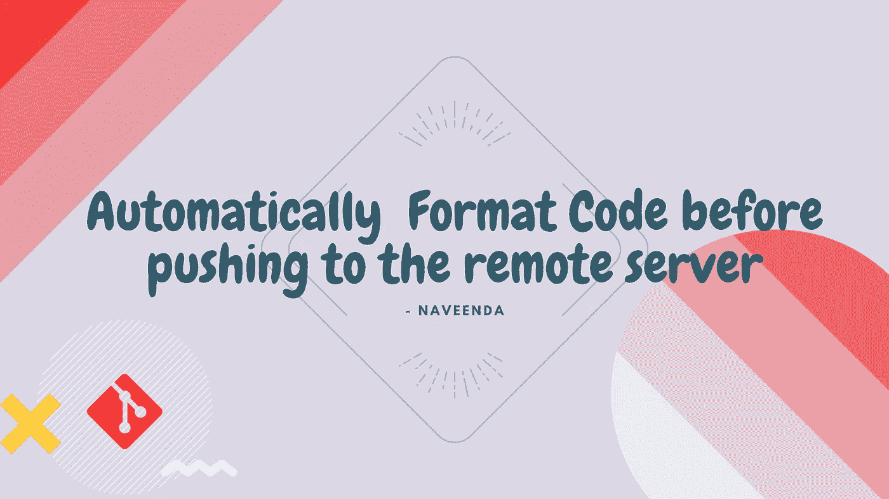

# 如何在推送到远程服务器之前自动格式化您的代码

> 原文：<https://javascript.plainenglish.io/how-to-automatically-format-your-code-before-pushing-to-the-remote-server-a5ace1dc2fa7?source=collection_archive---------6----------------------->



## 快速小结

如果你和两个以上的开发人员一起开发一个项目，你可能会注意到不同格式的代码会产生不同类型的问题，比如合并冲突、代码不可读等等。为了避免这种情况，我们可以设置 git 挂钩，在推入远程服务器之前格式化代码。

## 我们开始吧

为了简单起见，我将使用一个简单的 react 应用程序，它通过 create-react-app 来创建。

## 设置 Git 挂钩

Git 挂钩基本上是一种事件监听器，你可以通过使用 git 挂钩来监听任何 git 事件。

在 Javascript 世界里， [Husky](https://github.com/typicode/husky) 让 Git 挂钩变得简单🐶汪汪！。

让我们在项目中安装哈士奇。

```
npm install husky --save-dev
```

我们将使用 [lint-staged](https://www.npmjs.com/package/lint-staged)

```
npm install lint-staged
```

现在打开 package.json 文件并添加这个条目外壳条目

这段代码将在代码提交之前运行，这意味着无论何时运行命令`git commit -m "dsad"`，它都会运行。

通过使用 lint-staged，您可以单独为所需的文件扩展名运行 Git 挂钩。

## 格式化代码

为了格式化代码，我们将使用[更漂亮的](https://prettier.io/)。漂亮是一个优秀的工具，通过编程来格式化代码。

```
npm install prettier --save-dev
```

如果你想定制格式化，你可以在`package.json`上添加`prettier`条目

## 排序导入

很多时候，import 语句会产生合并冲突。我们可以通过配置来避免 Githooks 上的排序导入。

```
npm install import-sort-cli import-sort-style-renke --save-dev
```

[导入-排序-样式-任可](https://npmjs.com/package/import-sort-style-renke)是`sort-importen`工具的一个样式，与其他样式相比，它非常好。

让我们在 package.json 中配置 [import-sort-cli](https://npmjs.com/package/import-sort-cli)

好了，我们的最终代码！

## 让我们测试你的代码

每当你提交代码的时候,`lint-staged`就会运行得更漂亮并导入排序。这些将自动格式化和导入代码。

```
git add .
git commit -m "Test the husky"
```

***感谢坚持到最后:)*** *如果你喜欢这篇文章，可以考虑* [*在 Twitter 上关注我*](https://twitter.com/NaveenDA_) *并与你的开发者朋友分享这篇文章🐋😀*