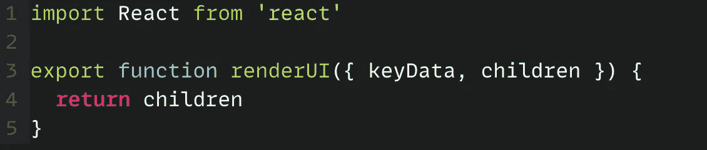
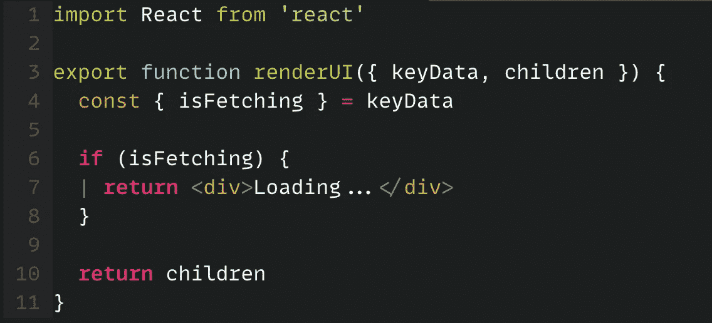
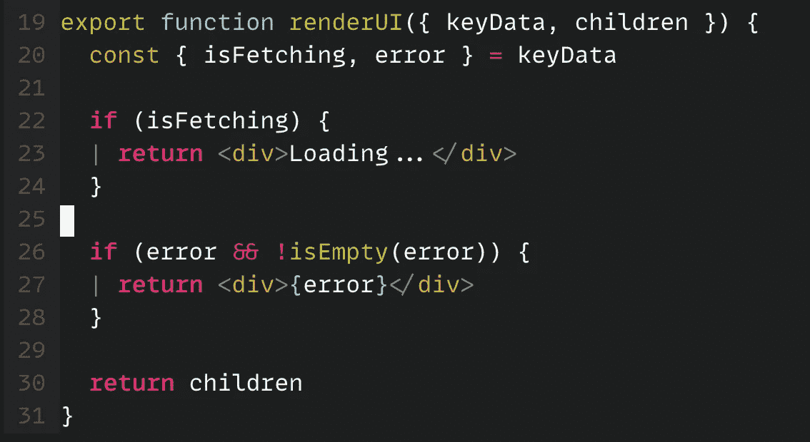
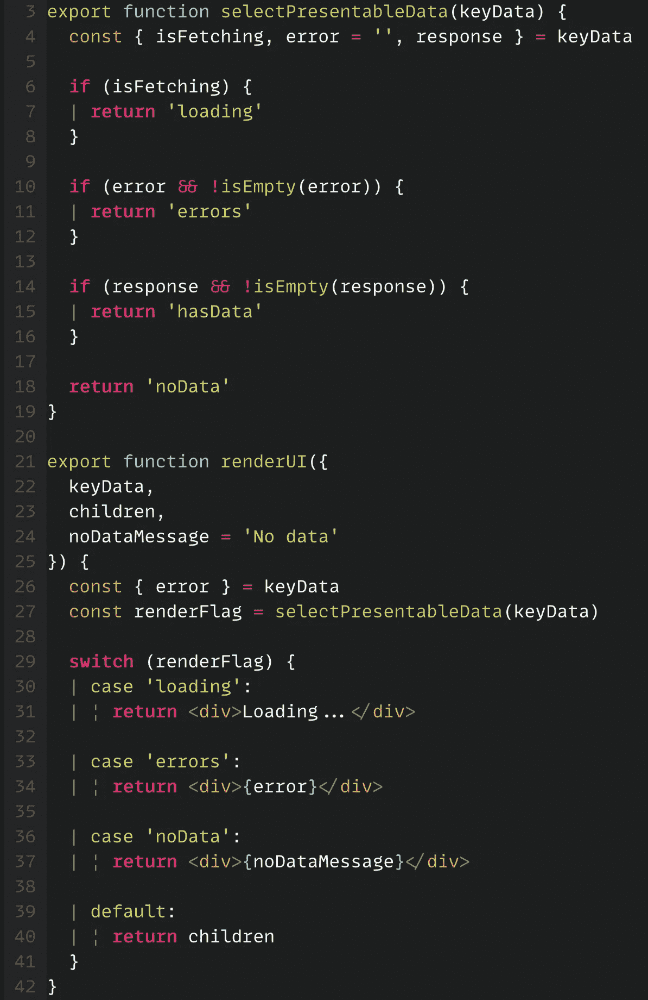
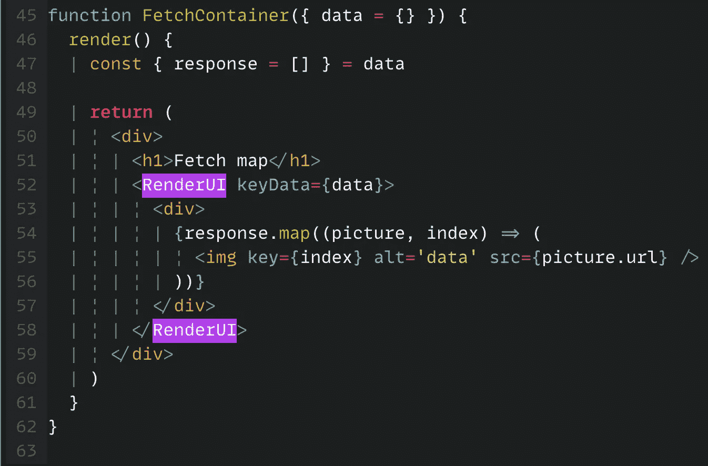

# 如何避免反应成分中的代码重复

> 原文：<https://javascript.plainenglish.io/how-to-avoid-code-repetition-in-react-components-1441180db425?source=collection_archive---------1----------------------->

## 编写反应组件的更好方法是避免重复的代码。

## 编写 React 组件的更好方法是主要关注业务逻辑。

Photo by [Victória Kubiaki](https://unsplash.com/@vikubi?utm_source=medium&utm_medium=referral) on [Unsplash](https://unsplash.com?utm_source=medium&utm_medium=referral)

在我的前一篇文章中，我们讨论了如何编写一个泛型函数，在十行代码内生成减压器。今天，在继续避免样板代码系列的同时，我会告诉你如何在编写反应组件时避免重复的代码。

正如您在编写反应组件时可能注意到的，您必须编写类似的代码来确保您是否拥有渲染反应组件的所有数据。让我用一个例子来详细说明这一点，假设您需要在页面上显示 API 数据，您必须确保如果:

*   **API 调用被触发？**
*   **API 调用正在进行中？**
*   **API 是否返回非空数据？**
*   **是否有服务器或应用编程接口错误？**

现在，假设应用程序中有五个页面，需要进行不同的 API 调用并显示数据。这意味着您必须在渲染页面时检查所有这些点。

必须有更好的方法来做到这一点。好吧，有很多，但是让我们来看看最明显的一个:我们可以提取所有这些逻辑，并从中创建一个组件，然后将实际的 React 组件呈现为该组件的子组件。

为了在生产中实现组件的代码，我们需要:

*   制作一个特设的，反过来，将渲染实际的业务逻辑。
*   特设检查所有的先例规则。
*   使其可在不同组件之间共享。

让我们现在开始制作组件:

让我们先做第一件事，制作一个呈现其子组件的组件。没什么特别的，我们会用道具中的`children`来做这个。让我们称我们的组件为`renderUI:`

initialized the base component

让我们先检查一下 API 调用是否正在进行。如果你还记得上一篇帖子，我在各州都有一个名为`isFetching`的房产。如果 API 调用正在进行，则该值将设置为 true。根据业务逻辑，默认值可以是`true`或`false`。当 API 调用被解决时，它将被设置为`false`。现在，这个属性在呈现组件时将非常有用。如果该值为`true`，则需要显示加载消息或加载动画。我们将整个减速器状态作为`keyData`传递给部件。检查`isFetching`值，决定是显示数据还是加载信息:

show loading message if isFetching is set to true.

既然我们已经检查了 API 是否正在进行中。让我们检查一下 API 响应中是否有错误。我在我的 Reducer 状态中存储了另一个名为“errors”的变量。我将各种错误(无论是用户错误还是 API 响应错误)存储在这个变量中。如果 is-fetching 等于 false 并且 error 非空，我将显示我的错误消息，而不是呈现实际的组件:

Show API or network errors.

假设 API 调用成功，并且响应中没有错误。但是 API 没有响应任何数据。这意味着我们还需要检查非空数据。现在，为了统一起见，我将 API 数据存储在每个 Reducer 状态下的一个名为`response`的变量中。我们将检查 API 响应是否为空，如果为空，我们将向用户显示一条有意义的消息，但是如果 API 响应非空，我们将呈现组件:

show a message if API returns empty data.

好吧，我在这部分更新了一些代码。首先，对数据和错误逻辑的检查变得更大了。此外，我认为这可以在其他一些地方重用。于是，我把那个逻辑提取出来，做了一个单独的函数，`selectPresentableData`。它检查所有与规则相关的数据，并返回一个字符串，基于这个字符串，我们的`renderUI`将呈现相关的组件。其余的事情在代码中是不言自明的。

差不多就是这样了。现在，您不必每次都手动检查数据。我们的 render-UI 组件将负责数据检查。现在让我们看看如何在代码中使用 render-UI 组件:

上面的组件呈现了一个图像列表。图像列表来自 API(比如在按钮点击时或页面加载时)，并通过 props 或直接通过 Redux(通过 hooks 或任何您喜欢的方式)存储传递给组件。

## 专业提示:

您还可以在同一页面的多个部分多次使用该组件。比方说，如果您需要在页面的不同部分显示不同部分的 API 响应。你可以在所有这些地方使用`RenderUI`组件。您可能希望为每个部分制作`keyData`,如下所示:

using `*RenderUI*` component at multiple places in a single component.

您可以根据需要制作`keyData`。比方说，响应数据不是来自 API，但是如果数据为空，您希望显示一条消息，您可以手动将`isFetching`传递给`false`，并且仍然可以获得组件的好处。发挥你的想象力吧，有很多地方可以用。

这里是完整的`RenderUI`组件的代码:

RenderUI component

# 关于作者:

Bharat 自 2011 年以来一直是前端开发人员。他对“前端开发经验”情有独钟。他喜欢学习和教授技术。他和最可爱的女人以及珍贵的双胞胎孩子一起享受生活。

总的来说是个好人。在 [Twitter](https://twitter.com/iiisoni) 、 [Github](https://github.com/iiison) 、 [Linkedin](https://www.linkedin.com/in/iiison/) 上找到他。