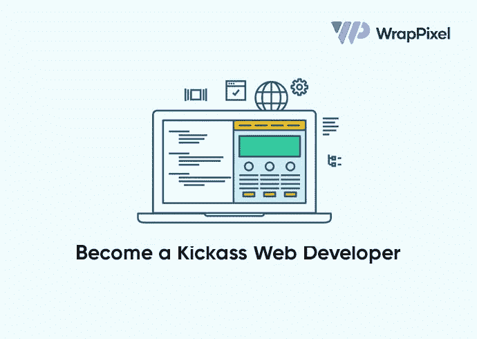

# 2021 年成为更好的软件开发人员的 20 个技巧

> 原文：<https://javascript.plainenglish.io/how-to-become-a-kickass-web-developer-in-2021-frontend-backend-tips-3dca27e87e0d?source=collection_archive---------15----------------------->

好吧，那么，你已经决定了你的道路。今年你想成为一名网页开发者。

欢迎来到广阔的网络生态系统！很好的选择，但是你怎样才能成为一个喜欢接受挑战的优秀开发人员，能够实现客户需要的东西，或者仅仅知道如何调试和解决与 web 相关的问题？

下面你将要阅读的内容将告诉你所有你需要知道的事情，以专业的方式完成。以下是今年你如何成为一名出色的网络开发人员:

# 什么是 web 开发？

在我们跳过语言和框架的一些细节之前，了解您的工作到底是什么非常重要。作为一名网络开发人员，你将会做些什么。没有网络知识，你不可能成为一名优秀的开发者。

*用一句话来说，* ***web 开发*** *就是工作涉及到为互联网开发(或构建)一个网站(ora web app)的领域。*

通常，它与网站的设计无关。这都是关于*编码*和*编程*来启用网站上的一些功能。

**web 开发人员做什么？**
当你是一名网站开发人员时，你*编写代码*负责告诉网站*它应该如何运行*。一个 web 开发人员可以身兼数职。例如，web 开发人员不只是简单地“编码”网站，而是以某种方式构建网站，以便最终用户或网站访问者在导航或使用网站时具有最小的难度。因此，作为一名 web 开发人员，你可以通过使用你的编码技能来实现一个想法或设计。

好了，现在你知道这个领域是什么了，听起来很兴奋吧？以下是一些很棒的建议:

# 给 web 开发人员的一般提示

这些是所有 web 开发人员都应该掌握的一些技巧，不管你是全栈开发人员还是前端开发人员。

## **1。永远保持更新**

作为一名 web 开发人员，你所选择的道路是经常变化的。随着更新技术的进步，网络本身每天都在变化。为了跟上这些变化，您可以:

*   *阅读 web 爱好者写的文章/博客*:[Smashing Magazine](https://www.smashingmagazine.com/)， [Freecodecamp](https://www.freecodecamp.org/news/) ， [Scotch.io](https://scotch.io/) ， [A List Apart](https://alistapart.com/) ， [Site Point Blog](https://www.sitepoint.com/blog/) 等。
*   *订阅简讯* : [JavaScript 周刊](https://javascriptweekly.com/)、 [Mozilla 开发者简讯](https://www.mozilla.org/en-US/newsletter/developer/)、[指针](http://www.pointer.io/)、 [hackernewsletter](https://hackernewsletter.com/) 、[前端焦点](https://frontendfoc.us/)等。
*   *观看创作者的视频* : [谷歌 Chrome 开发者](https://www.youtube.com/channel/UCnUYZLuoy1rq1aVMwx4aTzw)， [LearnCode.academy](https://www.youtube.com/c/learncodeacademy) ， [LevelUpTuts](https://www.youtube.com/user/LevelUpTuts) ， [Academind](https://www.youtube.com/channel/UCSJbGtTlrDami-tDGPUV9-w) ， [JavaScript Mastery](https://www.youtube.com/channel/UCmXmlB4-HJytD7wek0Uo97A) 。

## **2。获取灵感**

这是你的关心的药，“我不知道该怎么编码！”从别人那里获得灵感不是你应该害怕的事情，我们都需要一个想法来将其转化为代码。因此，您可以访问以下网站:

*   [朝前](http://awwwards.com/)。
*   [密码笔](http://codepen.io/)
*   [动作](https://www.behance.net/search?search=website)和[滑动](https://dribbble.com/shots/popular/web-design)。
*   [GitHub](http://github.com/) 。

## **3。学习通用编程原理**

这些包括代码审查、与其他开发人员和维护人员协作、重构和注释您的代码、使用干净的代码实践、解决问题和调试，当然还有测试您的代码。

## **4。记录你的学习**

如果你想进步，那么这就是你需要坚持做的事情。无论你在做什么，不管是一个项目还是学习一个新的库，都要记录下来。这可以是多种形式，如使用社交媒体展示或简单地写一篇文章。写下你在学习一个特定主题时的成就或失败，创建教程等。

## **5。创建内容**

如果你有足够的自信知道某些话题，那么不要羞于发挥创造力！你可以开设你的 YouTube 频道、时事通讯、课程，甚至写一本电子书。在学习的同时，通过赚取一些额外收入来走得更远！这一切都是为了帮助开发者社区。

## **6。指导他人**

无论是你的同事、大学三年级学生，甚至是来自不同行业的人，你都有教授或指导他们的优势。当人们开始他们的编码之旅时，他们总是在寻找导师，你可以成为他们的帮手！

## **7。出席活动或发言**

如果你喜欢与人交往，那么强烈建议你参加世界各地的活动、网络研讨会或会议。你可以是一个演讲者，也可以只是一个与会者。这给了你至关重要的知识和来自世界各地不同头脑的大量信息。

## **8。配对程序**

在这里，你和你的书呆子朋友可以一起做同一个项目。当您还需要对实际项目的想法进行代码审查时，这将变得非常有效。你们分享知识来创造一个更好的程序版本。

## **9。永不放弃**

当你需要掌握如此庞大的信息列表来编写 web 代码时，有时会让人不知所措。但是你要知道你的目标，永不放弃。休息是很重要的。没有必要低估或贬低自己。

## **10。不断获得反馈**

即使你在网站开发方面有大量的经验，你仍然需要知道哪里可以改进。无论是与代码相关的任务还是简单的项目想法，你都应该得到反馈来迭代。

# 给前端开发人员的提示

前端 web 开发是为网站制作 HTML、CSS 和 JavaScript 文件的实践，以便用户可以直接看到它们并与之交互。

## **1。有设计要点**

作为一名前端开发人员，你将与制作网站界面或 UI 设计的产品设计师密切合作。了解一点这方面的知识不会有坏处，因为你会知道制作一个漂亮的 web 界面所需的一些最佳实践。

## **2。永远不要跳过基础知识**

你做一个网站的核心，需要三个技术: *HTML* 、 *CSS、*、 JavaScript 。你需要先了解这三点，然后再继续，因为它们是基本需求。你可以在 [Mozilla 开发者网络](https://developer.mozilla.org/en-US/)、 [W3Schools](http://w3schools.com/) 或 [Freecodecamp](http://freecodecamp.org/) 上开始了解它们。

## **3。不要小看 CSS！**

大多数人说 CSS 不是很强大，但是关于 CSS 有很多东西需要了解！在完成基础知识之后，你可以深入 CSS 框架，比如 [Bootstrap](https://getbootstrap.com/) 、 [Tailwind](https://tailwindcss.com/) ，或者[布尔玛](https://bulma.io/)。您甚至可以通过添加像 [SASS](https://sass-lang.com/) 和 [LESS](http://lesscss.org/) 这样的预处理器来增强您的造型工作流程。

## **4。选择适合您需求的框架**

没有必要跳进最时髦的框架。选择您的项目、公司或工作流需要的一个。先从官方文档开始，不管是[反作用](http://reactjs.org/)、 [Vue](https://vuejs.org/) 还是[角度](https://angular.io/)。

## **5。有求必应第一**

超过一半的网站是使用移动设备打开的，作为一名前端开发人员，你需要使用*响应式优先*方法进行编码，这样在多种设备上看起来就不会很糟糕。

# 给后端开发人员的提示

后端开发人员构建和维护支持元素和组件的技术，这些元素和组件共同使网站面向用户的一面能够首先存在。

## **1。记住数据结构，学习一门后端语言**

在后台，你将会处理大量的数据。像 PHP，Python，或者 Go 这样的语言都可以练习。

## **2。了解数据库**

你至少需要了解一些关于数据库如何工作，如何使用它们等的知识。

## **3。学习后端框架**

您可以选择 [Laravel](https://laravel.com/) 、 [Express](https://expressjs.com/) 或 [Ruby on Rails](https://rubyonrails.org/) 。

## **4。客户端知识**

一点点是无害的，因为它将用于将后端逻辑集成到前端代码中。您将知道数据是如何填充到界面中的。

## **5。了解坐在“中间”的是什么**

它包括中间件、API、数据安全和保护、云托管、CI/CD 环境等主题。

现在，你热衷于网络开发吗？我们强烈建议关注这些技巧，成为一名全面的网络开发人员。继续学习，快乐编码！