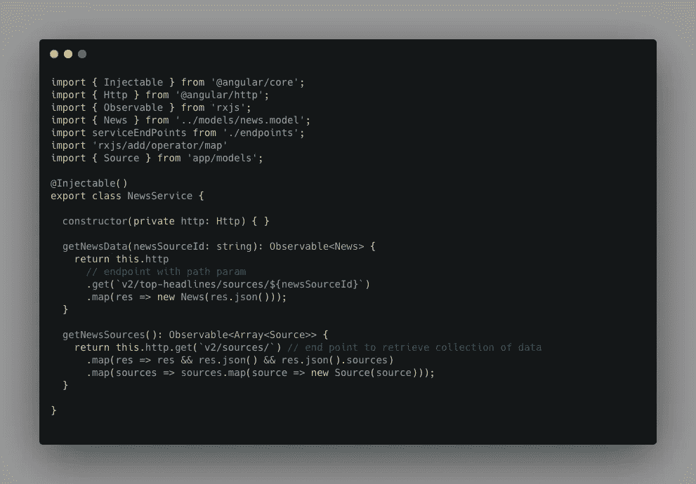
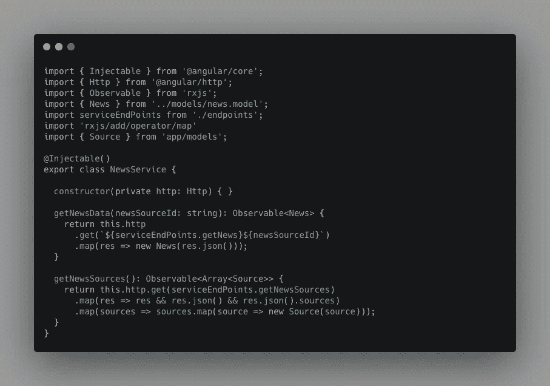
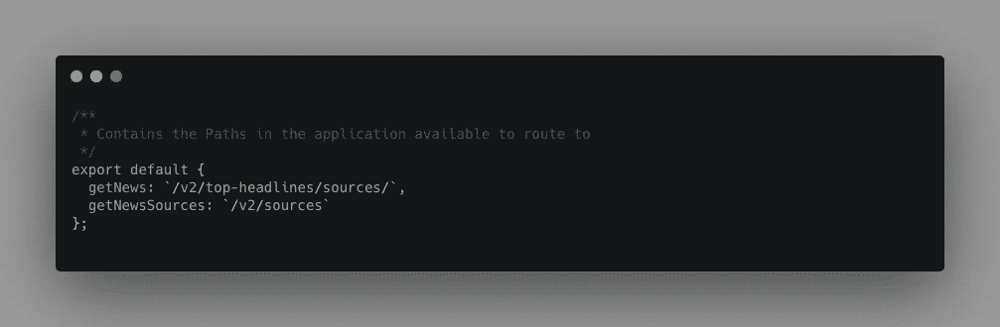
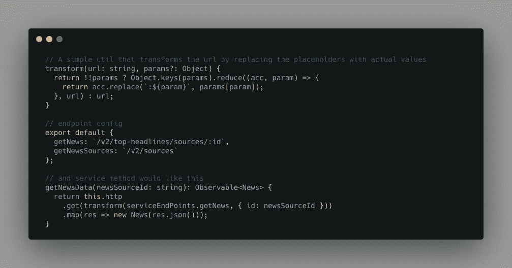
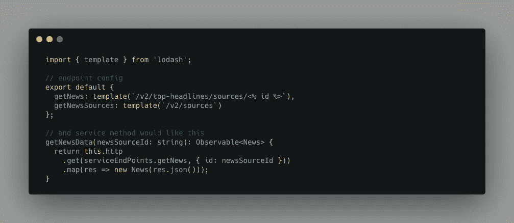
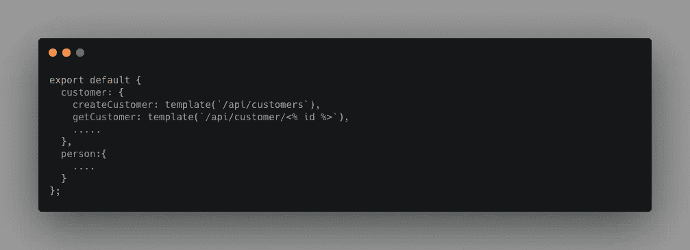

# 如何更好地组织 web 应用程序中的端点

> 原文：<https://javascript.plainenglish.io/how-to-better-organize-end-points-in-frontend-2cebd39b08c3?source=collection_archive---------8----------------------->


Photo by [Oscar Nilsson](https://unsplash.com/@oscrse?utm_source=unsplash&utm_medium=referral&utm_content=creditCopyText) on [Unsplash](/s/photos/organize-things?utm_source=unsplash&utm_medium=referral&utm_content=creditCopyText)

## 在任何应用程序中组织端点都很容易长期维护它们

大多数前端应用程序调用 API 来执行 CRUD 操作，并且这些端点的数量经常随着我们构建应用程序而增加。那么，如何以更好的方式管理这些端点呢？这就是其中之一。

让我们从一个简单的例子开始。在这种情况下，我使用了一个简单的角度服务，但是这种方法可以用于任何前端框架或库。



A simple Angular service

在这里，我们有一个简单的服务，它有两个方法，在方法中有硬编码的端点，可以调用 API 服务来检索数据。如果一个应用程序有更少的端点，这没问题，但是想象一个有数百个端点的企业应用程序？很难知道一个应用程序调用了什么 API，也很难维护它们。

**如何改善？**

我们可以做的第一件事是，将所有端点移动到一个不同的文件中，并引用服务中的那些端点。我们这样做之后，情况是这样的:



Angular service class after refactoring



New endpoints file

看起来好多了，对吧？但是，如果您注意到`getNewsData`方法，它仍然连接路径参数，这看起来不太好。有两种方法可以让事情变得更好。

1.  **用于转换网址的自定义实用函数:** 首先，我们可以通过在端点文件中放置一个占位符值(在这种格式下为`:{paramName}`)来将路径参数映射移动到端点文件。在服务方法中，我们可以通过传入 URL 和一个可选的 params 对象来调用`transform`函数，该对象将用实际值替换所有占位符路径参数。



A simple util that resolves the URL

2.**洛达什模板功能:**

**文档链接:**[https://lodash.com/docs/#template](https://lodash.com/docs/#template)

**示例**:

```
var compiled = _.template(‘hello <%= user %>!’);
compiled({ ‘user’: ‘fred’ });
// => ‘hello fred!’
```

下面是一个简单的示例，展示了它的外观。



Example use case for lodash’s template function

**实体层面分离:**

当我们有多个业务实体时，我发现在实体级别组织端点会使它更加清晰。示例实现如下所示。



Maintaining endpoints at entity level

就这样。我希望你会发现这很有用。谢谢你的阅读！继续阅读更有趣的文章。

## 简单英语中的 JavaScript

你知道我们有四种出版物吗？通过[](https://plainenglish.io/)**——关注我们的出版物并订阅我们的 YouTube 频道 **来表达爱意吧！****