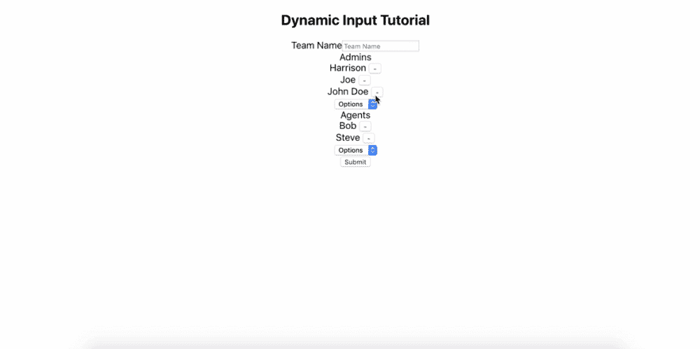
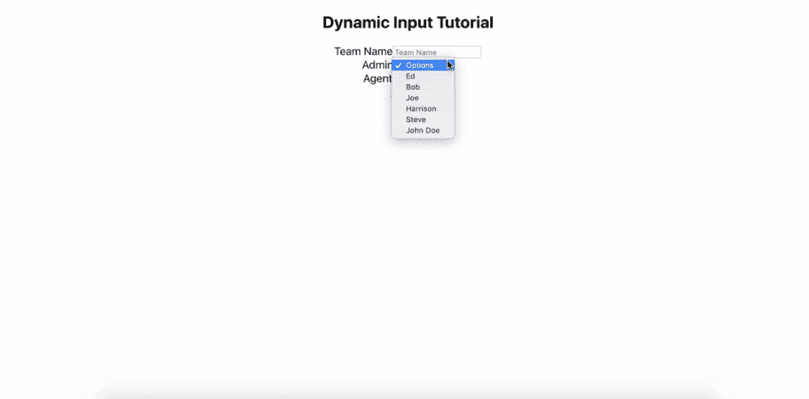

# 如何用 React 构建复杂的动态输入表单

> 原文：<https://javascript.plainenglish.io/how-to-build-a-complex-dynamic-input-form-with-react-ce8b0a7d83d?source=collection_archive---------1----------------------->



*(原载于*[*【https://edward-huang.com】*](https://edward-huang.com/react/frontend/software-development/tech/2019/10/20/how-to-build-a-complex-dynamic-input-form-with-react/)*)*

2019 年制作表格从未像现在这样复杂。React 使构建表单和 UI 变得更加容易，但是创建一个复杂的表单输入来为用户创造无缝的体验可能是棘手和具有挑战性的。我最近被指派创建一个随叫随到的支持应用程序。团队中的每个用户都可以查看自己的待命时间表，其中团队领导和管理员可以与管理员和代理组成小组。

挑战之一是创建一个新的团队注册表单。因此，我想分享一下我是如何设计和构建这个动态输入字段的，以便您可以在下一个 React 项目中使用这个概念。

# 问题是

该表单包含管理员、代理输入字段和团队名称。我需要创建一个团队形式，用户可以很容易地添加管理员和代理。

# 表单的规则如下:

一个团队需要一个管理员。一个用户可以属于多个组，该用户可以是一个组中的管理员，也可以是另一个组中的代理。

数据库中会有一个来自后端的用户列表。我需要设计的形式，以减少任何无效的表单提交到后端。此外，我还需要设计表单来指导用户以正确的方式提交表单，而不是明确地指导他们如何做。

如果用户被选为管理员，则该用户不应再次出现在代理输入字段中。例如，如果客户选择“ *John Doe* ”作为团队 A 的管理员，那么 John Doe 将不会出现在代理的选择输入中。



用户可以在 admin 中动态添加或删除任何用户，代理可以实时选择输入字段，而不会破坏应用程序的状态。

# 直觉

因为有一组来自后端的用户数组，所以我决定在 admin 和 users 字段中使用一个选择输入字段。有了一组输入字段，我将使用输入类型文本来输入团队名称，并对其进行实时验证。

如何确定管理员和代理输入部分的用户是否重复？因为我想最小化对服务器的 fetch 调用量，所以我获取用户的唯一时间是组件被挂载的时候。因此，我需要从服务器的原始用户数组中保留一个副本，这样用户列表上的任何添加和删除都不会改变来自服务器的原始数据。这个用户池将用于实现表单输入字段中的任何操作。该用户池将在代理和管理员输入字段中使用。

每当客户端从管理员的输入选择中选择一个用户时，该用户就会从池中删除。这样，我可以减少 admin 和 user 的选择输入字段中的重复，而不会破坏应用程序的状态。

# 攻击顺序

我通常从画元件图开始，要么在纸上，要么用你想用的任何模拟线框技术。然后，我识别出[虚拟元件和智能元件](https://medium.com/@dan_abramov/smart-and-dumb-components-7ca2f9a7c7d0)。

我将从最简单的表示组件开始，并回溯到容器组件。

# 死刑

创建表示层组件表示层应该是这样的:

```
const TeamForm = () => {
    return (
        <>
            <label htmlFor="admins">Team Name</label>
            <input type="text" value={team.name} onChange={handleChange} name={'name'} placeholder="Team Name" />
            <div>
                <label htmlFor="admins">Admins</label>
                <select name={"admins"} value={''} onChange={handleChange}>
                    {usernameList.map(({id, username}) =>
                        <option key={uuid.v4()} value={id}>{username}</option>
                    )}
                </select>
            </div>
            <div>
                <label htmlFor="agents">Agents</label>
                <select name={"agents"} value={''} onChange={handleChange}>
                    {usernameList.map(({id,username}) =>
                        <option key={uuid.v4()} value={id}>{username}</option>
                    )}
                </select>
            </div>
            <button onClick={handleSubmit}>Submit</button>
        </>
    )
}
```

在这段代码中，我使用了一个单选输入表单来查看代码在浏览器上的外观。


在容器组件中添加所需的状态和事件处理程序一旦我看到了表示组件，我就可以看到需要将状态存储在容器组件中。然后，我们考虑要传递给表示组件的数据的表示:

用户和管理员需要成为一个数组来创建多个动态输入吗？我需要什么样的事件处理程序？

```
const TeamForm = ({
    handleSubmit,
    handleChange,
    handleDeleteClick,
    team,
    usernameList,
}) => {
    return (
        <>
            <label htmlFor="admins">Team Name</label>
            <input type="text" value={team.name} onChange={handleChange} name={'name'} placeholder="Team Name" />
            <div>
                <label htmlFor="admins">Admins</label>
                {team.admins && team.admins.map(admin => {
                    return (<div key={admin.id}>
                        <span> {admin.username} </span>
                        <button onClick={handleDeleteClick('admins', admin.id)}> - </button>
                    </div>)
                })}
                <select name={"admins"} value={''} onChange={handleChange}>
                    {usernameList.map(({id, username}) =>
                        <option key={uuid.v4()} value={id}>{username}</option>
                    )}
                </select>
            </div>

            <div>
                <label htmlFor="agents">Agents</label>
                {team.agents && team.agents.map(agent => {
                    return (<div key={agent.id}>
                        <span> {agent.username} </span>
                        <button onClick={handleDeleteClick('agents', agent.id)} > - </button>
                    </div>)
                })}
                <select name={"agents"} value={''} onChange={handleChange}>
                    {usernameList.map(({id,username}) =>
                        <option key={uuid.v4()} value={id}>{username}</option>
                    )}
                </select>
            </div>
            <button onClick={handleSubmit}>Submit</button>
        </>
    )
}
```

在这种情况下，我需要在容器组件中创建`handleChange`事件来接收用户在输入表单中触发的数据；`handleDelete`来接收从子组件删除的消息，而另一个事件处理程序来接收当客户端点击`Submit`按钮时的消息。我需要在容器组件中创建这三个处理程序。

处理容器组件这是我们形式逻辑的核心。这是您希望将我前面谈到的关于动态添加和删除选择输入表单的所有实现放入的地方。

处理更改:

```
const handleChange = (event) => {
        const { name, value } = event.target;
        // if it is selected, automatically add to the team and create a new selection input
        // this can combine because the how the state is design in the component
        // name and value representing the property of the state
        if (name === 'admins' || name === 'agents') {
            const newUserObj = users.find(user => user.id === Number(value));
            console.log('what is newUserObj', newUserObj);
            console.log(name);
            setTeam(prevTeam => ({
                ...prevTeam,
                [name]: prevTeam[name].concat(newUserObj),
            }))
        }

        // changing team name
        else if (name === 'name') {
            setTeam(prevTeam => ({
                ...prevTeam,
                [name]: value,
            }));
        }
    }
```

处理删除:

```
const handleDeleteClick = (authority, id) => (event) => {
        setTeam(prevTeam => ({
            ...prevTeam,
            [authority]: prevTeam[authority].filter(user => user.id !== id),
        }));
    }
```

接下来，为了防止表单 select from admin 和 agent 中的重复，当组件被初始挂载时，从列表中创建一个名为`userList`的用户克隆缓冲区。这样，每次当其中一个输入字段上有`onChange`事件时，它可以在渲染到`TeamForm.jsx`之前从团队对象中过滤出`userList`(防止两个选择输入重复)。然后，创建一个团队对象，作为表示组件中的临时状态。

这是 ManageTeamPage.jsx 和 TeamForm.jsx 的完整代码:

你有它！我思考如何创建一个动态输入表单来作出反应的基本思路。我没有谈到验证部分，将把它留给下一个主题。如果您有任何问题，请随时在下面的部分发表评论。我希望这能帮助你处理你的下一个项目。

这是 GitHub 中项目的完整代码。