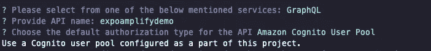

# 如何使用 Amplify 和 AWS AppSync 构建 CRUD 应用程序

> 原文：<https://javascript.plainenglish.io/how-to-build-a-crud-app-with-amplify-and-aws-appsync-a31ecbad58a7?source=collection_archive---------12----------------------->

## 如何使用 GraphQL 变异对数据库执行 CRUD 操作

[AWS Amplify](https://docs.amplify.aws/) 是一个让我们快速开发网络或移动应用的框架。在本教程中，我们将继续学习如何使用 GraphQL 变异对数据库执行 CRUD 操作。AWS Amplify 有一个完整的工具链，通过 GraphQL 连接和管理 API。我们将在本教程中创建的 API 是一个使用 AWS AppSync(一个托管的 GraphQL 服务)的 GraphQL API，数据库将是 Amazon DynamoDB(一个 NoSQL 数据库)。


在你开始本教程之前，请跟随[第 1 部分](https://www.instamobile.io/mobile-development/react-native-aws-amplify/)，在那里我们讨论了设置 Amplify 作为一个框架，以及使用自定义 UI 的电子邮件认证。

## 创建一个 GraphQL API

要开始创建 API 并连接数据库，请在终端窗口中运行以下命令。

```
amplify add api
```


这个 CLI 执行会自动完成几件事情。首先，它创建了一个全功能的 GraphQL API，包括数据源、带有查询、变异和订阅的基本模式结构的解析器。它还通过发送请求下载运行这些操作所需的客户端代码和配置文件。上面的命令将提示我们选择我们想要编写的 API 类型。输入配置文件 API 名称。在下面的例子中，我们保留默认的配置文件名。


接下来，它将再次为我们提供两个选项，告诉我们如何对 AWS AppSync API 进行身份验证。在实时应用程序中，我们有不同的用户访问数据库并向它发出请求。选择选项 **Amazon Cognito 用户池**。这是一种更务实的方法。因为我们已经用认证模块配置了 **Amazon Cognito 用户池**，所以我们不需要在这里进行配置。



对于接下来的两个问题**您是否希望为 GraphQL API 配置高级设置**和**您是否有带注释的 GraphQL 模式？**答案是`N`或否。Amplify 附带预定义的模式，以后可以更改。

当提示**选择一个模式模板**时，选择选项**带字段的单个对象。**


在我们继续之前，让我们编辑由这个过程创建的 GraphQL 模式。转到 React 本地项目，从根目录打开文件`amplify/backed/api/[API_NAME]/schema.graphql`。

AppSync 创建的默认模型如下:

```
type Todo @model {
  id: ID!
  name: String!
  description: String
}
```

目前，在 CLI 中完成该过程时，一定会提示一条警告，描述为:

```
The following types do not have '@auth' enabled. Consider using @auth with @model 
- Todo
```

因为我们已经启用了认证模块，所以我们可以在`schema.graphql`文件中添加`@auth`指令。默认情况下，启用所有者授权允许任何登录用户创建记录。

```
type Todo @model @auth(rules: [{ allow: owner }]) {
  id: ID!
  name: String!
  description: String
}
```

如果您不熟悉 GraphQL 模型及其类型，这里有一个简单的概述。

GraphQL 模式中的`type`是存储在数据库中的一段数据。每种类型可以有一组不同的字段。把`type`想象成一个来自 JavaScript 后台的对象。例如，在上面的模式中，`Todo`模型的类型有三个字段:`id`、`name`和`description`。另外，`@model`指令用于在 Amazon DynamoDB 中存储类型。这是亚马逊在存储我们的应用程序数据时使用的数据库。

感叹号`!`表示存储数据时该字段是必需的，并且必须有一个值。在上面的模式中，Todo 类型有两个必需字段:`id`和`name`。

保存此文件，我们刚才所做的所有更改现在都保存在本地。

## 将 API 发布到 AWS 云

在运行该命令时，作为一个提示，它会返回一个表，其中包含有关我们已经使用、修改或启用的资源的信息。这些资源的名称在**类别**部分描述。

上表中的**资源**名称是上一节中选择的 API 名称。


Amplify CLI 界面现在将检查模式，然后在将最终更改发布到云之前编译它以查找任何错误。

下一步，它会提示我们选择是否要为新创建的 GraphQL API 生成代码。按下`Y`。然后选择 JavaScript 作为代码生成语言。


按`Y`进入下一个询问更新所有 GraphQL 相关操作的问题。同样，让最大语句深度作为`2`的默认值。更新 AWS 云上的资源需要一些时间，完成后会提示一条成功消息。


## 在 React 本机应用程序中添加输入字段

为了捕捉用户输入，我们将通过 React hook `useState`使用两个状态变量。第一个状态变量是 todo 项的 name `name`字段和一个名为`todos`的数组。这个数组将用于从 GraphQL API 中获取所有的 todo 项，并在 UI 上显示这些项。

```
const [name, setName] = useState(''); 
const [todos, setTodos] = useState([]);
```

接下来，从 React Native 导入`TextInput`和`TouchableOpacity`来创建一个输入字段和一个可按下的按钮，该按钮具有在`Home`组件下的`StyleSheet`引用对象中定义的一些自定义样式。这里是`Home.js`的完整代码:

```
import React, { useState } from 'react';
import {
  View,
  Text,
  TextInput,
  TouchableOpacity,
  StyleSheet,
  Button,
  ScrollView,
  Dimensions
} from 'react-native';
import { Auth } from 'aws-amplify';

const { width } = Dimensions.get('window');

export default function Home({ updateAuthState }) {
  const [name, setName] = useState('');
  const [todos, setTodos] = useState([]);

  async function signOut() {
    try {
      await Auth.signOut();
      updateAuthState('loggedOut');
    } catch (error) {
      console.log('Error signing out: ', error);
    }
  }

  const addTodo = () => {};

  return (
    <View style={styles.container}>
      <Button title="Sign Out" color="tomato" onPress={signOut} />
      <ScrollView>
        <TextInput
          style={styles.input}
          value={name}
          onChangeText={text => setName(text)}
          placeholder="Add a Todo"
        />
        <TouchableOpacity onPress={addTodo} style={styles.buttonContainer}>
          <Text style={styles.buttonText}>Add</Text>
        </TouchableOpacity>
      </ScrollView>
    </View>
  );
}

const styles = StyleSheet.create({
  container: {
    flex: 1,
    alignItems: 'center',
    marginTop: 20
  },
  input: {
    height: 50,
    borderBottomWidth: 2,
    borderBottomColor: 'tomato',
    marginVertical: 10,
    width: width * 0.8,
    fontSize: 16
  },
  buttonContainer: {
    backgroundColor: 'tomato',
    marginVertical: 10,
    padding: 10,
    borderRadius: 5,
    alignItems: 'center',
    width: width * 0.8
  },
  buttonText: {
    color: '#fff',
    fontSize: 24
  }
});
```

确保您正在终端窗口中运行`expo start`命令，以查看此步骤的结果。


## 使用 GraphQL API 添加变异

GraphQL 的一个变种就是处理像添加、删除或修改数据这样的操作。目前，React 本机应用程序是基本的，但它的目的是让您熟悉作为工具链的 Amplify 及其与跨平台框架的集成。

要添加一个项目并在 React 本机应用程序中检索该项目，让我们添加一些业务逻辑，以便通过一个突变与 GraphQL 后端进行通信。

```
/* eslint-disable */
// this is an auto generated file. This will be overwritten

export const createTodo = /* GraphQL */ `
  mutation CreateTodo(
    $input: CreateTodoInput!
    $condition: ModelTodoConditionInput
  ) {
    createTodo(input: $input, condition: $condition) {
      id
      name
      description
      createdAt
      updatedAt
      owner
    }
  }
`;
export const updateTodo = /* GraphQL */ `
  mutation UpdateTodo(
    $input: UpdateTodoInput!
    $condition: ModelTodoConditionInput
  ) {
    updateTodo(input: $input, condition: $condition) {
      id
      name
      description
      createdAt
      updatedAt
      owner
    }
  }
`;
export const deleteTodo = /* GraphQL */ `
  mutation DeleteTodo(
    $input: DeleteTodoInput!
    $condition: ModelTodoConditionInput
  ) {
    deleteTodo(input: $input, condition: $condition) {
      id
      name
      description
      createdAt
      updatedAt
      owner
    }
  }
`;
```

这是通过 Amplify 实现的，要使用上述任何一种突变，我们可以直接在组件文件中导入方法。在`Home.js`文件中，从`aws-amplify`包中导入`API`和`graphqlOperation`。`API`是 AWS 资源的类别，导入的第二个函数是运行变异或查询的方法。另外，从`graphql/mutation.js`文件导入突变`createTodo`。

```
// ... 
import { Auth, API, graphqlOperation } from 'aws-amplify'; import { createTodo } from '../graphql/mutations';
```

让我们将逻辑添加到我们在上一节中定义的`addTodo`自定义处理程序方法中。这将是一个异步函数，从变异中获取结果并更新`todos`数组。它将`name`作为输入，其中`name`是项目的文本。

```
const addTodo = async () => {
  const input = { name };
  const result = await API.graphql(graphqlOperation(createTodo, { input }));

  const newTodo = result.data.createTodo;
  const updatedTodo = [newTodo, ...todos];
  setTodos(updatedTodo);
  setName('');
};
```

在我们进入下一部分之前，尝试添加一些数据。

## 运行查询以从 AWS AppSync 获取数据

为了从数据库中获取数据，我们需要运行一个查询。与突变类似，Amplify 也负责基于生成的 GraphQL 模式创建初始查询。

所有可用的查询都可以在`src/graphql/queries.js`中找到。

```
/* eslint-disable */
// this is an auto generated file. This will be overwritten

export const getTodo = /* GraphQL */ `
  query GetTodo($id: ID!) {
    getTodo(id: $id) {
      id
      name
      description
      createdAt
      updatedAt
      owner
    }
  }
`;
export const listTodos = /* GraphQL */ `
  query ListTodos(
    $filter: ModelTodoFilterInput
    $limit: Int
    $nextToken: String
  ) {
    listTodos(filter: $filter, limit: $limit, nextToken: $nextToken) {
      items {
        id
        name
        description
        createdAt
        updatedAt
        owner
      }
      nextToken
    }
  }
`;
```

要从 GraphQL API 获取所有数据并显示在设备屏幕上，让我们使用上面文件中的查询。将`listTodos`导入到`Home.js`文件中:

```
import { listTodos } from '../graphql/queries';
```

为了从数据库中获取数据，让我们使用`useEffect`钩子。确保从 React 库导入它:

```
import React, { useState, useEffect } from 'react';
```

让我们定义另一个名为`fetchTodos`的处理程序方法，通过运行查询`listTodos`来获取数据。这将是一个异步方法，所以让我们使用`try/catch`块来捕捉获取数据时的任何初始错误。在`Home`组件中添加以下代码片段:

```
useEffect(() => {
  fetchTodos();
}, []);

async function fetchTodos() {
  try {
    const todoData = await API.graphql(graphqlOperation(listTodos));
    const todos = todoData.data.listTodos.items;
    console.log(todos);
    setTodos(todos);
  } catch (err) {
    console.log('Error fetching data');
  }
}
```

从数据库返回的数据数组如下所示:


```
return (
  <View style={styles.container}>
    <Button title="Sign Out" color="tomato" onPress={signOut} />
    <ScrollView>
      <TextInput
        style={styles.input}
        value={name}
        onChangeText={text => setName(text)}
        placeholder="Add a Todo"
      />
      <TouchableOpacity onPress={addTodo} style={styles.buttonContainer}>
        <Text style={styles.buttonText}>Add</Text>
      </TouchableOpacity>
      {todos.map((todo, index) => (
        <View key={index} style={styles.itemContainer}>
          <Text style={styles.itemName}>{todo.name}</Text>
        </View>
      ))}
    </ScrollView>
  </View>
);
```

此外，更新相应的样式:

```
const styles = StyleSheet.create({
  // ...
  itemContainer: {
    marginTop: 20,
    borderBottomWidth: 1,
    borderBottomColor: '#ddd',
    paddingVertical: 10,
    flexDirection: 'row',
    justifyContent: 'space-between'
  },
  itemName: {
    fontSize: 18
  }
});
```

以下是您将得到的结果:


## 在查询提取数据时添加加载指示器

现在，当应用程序刷新或用户登录时，需要时间进行网络调用来加载数据，因此，在呈现列表项时会有轻微的延迟。让我们使用 React Native 的`ActivityIndicator`添加一个加载指示器。

```
// modify the following import statement
import {
  View,
  Text,
  TextInput,
  TouchableOpacity,
  StyleSheet,
  Button,
  ScrollView,
  Dimensions,
  ActivityIndicator
} from 'react-native';
```

为了知道查询运行时何时显示加载指示器，让我们在`Home`组件中添加一个名为`loading`的新状态变量，初始值为布尔值`false`。当获取数据时，最初这个值是`true`，只有当从 API 获取数据时，它的值才被再次设置为`false`。

```
export default function Home({ updateAuthState }) {
// ...
const [loading, setLoading] = useState(false);

// modify the fetchTodos method
 async function fetchTodos() {
    try {
      setLoading(true);
      const todoData = await API.graphql(graphqlOperation(listTodos));
      const todos = todoData.data.listTodos.items;
      console.log(todos);
      setTodos(todos);
      setLoading(false);
    } catch (err) {
      setLoading(false);
      console.log('Error fetching data');
    }
  }

  // then modify the JSX contents

  return (
    {/* rest remains same */}
    <ScrollView>
        {/* rest remains same */}
        {loading && (
          <View style={styles.loadingContainer}>
            <ActivityIndicator size="large" color="tomato" />
          </View>
        )}
        {todos.map((todo, index) => (
          <View key={index} style={styles.itemContainer}>
            <Text style={styles.itemName}>{todo.name}</Text>
          </View>
        ))}
      </ScrollView>
  )
}

// also modify the styles

const styles = StyleSheet.create({
  // ...
  loadingContainer: {
    marginVertical: 10
  }
});
```

以下是输出:


## 运行删除突变来删除项目\

要从`todos` 数组中删除一个项目，需要执行变异`deleteTodo`。让我们使用列表中的每一项的`TouchableOpacity`和`@expo/vector-icons`在 UI 上添加一个按钮。在`Home.js`组件文件中，首先导入图标和突变。

```
// ...
 import { Feather as Icon } from '@expo/vector-icons'; 
import { createTodo, deleteTodo } from '../graphql/mutations';
```

然后，定义一个名为`removeTodo`的处理程序方法，该方法将从`todos`数组中删除 todo 项，并通过对其使用`filter`方法来更新数组。这次突变的`input`将是 todo 项的`id`。

```
const removeTodo = async id => {
  try {
    const input = { id };
    const result = await API.graphql(
      graphqlOperation(deleteTodo, {
        input
      })
    );
    const deletedTodoId = result.data.deleteTodo.id;
    const updatedTodo = todos.filter(todo => todo.id !== deletedTodoId);
    setTodos(updatedTodo);
  } catch (err) {
    console.log(err);
  }
};
```

现在，在呈现 todo 列表项的位置添加按钮。

```
{
  todos.map((todo, index) => {
    return (
      <View key={index} style={styles.itemContainer}>
        <Text style={styles.itemName}>{todo.name}</Text>
        <TouchableOpacity onPress={() => removeTodo(todo.id)}>
          <Icon name="trash-2" size={18} color="tomato" />
        </TouchableOpacity>
      </View>
    );
  });
}
```

这是完成这一步后您将得到的输出。


## 摘要

完成本教程后，您会发现使用 AWS AppSync 和 Amplify 创建 GraphQL API 是多么简单。

在 [Instamobile](https://www.instamobile.io/) ，我们正在构建随时可用的 React 原生应用，由各种后端支持，如 AWS Amplify 或 Firebase，以帮助开发者更快地制作他们自己的移动应用。

喜欢这篇文章吗？如果是这样，通过 [**订阅解码获得更多类似内容，我们的 YouTube 频道**](https://www.youtube.com/channel/UCtipWUghju290NWcn8jhyAw) **！**

*原载于 2020 年 10 月 5 日*[*https://www . insta mobile . io*](https://www.instamobile.io/react-native-tutorials/aws-appsync-react-native/)*。*