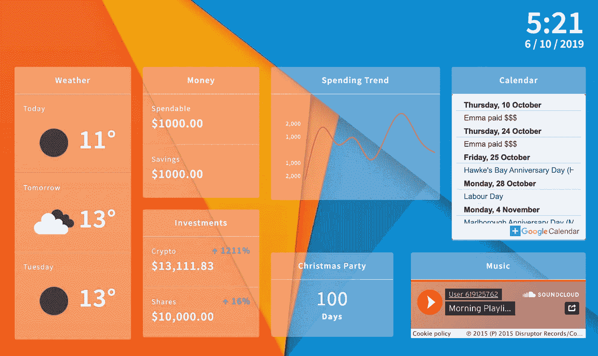
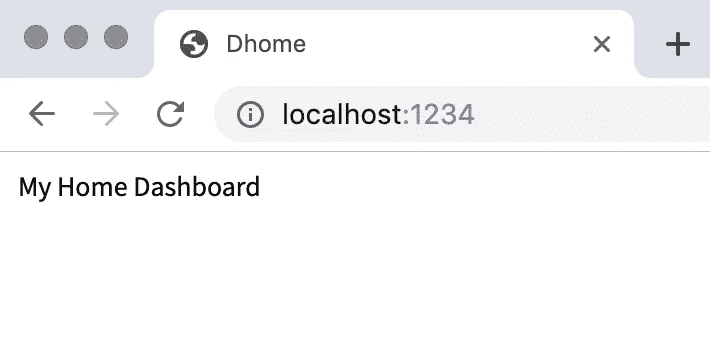
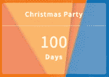
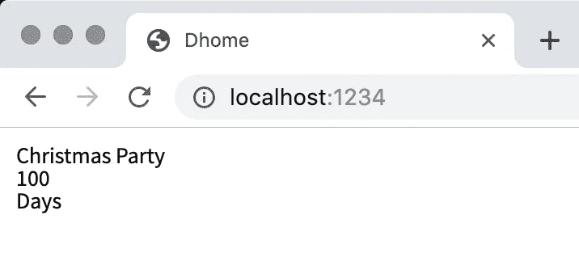
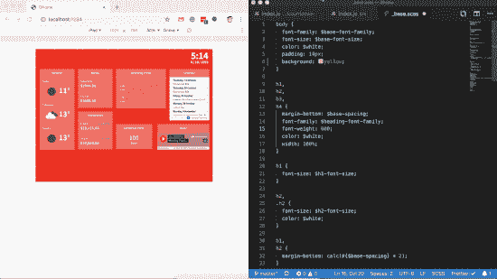

# 如何在 React、Parcel 和 Alexa 中构建家庭仪表盘

> 原文：<https://javascript.plainenglish.io/how-to-build-a-home-dashboard-in-react-parcel-and-alexa-41f4eb2ebe5a?source=collection_archive---------0----------------------->



Current look of my Home Dashboard

我决定利用内置 Alexa 的优势，并将它们与 React 的一些基本知识融合到一个个性化的家庭仪表盘中。

自从我有了亚马逊 Echo，我就喜欢上了通过询问天气、交通和播放音乐来开始一天工作的能力。我喜欢有一个“家庭仪表板”的想法，它不是关于“开灯”等，而是关于我通常想知道的我的家庭和日常事务。

结果是一个相当简单的 React 应用程序，在亚马逊 Fire 平板电脑的浏览器中运行。其代码可在 [Github 这里](https://github.com/lindsayjopson/react-home-dashboard)获得。

## 先决条件:

*   对 React 的基本了解
*   [节点](https://nodejs.org/en/)安装完毕

# 从哪里开始

首先，您需要创建 React 项目准系统。本质上是三个文件。其中两张我放在了一个`[src](https://github.com/lindsayjopson/react-home-dashboard/tree/master/src)`文件夹里。
`src/index.html``src/index.js`&

## src/index.html

在你的`src/index.html`文件的`body`中，放置在下面。

```
<div id="root"></div>  
<script src="index.js"></script>
```

这将意味着当执行`index.js`文件时，它将把 React 容器和您列出的所有`/widgets`放入`#root` div。

## `src/index.js`

接下来，您需要添加`index.js`文件。这是你的应用程序的“引擎”。这是需要对 React 有一个基本了解的地方。

您的`src/index.js`文件的内容如下:

```
import * as React from "react";
import { render } from "react-dom";const App = () => (
  <>
   My Home Dashboard
  </>
);render(<App />, document.getElementById("root"));
```

要逐行运行该代码:

```
import * as React from "react";
import { render } from "react-dom";
```

这是拉入`react`库& `react-dom`以使您的应用程序能够`render(<App/>, document.getElementById("root"));`

下一个关键部分是:

```
const App = () => (
  <>
   My Home Dashboard
  </>
);
```

在这个阶段，在两个`<> & </>`之间添加的所有内容都将在执行`npm start`后呈现在浏览器中



Currently shown in browser

## package.json

这就是“奇迹”发生的地方。这是 React 和[包裹](https://parceljs.org/)都被拉入游戏并放置节点`scripts`的地方:

```
{
  "name": "dhome",
  "version": "1.0.0",
  "description": "",
  "main": "index.js",
  "scripts": {
    "start": "parcel ./src/index.html"
  }
  "keywords": [],
  "author": "",
  "license": "ISC",
  "dependencies": {
    "parcel-bundler": "^ 1.12.3",
    "react": "^ 16.9.0",
    "react-dom": "^ 16.9.0"
  }
  "devDependencies": {
    "parcel-bundler": "^ 1.12.3"
  }
}
```

将它放入目录的`root`后，执行`npm install` & `npm start`。这将下载并安装`parcel-bundler, react & react-dom`并通过`npm start`运行`parcel`启动脚本，这将创建一个本地开发服务器。编译您的`src/index.js`，并通过`localhost:1234`访问您的`/src/index.html`

# 构建小部件

我决定在我的仪表板上使用一个“widget”系统。你没有理由不直接把这些放到你的`index.js`文件中，但是为了可扩展性和允许将来在不同的东西之间切换。

我所有的小工具都存储在`/src/widgets`下。我制作的第一个小部件是一个“倒计时”小部件。我们的房子通常会发生一些让我们兴奋的事情。此时此刻，我们正在为一年一度的圣诞晚会倒计时！



为此，这是一个简单的编码练习。取当前日期，您的活动开始的日期，并显示差异…

现实中是这样的。首先，创建`/src/widgets/countdown/index.js`

```
import React from "react";export class CountdownWidget extends React.Component {
    render() {
        return (
             <div className="widget countdown">
                 <div className="heading">Christmas Party</div>
                 <div className="count">100</div>
                 <div className="meta">Days</div>
             </div>
        );
    }}
```

现在我们需要扩展这个来创建“真正的”倒计时，而不仅仅是`100`。

为此，您需要将这段代码添加到`render()`函数的上方。

```
constructor(props) {
    super(props);
    const then = new Date(2019, 12, 15);
    const today = new Date();
    const count = Math.abs(Math.round((today - then) / (1000 * 60 * 60 * 24)));this.state = {
        count: count
    };
}componentDidMount() {
    setInterval(() => {
        const then = new Date(2019, 12, 15);
        const today = new Date();
        const count = Math.abs(Math.round((today - then) / (1000 * 60 * 60 * 24)));

        this.setState({
            count: count
        });
    }, 3600000);
}render() {
...
```

该代码块中需要注意的关键事项是:

*   `then`你正在倒数的日期
*   `today`今日日期
*   `this.state`这实质上形成了组件状态的“形状”,使我们能够在代码中修改它并在以后查询它。
*   `this.setState`这用一个新变量更新组件状态。

我选择在这里使用一个`setInterval`,虽然这不是必需的，但这意味着每 24 小时,`count`变量应该更新，而不需要刷新整个仪表板。

现在只需用以下代码更新您的`render`函数:

```
<div className="count">{this.state.count}</div>
```

# 将倒计时添加到您的仪表板

将`CountdownWidget`添加到您的仪表板。打开`index.js`并添加以下几行:

```
import * as React from "react";
import { render } from "react-dom";import { CountdownWidget } from "./widgets/countdown";
```

并且在`App`常量内

```
const App = () => (
   <CountdownWidget />
);
```

现在，您应该会在浏览器中看到以下内容:



# 添加一些风格

我个人使用 [Sass](https://sass-lang.com/) 文件来做到这一点，但这完全取决于你。

为此，我在根目录下创建了一个`/src/styles`文件夹。然后在下面添加各种`_filename.scss`。[包](https://parceljs.org/)的美妙之处在于它会直接为你编译`.scss` & `.js`文件，并且在你每次保存时自动重新编译。加入:

```
if (module.hot) {
    module.hot.accept();
}
```

到你的根`index.js`你会看到你的浏览器直接从盒子里更新这些重新编译的人工制品！



hot reloading in action

# Alexa 的那一点…

所以这有点像作弊。与其试图将 Alexa API 集成到我的仪表盘中，我决定利用一个已经内置了这个的设备。[亚马逊 Fire 平板电脑](https://www.amazon.com/Amazon-Fire-Tablet-Family/b?ie=UTF8&node=6669703011)。这些附带了一个 web 浏览器，它基本上会指向您刚刚创建的仪表板。现在你可以让你的仪表板运行，同时仍然能够喊出“Alexa，玩酷玩”而不需要触摸你的仪表板。

# 构建小工具并享受其中的乐趣！

现在，您已经拥有了开始构建小部件所需的一切。为了让你开始，我在我的 GitHub 上有几张我已经做过的图片。请随意打开这些，更新您需要的内容，然后从那里开始！我很想看看你添加了什么小工具，所以请随意打开这个回购的 PR，我们可能会做出一些很酷的改变和更新。