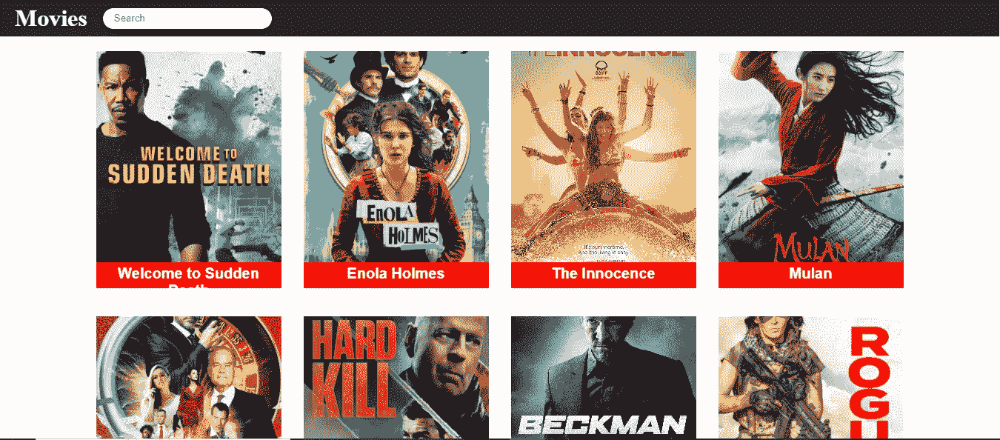
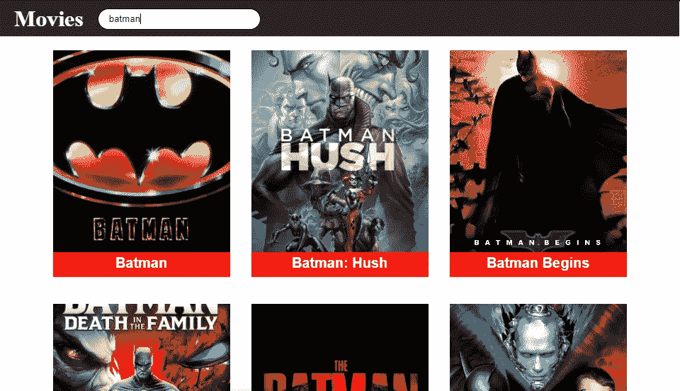

# 如何用普通 JavaScript 构建电影应用程序

> 原文：<https://javascript.plainenglish.io/how-to-build-a-movie-app-with-vanilla-javascript-351a9255d7ad?source=collection_archive---------1----------------------->

## 使用普通 JavaScript 和 Fetch API 构建电影应用程序

Image By Mehdi Aoussiad.

# 简介:

**电影应用**是为了提高你的 JavaScript 技能，你必须尝试的令人兴奋的项目之一。上个月，我构建了一个简单的电影应用程序，这是我在 100 天代码挑战中尝试的项目之一。所以在尝试这个项目之前，你需要了解 **HTML** 、 **CSS** 和 **JavaScript** 。正如你所看到的，这个项目非常简单，它只是给你一个带有图片和标题的电影列表。你也可以搜索任何电影，它会显示你的电影名称和图像。让我们看看我们的项目怎么样。

# 项目演示

Our Movie App Demo.

如你所见，这个项目很简单。如果您愿意，您可以添加更多功能，如描述或每部电影的评级。当然，你可以用我用过的电影 API 来实现。

# 让我们从 HTML 开始:

The HTML Structure.

正如你在 HTML 结构中看到的, **header** 标签将包含我们的导航菜单，上面有我们要搜索电影的徽标和搜索栏。

# 让我们来设计我们的标题:

Styling the Navigation Menu.

现在，我们在 header 标签中设计了导航菜单。我认为是时候转向 JavaScript 了。

# JavaScript 部分

现在我们必须选择我们的 HTML 元素，然后我们必须使用 **fetch** 从外部电影 API 获取数据，并将它们放入 HTML 中的 **main** 标签中。

Our JavaScript Code.

正如您在我们的 JavaScript 代码中看到的，我们使用 fetch 从 API 请求了电影的数据，然后我们为这些数据创建了一些元素，例如用于图像的 **IMG** 元素和用于电影标题的 **h2** 。我们把所有这些都放在主标签中。现在，我们只需对主标记中的所有内容进行样式化。

# 设计我们的电影

现在恭喜你，你已经用普通的 JavaScript 轻松创建了一个简单的电影应用程序。

Image by Mehdi Aoussiad. (searching for batman movie)

# 结论:

成为一名优秀的开发人员的最好方法是实践你所学到的东西。熟能生巧。构建一个电影应用程序将帮助你练习和提高你的编码技能。所以，我希望你今天学到了新东西。