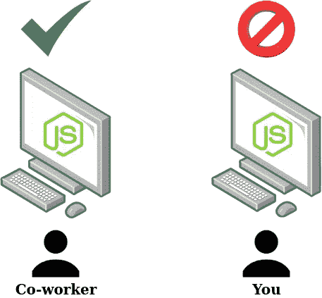
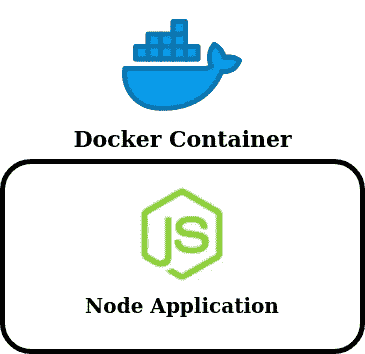
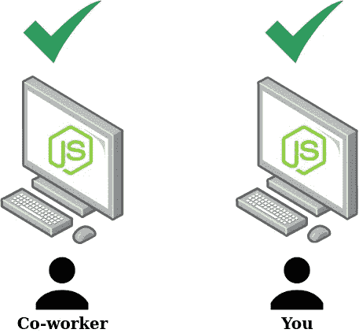
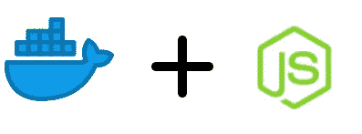

# 如何用 Docker 构建 Node.js 应用程序

> 原文：<https://javascript.plainenglish.io/how-to-build-a-node-js-application-with-docker-4a0164fdc9ca?source=collection_archive---------9----------------------->

## 通过快速、全面地概述 Docker 容器以及如何在 Node.js 中使用它们，启动并运行 Node.js 应用程序

如果您已经找到了这篇文章，那就意味着您的任务是设置一个应用程序并在 Docker 容器中运行它。到本文结束时，您将能够做到这一点。

在深入必要的代码之前，理解容器和 Docker 解决的底层问题是很重要的。幸运的是，这个问题很容易理解，并且会使我们的代码更容易理解。

> 对于已经熟悉 Docker 及其用例的读者，请滚动阅读下一部分。

# 容器解决的问题是什么？

大多数开发人员都与下面的场景有关，这个场景很好地说明了容器的用途。一位同事要求您克隆他们的 GitHub 存储库，以帮助他们调试问题。在您克隆了它并安装了必要的依赖项之后，您发现应用程序将无法运行。它抛出各种各样的错误，没有一个是你的同事请求帮助的问题。

你们两个刚刚遇到的问题是在不同环境的不同机器上运行应用程序。没有两个开发者拥有相同的机器。仅仅因为一个开发者的应用可以在他们的机器上运行，并不意味着它也可以在你的机器上运行，因为你的机器在他们各自的环境中可能有许多不同的属性，比如:

*   操作系统；
*   软件版本；
*   已安装的依赖项；

不同之处不胜枚举！这个问题的解决方法是什么？

这就是**集装箱**解决方案的地方。通过将代码和**及其所有**依赖项打包到一个隔离的容器中，开发人员可以在任何机器上运行该容器并获得可预测的结果，因为**应用程序运行**所需的一切都包含在该容器中。

一旦应用程序被容器化，它就可以在任何机器上共享和运行。因此，前面提到的开发环境不兼容的问题得到了解决。

我们已经得到了容器的定义:**容器**是一个软件单元，它打包了代码和所有代码的依赖项，因此它可以在任何机器上运行。

让我们把这个定义翻译成 Node.js 应用程序；打包代码及其依赖项的过程会是什么样的？

首先，运行应用程序的主机将需要 Node.js 运行时，因此应该包括它。接下来，我们需要组成应用程序的实际代码，比如`index.js`，以及组成应用程序的所有其他文件。我们还需要`package.json`，因为该文件为应用程序定义了必要的**依赖关系**。

此外，我们需要定义实际运行应用程序所需的命令。

现在我们已经看到了 Docker 容器解决的问题，让我们实际上为 Node.js 应用程序创建一个。

# 定义 Dockerfile 文件

转到一个新目录并运行`npm init`。这将创建一个新的`package.json`文件，用于定义应用程序及其依赖项。

让我们添加一个依赖:运行`npm i express`来安装 **express** 作为一个依赖。我们将使用这个包来创建一个服务器。

现在，为应用程序创建入口点文件。它的名称将是您在`init`设置期间定义的名称。在我的机器上，它是`index.js`，所以我将运行`touch index.js`。

打开`index.js`并粘贴以下代码:

`index.js`只是指定一个**主机和端口**的组合来监听请求。当我们访问根节点`/`时，我们将在代码的第 11 行收到响应。

这些代码足以编写和测试 Docker 容器。

为了启动 Docker 容器，我们首先需要编写一个 **Dockerfile** ，它定义了应用程序、它的依赖项以及应用程序运行所需执行的任何命令。运行命令`touch Dockerfile`并在文本编辑器中打开它。

首先，我们需要定义基本的**图像**，它将被用来构建这个容器。

一个**图像**被用来构建一个 Docker 容器。映像提供了在其中作为容器运行特定应用程序或软件的必要环境。在我们的例子中，我们运行的是 Node.js 应用程序，因此我们需要从 Node.js 映像构建，以便为我们的应用程序提供 Node.js 运行时。为此，模仿以下 docker 文件:

> 我们选择了 Node.js 提供的某张图片，有很多不同的选项；在这种情况下，我们选择了它的一个小图像。

接下来，让我们定义容器内部的工作目录。这个目录将存放我们的应用程序代码。

下一步是将`package.json`文件从我们机器上的当前目录复制到镜像中，并运行`npm install`来安装`package.json`中定义的依赖项。因为我们已经使用了 Node.js 的基本映像，所以 NPM 已经安装好了，可以在容器内部运行。

为此，我们将使用命令**复制**和**运行**。

> `COPY package.json .`会将我们**当前目录**中的`package.json`复制到工作目录`/usr/src/app/package.json`。

我们几乎完成了——现在，我们需要复制应用程序的其余源代码；在这种情况下，它只是`index.js`。为当前目录定义另一个 **COPY** 命令。

我们现在需要使用一个新的命令，即 **EXPOSE** 。该命令告诉 Docker 容器在运行时监听哪个端口。在我们的例子中，我们的应用程序监听 3000，所以在容器中公开相同的端口。除了暴露容器的 3000 端口之外，运行最终命令来启动应用程序:`node index.js`。

在实际构建此映像并运行容器之前，创建一个`.dockerignore`文件来定义构建映像时应该忽略当前目录中的哪些文件。该文件应与文件存在于**相同的目录中。**

现在，整个目录正被复制到图像中的工作目录中，包括节点模块。

这个目录可能很大。我们不想包含`node_modules`，所以将其添加到`.dockerignore`。

# 塑造形象

Dockerfile 已经定义，但是我们还没有建立图像。为了在容器中运行这个应用程序，我们需要运行代表应用程序的图像。所以，让我们从 Dockerfile 构建我们的图像，然后将图像作为一个容器运行。

在当前目录下，运行`docker build -t <your_name>/node_app .`。末尾的`.`指定检查当前目录是否有文件，而`-t <your_name>/node_app`给图像一个**标签**，您可以简洁地指定运行图像。

在成功构建之后，就可以将图像作为一个容器运行了。运行以下命令:`docker run -p 5000:3000 -d <your_name>/node_app`。

`-p`指定机器上的公共端口，以映射到 Docker 容器中的内部端口。在这种情况下，我们映射到端口 3000，因此在 5000 处对我们的机器**的请求将被路由到码头工人集装箱的 3000 端口。`-d`指示 Docker 将该容器作为后台进程运行，以便您可以继续在终端中操作。**

**在浏览器中访问`localhost:5000`，出现消息“正在 Docker 上运行！”应该在场。**

# **结论**

**可以看到，Docker 容器通过确保我们可以在任何机器上运行任何应用程序，给了开发人员巨大的能力。**

**在本文中，我们只接触到了 Docker 的一小部分权力。对于任何想要额外工作的读者，尝试下面的练习。**

**创建一个以某种方式使用 **Redis** 实例的应用程序。然后，定义一个`docker-compose`文件，该文件可以无缝地运行应用程序和 Redis，并允许它们通过共享网络进行通信。**

**祝你好运，编码快乐！**