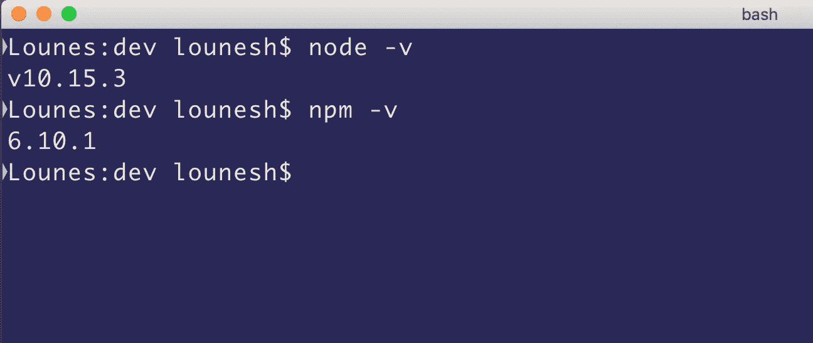

# 如何构建 NodeJS web 服务器

> 原文：<https://javascript.plainenglish.io/how-to-build-a-nodejs-web-server-for-beginner-1f793a48419f?source=collection_archive---------10----------------------->

## 如今，构建 NodeJS 服务器非常简单

今天我将向您展示如何使用 NodeJS 构建一个基本的 web 服务器。


NodeJS web server

本文将涵盖三个主要部分

1-使用自制软件安装 NodeJS 和 NPM(在 macOS 上)

2-构建我们的 NodeJS 服务器

3-使用 PM2 保持服务器运行

# 1.在 MacOS 上安装 NodeJS

这一步需要你安装家酿。如果你不知道如何在你的机器上安装家酿软件，请访问这个**链接**

我选择用家酿安装 NodeJS，因为它比手动安装更快。

在你的机器上安装家酿后，打开你的终端(为它的 [Iterm](https://www.iterm2.com/) )并键入:

```
brew update
```

这将使用最新版本的 Node 更新 Homebrew。现在键入:

```
brew install node
```

就是这样！现在，您的计算机上应该已经安装了节点和 NPM

为了确保您已经成功安装了 NodeJS & NPM，您可以运行两个命令行。

```
node -v && npm -v
```

如果你已经成功安装了 NodeJS & NPM，你应该可以看到他们的版本。



## 我们完事了。:D

# 2.构建我们的 NodeJS 服务器

现在是时候开始编码我们的 NodeJS 服务器了:)

首先，我们需要创建一个项目文件夹来存储我们的文件，并在其中创建一个 **index.js** ，打开您的终端并键入以下命令:

```
mkdir nodejsserver && cd nodejsserver && touch index.js
```

打开您喜欢的代码编辑器(对我来说是[对代码](https://code.visualstudio.com/))，在 index.js 中编写以下代码

```
const http = require('http');const port = 2020; const server = http.createServer((req, res) => {res.end('Hello COVID19!');}); server.listen(port, () => {console.log(`Server running at http://localhost:${port}/`);});
```

保存，返回到您的终端，确保您在正确的文件夹(nodejsserver)中，并键入:

```
node index.js
```

您应该在您的终端上看到类似这样的内容


恭喜你！你做到了！:)是的，您刚刚创建了一个 NodeJS web 服务器。现在在浏览器上输入 [http://localhost:2020/](http://localhost:2020/) 你应该会看到:Hello COVID19！

# 3.使用 PM2 保持服务器运行

PM2 将帮助您管理和保持您的应用程序在线，即使您关闭您的终端。

在全球范围内安装最新版本的 PM2:

```
npm install pm2@latest -g
```

始终确保您位于终端上的正确文件夹中，并键入:

```
pm2 start index.js
```

您应该会看到我们的应用程序的状态:


即使您关闭终端，我们的网络服务器现在也将继续运行。

有关 PM2 的更多信息，请访问此[链接](https://pm2.keymetrics.io/docs/usage/quick-start/)。

我们都完了！(:

# 使用 ExpressJS 让您的生活更轻松

ExpressJS 是一个 Node.js web 应用程序框架。我会让你更详细地了解 ExpressJS。请访问此 [**链接**](https://expressjs.com/)

谢谢你。

## **用简单英语写的 JavaScript 笔记**

我们已经推出了三种新的出版物！请关注我们的新出版物:[**AI in Plain English**](https://medium.com/ai-in-plain-english)[**UX in Plain English**](https://medium.com/ux-in-plain-english)[**Python in Plain English**](https://medium.com/python-in-plain-english)**——谢谢，继续学习！**

**我们也一直有兴趣帮助推广高质量的内容。如果您有一篇文章想要提交给我们的任何出版物，请发送电子邮件至[**submissions @ plain English . io**](mailto:submissions@plainenglish.io)**，并附上您的 Medium 用户名，我们会将您添加为作者。另外，请让我们知道您想加入哪个/哪些出版物。****