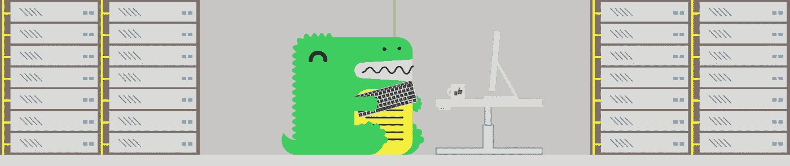
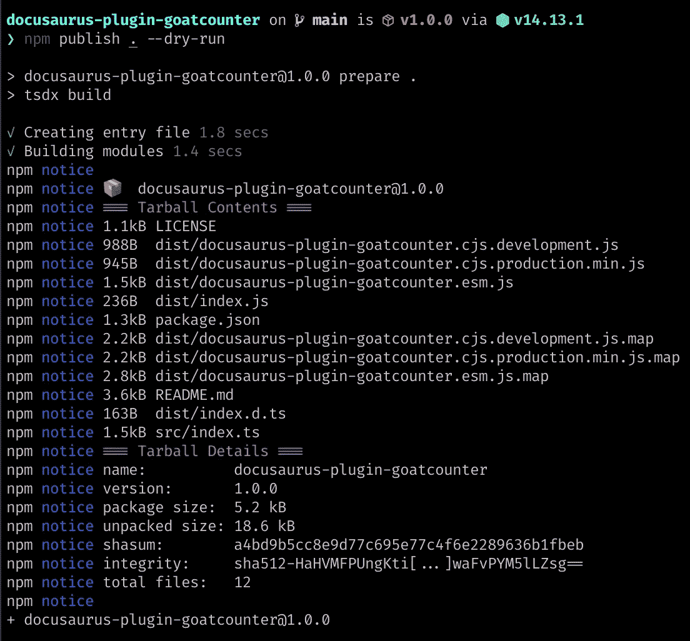

# 如何为 Docusaurus 构建一个插件

> 原文：<https://javascript.plainenglish.io/how-to-build-a-plugin-for-docusaurus-v2-dd54d627a94e?source=collection_archive---------14----------------------->

## 从零到插件

## 关于如何为 Docusaurus v2 构建和发布自己的插件的简要指南

在[声明](https://claimr.tools/)时，我们已经为我们的[开发者和文档网站](https://developer.claimr.tools/)使用 [Docusaurus v2](https://v2.docusaurus.io/) 有一段时间了。在使用了几个月后，我们可以自信地说，我们对自己的选择非常满意。

Docusaurus 附带电池，因此您可以立即获得大量价值，同时它足够灵活，如果您喜欢不同的东西，可以根据您的需求进行定制。此外，他们的文档是极好的，正如你所期望的，一个框架的存在归功于它创建文档网站的能力。



# docu-什么？

对于任何不熟悉 Docusaurus 的人来说，Docusaurus 是一个由脸书创建的开源框架，用于为他们所有的开源工具制作文档网站。如果您一直在从事一些 NodeJS 项目，那么您可能已经使用了由 Docusaurus 生成的[文档，仅举几个例子:](https://docusaurus.io/en/users) [Jest](https://jestjs.io/) 、 [Create React App](https://facebook.github.io/create-react-app/) 和 [Redux](https://redux.js.org/) 。

现在，脸书正在开发 Docusaurus 的下一代产品，名为 Docusaurus v2。这使得它成为一个高性能的静态站点生成器，可以快速创建各种类型的网站。对文档的支持仍然是一等公民，但是现在您可以自由地使用它来创建您想要的任何东西。官方上它仍然处于 alpha 阶段，但是根据我们的经验，它已经非常稳定了，脸书鼓励新项目采用 Docusaurus v2。

# 为什么我需要插件？

插件存在于 Docusaurus 生态系统中的主要原因是可重用性。有很多代码都有一个通用的目的，通过插件，你可以在这些项目之间共享这些代码。Docusaurus 使用插件将创建博客或文档页面的逻辑从核心 Docusaurus 中分离出来。插件也可以用来增加不直接面向用户的功能，例如，有官方插件可以优化图片，添加谷歌分析或创建网站地图。

官方插件非常有用，但是可能你的用例对它们不满意。在 ClaimR 的案例中，我们使用的是不同于 Google Analytics 的分析提供商。插件在这里非常有用，因为您可以使用它们在每个生成的页面中注入跟踪代码。

# 该过程

让我们先来看一下创建你自己的插件的过程，稍后我们将一步一步地来深入研究每一个插件。对于上下文，我们将遵循将 GoatCounter 分析添加到我们的文档中的过程，该文档现在位于 [npm](https://www.npmjs.com/package/docusaurus-plugin-goatcounter) 的**docusaurus-plugin-goat counter**中。查看官方插件的[源代码](https://github.com/facebook/docusaurus/tree/master/packages)对于如何实现适合你的用例的插件很有帮助。我们使用“@ docusaurus/plugin-Google-analytics”作为我们的起点。

1.  **本地原型** Docusaurus 允许你在与当前项目相同的源代码中创建一个插件。这让你可以试验并很快得到结果。
2.  **将插件移动到单独的代码库**引导一个新项目，Docusaurus 插件的代码库将位于其中。
3.  **发布你的插件**最后，我们将把你的插件发布到 NPM，这样你就可以把它包含在你所有的项目中了。

# 1.本地原型制作

Docusaurus v2 的文档[简要介绍了如何创建插件。那些指令的目标是在你当前的项目中直接创建一个新的插件。我们发现这大大降低了进入门槛，并允许快速实验。如果你正在构建一个大的插件，那么你可能想跳过这一步，从一个单独的代码库开始构建，因为这也会给你类型提示，因为我们将添加 TypeScript。](https://v2.docusaurus.io/docs/using-plugins#creating-plugins)

[这](https://github.com/ClaimR/developer-website/commit/28becd61873c3dc77566b5699e61b3289bbf38cd)是将 GoatCounter 分析的初始版本添加到我们的项目中的完整提交。这里我们将使用一个稍微简化的版本，这样我们可以专注于核心功能。对于不熟悉 GoatCounter 的人来说，我们需要插件将以下 HTML 添加到每个页面:

首先创建`plugins/goatcounter/index.js`并添加以下内容:

现在，在`docusaurus.config.js`中添加你的插件:

重启 Docusaurus，现在每个页面都应该将你的分析包含在 HTML 中了🎉。

# 2.创建独立插件

将插件放在与 Docusaurus 网站相同的代码库中可能更容易进行原型开发。但是，它不允许重用这段逻辑。另外，你的 Docusaurus 网站可能没有使用 TypeScript，我们可以将它添加到我们的插件项目中，为我们的插件提供类型提示。

为了引导我们的项目，我们将使用 [TSDX](https://tsdx.io/) ，它为我们建立了一个完整的 TypeScript 开发包。

```
npx tsdx create docusaurus-plugin-goatcounter
```

然后添加 Docusaurus 的类型。我们显式定义了所需的函数，因为“latest”标签不是最新的。最新版本见 [npm](https://www.npmjs.com/package/@docusaurus/types) 。

```
yarn add --dev @docusaurus/types@2.0.0-alpha.65
```

现在，您可以复制`plugins/goatcounter/index.js`的内容，并将其放在新项目的`src/index.ts`中。

因为我们要从普通 JS 迁移到 TypeScript，所以我们需要一些小的修改。替换这个来自`plugins/goatcounter/index.js`:

有了这个在`src/index.ts`:

为了测试你的插件，在你新创建的插件目录下运行`yarn build && yarn link`。然后在您的 Docusaurus 项目中，运行`yarn link docusaurus-plugin-goatcounter`并修改`docusaurus.config.js`以将插件作为包导入，而不是文件:

# 3.发布您的插件

发布你的插件就像运行`npm publish`并遵循它给出的步骤一样简单。



如果您之前将插件链接到了 Docusaurus 项目，那么您首先需要在 Docusaurus 项目中运行`yarn unlink docusaurus-plugin-goatcounter`。然后，您可以从 npm 添加依赖关系:

```
yarn add docusaurus-plugin-goatcounter
```

重启 Docusaurus，现在你可以使用你新做的独立 Docusaurus 插件🥳了。

# 解决纷争

不清楚的事？使用插件检查[插件](https://github.com/Addono/docusaurus-plugin-goatcounter)和 [Docusaurus 项目](https://github.com/ClaimR/developer-website)的源代码。此外，随时发送[电子邮件给我](mailto:hi@aknapen.nl)！

喜欢这篇文章吗？如果有，通过 [**订阅获取更多类似内容解码，我们的 YouTube 频道**](https://www.youtube.com/channel/UCtipWUghju290NWcn8jhyAw) **！**