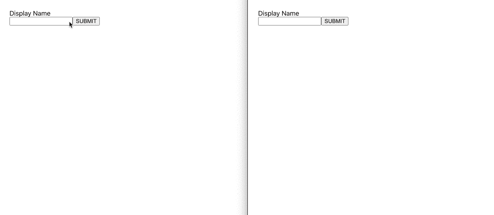

# 如何用 React Hooks 和 Socket.io 构建一个实时聊天应用

> 原文：<https://javascript.plainenglish.io/how-to-build-a-real-time-chat-application-with-react-hooks-and-socket-io-edfae30b3c5b?source=collection_archive---------8----------------------->

## 使用 React 和 Socket.io 构建实时应用的入门指南


Created by the author in [Canva](https://www.canva.com/)

web 应用程序的一些用例需要来自服务器的实时更新。一个这样的例子是聊天应用。如果你有多个用户在一起聊天，你可以从服务器刷新更新，但有一个更干净的解决方案，将更新从服务器推到用户界面。插座使这成为可能。幸运的是，我们开发人员有一个名为 Socket 的库。简化套接字工作的 IO。

在本文中，我们将浏览一个用 React hooks 和 Socket.io 构建的实时聊天应用程序的简单示例。这个示例应用程序将提供设置新的实时应用程序的快速指南，我将提供所有源代码。

# 项目设置

对于我们将要构建的示例项目，我们需要创建一个 Node.js 服务器和一个 React UI。首先创建一个新文件夹并初始化一个新项目，这样我们就可以在开始开发之前安装我们的依赖项。

***注意:*** *你可以全局安装 create-react-app，但是如果你改为用 npx 运行，它会自动抓取最新版本，你不用安装。*

```
$ mkdir socket-io-example-app
$ cd socket-io-example-app
$ npx create-react-app .
$ npm install socket.io express socket.io-client
```

接下来，我们将为 Node.js 服务器创建一个新文件，并添加以下代码。

随着项目的建立，我们希望在本地开发时能够并行运行 React 应用程序和 Node.js 服务器，并通过 React 应用程序代理 Node.js 服务器。我们将对 ***package.json*** 文件进行一些更新来完成这个任务。

现在，随着新脚本的设置和在文件末尾添加代理，我们可以使用以下命令在本地运行我们的应用程序进行开发。

```
$ npm run dev
```

这应该并行运行 React 应用程序和 Node.js 服务器。React 应用程序在 Node.js 服务器的端口 3000 和 3001 上运行。负责安排一切。现在我们可以继续写代码了。

# Socket.io 服务器

我们的 Socket.io 服务器实际上已经完成了大部分工作。我们需要添加的唯一额外代码是处理套接字上的传入连接。让我们打开我们的 ***index.js*** 文件，并更新它以反映以下内容。

您可以看到，这在服务器端只需要很少的代码就可以设置好。Socket.io 抽象出了套接字协议的所有难点，并把它们连接起来。我们为传入的客户端连接添加一个侦听器，在连接时，我们为消息添加一个事件处理程序，并将这些消息发送回所有现有的连接。

如果您需要做一些更复杂的事情，比如处理私人消息，connection 事件提供了一个 socket 对象，它有一个惟一的 id 字段来跟踪谁是谁。

# React 聊天应用

现在服务器已经设置好了，我们准备为聊天应用程序编写客户机代码。现在，这将是一个聊天应用程序的基本框架和非常丑陋的版本，但可以随意添加更多的 CSS 来使它看起来更好一些。但是现在，我们不会关心这个。

用户将有一个初始步骤来提供他们的显示名称，将其添加到他们的聊天消息中。一旦他们提供了显示名称，他们将被带到聊天窗口。

我们需要打开 App.js 文件，首先清除它，然后添加以下代码。

当这个组件装载时，我们添加一个事件监听器来监听来自服务器的新聊天消息。当我们收到一条消息时，我们把它附加到我们在状态中跟踪的先前收到的消息列表中。

每当用户点击 send 时，我们就将输入的文本发送到服务器，服务器是我们在上一节中设置的，用于将这些文本发送到所有现有的连接。

这就是我们需要启动并运行的所有代码。请看下面我们聊天应用程序的快速演示。



Screen capture by the author

# 包裹

这就是我们的聊天应用程序演示。我知道这是非常基本的，但是我想演示一下启动并运行一个实时聊天应用程序只需要多么少的代码。这并不总是容易实现的。您可以在这个聊天应用程序中实现更多功能，以下是一些想法:

*   当用户加入和离开聊天时发出通知。
*   当前活动用户的列表
*   私人信息
*   不同的房间或主题

感谢阅读，并在 Github 上查看完整的源代码示例！

[](https://medium.com/swlh/build-an-image-upload-application-with-react-nodejs-postgresql-and-s3-34fe13fbe572) [## 用 React、NodeJS、PostgreSQL 和 S3 构建一个图像上传应用程序

### 用 JavaScript 和 AWS 构建简单图像上传 web 应用程序的分步指南

medium.com](https://medium.com/swlh/build-an-image-upload-application-with-react-nodejs-postgresql-and-s3-34fe13fbe572) [](https://medium.com/swlh/beautiful-visualizations-with-react-and-recharts-76c7c51f926c) [## 美丽的可视化反应和再 charts

### 用历史股票数据反应和重新绘制示例

medium.com](https://medium.com/swlh/beautiful-visualizations-with-react-and-recharts-76c7c51f926c) [](https://medium.com/swlh/how-to-build-awesome-tables-with-react-table-963955fd9262) [## 如何用 React Table 构建超棒的表格

### React Tables 是构建带有排序、分页、CSV 导出等功能的表格的简单方法。

medium.com](https://medium.com/swlh/how-to-build-awesome-tables-with-react-table-963955fd9262) [](https://medium.com/swlh/how-to-incorporate-openlayers-maps-into-react-65b411985744) [## 如何在 React 中使用 OpenLayers 贴图

### 让我们把它画出来…

medium.com](https://medium.com/swlh/how-to-incorporate-openlayers-maps-into-react-65b411985744) [](https://github.com/mbrown3321/socket-io-example-app) [## MBR own 3321/socket-io-example-app

### 这个项目是用 Create React App 引导的。在项目目录中，您可以运行:在…中运行应用程序

github.com](https://github.com/mbrown3321/socket-io-example-app)