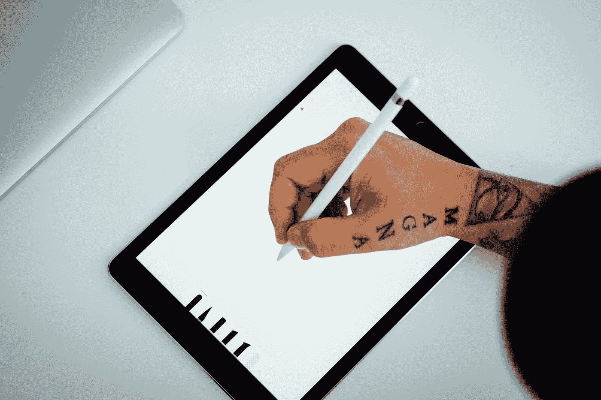
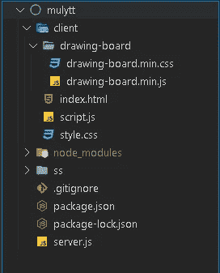

# 如何使用 Node 和 Socket.io 构建实时多用户画图 app

> 原文：<https://javascript.plainenglish.io/how-to-build-a-real-time-multiuser-drawing-app-using-node-and-socket-io-bdebc5df916?source=collection_archive---------2----------------------->



Photo by [Dose Media](https://unsplash.com/@dose?utm_source=medium&utm_medium=referral) on [Unsplash](https://unsplash.com?utm_source=medium&utm_medium=referral)

在本文中，我们将构建一个聊天应用程序，发送用户自制的图片，而不是简单的聊天消息。我们使用带有 Socket.io 的 Express 和 HTTP 服务器来实现实时功能，并在前端部分使用 **drawingboard.js** 和 jQuery 来保持简洁。这是我们将要构建的最终工作演示。


Working Demo of Drawing App

Github 仓库中与此 tut 相关的代码如下所示:

> [https://github . com/Mayank-MP05/real time-Drawing-Chat-NodeJS-SocketIO](https://github.com/Mayank-MP05/Realtime-Drawing-Chat-NodeJS-SocketIO)

我们首先构建后端，然后转到前端部分，在构建后端部分之前，我们应该知道的是我们要通过客户端-服务器连接交换的数据类型。

*我们使用图像数据 URI 作为字符串数据类型发送客户端到服务器，反之亦然。可以在这里阅读更多:* [*数据 URI 方案*](https://en.wikipedia.org/wiki/Data_URI_scheme)

# 后端

首先，确保您已经安装了 node.js 和 npm，并且正在使用 CLI 启动 npm 项目并安装必要的依赖项

```
npm init -ynpm install express socket.io
```

首先，我们导入了所有库 Express HTTP 和 Socket IO。我们将静态设置到客户端文件夹，以便根据请求为静态前端提供服务。在套接字连接时，我们检查绘图数据 URI 是否由用户发出，并通过服务器将其重新发送给所有连接的用户。最后，我们开始监听指定端口上的服务器

恭喜你！您已经完成了后端部分。这是最起码的

# 前端

前端部分是客户端部分，它有一堆样式标记和脚本文件。我想解释一下核心机制、插座和画板，所以如果你想参考样式，你可以访问我上面提到的 Github 库中的代码。



Folder Structure for Project

客户端文件夹有一个包含库 CSS 和 JS 文件的画板文件夹。**index.html**用于基本标记文件。样式保存在 **style.css 中**客户端 socket 和画板的核心逻辑保存在 **script.js 中**另外，我们使用的是 jQuery bootstrap 和 socket.io 客户端使用的是 CDN。

第一个任务是在**index.html**中链接所有这些文件和 cdn，在结束 body 标签之前链接所有的样式和 CSS 文件到 head section 和 JS 文件中，然后你的空 HTML 文件看起来像这样:

设置好所有的链接后，下一个任务是给文件添加一些标记和样式，现在我不打算在这里详细解释样式，只是需要注意的是，样式是用来固定画板和导航条的位置，宽度和颜色很少

这是添加标记 UI 后的代码快照，我们添加了非常基本的导航栏，然后是一个消息容器，在底部的画板上有一个发送 DWG 按钮

让我们移动客户端 JS 部分

*抱歉错别字！*

上面使用的是 jQuery once 自动执行语法，你在函数体中写的任何东西都在开始时执行一次。首先，我们创建了一个 ***IO*** 类的实例作为 ***socket*** 并使用 param 提供的 div 的 ID 初始化画板

我们向按钮添加了一个点击事件(jQuery 中的`*click()*`),每当用户按下 send dwg 按钮时，该代码就会在该函数中执行。我们首先使用在 **drawing-board.js** 中预定义的`*.getImg()*` 函数获取画板图像的图像数据 URI，然后使用 socket IO 客户端发出函数发出该图像数据 URI 字符串。

当我们发送图像时，我们使用`*resetBackground(*` ***)*** 方法将背景重置为空白。

此外，由于服务器发出“drawing ”,我们必须将其映射到 UI，因此我们使用了`*on(“drawing”)*`方法，并将图像作为列表对象附加到消息容器中

简单！前端部分到此为止。

这是一个非常简单的例子，说明如何使用 socket.io 来构建到客户端的实时连接，并实时交换数据