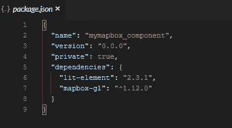
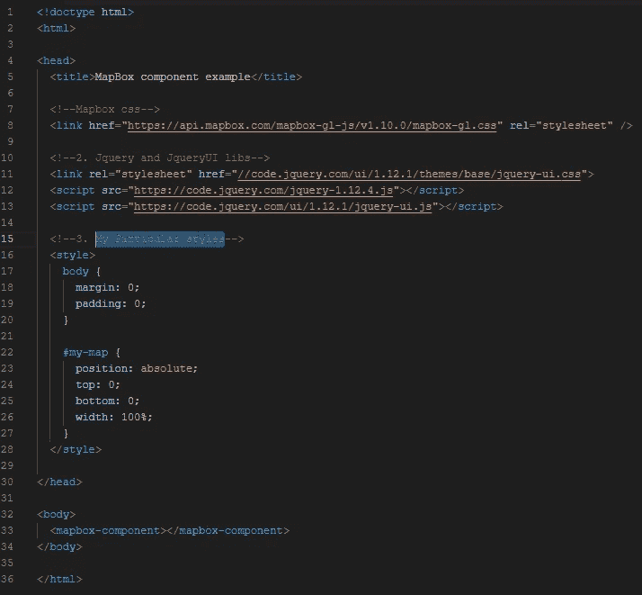
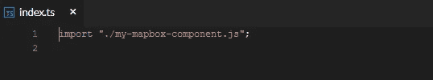
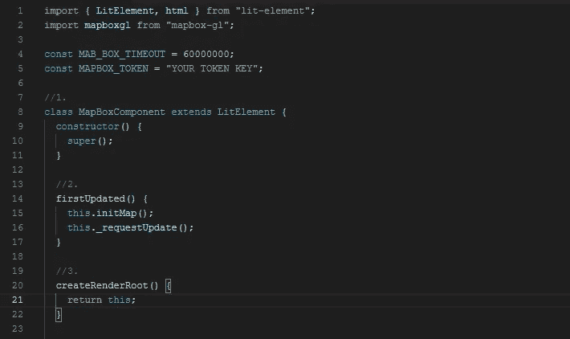
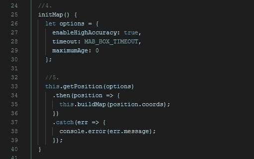
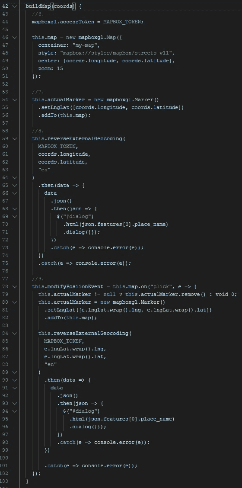
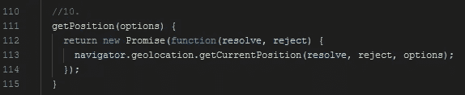
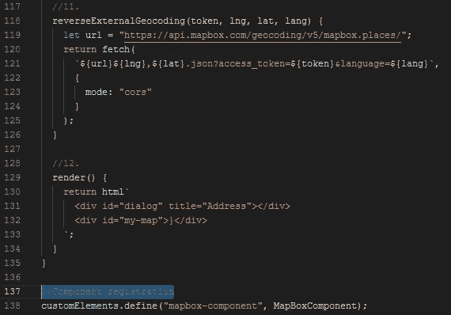
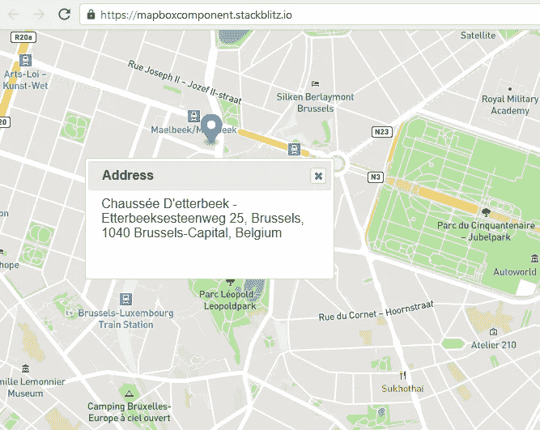

# 如何构建可重用的地理定位和反向地理编码 Web 组件

> 原文：<https://javascript.plainenglish.io/how-to-build-a-reusable-geolocation-reverse-geocoding-web-component-d18bd7892a5e?source=collection_archive---------16----------------------->

## 通过几个简单的步骤和使用网络标准


在这篇小文章中，将向您展示如何构建一个简单的网页，该网页将自动定位您的位置，将其绘制在地图上，并向您显示对应于地图坐标的文本地址。

首先，我们来定义一些术语:

**地理定位**识别或估计一个物体的真实地理位置，比如一栋建筑或一部手机。

**地理编码**是获取输入文本(如地址或地名)并返回该地点在地球表面的纬度/经度位置的过程。

**反向地理编码**是将地址(如“10 Downing Stree**”**)转换成他的经纬度地理坐标的过程，你可以用它在地图上放置标记或定位地图。

澄清了前面的术语后，我们将需要以下内容来构建我们的位置页面:

*   [地图盒](https://www.mapbox.com/)用于地图。如果您有一个免费的 API 令牌来使用他的 API，那会很有帮助。
*   基本的 JavaScript 知识。
*   [Jquery](https://jquery.com/) 和 [JqueryUI](https://jqueryui.com/dialog/) 显示所选地址的对话框。如果不想使用 Jquery，可以使用“alert”。
*   我们将使用一个 [JS 在线版](https://stackblitz.com/) r 来尝试它(可选)。在文章末尾的参考资料中，我留下了一个在本教程中创建的 web 应用程序的链接。
*   我们将使用 [LitElement](https://medium.com/javascript-in-plain-english/build-a-reusable-pagination-web-component-with-bootstrap-4-and-litelement-63ff4eebda4b) 来构建一个 Web 组件。LitElement 是*遵循* [*Web 组件标准*](https://developer.mozilla.org/en-US/docs/Web/Web_Components) *规范的简单实现。*

# 步伐

我们将构建一个 npm 项目，所以首先，我们需要创建我们的 package.json 文件。如果你用的是像[https://stackblitz.com/](https://stackblitz.com/)这样的 JS 在线编辑器，就不需要这么做了。否则，您需要在计算机上安装 nodejs，并安装必要的脚本来构建和服务您的应用程序。

```
$npm init
```

## 配置 package.json 文件



package.json file

该文件包含我们项目的配置以及我们将使用的库和脚本。

名称:包的名称。必须是小写字母和一个单词，但可以包含连字符和下划线。

版本:包的版本。当我们在存储库上发布我们的模块时，我们使用它。

Private:如果在 package.json 中将“private”设置为 true，那么 npm 将拒绝发布它。

依赖关系:项目依赖关系。我们将使用 litElement 依赖项为地图构建 Web 组件和 mapbox-gl 库。

## 创建包含组件的 HTML 模板



index.html file

1.  我们在应用程序中添加了 Mapbox 使用的样式。
2.  在这一步中，我们导入了 Jquery 和 JqueryUI 库，我们将使用它们来显示一个窗口对话框。这是可选的，您可以用一个本地 JavaScript 警告替换这个对话框。
3.  在这里，我们定义了地图容器将使用的样式，以便它占据整个页面。

## 导入组件

因为我使用的是 stackblitz 在线编辑器，所以我将使用 index.ts 文件来导入组件。



Import my-mapbox-component image

## 构建 Web 组件



my-mapbox-component.js part 1.

1.  我们将使用 litElement 来构建 Web 组件，所以我们要做的第一件事是扩展 LitElement 类。
2.  第一次呈现 Web Component 时，我们调用 initMap 函数，然后刷新 Web 组件来显示它。
3.  如果我们想要使用我们的样式，在本例中，为了呈现 Mapbox 元素，LitElement createRenderRoot 函数是必需的。



my-mapbox-component.js part 2.

4.我们定义了地图的特征:这里是精度和有效时间。

5.在这一步中，我们获得浏览器的位置，当我们获得它时，我们调用我们的 buildMap 函数。给我们的浏览器适当的位置许可是必要的。这个例子已经在 Firefox 中测试过了。



my-mapbox-component.js part 3.

6.我们使用从[地图框](https://www.mapbox.com/)网页获得的令牌，并创建了地图。

7.我们用当前位置创建标记，并将其绘制在地图上。

8.我们调用 Mapbox API 来获取所获得的坐标的地址。当我们有了地址，我们显示一个对话。

9.我们为地图上的事件“click”创建了一个监听器。这帮助我们移动位置标记，并向我们显示一个带有更新地址的新对话框。



my-mapbox-component.js part 4.

10.这是我们创建的一个帮助器函数，用于使用浏览器获取位置。



my-mapbox-component.js part 5.

11.这是我们创建的另一个辅助函数，用于反向地理编码。

12.这是呈现组件的 LitElement 函数。

# 结果



Our component.

# 结论

这篇文章展示了如何创建一个显示我们位置的地图组件。您还可以更改标记，并获取地图上您单击的任何点的地址。现在，您可以在项目中任意多次重用该组件。

请随意复制并改进它，因为它只是展示如何构建地理定位 Web 组件的初级版本。

开始改进代码的一点是使用 [async/await](https://medium.com/javascript-in-plain-english/javascript-a-fast-trip-for-dummies-from-callbacks-to-es6-async-await-a61b0a4b0bed) 使代码更具可读性。

我创建的组件的[演示和代码](https://stackblitz.com/edit/mapboxcomponent)。

感谢你阅读我！保重。