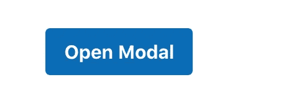

# 如何构建一个可重用的 Vue 模型

> 原文：<https://javascript.plainenglish.io/how-to-build-a-reusable-vue-js-modal-5f65017e190b?source=collection_archive---------0----------------------->

## 如何构建一个可重用的 Vue 模型，但具有一些高级功能

## 介绍

以前，我写过一篇关于如何构建可重用 Vue 模型的文章，那是一年前的事了。我很感激很多人读了它，虽然它有点太初级了。今天，我想教大家如何建立一个可重用的 Vue 模型，但有一些先进的功能。

我们要构建的是一个具有多种支持的可重用模态组件。

*   基于组件的
*   在根 DOM 中呈现
*   使用 slot 来呈现内容
*   添加可滚动内容的选项
*   按 escape 键退出模式
*   动画过渡

让我们深入研究如何构建它。

# 构建一个 HTML/CSS 模板

首先，让我们为我们的模态组件创建一个新文件，并将其命名为`BaseModal.vue`

因为，我已经准备了一些在 HTML 和 CSS 中使用的模板，让我们把它添加到我们的模态组件中，并在我们的页面中呈现它。

# 创建一个按钮来触发模式

酷毙了。让我们添加一个方法来控制模态的可见性。我将用方法`openModal`添加一个新的按钮，并添加一个新的状态调用`this.isShowModal`。每当用户点击按钮时，就会反转`isModalOpen`值。

酷毙了。所以我们来添加一个关闭模态的方法。我们希望当用户按下 x 标记或取消按钮时，它将关闭模态。

在模态组件中，添加一个名为`handleClose`的新方法，它将触发监听`close`监听器的父组件。

在容器组件中，我们将添加监听器调用`close`，它将触发我们刚才构建的`toggleModal`方法。

# 使用 Vue 门户

看起来一切都很顺利。为了更加灵活，让我们在容器 DOM 之外呈现这个模态。既然我们在处理绝对位置，就给它渲染减少摩擦。

我们将使用一个名为 vue Portal—[GitHub—Linus Borg/Portal-Vue 的库:一个功能丰富的 Vue 门户插件，用于在组件之外、我们的应用程序或整个文档的任何地方呈现 DOM。](https://github.com/LinusBorg/portal-vue)

让我们安装`vue-portal`

`npm i portal-vue yarn add portal-vue`

在您的`main.js`中添加依赖项

将门户添加到您希望呈现模式的位置。在这种情况下，我将在根 Vue 组件中呈现它— `App.vue`

要使用它，用`<portal-target></portal-target>`包装我们的模态组件

现在，我们的模型已经呈现在门户中。是不是太酷了😎

# 添加属性支持

让我们将道具支持添加到我们的模型中。作为一名开发人员，我希望这个模态组件能够改变模态标题和其中的内容。

让我们在模态组件中添加 props 参数。

若要使用它，请传递

# 狭槽

现在，我们想显示模态体内部的内容——我们想通过使用槽来实现。有两个槽；我们要用它。

1.  模态体
2.  模态页脚

我们希望 modal 能够预览主体中的任何内容，并为 submit 按钮添加一个功能。我们将使用`<slot></slot>`作为模态主体，使用`<slot name="footer"></slot>`作为模态页脚。

要使用它，我们只需像这样传递`<base-modal>`组件中的内容。

# 可滚动

现在，我们有了一个函数模态组件。假设我们的内容页面很长。所以，我们想增加一些功能来增加可滚动的选项。

在模态组件中，我们添加一个数据类型为`Boolean`的新道具调用`scrollable`，并将其设置为默认值`false`。

让我们为可滚动内容添加一个新的样式。我将添加这个名为`.scrollable`的类

为了使用它，我们将检查可滚动的属性。如果`scrollable`为真，那么我们将把这个类添加到我们的内容中。我们将使用类绑定来实现它。

酷毙了。现在，我们也可以在带有可滚动道具的槽中添加一个长内容。它工作正常👏🏻。

# 键盘绑定

让我们添加另一个强大的功能。如果我们按下`escape`键，我们将关闭该模式。

首先，我们需要按下键盘听一个事件。所以，在模态组件中，让我们将它添加到`created`和`destroyed`生命周期中。

当我们不使用侦听器时，不要忘记删除它。这里发生的事情是，每当`keyup`被触发时，它将被调用一个名为`onClose`的方法。我们来补充一下这个方法。

我们可以通过使用`event`参数来读取事件。由于`escape key`按钮是 27，我们将对其进行过滤。如果 keycode 是 27，那么它将触发`handleClose`方法，关闭我们的模态。

# 过渡

让我们在打开和关闭模态时添加一个漂亮的过渡。幸运的是，Vue 已经有了一个过渡元素，我们将使用它。只需用`<transition name=“fade”></transition>`包裹模态组件

将`fade` CSS 也添加到组件中

因此，在打开和关闭期间，您将有一个很好的过渡。

# 源代码

*BaseModal.vue*

*App.vue*

如果您对这个模型中添加的特性感兴趣，或者对下一篇文章有什么想法，请告诉我。请随时联系 [@jakzaizzat](https://twitter.com/jakzaizzat)

完整源代码可在此获得—[https://github.com/jakzaizzat/blog-snippet](https://github.com/jakzaizzat/blog-snippet)

原文发表于—[https://jakzaizzat.com/vue-modal](https://jakzaizzat.com/vue-modal)