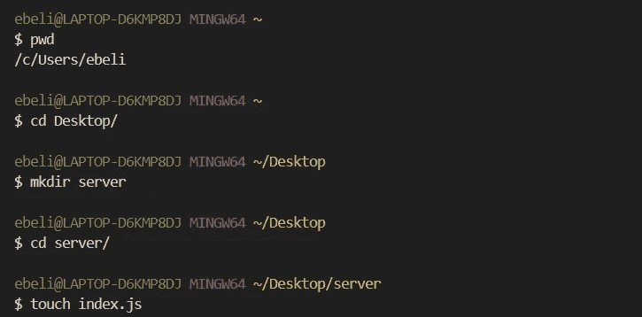
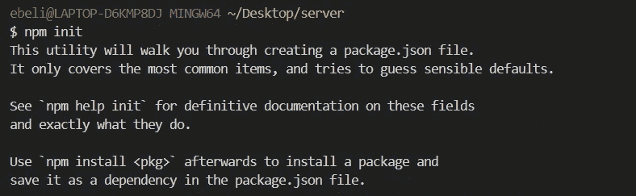
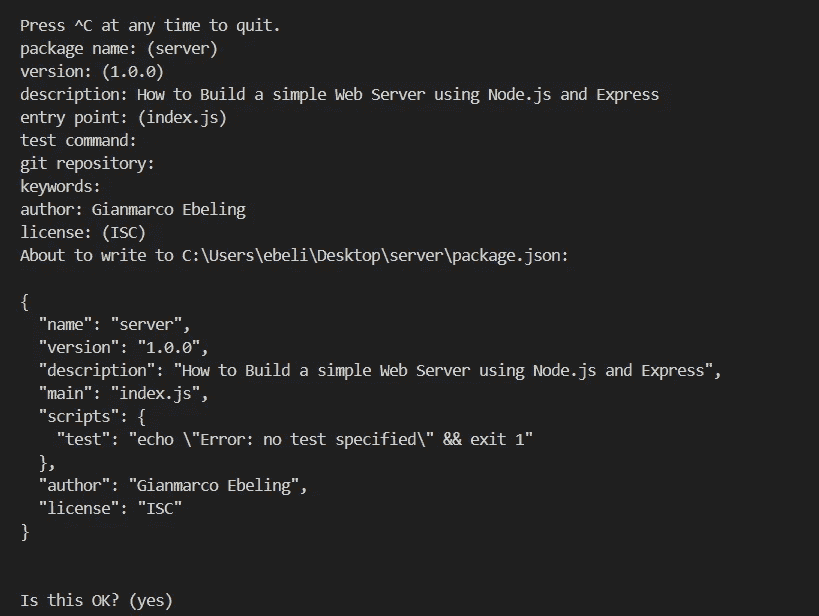
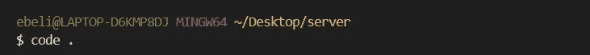
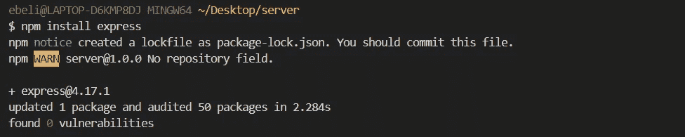
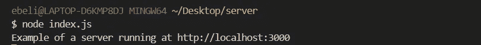
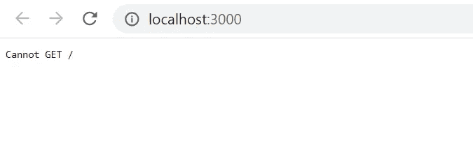

# 如何使用 Node.js 和 Express 构建一个简单的 Web 服务器

> 原文：<https://javascript.plainenglish.io/how-to-build-a-simple-web-server-using-node-js-and-express-b945b22fe9bb?source=collection_archive---------5----------------------->

## 用**最流行的后端技术**从头开始建立一个本地**网络服务器**


Photo by [Bruno Figueiredo](https://unsplash.com/@bfigas?utm_source=unsplash&utm_medium=referral&utm_content=creditCopyText) on [Unsplash](https://unsplash.com/s/photos/fast-train?utm_source=unsplash&utm_medium=referral&utm_content=creditCopyText)

# 在我们开始之前

在本文中，我们将使用 **Node.js、Express、**和**命令行构建一个简单的 web 服务器。**对于不熟悉这些技术的读者，在开始之前请快速阅读本简介:

*   **Node.js** 是一个在网络浏览器之外执行 JavaScript 的 JavaScript 运行时环境。它已经成为最常用的后端技术之一。安装时从 [**Nodes.js 网站下载 **LTS 版**。**](https://nodejs.org/en/)
*   [**Express**](https://expressjs.com/) 是一个极小的 Node.js 框架。使用 Node.js 构建 web 应用程序时，编写 DRY 代码很有帮助。我将在后面的文章中展示如何安装这个框架。
*   [**命令行**](https://www.learnenough.com/command-line-tutorial/basics) 是我们告诉计算机执行所需任务的地方。我们可以打开操作系统附带的命令行(Windows 中的**命令提示符**、macOS 中的**终端**)或者下载终端应用程序。我将使用**[**Hyper**](https://hyper.is/)**、**一款基于 HTML/CSS/JS 的完全可定制的终端。**

# **让我们设置这个服务器！**

**一旦我们在机器上安装了 Node.js，我们就可以构建简单的服务器了。**

**首先，我们将使用**命令行**在桌面上创建一个**新文件夹**和一个**新 JavaScript 文件**:**

*   **首先，打开终端。要知道我们在哪个目录中，我们可以键入`pwd` ( *打印工作目录*)。如果我们还没有在桌面上，我们可以用`cd Desktop/`改变目录。**
*   **创建新的文件夹类型`mkdir`和文件夹的名称。我会称我的 ***为“服务器”。*****
*   **现在，让我们再次更改目录，在新文件夹中，我们可以创建一个名为`index.js`的新 JavaScript 文件。在这种情况下，我们将使用`touch`命令。**

****

**现在，我们必须设置 [**NPM**](https://www.npmjs.com/) ，这是一个外部模块的包管理器。NPM 代表**节点包管理器**，它是目前世界上最大的软件注册中心。**

*   **我们初始化 NPM 打字`npm init`。**

****

*   **现在我们建立我们的 NPM。我们可以决定包的名称、项目的版本、描述和入口点(这是指我们的主 Javascript 文件，在我们的例子中是`index.js`)。我们可以忽略其他设置并点击回车，直到我们创建了 **package.json.****

****

**让我们在文本编辑器中打开我们的项目。在命令行中这样做的快捷方式是简单地键入文本编辑器的名称(例如 Atom ),后跟一个点。**

*   **我将在 ***Visual Studio 中打开项目代码*** 键入`code .`**

****

**我们现在准备安装 express。**

*   **类型`npm install express`。**

****

**下一步是转到我们的 JavaScript 文件，并需要“express”包。然后我们可以创建一个名为`app`的新常量，它被设置为等于`express`。现在我们可以使用它的一个方法，叫做`listen`。这告诉`app`监听发送到我们服务器的任何 HTTP 请求的特定端口。端口就像是我们将服务器调谐到的频道。对于这个例子，我选择了端口 3000。接下来，让我们给这个方法添加一个回调函数来控制一条消息:“*在*[*http://localhost:3000*](http://localhost:3000)运行的服务器的示例”。**

**现在我们可以保存文件并在命令行中键入`node index.js`。这将打印出我们的消息并启动服务器。**

****

**我们刚刚创建了我们的 **Web 服务器！****

**现在的问题是如果我们去 [http://localhost:3000](http://localhost:3000) ，会显示错误:`cannot GET /`。**

****

**我们必须编写一些额外的代码，以便当浏览器向服务器发出请求时，服务器能够做出响应。首先，让我们用 ***ctrl + C*** 停止服务器，并再次打开我们的`index.js`。**

**我们现在必须向这个 JS 文件添加几行代码。就在`app.listen`上面，我们还要加上`app.get`。该方法允许我们指定当浏览器发出 ***get 请求*** 并与我们的服务器取得联系时应该发生什么。**

```
app.get ('/', (req, res) => {
  res.send('Hello! Everything is working fine!')
})
```

**第一个参数是 get 请求的位置。转到 [http://localhost:3000](http://localhost:3000) ， ***get 请求*** 正在发送到我们网站的路由，用***“/”表示。*****

**现在，当***get 请求*** 发生时，我们可以触发一个回调函数，该函数将有两个参数:*请求*和*响应*。所以目前我们的服务器没有任何反应。我们可以使用`send`方法发送一个响应，它将是文本:*“你好！一切正常！”。***

**让我们保存文件，并在命令行中使用`node index.js`再次运行服务器。**

**现在，如果我们去 [http://localhost:3000](http://localhost:3000) ，**我们终于得到了我们的消息！****

****

**如果你需要的话，这里是`index.js`文件的完整代码:**