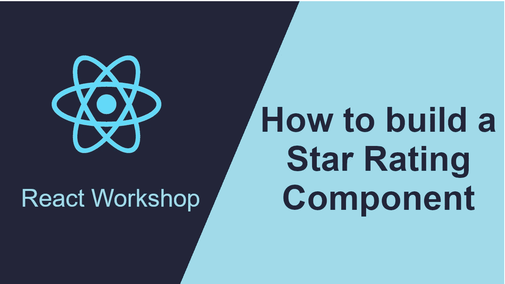
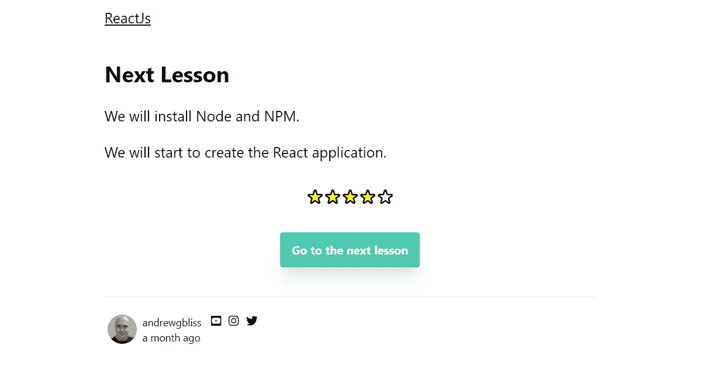

# 如何在 React 中构建星级组件

> 原文：<https://javascript.plainenglish.io/how-to-build-a-star-rating-component-in-react-dad06b05679b?source=collection_archive---------3----------------------->



如果你正在开发一个博客或 CMS，你可能希望用户能够对文章或产品进行评级。这将使你能够根据产品的受欢迎程度来推荐产品。

本文将介绍如何使用 Codepen 在 React 中构建一个开始评级组件。

如果你想直接进入代码，下面是代码笔:

Star Rating Component in React

因此，如果您是 React 新手或喜欢了解如何使用功能组件，现在让我们一步步来。

首先让我们前往 *https://heroicons.dev* 并挑选一个星形图标。

[](https://heroicons.dev/) [## 免费开源 SVG 图标库

### 新的麻省理工学院开源 SVG 图标库由史蒂夫·舒格设计。实心和笔画变体，一键复制粘贴，以及…

heroicons.dev](https://heroicons.dev/) 

```
function StarIcon(props) {
  const { fill = 'none' } = props;
  return (
    <svg class="w-6 h-6" fill={fill} stroke="currentColor" viewBox="0 0 24 24" ae mh" href="http://www.w3.org/2000/svg" rel="noopener ugc nofollow" target="_blank">http://www.w3.org/2000/svg"><path stroke-linecap="round" stroke-linejoin="round" stroke-width="2" d="M11.049 2.927c.3-.921 1.603-.921 1.902 0l1.519 4.674a1 1 0 00.95.69h4.915c.969 0 1.371 1.24.588 1.81l-3.976 2.888a1 1 0 00-.363 1.118l1.518 4.674c.3.922-.755 1.688-1.538 1.118l-3.976-2.888a1 1 0 00-1.176 0l-3.976 2.888c-.783.57-1.838-.197-1.538-1.118l1.518-4.674a1 1 0 00-.363-1.118l-3.976-2.888c-.784-.57-.38-1.81.588-1.81h4.914a1 1 0 00.951-.69l1.519-4.674z"></path></svg>
  );
}
```

这是我将用于星级评定的 *StarIcon* 组件。除了需要传入 fill 属性之外，没有什么特别的东西。使用 SVG，我们可以传递填充颜色。这使得当我们悬停在*星星图标*上时，可以用黄色渲染星星，当我们不悬停在上面时，我们可以不填充。我默认填充属性为无。

现在让我们来看一遍比赛。

```
function RatingIcon(props) {
  const {
    index,
    rating,
    hoverRating,
    onMouseEnter,
    onMouseLeave,
    onSaveRating,
  } = props; const fill = React.useMemo(() => {
    if (hoverRating >= index) {
      return 'yellow';
    } else if (!hoverRating && rating >= index) {
      return 'yellow';
    }
    return 'none';
  }, [rating, hoverRating, index]); return (
      <div 
        className="cursor-pointer"
        onMouseEnter={() => onMouseEnter(index)} 
        onMouseLeave={() => onMouseLeave()} 
        onClick={() => onSaveRating(index)}>
        <StarIcon fill={fill} />
      </div>
  )
}
```

因此，该组件将从 props 中获取一个索引，指示我们正在悬停或单击的星星。它将接受我们给它的实际评分，以及悬停评分，即我们当前悬停的当前指数。然后，当我们悬停在星星上或点击星星时，我们会触发一些事件， *onMouseEnter* ， *onMouseLeave* ，以及*on average*。

为了计算填充颜色是否是黄色，我取悬停等级并检查它是否大于或等于当前指数。例如，如果悬停等级为 3，则 1、2 和 2 将变为黄色。然后，如果没有悬停评级，而有一个设置评级，我运行相同的逻辑。因此，当您单击并设置真实评级时，当您将鼠标从组件上移开时，它会保存该评级。

现在让我们来看看容器组件。

```
const App = () => {
  const [rating, setRating] = React.useState(0);
  const [hoverRating, setHoverRating] = React.useState(0);
  const onMouseEnter = (index) => {
    setHoverRating(index);
  };
  const onMouseLeave = () => {
    setHoverRating(0);
  };
  const onSaveRating = (index) => {
    setRating(index);
  };
  return(
    <div className="box flex">
      {[1, 2, 3, 4, 5].map((index) => {
        return (
          <RatingIcon 
            index={index} 
            rating={rating} 
            hoverRating={hoverRating} 
            onMouseEnter={onMouseEnter} 
            onMouseLeave={onMouseLeave} 
            onSaveRating={onSaveRating} />
        )
      })}
    </div>
  );
}
```

因此，我设置了两个需要跟踪的状态，一个是当有人点击一颗星并对该项目进行评级时的真实评级，另一个是当有人悬停在某个项目上想要对其进行评级时的悬停评级。然后我设置我的事件，当触发 *onMouseEnter* 事件时设置悬停等级。当触发 *onMouseLeave* 事件时，我重置悬停评级，当触发*on averaging*事件时，我保存他们点击的评级。

我设置了一个从 1 到 5 的数组，并用正确的索引、状态和事件创建了一个 *RatingIcon* 组件。

这是针对前端的，但是您可以很容易地调用 API 并根据 id 获取当前评级，或者在用户登录时创建、更新评级。选择是无限的。

这是我的训练博客使用星级的截图。



https://entryleveldeveloper.training

Entry Level Developer Training