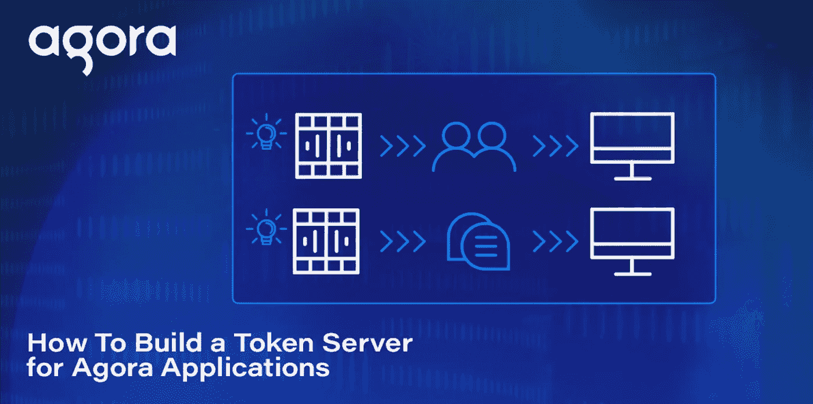
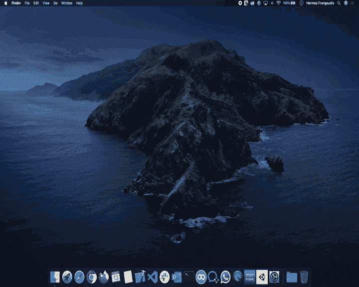
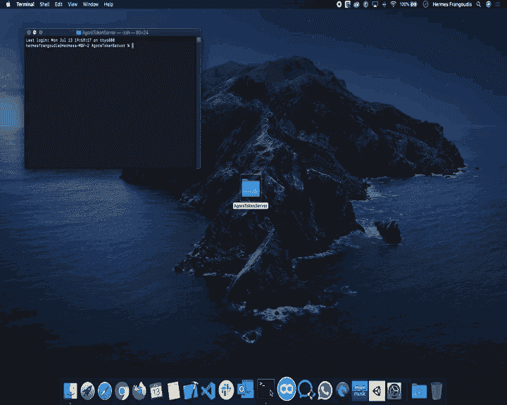
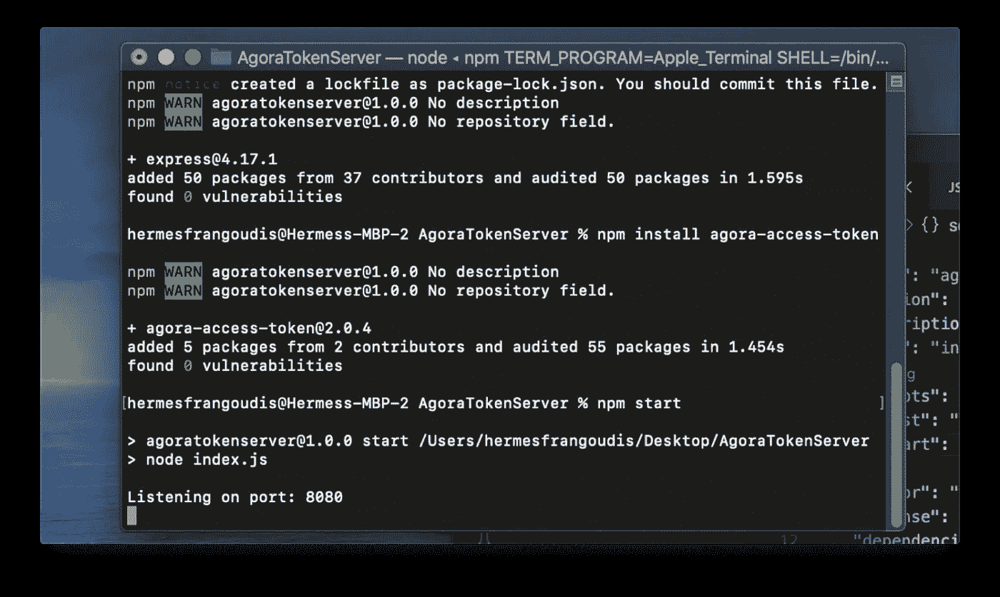
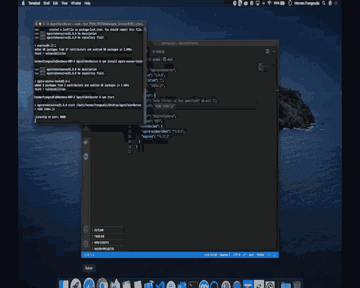

# 如何使用 NodeJS 为 Agora 应用程序构建令牌服务器

> 原文：<https://javascript.plainenglish.io/how-to-build-a-token-server-for-agora-applications-using-nodejs-c08259479c22?source=collection_archive---------4----------------------->



视频聊天应用的安全性是目前的热门话题。随着远程工作和虚拟事件越来越多，对安全性的需求也会增加。

在 [Agora 平台](https://www.agora.io/?utm_source=medium&utm_medium=blog&utm_campaign=How_to_Build_a_Token_Server_for_Agora_Applications_using_NodeJS)中，一层安全以令牌认证的形式出现。对于那些不知道的人来说，令牌是一个使用一组给定输入生成的动态密钥。Agora 的平台使用令牌来认证用户。

Agora 为其 RTC 和 RTM SDKs 提供令牌安全性。本指南将解释如何使用 [NodeJS](https://nodejs.org/en/) 和 [Express](https://expressjs.com) 构建一个简单的微服务来生成 Agora RTC 令牌。该示例可以很容易地修改为包括 RTM 令牌，因为它遵循类似的模式。

# 先决条件

*   基本了解 JavaScript ES6、 [NodeJS](https://nodejs.org/en/) 和 [NPM](https://www.npmjs.com)
    ( *所需的最少知识*)
*   了解 express web 服务器如何运行
    ( *所需的最少知识*)
*   [Agora 开发者账户——在此注册](https://sso2.agora.io/en/signup?utm_source=medium&utm_medium=blog&utm_campaign=how-to-build-a-token-server-for-agora-applications-using-nodejs)

# 项目设置

为了开始我们的项目，我们将创建一个新文件夹，并在该文件夹中打开一个终端窗口。



I named my folder AgoraTokenServer

在终端中，我们将运行`npm init`来设置节点项目。将出现创建项目提示。我使用了默认设置，但是可以随意定制这一部分。

现在项目已经创建好了，我们可以添加我们的 NPM 依赖项(`[express](https://www.npmjs.com/package/express)`和`[agora-access-token](https://www.npmjs.com/package/agora-access-token)`)，使用:

```
npm install express
npm install agora-access-token
```



# 构建 Express 服务器

现在项目已经设置好了，在您喜欢的代码编辑器中打开文件夹。查看`package.json`，您会注意到入口文件是`index.js`，但是这个文件在我们的项目中不存在，所以我们必须创建一个新文件，并将其命名为`index.js`。

在`index.js`中，我们将从要求我们的模块开始。从`express`开始，我们将需要`express`对象，从`agora-access-token`开始，我们将利用 ES6 的[析构赋值](https://developer.mozilla.org/en-US/docs/Web/JavaScript/Reference/Operators/Destructuring_assignment)来提取对`RtcTokenBuilder`和`RtcRole`对象的引用。

```
const express = require('express');
const {RtcTokenBuilder, RtcRole} = require('agora-access-token');
```

让我们为用于监听请求的`**PORT**`号定义常数，我喜欢用 8080。我们还将为我们的 Agora `**AppID**`和`**AppCertificate**`定义常量，我喜欢使用环境变量，所以我们不会在代码中暴露这些值，但是您也可以将这些值设置为包含您各自的 Agora 关键字的*字符串*。

```
const PORT = 8080;const APP_ID = process.env.APP_ID;
const APP_CERTIFICATE = process.env.APP_CERTIFICATE;
```

接下来，我们将定义我们的`app`常量，它将实例化我们的`**Express**`对象，并允许我们设置我们的服务器。

```
const app = express();
```

在我们为 Express 服务器设置`*GET*`端点之前，我们需要定义当端点被访问时调用的函数。第一个函数(`**nocache**`)将应用响应头，强制浏览器永远不缓存响应，这样我们就能确保总是获得新的令牌。你会注意到我们在最后调用了`next()`方法，因为这个函数是系列中的第一个中间件函数，所以我们需要调用`next()`让 Express 知道继续系列中的下一个中间件函数。

第二个函数(`**generateAccessToken**`)将处理请求并返回 *JSON* 响应。我们现在将定义函数，并在完成设置`Express`服务器后添加主体。这是系列中的最后一个函数，所以我们不需要`**next**`参数/函数。

```
const generateAccessToken = (req, resp) => { };
```

让我们定义一个`GET`端点，传入`**nochache**`和`**generateAccessToken**`函数。

```
app.get('/access_token', nocache, generateAccessToken);
```

作为创建 Express 服务器的最后一步，我们将实现`.listen()`方法，并在服务器准备好并监听给定端口后传入`**PORT**`和一个回调。

# 生成广场令牌

现在我们已经有了我们的 Express 服务器设置，我们准备添加功能到`**generateAccessToken**`功能中。我们将从设置响应头开始，以确保我们不会遇到任何 CORS 问题。

```
resp.header('Access-Control-Allow-Origin', '*');
```

## 获取查询参数

接下来，我们将检查`channelName`查询参数。这是一个必需的参数，因此如果 channelName 未定义，我们需要返回一个带有 *500* 响应代码的错误和一个带有错误的 *JSON* 对象。

```
const channelName = req.query.channelName;if (!channelName) {
  return resp.status(500).json({ 'error': 'channel is required' });
}
```

接下来的几个参数(`**uid**`、`**role**`、`**expirationTime**`)不是必需的，所以我们将根据需要分配默认值。

对于`**uid**`,我们将默认值设置为`0`,这允许我们生成一个“*通配符*”令牌，该令牌可用于将给定的*通道*与任何`**uid**`连接起来。这仅适用于安全性较低的情况(*或在开发过程中*)，在这种情况下，所有用户可以共享一个令牌。

低安全性情况的一个例子是现场直播，任何人都可以作为观众加入并观看。

对于`**role**`，我们将默认每个用户为`SUBSCRIBER`，并且只检查请求是否传递了值`publisher`，否则任何其他值都可以忽略。

> **请注意:**Agora 平台默认只强制特权。这是加入频道特权，要启用其他特权，您需要通过 [Agora 支持](https://agora-ticket.agora.io)提出请求。

对于`**expirationTime**` ，我们将默认为`3600`秒，这给用户一个小时的时间在权限到期前加入频道。关于到期时间需要注意的一点是，令牌的特权生存期需要是一个整数，表示自 1970 年 1 月 1 日以来的时间。我们将使用当前时间，并添加我们的到期时间。

## 构建令牌

现在我们已经拥有了令牌的所有元素，我们准备使用`RtcTokenBuilder`对象的`buildTokenWithUid`来生成令牌。

```
const token = RtcTokenBuilder.buildTokenWithUid(APP_ID, APP_CERTIFICATE, channelName, uid, role, privilegeExpireTime);
```

## 返回响应

生成令牌的最后一步是返回包含令牌的 JSON 响应。

```
return resp.json({ 'token': token });
```

# 测试令牌服务器

让我们回到我们的`package.json`，在“*脚本*对象中添加一个“*开始*命令。start 命令将执行“ *node index.js* ”命令，这样我们就可以运行我们的服务器实例了。

```
"scripts": {
  "test": "echo \"Error: no test specified\" && exit 1",
  "start": "node index.js"
},
```

## 启动服务器

让我们回到命令提示符窗口，使用我们的新命令:

```
npm start
```

一旦服务器实例开始监听，我们将在终端窗口中看到“监听端口:8080”。



## 测试端点

现在我们的服务器实例正在运行，让我们打开 web 浏览器并进行测试。对于这些测试，我们将尝试一些省略各种查询参数的变化。

我们将从省略所有查询参数开始:

```
localhost:8080/access_token
```

这将显示:

```
{"error":"channel is required"}
```

接下来，我们将通过“测试”作为通道名称:

```
localhost:8080/access_token?channelName=test
```

这将输出一个任何用户都可以使用的令牌。

```
{"token":"0062ec0d84c41c4442d88ba6f5a2beb828bIAD9qg4N4hd04MvaY6A72m4BjYmO/7+xnRMinaI0ncLzkAx+f9gAAAAAEACS0zcn9gASXwEAAQCGvRBf"}
```

我们可以继续测试其余的查询参数，我们将得到与上面类似的响应。

```
localhost:8080/access_token?channelName=test&role=subscriberlocalhost:8080/access_token?channelName=test&role=subscriber&uid=1234localhost:8080/access_token?channelName=test&role=subscriber&uid=1234&expireTime=6400
```



# 搞定了。

就这样我们结束了！如果你不想编码或者想一起看成品，我已经把所有代码上传到 GitHub 了。

[](https://github.com/digitallysavvy/Agora-Node-TokenServer) [## digitallysavvy/Agora-Node-token server

### 一个用于 Agora 应用程序的简单令牌服务器，使用 NodeJS 和 Express 以及 Agora 访问令牌模块。GitHub 是家…

github.com](https://github.com/digitallysavvy/Agora-Node-TokenServer) 

感谢您花时间阅读我的教程，如果您有任何问题，请留言告诉我。如果您看到任何改进的空间，请随意叉回购并提出拉动请求！

# 其他资源

有关 Agora.io 应用程序令牌的更多信息，请查看[设置认证](https://docs.agora.io/en/Agora%20Platform/token?platform=All%20Platforms)指南和 [Agora 高级指南:如何构建令牌](https://docs.agora.io/en/Video/token_server_nodejs?platform=Node.js) ( *NodeJS* )。

我也邀请你[加入 Agoira.io 开发者 Slack 社区](http://bit.ly/2IWexJQ)。