# 如何只用 JavaScript 搭建一个网站

> 原文：<https://javascript.plainenglish.io/how-to-build-a-website-with-only-javascript-553406040dc9?source=collection_archive---------1----------------------->

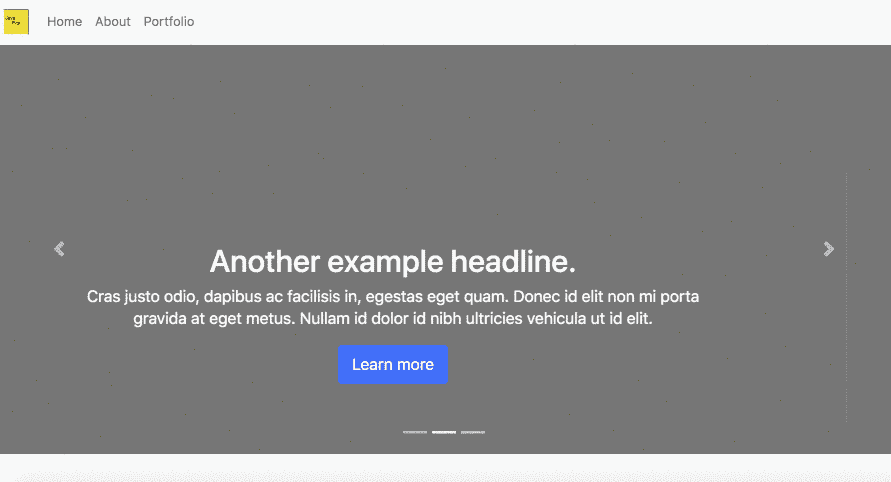

Photo by [Hans McMurdy](https://medium.com/u/1d679de5005f?source=post_page-----1730835a9e87----------------------) — ©JavaScript-First: HTTP

JavaScript 是世界上通用的语言之一。它允许美国开发者建立网站、服务器、移动应用、硬件甚至人工智能。因此，它是世界上最流行的编程语言之一就不足为奇了。

在本文中，我们将讨论什么是 HTTP，并通过构建 HTTP 服务器来学习 JavaScript，而不是先学习 HTML 和 CSS。上图是我们将要建造的一个例子。

***请注意:*** *绝命毒师部分在本文中有意略去，是为了驱动好奇心，鼓励你自己构建一些东西，而不是促成教程地狱。所有代码都可以在* [*JavaScript 第一资源库*](https://github.com/JavaScript-Open-Curriculum-Foundation/JavaScript-First/tree/master/02-ClientVServer) *中找到，并且是您在远程开发环境中学习的开源书籍的一部分，使用*[*git pod*](https://gitpod.io/)*。*

# JavaScript & Node 简介

如果您不熟悉 JavaScript 或 Node.js 生态系统，我写了一篇关于它的文章。请随意查看下面的链接。

[](https://medium.com/swlh/terminal-basics-and-installing-nvm-node-js-631cf9476ac4) [## 终端基础知识和安装 NVM 和节点。射流研究…

### 2020 年学习如何编码

medium.com](https://medium.com/swlh/terminal-basics-and-installing-nvm-node-js-631cf9476ac4) 

如果你不了解 JavaScript 或者还是新手，请注意我们的例子使用了 ES6 特性和 node 中实验性标志后面的特性。节点时这些都不可用。JS 首先推出了 ES 5 标准。

# HTTP:了解 HTTP 和 HTML

在我们开始编码之前，让我们通过观看幻灯片的内容来快速了解一下什么是 HTTP。这张幻灯片中的术语旨在帮助解释我们将使用的 HTTP 方法。

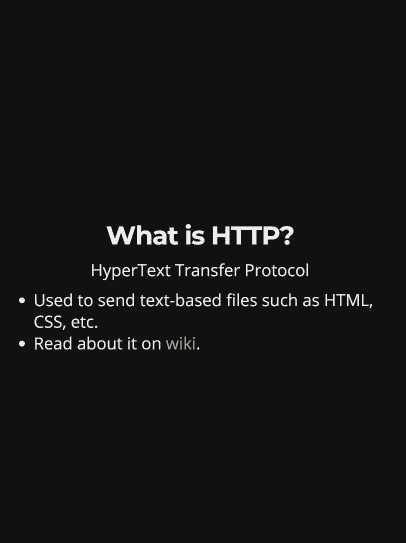

Photo by [Hans McMurdy](https://medium.com/u/1d679de5005f?source=post_page-----1730835a9e87----------------------) — ©JavaScript-First: [HTTP Slides are accessible for the blind here](https://github.com/HansUXdev/JavaScript-First/blob/master/02-ClientVServer/01-HTTP/readme.md)

> 更简单地说:

> “当你，读者，正在阅读这篇文章时，浏览器(客户机)正在向服务器发出请求。然后，服务器以 HTML 的形式发送一个响应(200 HTTP ),显示其内容被设置为 HTML 的页面

接下来，我们将构建一个简单的 HTTP 服务器，向客户机(浏览器)发送 HTML。

## 什么是 HTML

不管你在 twitter 上读到什么，或者这些人在哪个公司工作，HTML 都不是一种编程语言。它代表超文本标记语言，因为它是一种标记语言。其创建原因的简短版本是为了让学者们能够在地理空间中通过超文本/超链接共享文档。做这个项目或者做 web 开发需要知道的 HTML，99%都可以用 1 分钟，或者一张 GIF 解释清楚。另外的 1%归结于项目需求研究&实践经验。

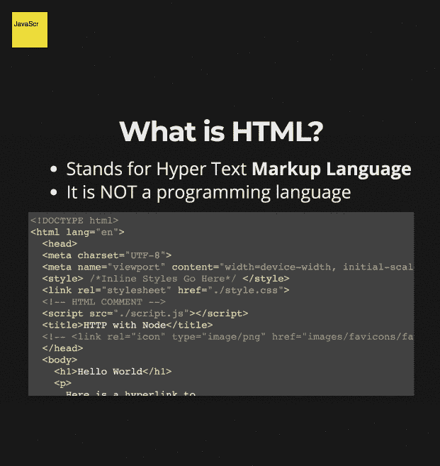

Photo by [Hans McMurdy](https://medium.com/u/1d679de5005f?source=post_page-----1730835a9e87----------------------) — ©JavaScript-First: Explain HTML

# 关于项目:

我们要看的第一个例子是如何用`fs`模块读取一个 html 文件，并用`http`模块将它发送给客户机。两者都内置于 node 的核心 API 中。然后，我们将多次重构以启用 ESM 模块，而不是使用 require。

**本文目标:** 到本文结束时，读者应该能够:

1.区分客户端和服务器。

2.描述什么是 http 以及如何使用 node 的 HTTP 方法。

3.解释什么是 HTML 以及如何在模板字符串中使用它。

4.识别 HTML 基本语法以及如何检查。

5.解释如何使用 HTTP 将 HTML 从服务器发送到浏览器

6.演示如何使用 node 的“fs”方法读取 HTML 和“http”方法创建服务器。

7.在服务器端，使用 bootstrap 5 和普通 javascript 以类似于*react*的方式创建简单的函数，这些函数使用模板文字组成 html 布局和组件。

# 最终目录应该是这样的。

我们要看的第一个例子是如何用`[fs](https://nodejs.org/api/fs.html)`模块读取一个 html 文件，并用`[http](https://nodejs.org/api/http.html)`模块将其发送给客户端。两者都内置于 node 的核心 API 中。

创建一个`index.html`文件，并用任何有效的 html 填充它。然后创建一个名为`index.js`的文件，将下面的代码放入其中，用`npx nodemon index.js`运行它。

简单地说，我们正在导入或“要求”我前面提到的内置 http 方法。然后我们用它来创建一个基本服务器，并使用一个[回调函数](https://developer.mozilla.org/en-US/docs/Glossary/Callback_function)。然后，我们将检查请求对象的 url，以确保它是否指向带有`‘/’`的主页。如果这是真的，我们将读取 html 文件，写入 http 头，写入数据并结束响应。服务器运行在端口 7000 上。

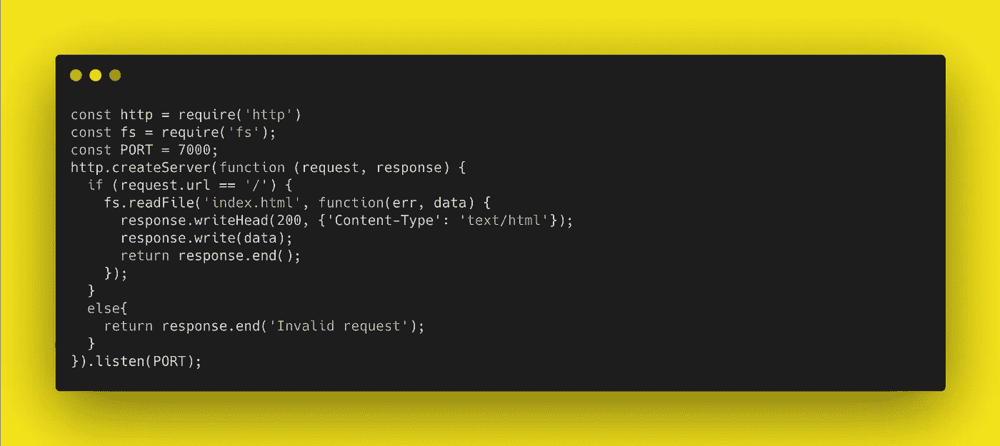

Photo by [Hans McMurdy](https://medium.com/u/1d679de5005f?source=post_page-----1730835a9e87----------------------) — ©JavaScript-First:

在你让它工作之后，我们将把它重新命名为`index.mjs`。删除那个愚蠢的 html 文件，因为我们永远不会使用它。

## 最终的目录应该是什么样子。

如你所见，没有 HTML 或 CSS 文件。这是因为所有的 html 都将在服务器端用普通的 JavaScript 和基本的节点 API 方法生成。任何 css 或客户端 JavaScript 要么在[模板字符串](https://developer.mozilla.org/en-US/docs/Web/JavaScript/Reference/Template_literals)中，要么由 CDN 提供服务。

```
.
├── readme.md
├── index.mjs
├── package.json
├── layout/
│   ├── main.mjs
│   ├── template.mjs
├── pages/
│   ├── home.mjs
│   ├── about.mjs
├── components/
│   ├── nav.mjs
├── util/
│   ├── helpers.mjs
```

## 步骤 1:使用带有 package.json 的 NPM 脚本运行 ESM 模块。

我们将添加一个启动脚本，使用 nodemon 运行`index.mjs`文件，以观察变化并重新加载，添加实验模块。

```
"scripts": {
    "start": "npx nodemon --experimental-modules index.mjs"
},
```

接下来，我们将在`index.mjs`中添加以下代码。代码可以在[这里找到](https://raw.githubusercontent.com/HansUXdev/JavaScript-First/master/02-ClientVServer/01-HTTP/code/simpleHTTP.js)。

现在，来解释一下这是怎么回事。我们正在导入或“要求”内置的 http。我们稍后将对此进行重构，以使用 ESM 导入。然后我们用它来创建一个基本的服务器，并使用一个回调函数来设置服务器对浏览器请求的响应。服务器运行在端口 8080 上。

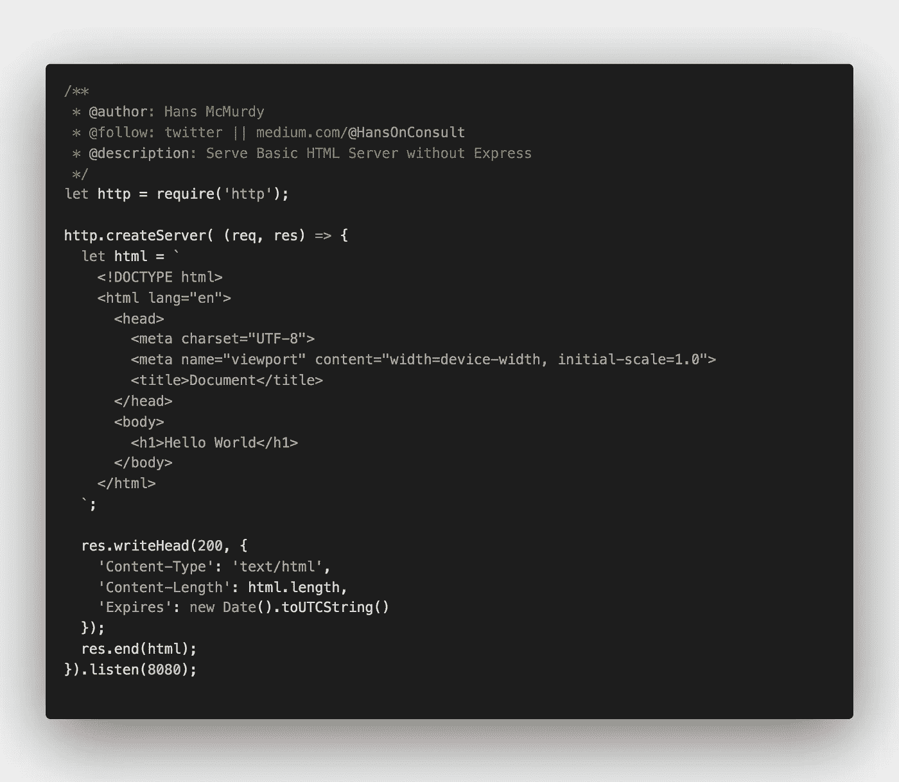

Photo by [Hans McMurdy](https://medium.com/u/1d679de5005f?source=post_page-----1730835a9e87----------------------) — Simple vanilla JavaScript Server

> 为什么不用模板引擎呢？

事情是这样的。
我们其实并不**需要** *他们*。另外，在许多方面，这实际上更强大、更快，而且学习曲线更短，因为没有引入新的语法。

就安全性而言，无论您选择哪个方向，都有缺点，模板引擎增加了另一个依赖性，而这将迫使您维护一个小的字符串库来整理和验证 html 输出，这在本文中不涉及。

## 步骤 1:使用带有 package.json 的 NPM 脚本运行 ESM 模块。

我们将添加一个启动脚本，用 nodemon 运行`index.mjs`文件，以观察变化并重新加载，添加实验模块。

```
"scripts": {
    "start": "npx nodemon --experimental-modules index.mjs"
},
```

要运行该项目，我们只需运行`npm start`并打开浏览器到 [localhost:8000](http://localhost:8000/) 。

## 步骤 2:带有函数和模板文字的服务器端布局

> 如果我告诉你，你也不需要反应？
> 如果我说我们可以通过用一个基于我们定义的参数返回 html 的函数包装模板字符串来重构上面的内容，会怎么样？

在 gif 中，我们通过创建一个名为`HtmlTemplateString()`的函数来做到这一点。

我们将使用这个函数来创建一个基本的布局生成器。我们所做的只是简单地传递页面上的页眉、正文和页脚的相关 html，方法是调用这个函数，将值作为参数，并将结果存储在某个变量中。

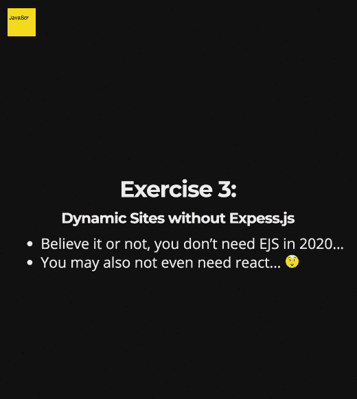

Photo by [Hans McMurdy](https://medium.com/u/1d679de5005f?source=post_page-----1730835a9e87----------------------) — Simple vanilla JavaScript Server

我们甚至可以将函数传递到这些参数中，并在服务器上创建类似 react 的组件，而无需任何主要框架。

## 步骤 3:用实用程序重构

为了使这段代码更具可重用性，我们必须针对各种实用函数再次重构它。在这种情况下，我们将创建一个函数来编写 http 头，并发送带有少量样板文件的最终 html。

而不是编写下面的示例页:

```
res.writeHead(200, {
'Content-Type': 'text/html',
'Content-Length': page1.length,
'Expires': new Date().toUTCString()
})
res.end(page1);
```

我们将把它包装在一个继承 response 对象的函数中，并使`page1`成为一个参数，既可以直接使用，也可以用作验证 html 的回调。最后，我们将这个函数保存在`util/helpers.mjs`中。如果你选择走这条路，这将有助于增加其他实用功能。

```
export const headers = (data,response) => {
  **response**.writeHead(200,{
    'Content-Type': 'text/html',
    'Content-Length': **data**.length,
    'Expires': new Date().toUTCString()
  })
  **response**.end(**data**)
}
```

接下来，我们将返回 index.mjs，将我们的服务器代码包装在一个 async IIFE 中，并为每个页面使用一个 switch 语句，并调用其中的 header 函数。*我们还没有定义“关于”页面…所以这显然会出错。但是这就是为什么你想在盲目复制代码之前完整地阅读这篇文章。*

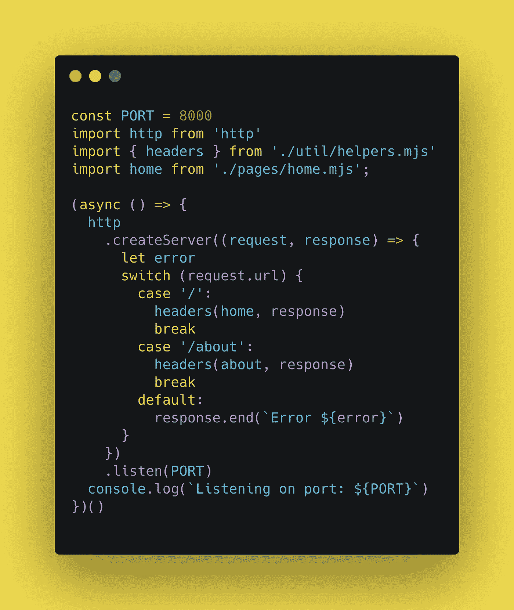

Photo by [Hans McMurdy](https://medium.com/u/1d679de5005f?source=post_page-----1730835a9e87----------------------) — Simple vanilla JavaScript Server

## 步骤 4:使用模板字符串创建可重用的布局

接下来，我们将使用 [Bootstrap 5 扩展](https://marketplace.visualstudio.com/items?itemName=HansUXdev.bootstrap5-snippets)使用命令`!b5-$`快速搭建出一个可重用的模板，然后按 tab 键构建出模板，包括一个用于框架的 css 和零 JavaScript 依赖关系的 cdn 和自定义样式，还有其他可用的模板，如 masonry，但我们在这里保持简单。

最后，我们将编辑我们想要的 html。

在我的例子中，我简单地添加了一个标题、导航、正文和页脚、参数，稍后我们将把其他功能组件作为参数传递给它们。我们将把这个代码存储在`layout/main.mjs` 中。

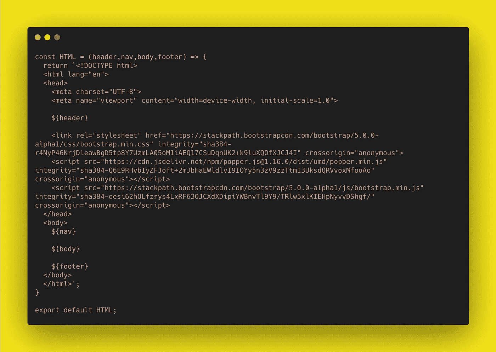

Photo by [Hans McMurdy](https://medium.com/u/1d679de5005f?source=post_page-----1730835a9e87----------------------) — Simple vanilla JavaScript Server

## 步骤 5:创建服务器端导航链接组件

我们要做的第一件事是创建可重用的组件，从一组对象(数据)生成页面。我们将把这段代码放在`components/nav.mjs`中。这个函数生成的 html 将被传递到我们创建的下一个组件中。

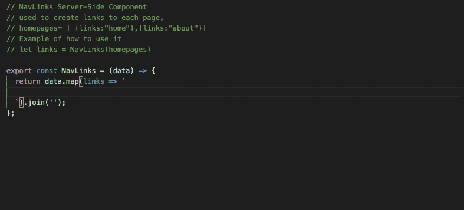

Photo by [Hans McMurdy](https://medium.com/u/1d679de5005f?source=post_page-----1730835a9e87----------------------) — Simple vanilla JavaScript Server

## 步骤 6:创建服务器端导航组件

在同一个文件`components/nav.mjs`中，在前一个组件下面的新行上，我们将创建一个新组件。这将是一个返回 html 的简单函数，而不是之前那个遍历数组的函数。在 return 语句中，我们将添加````，在模板字符串中，我们将键入`b5-navbar-default`并点击 tab。这将为我们的主导航组件生成所需的 html，我们只需适当地编辑它。

最后一个可重用的 Nav()接受两个参数，内容和徽标。
内容是我们用来将前一个组件传入的参数。
Logo 只是用于不要脸的品牌推广。

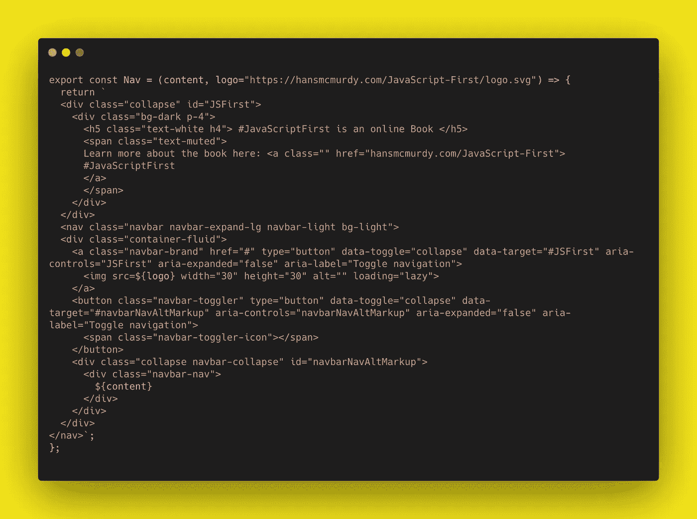

## 步骤 7:构建我们的导航栏

现在我们将这两者放在一起，然后在一个可重用的导航中使用，它接受两个参数，内容和徽标。在同一个文件`components/nav.mjs`里。理想情况下，您希望从数据库中提取页面数据，但我们会保持简单，并将其构建在同一个文件中。

首先，我们创建一个带有名称和 url 的对象数组，如果你愿意，你也可以添加图标和数据等信息，但我们不会在这里讨论。然后我们将创建一个`links`变量来存储每个 NavLink 的 html，并将主页作为数据的参数传递。最后，我们将把这个变量传递给我们的`Nav()`组件，并将最终的 html 存储在一个名为 NAV 的变量中。我们将导出该变量，并在每个页面上重用它。


## 步骤 8:构建我们的页面

接下来，我们将在`pages/home.mjs`中构建我们的主页。我们将从导入我们的布局、`HTML()`和可重用的`NAV()`开始。然后用`<title>#JavaScriptFrist Bootstrap Site</title>`在第一个参数中添加我们的元数据。那么我们将只使用模板的主体参数。我们没有构建足够复杂的东西来为我们的布局函数`HTML()`使用页脚参数。

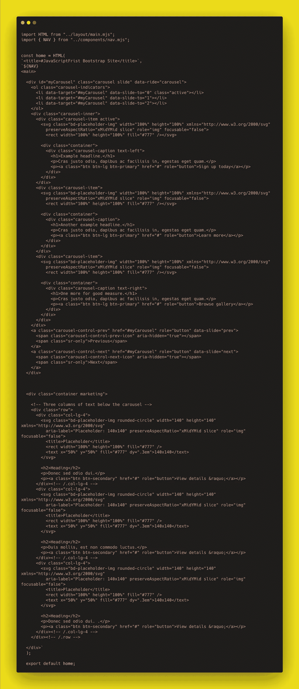

## 第九步:把所有东西放在一起

现在我们再回到`./index.mjs`把这些都拼起来。
你会注意到我注释掉了一些代码。
这是一个在服务器端使用 fetch 在 about 页面上生成动态砖石布局的例子。我不会在这篇文章中涉及这些，因为我想给你留下一些自己思考和研究的东西，或者一个加入我的[抽动课程](https://www.twitch.tv/hansoncoding/about)的理由。

现在，我将只导入主页并在`headers()`中调用它。这样，当我们转到`something.com/`时，它将呈现出我们的页面。

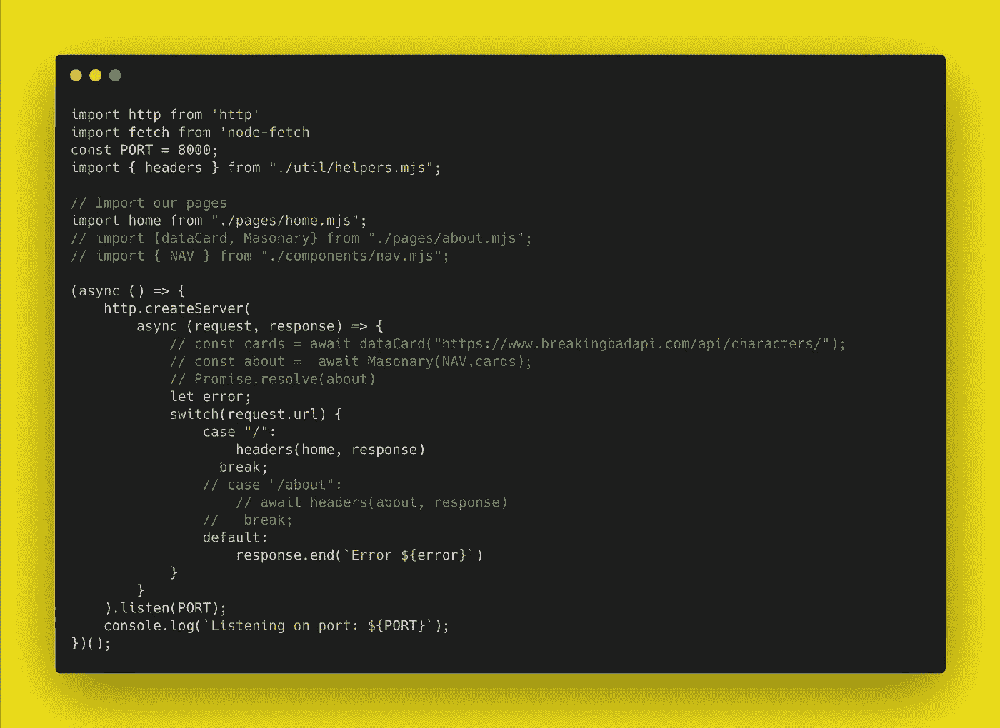

> *感谢看完这个字吐槽。*

我不在乎掌声，但如果你觉得这篇文章有趣，在下面引发一场对话，如果你不同意，那也很酷。但不管怎样，让我们保持文明和建设性的对话，让网络成为每个人更好的地方。

如果您喜欢阅读这篇文章，可以考虑关注我，因为我将写一篇关于 HTTPS 和设置 SSL 的后续文章。

如果你不知道什么是 SSL/TSL 或 HTTPS，看看我以前写的一篇文章，这样你就会明白为什么它很重要，为什么应该尽可能在每个网站上使用它。

[](https://medium.com/swlh/https-medium-com-swlh-lets-encrypt-securing-the-web-for-all-5b50842ecead) [## 让我们加密:保护网络

### 抛开自由市场神话&保护网络

medium.com](https://medium.com/swlh/https-medium-com-swlh-lets-encrypt-securing-the-web-for-all-5b50842ecead) 

## 简单英语的 JavaScript

你知道我们有三份出版物和一个 YouTube 频道吗？在 [**寻找一切的链接 plainenglish.io**](https://plainenglish.io/) ！