# 如何构建 WebSocket 聊天应用程序

> 原文：<https://javascript.plainenglish.io/how-to-build-a-websocket-chat-application-819399d55800?source=collection_archive---------0----------------------->


Photo by [Yogas Design](https://unsplash.com/@yogasdesign?utm_source=medium&utm_medium=referral) on [Unsplash](https://unsplash.com?utm_source=medium&utm_medium=referral)

在进入这篇博客之前，我建议看一下我以前的博客，在那里我介绍了[web socket API](http://Introduction to WebSockets)。从本文中，您会发现 web sockets API 如何工作以及 WebSocket API 的主要组件的高级概述。这篇博客将重点介绍我用来创建 WebSocket 聊天应用程序的技术和步骤，该应用程序符合以下准则:

*   在消息发生时记录消息，并立即与连接到应用程序的每个人分享这些消息。
*   结果保留在会话之间，只有最后十条消息按从最近到最早的降序显示。

## 技术

**后端** : CRUD WebSocket API: Node.js、Express.js、Socket.io、PostgreSQL

**前端** : React 和 Socket.io

部署 : Heroku 和 Netlify

## 后端

**概述:**我们的后端将由一个 CRUD WebSocket API 组成，该 API 使用在 Express.js 服务器上运行的 Node.js 环境，该服务器利用 Socket.io 和 PostgreSQL 数据库。现在，一次列出了很多词汇和技术。所以，在我们开始编码之前，让我们定义每一部分。

*   **CRUD** — CRUD 代表(创建、读取、更新和删除)，是 API 的四个关键功能。我们的聊天应用程序将利用创建和只读。
*   **API(应用程序编程接口)**—“…是一组编程代码，支持一个软件产品和另一个软件产品之间的数据传输。它还包含此数据交换的条款”(Altexsoft)。
*   **web socket API**—“…一种先进的技术，可以在用户的浏览器和服务器之间开启双向互动通信会话。”(Mozilla)。更多信息[点击这里](https://sedlacek1991.medium.com/introduction-to-websockets-8583403d401d)。
*   **node . js**——“一个开源的、跨平台的、后端的 JavaScript 运行时环境，在 web 浏览器之外执行 JavaScript 代码”(维基百科)。
*   Express . js—“…一个最小且灵活的 Node.js web 应用程序框架，为 web 和移动应用程序提供了一组强大的功能”(Express)。
*   **PostgreSQL(Postgres)**—“…一个强大的开源对象关系数据库系统，经过 30 多年的积极开发，它在可靠性、功能健壮性和性能方面赢得了良好的声誉”(Postgresql.org)。
*   **Socket . io**——“Socket。IO 是一个库，支持浏览器和服务器之间的实时、双向和基于事件的通信。它由 Node.js 服务器和浏览器的 Javascript 客户端库组成”(Socket.io)。

现在让我们通过创建 Postgres 数据库来开始编码。

**数据库创建**

说明要求家酿安装在您的本地机器上。有关设置说明，请参见[链接](https://brew.sh/)。

1.  如果您尚未安装 PostgreSQL，请安装它。对于 Mac 用户，在终端中键入`brew install postgresql`。
2.  通过在您的终端中键入`psql postgres`连接到默认的 postgres 数据库
3.  创建一个用户名为 me，密码为`CREATE ROLE me WITH LOGIN PASSWORD 'password';`的用户
4.  给我创建数据库的能力`ALTER ROLE me CREATEDB;`
5.  使用`\q`退出默认 postgres
6.  连接 postgres 和我`psql -d postgres -U me`
7.  创建数据库`CREATE DATABASE api;`
8.  连接到新的 api 数据库`\c api`
9.  使用下面的 SQL 命令在 api 数据库中创建一个表。这个 SQL 命令在 Postgres 表中为 ID、文本、用户名和 created_at 时间戳创建列。请根据您的应用需求随意编辑。

```
CREATE TABLE messages (
  ID SERIAL PRIMARY KEY,
  text varchar(255) NOT NULL,
  username varchar(255) NOT NULL,
  created_at TIMESTAMP NOT NULL DEFAULT now()
);
```

10.将时区设置为 UTC。`SET TIMEZONE='UTC';`。这一步不是必需的，但它允许您在前端使用 Moment.js 将 UTC 时间戳转换为用户的本地时间。要了解更多，请阅读我的博客[这里](https://levelup.gitconnected.com/seize-the-moment-js-43b3210a27a5)。

11.使用下面的 SQL 命令植入消息表。(确保列名与您在步骤 9 中创建的表一致)

```
INSERT INTO messages (text, username)
  VALUES ('1+1=2', 'matthew'), ('2+2=4', 'blake'), ('3+3=6', 'julie'), ('4+4=8', 'courtney'), ('5+5=10', 'brian'), ('6+6=12', 'michael'), ('7+7=14', 'edward'), ('1+1=2', 'matthew'), ('2+2=4', 'blake'), ('3+3=6', 'julie');
```

12.数据库现在已经设置好了，您可以将 psql 和`\q`一起留在您的终端中。

**Express.js 服务器设置**

现在，我们已经有了种子 Postgres 数据库，我们需要创建我们的服务器。

1.  在 GitHub 中，创建一个空白存储库，并将其克隆到您选择的文件夹中

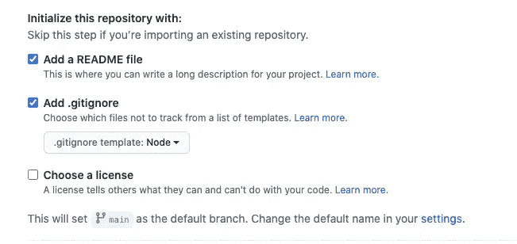

I recommend initializing your GitHub Repo with a README and .gitignore

2.使用`cd`输入克隆的存储库

3.要创建我们的 package.json 文件，请键入`npm init -y`

4.在您选择的代码编辑器中打开您的目录

```
// Your package.json file should look similar to this{
  "name": "node-api-postgres",
  "version": "1.0.0",
  "description": "index.js",
  "main": "",
  "license": "ISC"
}
```

5.为我们的服务器安装 express . js`npm install express --save`

6.使用 node -postgres 连接到 postgres `npm install pg`

我们的服务器现在在 node_modules 和 package.json 文件中有了所需的依赖项。我建议将您的工作提交给 GitHub，并在此时创建一个本地分支`git checkout -b local`

**创建 Express.js 服务器入口点**

我们服务器的入口点将是 index.js

1.  在代码编辑器中创建 index.js 文件
2.  将以下代码输入 index.js 文件

```
const express = require('express')
const bodyParser = require('body-parser')
const app = express()
const port = 3000

app.use(bodyParser.json())
app.use(
  bodyParser.urlencoded({
    extended: true,
  })
)app.get('/', (request, response) => {
  response.json({ info: 'Our app is up and running' })
})app.listen(port, () => {
  console.log(`App running on ${port}.`)
})
```

在上面，我们需要 require express 和一个名为 body-parser 的内置 express 中间件。NPM 解释说，主体解析，“在你的处理程序之前，解析中间件中的传入请求主体，在`req.body`属性下可用”(NPM)。

第一个 app.get 是我们应用程序的主路径，当我们在 localhost:3000 中运行服务器`node index.js`时，它将显示 info 消息。

app.listen 告诉我们我们的应用程序在终端的哪个端口上运行。

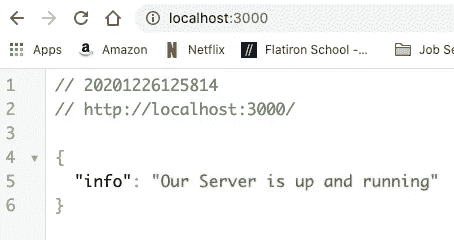

Localhost: 3000

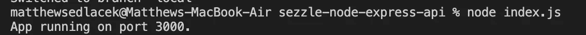

Terminal

我们的 Express.js 服务器正在运行；现在我们需要连接到我们之前创建的 Postgres 数据库。

**Postgres 数据库连接**

如前所述，我们安装了 node-postgres 来允许我们的 postgres 数据库连接到我们的 Node.js/Express.js 服务器。现在让我们建立联系。

1.  创建 queries.js 文件
2.  输入下面的代码来设置我们到 postgres 数据库的连接。在我们的例子中，我们使用 node-postgres 内置的连接池。我们使用池是因为我们的应用程序会频繁地进行查询。此外，使用池架构“…确保“关闭的”连接不是真正关闭，而是返回到池中，而“打开”新连接会返回相同的“物理连接”，从而减少 PostgreSQL 端的实际分叉”(ScaleGrid)。

```
// Please note that if you changed the user, database, or password in the database creation section you will need to update the respective line items below.const Pool = require("pg").Pool;const pool = new Pool({ user: "me", host: "localhost", database: "api", password: "password", port: 5432,});
```

现在我们已经连接到数据库，我们将创建我们的 CRUD 操作和路由。

**CRUD 操作&路线**

这个应用程序将只使用创建和读取功能，因此只需要一个端点/消息。在创建 CRUD 操作时，我们需要对 index.js 和 queries.js 文件进行修改。让我们从 queries.js 开始。

*   请记住，我们的应用程序要求我们只显示最后十条消息，从最近的到最早的降序排列。我们现在可以通过创建一个名为 getMessages 的 GET 请求(在 CRUD 中读取)来满足这个需求。

```
// queries.jsconst getMessages = (request, response) => { pool.query( "SELECT * FROM messages ORDER BY id DESC LIMIT 10", (error, results) => { if (error) { throw error; } response.status(200).json(results.rows); } );};
```

使用池使我们能够输入将从 Postgres 数据库中提取的原始 SQL。原始 SQL 是满足我们项目需求的关键。用简单的英语来说，SQL 语句选择 messages 表中的所有内容，并按照从旧到新的顺序对行进行排序，并将选择限制为十条消息。

*   我们的用户也需要能够创建消息。这需要向我们的端点发出 POST 请求(在 CRUD 中创建)。现在让我们来实现这个功能。

```
const createMessage = (request, response) => { const { text, username } = request.body; pool.query( "INSERT INTO messages (text, username) VALUES ($1, $2) RETURNING 
   text, username, created_at", [text, username], (error, results) => { if (error) { throw error; } response.status(201).send(results.rows); } );};
```

这里，我们再次使用池来输入原始 SQL，该 SQL 将用户的消息添加到 Postgres 数据库中。简单地说，SQL 语句在 messages 表中放入一个条目，我们的应用程序将在其中提供文本和用户名的值。除了文本和用户名之外，我们还告诉查询返回 created_at 时间戳。

在 queries.js 中我们需要做的最后一步是让 index.js 可以访问这些方法。

```
module.exports = { getMessages, createMessage,};
```

现在，在 index.js 中，我们需要做的就是添加以下内容来利用这些方法。

```
// Add to the top of the index.js file with the other requires
const db = require('./queries') // Add to the bottom
app.get("/messages", db.getMessages);app.post("/messages", db.createMessage);
```

现在，如果我们运行`node index.js`，我们可以转到[http://localhost:3000/messages](http://localhost:3000/messages)并查看我们的消息。您应该会看到类似下面的内容。

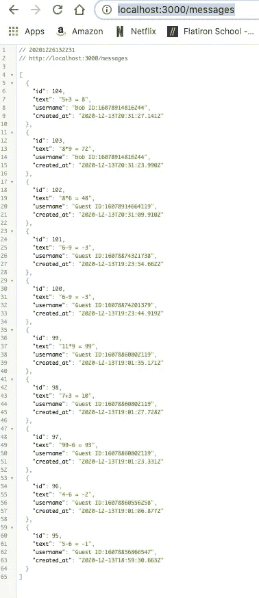

Example of current output

现在，如果我们正在实现一个 RESTful API，这就是我们可以停止的地方。然而，我们的应用程序需要一个 WebSocket API。我会推荐将这个分支推上 GitHub，然后创建一个名为 Socketio 的分支。

**Socket.io 实现(本地)**

如前所述，Socket.io 是“……基于长轮询/WebSocket 的第三方传输协议，用于[node . js](https://nodejs.org/)”(Mozilla)。在本节中，我们将安装 Socket.io 和其他所需的依赖项，以将我们的 API 从 RESTful API 转换为 WebSocket API。

1.  按照 Socket.io 约定，将 index.js 重命名为 app.js
2.  在 package.json 中将主值从 index.js 重命名为 app.js

```
"main": "app.js",
```

3.用终端命令`npm install socket.io`安装 Socket.io

4.使用终端命令`npm i cors`安装 CORS。Mozilla 将 CORS 或跨来源资源共享定义为“……一种基于 HTTP 头的机制，允许服务器指示除其自身以外的任何其他来源(域、方案或端口)，浏览器应允许从这些来源加载资源”(Mozilla)。如果没有 CORS，我们的前端将无法向后端发送请求。

5.使用 Socket.io 提供的文档，我们需要在 app.js 中添加/更新粗体内容，以允许 Socket.io 和 CORS 实现

```
// app.jsconst express = require("express");const bodyParser = require("body-parser");**const cors = require("cors");**const app = express();const port = 3000;**const socketPort = 8000;**const db = require("./queries");**const { emit } = require("process");****const server = require("http").createServer(app);****const io = require("socket.io")(server, {** **cors: {** **origin: "http://localhost:3001",** **methods: ["GET", "POST"],** **},****});****app.use(cors());**// parses requests for fetchapp.use(bodyParser.json());app.use( **bodyParser.urlencoded({** **extended: true,** **})**);app.listen(port, () => { console.log(`App running on port ${port}.`);});app.get("/messages", db.getMessages);app.post("/messages", db.createMessage);
```

6.既然我们正在使用 WebSocket API，我们需要在 queries.js 文件中添加新的 GET 和 POST 请求。请参阅 RESTful API 部分，了解这些 SQL 查询的具体功能。

```
// queries.js/* SOCKET DB */const getSocketMessages = () => { return new Promise((resolve) => { pool.query( "SELECT * FROM messages ORDER BY id DESC LIMIT 10", (error, results) => { if (error) { throw error; } resolve(results.rows); } ); });};const createSocketMessage = (message) => { return new Promise((resolve) => { pool.query( "INSERT INTO messages (text, username) VALUES ($1, $2) 
         RETURNING text, username, created_at", [message.text, message.username], (error, results) => { if (error) { throw error; } resolve(results.rows); } ); });};
```

7.为了让 app.js 可以访问这些方法，我们需要将它们添加到我们的 module.exports 中

```
// queries.jsmodule.exports = { getMessages, createMessage, **getSocketMessages,** **createSocketMessage,**};
```

8.最后，我们需要将 Socket.io 方法添加到 app.js 中

```
// app.js // sends out the 10 most recent messages from recent to oldconst emitMostRecentMessges = () => { db.getSocketMessages() .then((result) => io.emit("chat message", result)) .catch(console.log);};// connects, creates message, and emits top 10 messagesio.on("connection", (socket) => { console.log("a user connected"); socket.on("chat message", (msg) => { db.createSocketMessage(JSON.parse(msg)) .then((_) => { emitMostRecentMessges(); }) .catch((err) => io.emit(err));
}); // close event when user disconnects from app socket.on("disconnect", () => { console.log("user disconnected");
   });}); // Displays in terminal which port the socketPort is running onserver.listen(socketPort, () => { console.log(`listening on *:${socketPort}`);});
```

9.为了测试我们的应用程序，我们可以创建一个 index.html 文件。复制并粘贴下面的源代码作为快速示例，或者随意创建自己的代码。要运行，需要有两个终端；一个用于服务器，另一个用于打开 index.html 文件。完成此操作的终端命令是`node app.js`和`open index.html`

```
<!doctype html><html> <head> <title>Socket.IO chat</title> <style> * { margin: 0; padding: 0; box-sizing: border-box; } body { font: 13px Helvetica, Arial; } form { background: #000; padding: 3px; position: fixed;   
         bottom: 0; width: 100%; } form input { border: 0; padding: 10px; width: 90%; 
         margin-right: 0.5%; } form button { width: 9%; background: rgb(130, 224, 255);
         border: none; padding: 10px; } #messages { list-style-type: none; margin: 0; padding: 0; } #messages li { padding: 5px 10px; } #messages li:nth-child(odd) { background: #eee; } </style> </head> <body> <ul id="messages"></ul> <form action=""> <input id="username" autocomplete="off" 
          placeholder="username"/> <input id="m" autocomplete="off" placeholder="equation"/> <button>Send</button>
      </form> <script src="http://localhost:8000/socket.io/socket.io.js">.
      </script> <script> const socket = io("http://localhost:8000"); const form = document.querySelector('form'); const messages = document.querySelector('#messages'); function createMessage(msg) { const li = document.createElement('li'); li.textContent =`${msg.text},${msg.username},${msg.created_at}` messages.append(li);
   } function createMessages(msgs) { msgs.forEach(createMessage);
   } fetch("http://localhost:3000/messages") .then(res => res.json()) .then(createMessages); form.addEventListener("submit", (e) => {
      e.preventDefault();
      socket.emit('chat message', JSON.stringify({
      text: document.querySelector('#m').value,
      username: document.querySelector('#username').value
     })); e.target.reset();
   }); socket.on('chat message', function (msgs) {
      console.log(msgs)
      messages.innerHTML = "";
      createMessages(msgs);
   }); </script> </body></html>
```

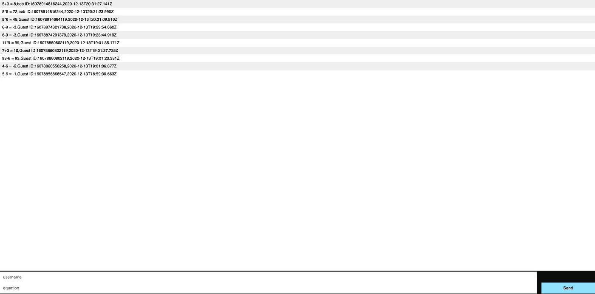

Index.html file after opening

我们的 WebSocket API 现在已经完成，我们的 Read 和 Create 操作正在按预期工作。现在的最后一步是修改我们的 API，以便在 Heroku 上部署。

**准备在 Heroku 上部署后端服务器**

此时，我建议将您的 socketio 分支推到 GitHub，并创建一个名为 deployment 的新分支。我们的部署分支将用于将我们的后端部署到 Heroku。

1.  创建一个空白。部署中引用的 app.js 和 queries.js 文件的 env 文件
2.  Heroku 要求我们只有一个端口变量。查看粗体区域的更改
3.  CORS 源将需要更新到 netlify 网址，我们的反应前端将被托管
4.  需要删除冗余代码`app.listen(port, () => {console.log(`App running on port ${port}.`);});`

最终的 app.js 文件应该类似于下面的代码:

```
// app.jsconst express = require("express");const bodyParser = require("body-parser");const cors = require("cors");const app = express();**const PORT = process.env.PORT || 8000;**const db = require("./queries");const { emit } = require("process");const server = require("http").createServer(app);const io = require("socket.io")(server, { cors: { **origin: "{will need to input netlify url here}",** methods: ["GET", "POST"], },});app.use(cors()); // parses requests for fetchapp.use(bodyParser.json());app.use( bodyParser.urlencoded({ extended: true, }));app.get("/messages", db.getMessages);
app.post("/messages", db.createMessage);// sends out the 10 most recent messages from recent to oldestconst emitMostRecentMessges = () => { db.getSocketMessages() .then((result) => io.emit("chat message", result)) .catch(console.log);}; // connects, creates message, and emits top 10 messagesio.on("connection", (socket) => { console.log("a user connected"); socket.on("chat message", (msg) => { db.createSocketMessage(JSON.parse(msg)) .then((_) => { emitMostRecentMessges(); }) .catch((err) => io.emit(err)); });// close event when user disconnects from app socket.on("disconnect", () => { console.log("user disconnected"); });});server.listen(**PORT**, () => { console.log(`listening on *:${**PORT**}`);});
```

3.更新 queries.js 文件中的连接池以使用。env 的 DATABASE_URL 由 Heroku 提供。

最终的 queries.js 文件应该类似于下面的代码:

```
// queries.jsconst Pool = require("pg").Pool;const pool = new Pool({ **connectionString: process.env.DATABASE_URL,** **ssl: {** **rejectUnauthorized: false,** **},**});/* Local DB */const getMessages = (request, response) => { pool.query( "SELECT * FROM messages ORDER BY id DESC LIMIT 10", (error, results) => { if (error) { throw error; } response.status(200).json(results.rows); } ); };const createMessage = (request, response) => { const { text, username } = request.body; pool.query( "INSERT INTO messages (text, username) VALUES ($1, $2)
      RETURNING text, username, created_at", [text, username], (error, results) => { if (error) { throw error; } response.status(201).send(results.rows); } );};/* SOCKET DB */const getSocketMessages = () => { return new Promise((resolve) => { pool.query( "SELECT * FROM messages ORDER BY id DESC LIMIT 10", (error, results) => { if (error) { throw error; } resolve(results.rows); } ); });};const createSocketMessage = (message) => { return new Promise((resolve) => { pool.query( "INSERT INTO messages (text, username) VALUES ($1, $2)  
         RETURNING text, username, created_at", [message.text, message.username], (error, results) => { if (error) { throw error; } resolve(results.rows); } ); });};module.exports = { getMessages, createMessage, getSocketMessages, createSocketMessage,};
```

4.将引擎和启动脚本添加到 package.json 文件中(参见粗体部分)。

最终的 package.json 文件应该类似于下面的代码:

```
{"name": "node-api-postgres","version": "1.0.0","description": "",**"engines": {** **"node": "12.18.4"****},**"main": "app.js","scripts": { **"start": "node app.js",** "test": "echo \"Error: no test specified\" && exit 1"},"repository": { "type": "git", "url": "git+https://github.com/matthewsedlacek/node-api
   -postgres.git"},"keywords": [],"author": "","license": "ISC","bugs": {"url": "https://github.com/matthewsedlacek/node-api-postgres/issues"},"homepage": "https://github.com/matthewsedlacek/node-api postgres#readme","dependencies": { "cors": "^2.8.5", "express": "^4.17.1", "pg": "^8.5.1", "socket.io": "^3.0.4"}}
```

5.用下面的代码创建一个 Procfile。如果您不熟悉 Procfile，这是一种声明由 Heroku 上我们的应用程序的 dynos 运行的命令的方法。

```
web: node app.js
```

现在 are 文件已经准备好部署在 Heroku 上了。

**部署到 Heroku**

这些说明摘自我之前关于[部署](https://medium.com/swlh/launching-your-first-website-rails-react-42a6af1ab481)的博客。

开始之前，您需要下载并安装 [Heroku CLI](https://devcenter.heroku.com/articles/heroku-cli) 。当你创建了一个帐号并登录后，你就可以开始在 Heroku 上托管你的后台了。在您的终端中，键入以下命令。

```
heroku create
```

这个命令将在 Heroku 上创建一个新的应用程序。如果你想命名你的后端，把它包括在上面的行中；否则，Heroku 会为你生成一个名字。

```
git push heroku main
```

git push 命令将把您的存储库推送到您在前面的终端命令中创建的 Heroku 应用程序。您不需要在上一步中指定应用程序的名称，因为“heroku create”构建了一个名为“heroku”的 git remote，它指向您刚刚创建的应用程序。

```
heroku addons:create heroku-postgresql:hobby-dev
```

上面的命令将 Postgres 添加到我们的 Heroku 应用程序中。

```
heroku pg:resetheroku pg:push name-of-local-database DATABASE_URL --app name-of-Heroku-app
```

接下来，我们需要重置我们的默认 Postgres 并提升我们的本地数据库。在创建数据库部分，我们将本地数据库命名为 api。因此，本地数据库的名称是 api。DATABASE_URL 应该和 app 一样保持不变。通过在终端中向上滚动，查看由`heroku create`终端命令生成的名称，可以找到 name-of-Heroku-app。

现在，您已经在 Heroku 上部署了后端。你可以通过输入`heroku open`查看你的应用程序，然后在网址上添加一个/信息。

*请注意，为了避免您的 Dyno 睡着，您需要进入您的 Heroku 帐户，将 Dyno 从免费升级为爱好。这将使您的 WebSocket API 保持清醒，并防止我们的 WebSocket 聊天应用程序出现不良行为。*

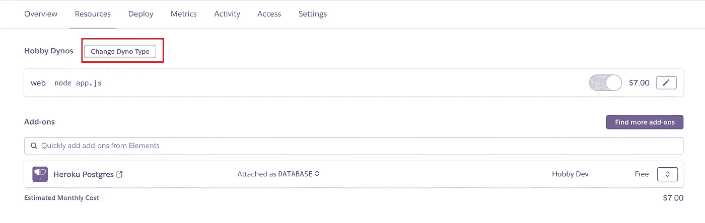

Change Dyno Type in the Resources Tab in Heroku

## 前端

这一节，将不会关注如何构建一个前端，但更多的是如何将 Socket.io 融入我们的 React 前端。我们将要编写的方法将分为两个独立的部分；一个功能组件和一个类组件。

要开始，我们需要安装 socket.io 客户端。要安装，请在终端中键入以下命令:

```
npm i socket.io-client
```

在我们的功能组件中，我们首先需要导入 Socket.io 客户端。然后，我们需要为我们的 Socket 端点、Fetch 端点和 WebSocket 创建变量(见粗体)。在这个功能组件中，我们使用 react 钩子来设置初始 HTTP 握手(参见第一个加粗的 useEffect)。然后我们再次使用 useEffect 来看看客户端和服务器是否可以继续通过 WebSockets。如果是这样的话，我们的消息列表将在每次用户提交消息时更新，并且我们的 WebSocket 将以它期望的方式运行。

```
import React from "react";import { useEffect, useState } from "react";import MessagesArea from "./MessagesArea";**import socketIOClient from "socket.io-client";****const socketEndpoint = "https://serene-crag-73795.herokuapp.com";****const fetchEndpoint = `${socketEndpoint}/messages`;****const socket = socketIOClient(socketEndpoint);**function ConversationsList(props) { const [messages, setMessages] = useState([]); **useEffect(() => {
      fetch(fetchEndpoint)
      .then((res) => res.json())
      .then(setMessages)
      .catch(console.log);
   }, []);** **useEffect(() => {
      if (socket) {
         socket.on("chat message", (msgs) => {
            setMessages(msgs);
         });
      }
   }, []);** return (
   <React.Fragment>
      {messages.length > 0 ? (
         <MessagesArea
            **messages={messages}**
            username={props.username}
            userId={props.uid}
         />
      ) : null}
   </React.Fragment> );}export default ConversationsList;
```

类组件将处理向客户端发送新消息。与功能组件类似，我们需要导入 Socket.io 并为我们的 Socket 端点和 WebSocket 创建变量(见粗体)。注意，我们没有在这个组件中使用 fetch，因为我们只通过 WebSocket 发送新消息。为了发送新消息，我们使用了一个 emit 事件(见粗体)。另外值得一提的是，我们创建的发射事件 *socket.on* 和 *socket.emit* 在我们后端的 app.js 文件中有对应的监听器。

```
import React, { Component } from "react";import CalculatorDisplay from "../components/calculator/CalculatorDisplay";import Keypad from "../components/calculator/Keypad";import Card from "react-bootstrap/Card";**import socketIOClient from "socket.io-client";****const socketEndpoint = "https://serene-crag-73795.herokuapp.com";****const socket = socketIOClient(socketEndpoint);**class Calculator extends Component { state = { result: "", errorMessage: 0, resultPost: "", }; onClick = (button) => { if (button === "=") { this.calculate(); } else if (button === "C") { this.reset(); } else if (button === "←") { this.backspace(); } else { this.setState({ result: this.state.result + button, }); } }; calculate = () => { try { this.handleSubmit(); } catch (e) { this.setState({ result: "error", }); } }; **handleSubmit = (e) => {
      socket.emit(
         "chat message",
         JSON.stringify({
            text: this.state.result + " = " +
            (eval(this.state.result) || 0) + "",
            username: this.props.username,
         })
      );
      this.setState({ result: "" });
   };** reset = () => {
      this.setState({
         result: "",
         resultPost: "",
      });
   }; backspace = () => {
      this.setState({
         result: this.state.result.slice(0, -1),
      });
   }; render() {
      return ["Primary"].map((variant, idx) => (
      <Card className="calculatorContainer" 
      bg={variant.toLowerCase()}>
         <Card.Body>
             <Card.Text>
                <CalculatorDisplay result={this.state.result} />
             </Card.Text>
             <Card.Text>
                 <Keypad
                    onClick={this.onClick}
                    resultPost={this.state.resultPost}
                    conversation_id={this.props.conversation_id}
                    username={this.props.username}
                 />
            </Card.Text>
         </Card.Body>
      </Card>
   ));
  }
}export default Calculator;
```

现在我们的前端使用 WebSocket 协议与我们的后端通信。

**在 Netlify 上部署前端**

这些说明摘自我之前关于[部署](https://medium.com/swlh/launching-your-first-website-rails-react-42a6af1ab481)的博客。

使用 [Netlify](https://www.netlify.com/) 创建帐户后，选择“从 Git 创建新站点”选项。

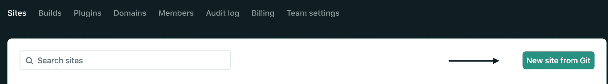

接下来选择您的 Git 提供者。

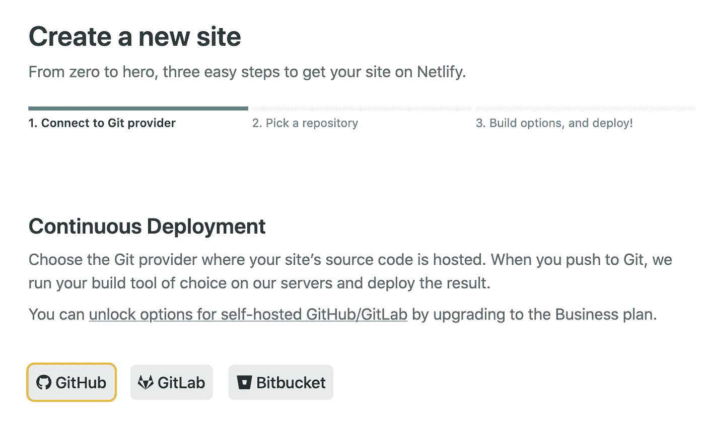

然后，Git 提供程序会要求您授权 Netlify。这样做之后，您将看到一个可供选择的存储库列表。

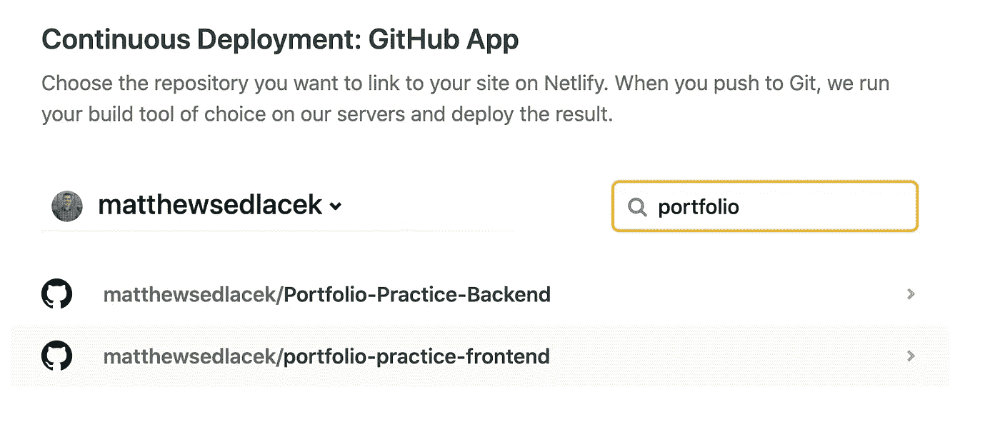

选择前端存储库后，将会填充以下选项。单击“部署站点”按钮。

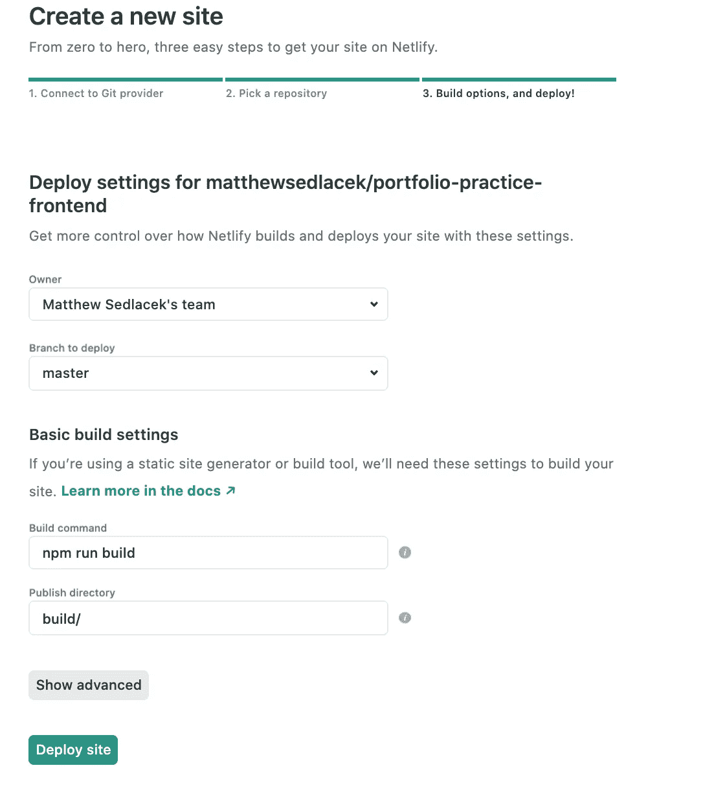

单击“部署站点”按钮后，您将被重定向到您的新站点仪表板，如下所示。需要注意的主要区域是现在称为“建筑”的生产部署区域这里你会看到任何错误，或者如果没有任何错误，你会看到你的网站已经发布。

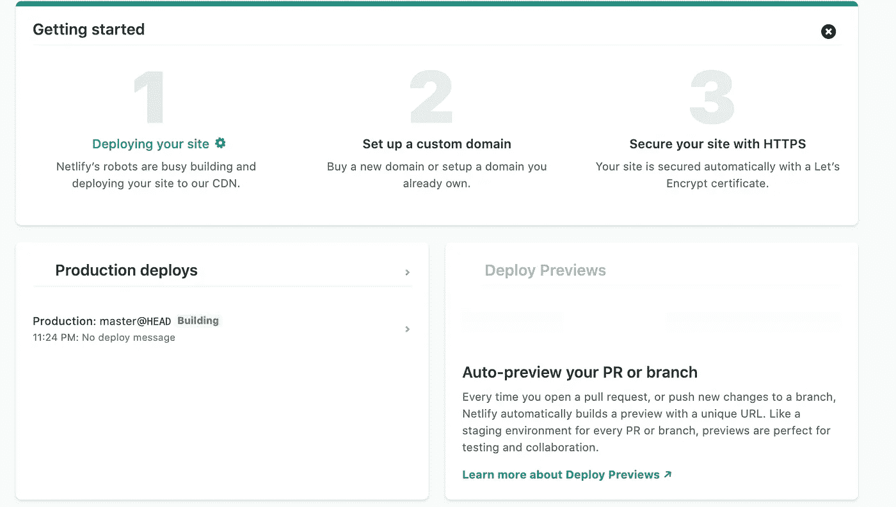

如果遇到错误，日志会提供错误的详细信息以及如何修复错误。还有一个与可以提供帮助的个人进行实时聊天的功能。修复错误后，您可以转到“部署”选项卡，然后单击“触发部署”重试。

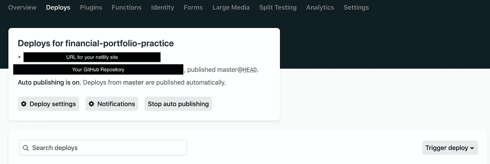

修复所有错误后，您将会看到一条类似于下面的发布消息。

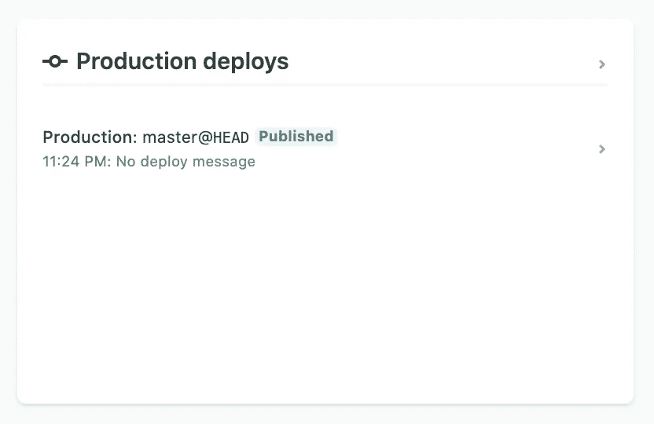

现在我们的前端已经部署好了，但是我们需要在后端更新 app.js 文件中的 CORS 来完成我们的应用程序。然后我们需要把这些改变推进到 heroku `git push heroku main`。

```
const io = require("socket.io")(server, { cors: { **origin: "https://calculator-chat.netlify.app",** methods: ["GET", "POST"], },});
```

感谢您花时间学习如何使用 WebSockets 创建聊天应用程序。我希望这个博客将是一个很好的参考，当你需要为将来的项目创建一个 WebSocket 聊天功能时，可以参考这个博客。

## 资源:

拉西亚，塔尼亚。 *Node.js，Express.js，和 PostgreSQL: CRUD REST API 示例*，2018 年 10 月 31 日，blog . log rocket . com/nodejs-express js-PostgreSQL-CRUD-REST-API-Example/。

“node . js”。*维基百科*，维基媒体基金会，2020 年 12 月 27 日，en.wikipedia.org/wiki/Node.js.

" Rails 介绍 Rest . " *Learn* ，Learn . co/tracks/web-development-immersive-2–0-module-two/rails/intro-to-rest/intro-to-rest。

" WebSocket vs REST:了解 8 个重要的区别."*EDUCBA*2020 年 4 月 23 日[www.educba.com/websocket-vs-rest/.](http://www.educba.com/websocket-vs-rest/.)

编辑。"什么是 API:定义、类型、规范、文档." *AltexSoft* ，AltexSoft，2020 年 2 月 11 日，[www . altex soft . com/blog/engineering/what-is-API-definition-types-specifications-documentation/。](http://www.altexsoft.com/blog/engineering/what-is-api-definition-types-specifications-documentation/.)

“面向开发者的网络技术。”Web API | MDN，Mozilla，developer.mozilla.org/en-US/docs/Web/API/WebSockets_API.

" Node.js Web 应用程序框架。"*快递*，expressjs.com/.

PostgreSQL 全球开发组。 *PostgreSQL* ，2020 年 12 月 27 日，【www.postgresql.org/. 

达米恩。“引言。”*插座。2020 年 11 月 27 日，socket.io/docs/v3.*

斯里什蒂卡。"你想知道的关于 WebSockets 的一切，真的！"黑客正午，2020 年 11 月 30 日，Hacker Noon . com/everything-you-everything-everything-everything-you-everything-want-to-know-about-web sockets-literal-a05f 36432999。

"正文解析器。" *Npm* ，[www.npmjs.com/package/body-parser.](http://www.npmjs.com/package/body-parser.)

“合用。”*节点*，node-postgres.com/features/pooling.

雷·乔杜里，阿帕拉吉塔。" PostgreSQL 连接池:第 1 部分—优缺点." *ScaleGrid 博客—完全托管的云数据库提示*，ScaleGrid，2020 年 10 月 19 日，scale grid . io/Blog/PostgreSQL-connection-pooling-part-1-利弊/

“面向开发者的网络技术。”developer.mozilla.org/en-US/docs/Web/HTTP/CORS.