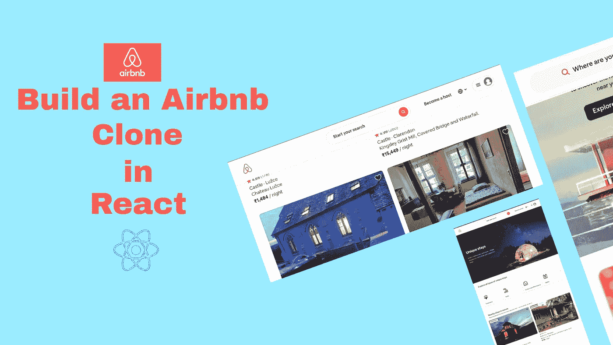
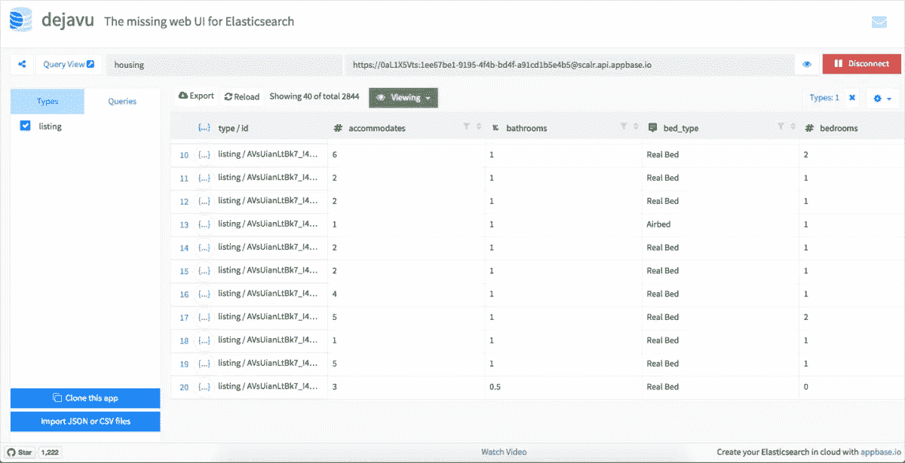
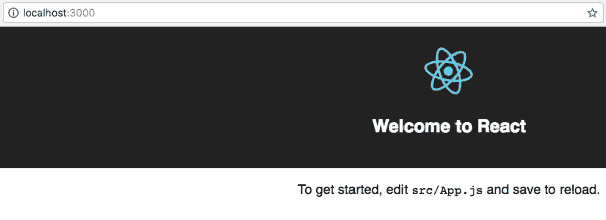
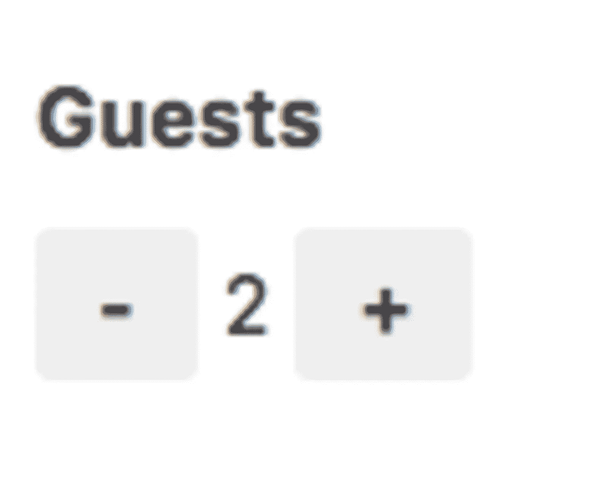
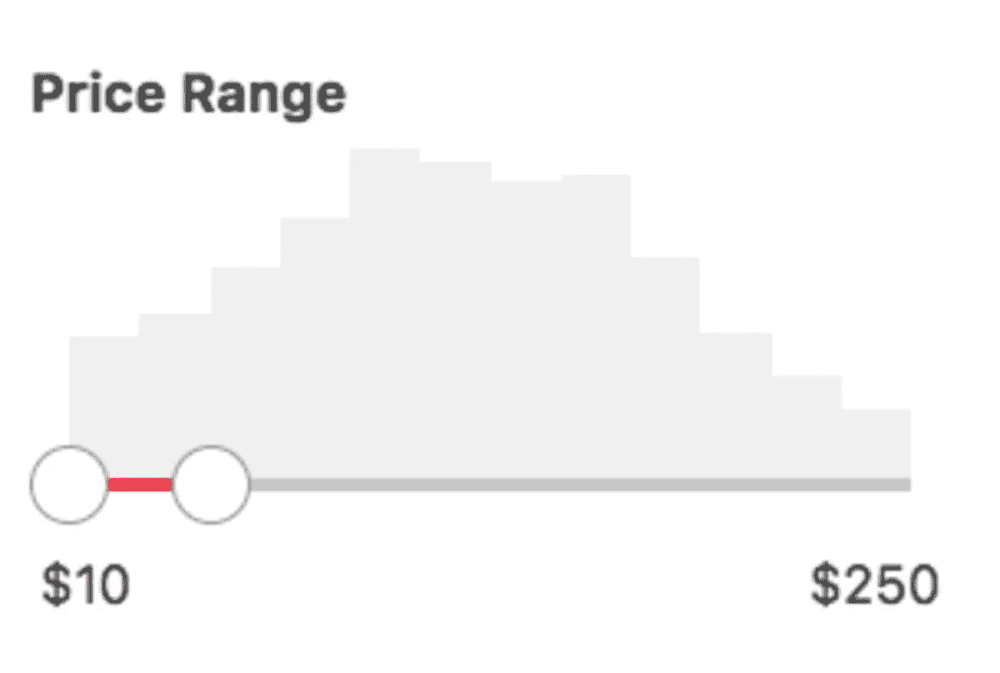
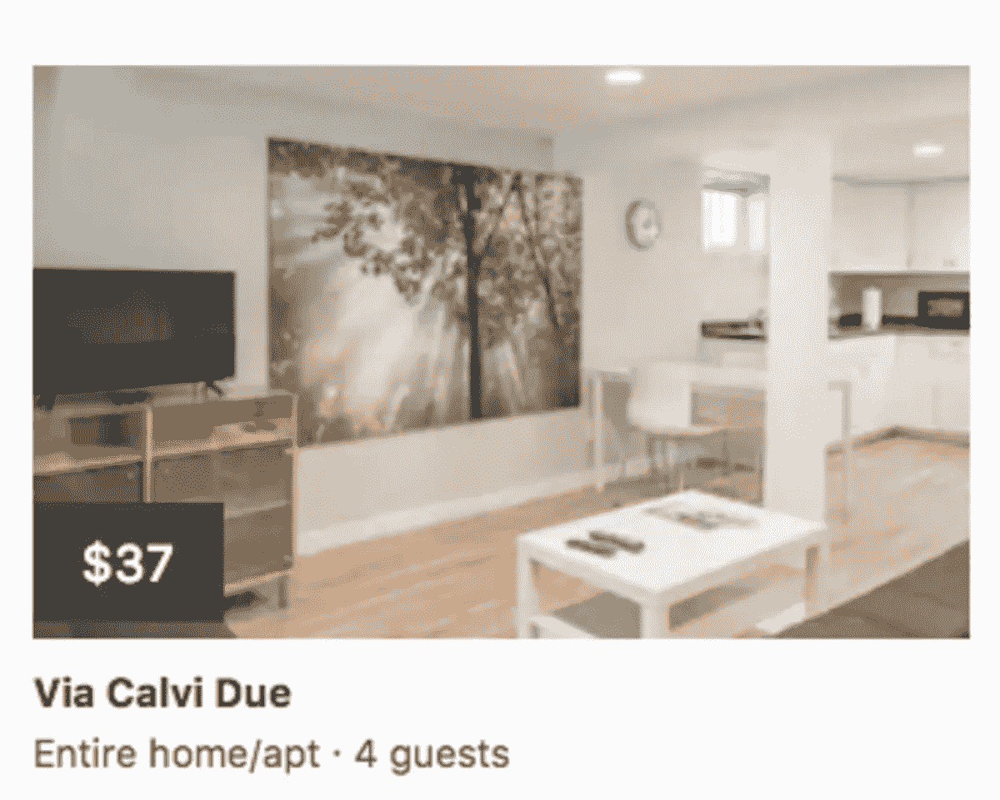
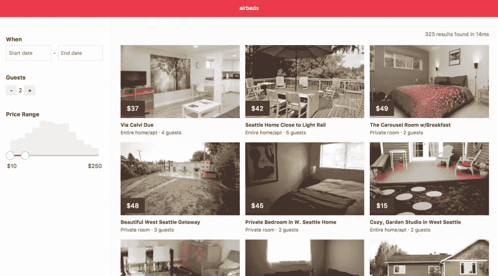

# 如何在 React 中构建 Airbnb 克隆

> 原文：<https://javascript.plainenglish.io/how-to-build-airbnb-clone-in-react-70265acf5159?source=collection_archive---------5----------------------->

## 了解如何使用 React 和弹性搜索构建 Airbnb 克隆



读者你好！

今天在这篇文章中，我们将看到如何使用 React 和 Elastic 构建 Airbnb 克隆。我们都知道什么是反应？。让我们来看看一点弹性搜索。

弹性搜索是一个超级快速的开源搜索引擎。它用于快速存储、搜索和分析大量数据。

使用弹性搜索，我们可以建立一个快速搜索查询 DSL。正确设置弹性搜索需要大量的工作。在弹性搜索中，应该正确设置数据映射。我们可以在搜索查询中添加更多的过滤器。

# 如何使用 React 进行弹性搜索？

我们将使用 ReactiveSearch 这一开源组件库进行弹性搜索。它提供了一个高度可定制的 UI 组件，与弹性搜索服务器连接，并为所有用例提供合适的默认搜索查询。

让我们通过以下代码构建一个使用弹性搜索的 searchbox UI 示例:

```
<DataSearch
    componentId="search"
    dataField="name"
    placeholder="Search housings..."
    iconPosition="left"
/>
```

# 先决条件

要构建一个类似 Airbnb 的应用程序，我们需要一些东西来开始:

*   Airbnb 房屋属性的数据集。
*   弹性搜索托管。

我已经为我们的应用程序创建了一个数据集。您可以查看以下内容:



# 设置

首先，在本地终端中使用 Create React App 命令。然后用**纱**代替 **npm** 导入模块。

```
yarn global add create-react-app
create-react-app airbeds
cd airbeds
yarn start
```



此时，您目录结构如下所示:

```
airbeds
├── README.md
├── node_modules
├── package.json
├── .gitignore
├── yarn.lock
├── public
│   └── favicon.ico
│   └── index.html
│   └── manifest.json
└── src
    └── App.css
    └── App.js
    └── App.test.js
    └── index.css
    └── index.js
    └── logo.svg
    └── registerServiceWorker.js
```

接下来，通过以下命令安装 ReactiveSearch:

```
yarn add @appbaseio/reactivesearch@2.16.1
```

## 将第一个 ReactiveSearch 组件添加到 ReactiveBase

在 **/src/App.js** 中包含弹性搜索索引和 ReactiveSearch 组件的容器组件中添加所有 ReactiveSearch 组件:

```
import React, { Component } from 'react';
import { ReactiveBase } from '@appbaseio/reactivesearch';

class App extends Component {
  render() {
    return (
      <section className="container">
        <ReactiveBase
          app="housing"
          credentials="0aL1X5Vts:1ee67be1-9195-4f4b-bd4f-a91cd1b5e4b5"
          type="listing"
        >
          Hello from ReactiveSearch!
        </ReactiveBase>
      </section>
    );
  }
}
export default App;
```

# 添加 UI 组件

首先添加允许用户选择住宿范围的日历 UI。以下代码看起来像这样:

*   componentid 是一个重要的属性，需要唯一的字符串来标识组件。
*   **dataField** props 用于设置用户搜索查询的数据是字符串还是字符串数组。
*   **queryFormat** 用于设置 DateRange 组件的日期格式。

现在**数字框** UI 代码看起来像这样:

```
import { NumberBox } from '@appbaseio/reactivesearch';

<NumberBox
    componentId="GuestSensor"
    dataField="accommodates"
    title="Guests"
    defaultSelected={2}
    data={{
        start: 1,
        end: 16
    }}
/>
```



然后，价格过滤器用于客户根据他们的预算过滤住宿。

```
import { RangeSlider } from '@appbaseio/reactivesearch';

<RangeSlider
    componentId="PriceSensor"
    dataField="price"
    title="Price Range"
    range={{
        start: 10,
        end: 250
    }}
    rangeLabels={{
        start: "$10",
        end: "$250"
    }}
    defaultSelected={{
        start: 10,
        end: 50
    }}
    stepValue={10}
    react={{
        and: ["DateRangeSensor"]
    }}
/>
```

现在我们已经创建了一个 **RangeSlider** 来控制滑块的边界。它用于添加标签和选择范围。

我们正在使用新的道具，根据所选的日期和客人数量动态更新价格。



现在我们必须创建 Airbnb 卡来显示搜索结果:

```
import { ResultCard } from '@appbaseio/reactivesearch';

<ResultCard
    componentId="SearchResult"
    dataField="name"
    from={0}
    size={10}
    onData={this.onData}
    pagination={true}
    react={{
        and: ["GuestSensor", "PriceSensor", "DateRangeSensor"]
    }}
/>
```

现在，通过使用我们项目中的所有道具， **ResultCard** 数据道具被用作回调函数，以返回数据库中 **ResultCard** 元素之间的映射。现在 **onData** 方法代码看起来是这样的:

```
onData(data) {
    return {
        image: data.image,
        title: data.name,
        description: (
            <div>
                <div className="price">${data.price}</div>
                <p className="info">{data.room_type} · {data.accommodates} guests</p>
            </div>
        ),
        url: data.listing_url,
    };
}
```

我们正在从 JSX 的数据库返回一个对象，该对象映射到卡片布局的图像、标题和描述。



# 结合元素

现在将所有这些组件组合到 **src/App.js** 文件中。然后我还会在类名中添加占位符类。

```
import React from 'react';
import { ReactiveBase, NumberBox, DateRange, RangeSlider, ResultCard } from '@appbaseio/reactivesearch';

export default () => (
    <div className="container">
        <ReactiveBase
            app="housing"
            credentials="0aL1X5Vts:1ee67be1-9195-4f4b-bd4f-a91cd1b5e4b5"
            type="listing"
            theme={{
                primaryColor: '#FF3A4E',
            }}
        >
            <nav className="nav">
                <div className="title">airbeds</div>
            </nav>
            <div className="left-col">
                <DateRange
                    dataField="date_from"
                    componentId="DateRangeSensor"
                    title="When"
                    numberOfMonths={2}
                    queryFormat="basic_date"
                    initialMonth={new Date('04-01-2017')}
                />

                <NumberBox
                    componentId="GuestSensor"
                    dataField="accommodates"
                    title="Guests"
                    defaultSelected={2}
                    labelPosition="right"
                    data={{
                        start: 1,
                        end: 16,
                    }}
                />

                <RangeSlider
                    componentId="PriceSensor"
                    dataField="price"
                    title="Price Range"
                    range={{
                        start: 10,
                        end: 250,
                    }}
                    rangeLabels={{
                        start: '$10',
                        end: '$250',
                    }}
                    defaultSelected={{
                        start: 10,
                        end: 50,
                    }}
                    stepValue={10}
                    interval={20}
                    react={{
                        and: ['DateRangeSensor'],
                    }}
                />
            </div>

            <ResultCard
                className="right-col"
                componentId="SearchResult"
                dataField="name"
                size={12}
                onData={data => ({
                    image: data.image,
                    title: data.name,
                    description: (
                        <div>
                            <div className="price">${data.price}</div>
                            <p className="info">{data.room_type} · {data.accommodates} guests</p>
                        </div>
                    ),
                    url: data.listing_url,
                })}
                pagination
                react={{
                    and: ['GuestSensor', 'PriceSensor', 'DateRangeSensor', 'search'],
                }}
                innerClass={{
                    resultStats: 'result-stats',
                    list: 'list',
                    listItem: 'list-item',
                    image: 'image',
                }}
            />
        </ReactiveBase>
    </div>
);
```

现在你可以看到功能齐全的用户界面。你可以看到滑动功能和搜索结果。唯一缺少的是布局和风格安排。

# 添加样式和布局

现在，通过在 **App.css** 中添加以下代码来添加样式和布局，并将其导入到 **App.js** 文件中。

```
.container {
  display: flex;
  padding-top: 52px;
}
.container .nav {
  width: 100%;
  position: fixed;
  top: 0;
  left: 0;
  z-index: 1;
  display: flex;
  justify-content: center;
  align-items: center;
  background-color: #FF3A4E;
  color: #fff;
  height: 52px;
  padding: 0 25px;
}
.container .left-col {
  width: 320px;
  height: 100%;
  padding: 15px 20px;
  position: fixed;
  left: 0;
  right: 0;
  border-right: 1px solid #f0f0f0;
}
.container .left-col > div {
  margin: 40px 0;
}
@media all and (max-width: 768px) {
  .container .left-col {
    position: static;
    width: 100%;
    height: auto;
    border-right: 0;
    border-bottom: 1px solid #f0f0f0;
  }
}
.container .right-col {
  width: calc(100% - 320px);
  position: relative;
  left: 320px;
  padding: 25px 30px;
  background-color: #fbfbfb;
}
.container .right-col .list {
  margin-bottom: 30px;
}
.container .right-col .list-item {
  max-width: none;
  min-width: 0;
  width: calc(30% - 16px);
  height: auto;
  background-color: transparent;
  border: 0;
  border-radius: 0;
  box-shadow: none;
  position: relative;
  padding: 0;
}
.container .right-col .list-item h2 {
  padding-bottom: 4px;
}
.container .right-col .list-item .image {
  background-size: cover;
}
.container .right-col .list-item .price {
  width: 70px;
  height: 44px;
  background-color: #424242;
  position: absolute;
  top: 160px;
  left: 0;
  color: #fafafa;
  font-size: 18px;
  display: flex;
  justify-content: center;
  align-items: center;
  letter-spacing: 0.03rem;
}
.container .right-col .list-item .info {
  color: #555;
  font-size: 14px;
  margin-bottom: 4px;
}
.container .right-col .result-stats {
  text-align: right;
  color: #666;
  font-size: 15px;
}
@media all and (min-width: 1441px) {
  .container .right-col .list-item {
    width: calc(25% - 16px);
  }
}
@media all and (max-width: 1024px) {
  .container .right-col .list-item {
    width: calc(50% - 16px);
  }
}
@media all and (max-width: 768px) {
  .container .right-col {
    width: 100%;
    position: static;
    padding: 25px 15px;
  }
}
@media all and (max-width: 480px) {
  .container .right-col .list-item {
    width: calc(100% - 16px);
    margin-bottom: 20px;
  }
}
```



Final result

# 结论

我希望你喜欢，现在你将知道如何使用 React 构建 Airbnb UI。你可以添加更多的功能，如认证，添加更多的搜索框和排序不同的订单。

感谢阅读！

## **简单英语的 JavaScript**

你知道我们有三份出版物和一个 YouTube 频道吗？在[**plain English . io**](https://plainenglish.io/)找到所有内容的链接！