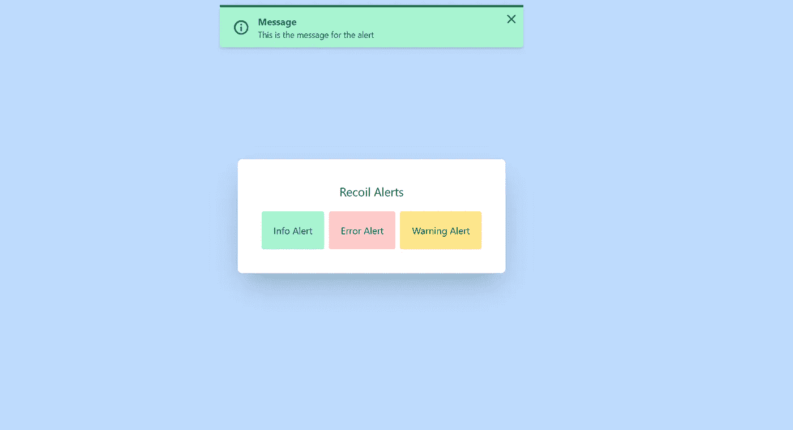

# 如何使用反冲构建警报组件

> 原文：<https://javascript.plainenglish.io/how-to-build-an-alert-component-using-recoil-eec9cae6ae79?source=collection_archive---------12----------------------->


反应状态管理是一个广泛的话题，选择正确的管理工具通常是困难的。众所周知，React 缺少状态管理工具，通常由开发人员来解决。然而，多年来，一些伟大的工具已经出现，给开发者一些强大的功能。

在本文中，我们将使用反冲来构建一个警报组件，但是您可以在您选择的任何状态管理工具中应用相同的原则。

如果您想直接进入代码，这里是整个项目的回购:

[](https://github.com/EntryLevelDeveloperTraining/recoil-alerts) [## entryleveldeveloper training/反冲警报

### 这是一个由 create-next-app 引导的 Next.js 项目。首先，运行开发服务器:打开…

github.com](https://github.com/EntryLevelDeveloperTraining/recoil-alerts) 

# 设置

我将从我创建的一个名为 Next.js Tailwind CSS Starter 的项目开始这个项目。您可以在这里找到代码 repo:

[](https://github.com/EntryLevelDeveloperTraining/nextjs-tailwind-css-starter) [## entry veldeveloper training/next js-tail wind-CSS-starter

### 这是一个由 create-next-app 引导的 Next.js 项目。首先，运行开发服务器:打开…

github.com](https://github.com/EntryLevelDeveloperTraining/nextjs-tailwind-css-starter) 

因此，我开始使用 Next.js 和 Tailwind CSS 来启动我的项目，以便在没有太多配置的情况下轻松完成一些事情。如果你想要一个起点，你可以克隆这个回购。

# 装置

现在我已经准备好了我的初学者项目，我现在需要的就是安装反冲。

```
npm install recoil 
```

# 风格

在我们开始创建组件之前，我想用 Tailwind CSS 设置我的样式。这是我在 Tailwind 中的组件，我将用来显示信息、错误和警告警报。

```
.screen {
  @apply w-screen h-screen flex justify-center items-center bg-blue-200;
}.paper {
  @apply bg-white shadow-2xl rounded-lg border p-10;
}.h1 {
  @apply text-center pb-5 text-xl;
}.alert-info {
  @apply bg-green-200 border-green-600 text-green-800;
}.alert-error {
  @apply bg-red-200 border-red-600 text-red-800;
}.alert-warning {
  @apply bg-yellow-200 border-yellow-600 text-yellow-800;
}.btn-info {
  @apply bg-green-200 hover:bg-green-100 p-5 rounded text-black focus:outline-none;
}.btn-error {
  @apply bg-red-200 hover:bg-red-100 p-5 rounded text-black focus:outline-none;
}.btn-warning {
  @apply bg-yellow-200 hover:bg-yellow-100 p-5 rounded text-black focus:outline-none;
}
```

这里没什么太难的。您可以看到我正在为警报定义颜色，如下所示:

```
bg-red-200 border-red-600 text-red-800;
```

当背景是柔和的颜色时，边框的饱和度更高，而文本的饱和度最高。

# 回复状态

现在，让我们创建反冲状态，该状态将保存显示警报所需的文本、警报类型以及在经过一定时间后关闭警报的超时。

```
import { atom, RecoilState } from 'recoil';export interface AlertState {
  open: boolean;
  primary: string;
  secondary: string;
  type: string;
  timeout: number;
}export const alertState: RecoilState<AlertState> = atom({
  key: 'alertState',
  default: {
    open: false,
    primary: '',
    secondary: '',
    type: 'info',
    timeout: 5000,
  },
});
```

我还使用类型脚本来定义我将在反冲原子中保存的信息。

反冲原子是反冲中的基本类型，可以用来存储任何类型的状态。

它保持了原生 React Hooks 提供的相同流程，因此很容易实现到 React 项目流中。

我给了它`alertState`的键，以确定我将把它用于我的警报组件。

# 警报组件

现在我们来谈谈警报组件。我需要把它分成两部分。第一个组件将是显示警报的实际组件，第二个组件将是知道何时显示不同类型的警报的容器。

```
interface AlertProps {
  type?: string;
  icon?: React.ReactNode;
  primary: string;
  secondary?: string;
  onClose?: Function;
}function Alert(props: AlertProps) {
  const { type, icon, primary, secondary, onClose } = props;
  return (
    <div
      className={`relative border-t-4 rounded-b px-4 py-3 shadow-md my-2 alert-${type}`}
      role="alert"
    >
      <div className="absolute top-0 right-0 p-2">
        <div className="cursor-pointer" title="Close" onClick={() => onClose()}>
          <CloseIcon />
        </div>
      </div>
      <div className="flex items-center">
        <div className="p-2 pr-4">{icon}</div>
        <div>
          <p className="font-bold">{primary}</p>
          <p className="text-sm">{secondary}</p>
        </div>
      </div>
    </div>
  );
}
```

第一个组件将负责显示一个图标，显示主要和次要文本，以及一个关闭按钮。它也将参考我在上面设置的 Tailwind CSS 样式的组件。

```
function InfoAlert(props: AlertProps) {
  return <Alert {...props} type="info" icon={<InfoIcon />} />;
}function ErrorAlert(props: AlertProps) {
  return <Alert {...props} type="error" icon={<ErrorIcon />} />;
}function WarningAlert(props: AlertProps) {
  return <Alert {...props} type="warning" icon={<WarningIcon />} />;
}
```

在这里，我将设置一些帮助器组件，这些组件将引用正确的类型和图标。我需要提到的是，我通过去[https://heroicons.dev/](https://heroicons.dev/)创建了图标

```
export function useAlert() {
  const [alert, setAlert] = useRecoilState<AlertState>(alertState);
  const showAlert = (props) => {
    setAlert({
      ...alert,
      ...props,
    });
  };
  useEffect(() => {
    if (alert?.open && alert?.timeout) {
      setTimeout(() => {
        showAlert({
          open: false,
        });
      }, alert?.timeout);
    }
  }, [alert?.open, alert?.timeout]);
  return { alert, showAlert };
}
```

我还设置了一个钩子，它使用反冲状态和一个助手函数来设置反冲原子的状态。它还使用一个`useEffect`来设置超时，每当它打开时，它将设置超时来关闭警报。

```
export default function Alerts() {
  const { alert, showAlert } = useAlert();
  const onClose = () => {
    showAlert({
      open: false,
    });
  };

  return (
    <Transition
      show={alert.open}
      enter="transition ease-out duration-500"
      enterFrom="transform opacity-0 scale-95"
      enterTo="transform opacity-100 scale-100"
      leave="transition ease-in duration-500"
      leaveFrom="transform opacity-100 scale-100"
      leaveTo="transform opacity-0 scale-95"
      className="fixed inset-x-0 top-0 w-2/3 md:w-1/3 mx-auto z-50"
    >
      {alert.type === 'info' && (
        <InfoAlert
          primary={alert.primary}
          secondary={alert.secondary}
          onClose={() => onClose()}
        />
      )}
      {alert.type === 'error' && (
        <ErrorAlert
          primary={alert.primary}
          secondary={alert.secondary}
          onClose={() => onClose()}
        />
      )}
      {alert.type === 'warning' && (
        <WarningAlert
          primary={alert.primary}
          secondary={alert.secondary}
          onClose={() => onClose()}
        />
      )}
    </Transition>
  );
}
```

Tailwind 也有一个过渡库，使得过渡在类中的使用更加简单。如果您想安装库来使用转换组件，就像我在这里做的那样，那么您可以运行这个安装命令:

```
npm install @headlessui/react
```

所以上面是主要的警报组件，它知道什么时候显示什么类型的警报。我使用条件语句来更好地记录代码在做什么，但是我也可以使用映射来显示基于类型的组件。它还负责关闭警报。

# 应用程序组件

在 Next.js `_app.tsx`组件中，我需要为反冲和我的警报组件添加一些代码。

```
import '../styles/index.css';
import { RecoilRoot } from 'recoil';
import Alerts from '../components/core/Alerts';function MyApp({ Component, pageProps }) {
  return (
    <RecoilRoot>
      <Component {...pageProps} />
      <Alerts />
    </RecoilRoot>
  );
}export default MyApp;
```

反冲将不会工作，除非我们将应用程序包装在反冲根组件中，我还添加了我的警报组件，以便能够在应用程序的任何地方使用它。

# 主页

在主页`index.tsx`组件中，我添加了一些测试功能来显示运行中的警报。

```
import { useAlert } from '../components/core/Alerts';function InfoButton() {
  const { showAlert } = useAlert();
  const onClick = (type: string) => {
    showAlert({
      open: true,
      primary: 'Message',
      secondary: 'This is the message for the alert',
      type,
    });
  };
  return (
    <button className="btn-info" onClick={() => onClick('info')}>
      Info Alert
    </button>
  );
}function ErrorButton() {
  const { showAlert } = useAlert();
  const onClick = (type: string) => {
    showAlert({
      open: true,
      primary: 'Message',
      secondary: 'This is the message for the alert',
      type,
    });
  };
  return (
    <button className="btn-error" onClick={() => onClick('error')}>
      Error Alert
    </button>
  );
}function WarningButton() {
  const { showAlert } = useAlert();
  const onClick = (type: string) => {
    showAlert({
      open: true,
      primary: 'Message',
      secondary: 'This is the message for the alert',
      type,
    });
  };
  return (
    <button className="btn-warning" onClick={() => onClick('warning')}>
      Warning Alert
    </button>
  );
}export default function Home() {
  return (
    <div className="screen">
      <div className="paper">
        <div className="h1">Recoil Alerts</div>
        <div className="flex gap-2">
          <InfoButton />
          <ErrorButton />
          <WarningButton />
        </div>
      </div>
    </div>
  );
}
```

我设置了三个按钮，点击时会显示一个警告。下面是运行中的组件的屏幕截图。



# 结论

React 有很多状态管理工具，但是我发现当你想保持和 React 钩子一样的 API 基础，并且不想处理太多的渲染时，反冲是一个很好的库。

还有许多你可以使用的警告组件，但是我发现使用 Tailwind CSS 和样式化你自己的组件可以让你的页面脱颖而出，而不是千篇一律。