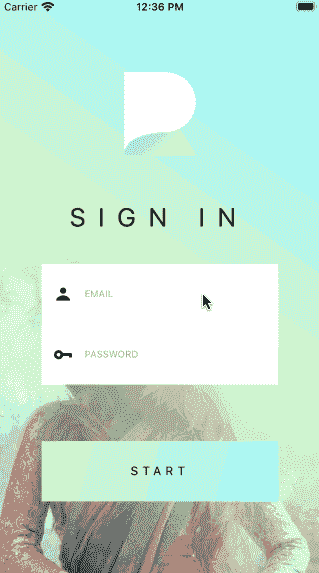
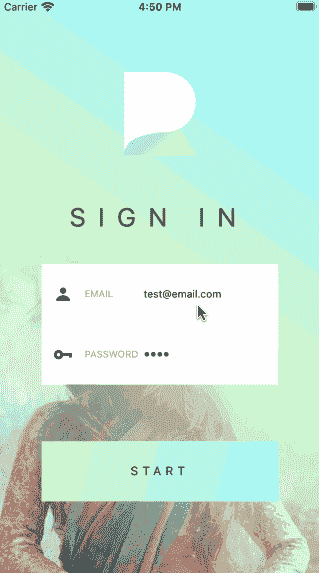

# 如何使用 React Native 构建动画登录屏幕

> 原文：<https://javascript.plainenglish.io/how-to-build-animated-login-screens-with-react-native-edb81cb500aa?source=collection_archive---------3----------------------->

## 如何用动画组件构建一个漂亮的交互式登录界面

在本教程中，我将向您展示:

*   如何用一组简单的输入指令呈现和更新自定义输入块
*   如何调用基于键盘显示/隐藏状态的动画？
*   如何创建外观平滑的自定义动画输入组件

下面是给你一个最终结果是什么样子的想法。

**React Native Starter Kit** :这个登录界面是取自*React Native Share Starter Kit*的样本，在[这里](https://market.nativebase.io/view/react-native-share-app-theme)可以买到。

**React Native Resources:** 希望我们向您发送来自网络的最新 React Native 故事、教程、资源等，以帮助您构建更好的应用。[在此注册](http://knowlephant.com)。

**Git repo** :我在这里贴了一个公开的 repo，里面有这个项目[的源代码。](https://bitbucket.org/henkcorporaal/ui_template_login_screen/src/master/)

# 构建 LogoView 动画效果

登录界面由三个独立的视图组成，为此我创建了三个不同的组件:logo view*和 InputView* 和 BlockButton 。

让我们从第一个开始:动画 LogoView，为此我必须解决两个挑战:

1.  如何跟踪键盘的显示/隐藏状态？
2.  如何让 logo 动画显得流畅而不是跳动？

从第一个开始， *LogoView* 包含两个事件监听器，跟踪键盘的显示/隐藏状态:

需要注意的是 android 和 iOS 的 KeyboardEventName 是不同的，因此需要进行平台检查。

每个事件侦听器调用一个函数来放大或缩小徽标和徽标文本。这给我们带来了第二个挑战:

Left: a not so smooth animation effect. Right: a much smoother animation effect

左边的“不太平滑的动画效果”发生在动画被直接修改时，而不是通过它的可变引用。

关于这个容易被忽视的错误，React Native docs 官方给出了以下警告:

*注意:不要直接修改动画值。可以使用* `[*useRef*](https://reactjs.org/docs/hooks-reference.html#useref)` [*钩子*](https://reactjs.org/docs/hooks-reference.html#useref) *返回一个可变的 ref 对象。这个 ref 对象的* `*current*` *属性被初始化为给定的参数，并在整个组件生命周期中保持不变。*

记住这个有用的技巧，实际动画的代码非常简单:

有关使用 *useNativeDriver* 的更多背景信息，请参见本文。

# 从一组*输入选项*中创建自定义输入元素

因为应用程序通常有许多需要多个自定义输入元素的身份验证屏幕，所以能够以一种快速、轻松地添加和修改输入元素的方式呈现我们的输入元素，同时编写最少的代码，这将是非常有用的。

我们面临的另一个挑战是，当我们与屏幕交互时，如何告诉屏幕哪个输入元素要增长，哪个要收缩。

从一组输入选项构建定制输入元素是这两个问题的答案。

考虑以下设置:

1.  登录屏幕跟踪每个输入值的状态，并检查在给定时刻哪个输入元素是活动的。
2.  每个值的状态被传递给我们的输入选项对象数组。
3.  相同的输入选项可以以类似的方式使用，以基于用户交互来更新每个值。

实际上，这看起来如下:

每个 options 对象通过映射对象数组并通过 props 传递每组选项来呈现自定义输入元素。

现在，我们可以简单地呈现我们的自定义输入组件，如下所示:

# 向我们的自定义输入元素添加动画效果

向自定义输入元素添加动画现在相当简单，因为它基本上可以归结为复制之前在动画 *LogoView* 组件中实现的设置。

剩下的两个挑战是:

*   当用户按下输入元素时，如何在每个*文本输入*之间改变焦点——目标是整个输入元素变成交互式的，而不仅仅是*文本输入*部分。
*   如何仅在输入元素处于活动状态时渲染阴影，从而使其在非活动状态时不可见？

但是让我们从第一个开始。您可能还记得，每个元素的 *TextInput* 组件都是根据它们传入的活动状态设置为活动/非活动的。通过将选项传递给 useEffect 中的第二个参数数组，我们可以确保每当 input options 对象改变时 input 元素都会更新。

通过检查 active 属性，并设置对 *TextInput、*的引用，现在可以通过编程为每个单独的 Input 元素聚焦 *TextInput* 。

为了显示输入组件的增长/收缩动画，我用两个动画*包装了 TextInput。查看*组件和一个*可触摸不透明*组件。添加后者是为了确保 on-press 不仅限于 TextInput，而是在整个输入块上注册。

最后一步是停用 TextInput 手势处理程序，因为我们不再需要它们了——因为 TextInput 焦点现在是通过 Touchable 的 onPress 处理程序设置的。

通过设置包装器视图的 pointerEvents 来实现这一点: *pointerEvents="none"*

AnimatedTextInput 组件的其余部分现在如下所示:

您可能会注意到添加到动画视图组件的`*$activeShadow*` styles 属性。这有助于我们在选项的活动属性激活时渲染阴影。

这就完成了教程。我希望这篇文章能启发你在下一个应用程序中使用身份验证屏幕。在下一篇教程中，我将向[展示如何使用 React Native](https://medium.com/@henkcorporaal/creating-a-smooth-sign-in-and-logout-experience-with-react-native-62e5deffbff) 创建流畅的登录和注销体验。