# 如何使用 Angular、Ionic 框架和 Firebase 托管来构建 PWAs(渐进式 Web 应用程序)。

> 原文：<https://javascript.plainenglish.io/how-to-build-pwas-progressive-web-apps-using-angular-ionic-framework-and-firebase-hosting-bfe43e025eba?source=collection_archive---------3----------------------->

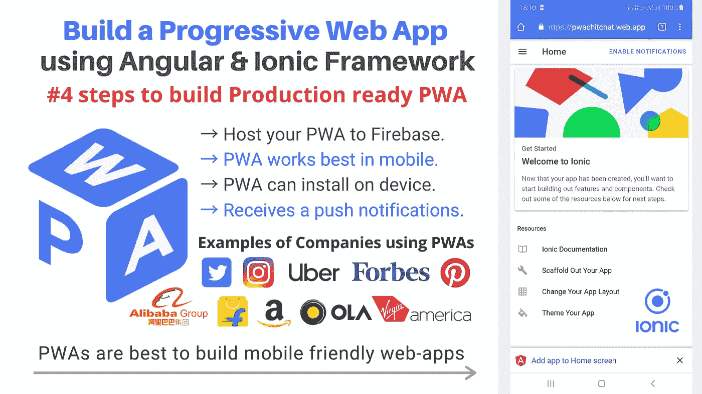

**简单的第 4 步**构建**生产就绪 PWA** 并在 Firebase 上托管它。
`PWAs are best to build mobile friendly web-apps.` `PWAs can install`在你的设备上，`It receives push notifications and even many more..`

## 什么是 PWA？

> ***PWA:P****rogressive****W****EB****A****application 是一种通过 web 交付的应用软件，使用常见的 web 技术构建，包括*`*HTML*`*`*CSS*`*和* `*JavaScript*` *。它适用于使用符合标准的浏览器的* `*work on any platform*` *。**

*让我们从创建一个**新的 Ionic 应用**开始:PWA 功能将在稍后添加。
在您的终端/命令提示符下运行该命令:*

```
*sudo ionic start pwaChitChat sidemenu --type=angular*
```

*(设置`sudo`以管理员身份执行该命令-对于 **Mac/Linux 用户**和 **Windows 用户** *→搜索命令提示符→右键单击，然后单击‘以管理员身份运行’*|`**sudo**`对于 Windows 用户不需要)*

*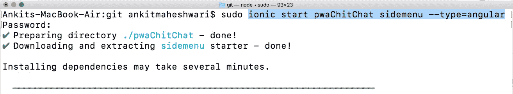*

*This command will generate a new directory of app by name: ‘pwaChitChat’*

# *#1 运行:在本地开发服务器上运行 Ionic blank 应用程序。*

*   *转到我们新创建的项目:`cd ./pwaChitChat`*
*   *在应用程序目录中运行`ionic serve`来查看我们的应用程序(这将在本地主机的 8100 端口上提供我们的应用程序)*

**安装后，我们将测试空白 Ionic 应用程序在我们的 PWA 清单中的得分。为了执行审计，我们将使用 Google 建议的工具，*[*light house*](https://developers.google.com/web/tools/lighthouse/)*。**

**所以我们要安装并使用* [*Lighthouse 命令行实用程序*](https://developers.google.com/web/tools/lighthouse/#cli) *。打开你的终端，安装* `*lighthouse*`*

```
*sudo npm install -g lighthouse*
```

*(`-g`代表全局)(`lighthouse`是包的名字)和(`npm`是 **N** ode 包 **M** 管理器安装像 lighthouse 这样的第三方库)*

**该命令将安装* `*lighthouse*` *，允许我们对 Ionic app 进行审计。用起来真的很简单，跑就行...**

```
*lighthouse URL-TO-TEST --view*
```

**(注意，我们使用* `*--view*` *参数运行 Lighthouse，以立即在浏览器中打开 HTML 报告)**

*通过运行以下命令对 Lighthouse 进行审计:*

```
*lighthouse http://localhost:8100/home --view*
```

**(确保您的* `*ionic serve*` *正在端口* `*8100*` *)**

**

*Run: [ `**lighthouse http://localhost:8100/home --view**` ] in your terminal/command-prompt | and this is how it’s looks like after running Lighthouse*

*该执行将为我们的 PWA 生成并打开灯塔报告。
看下面👇*PWA 的初始审核结果不佳* ( **0/100** )，因为我们从开发本地服务器提供应用程序，也因为代码不是使用性能增强(缩小等)构建的。*

*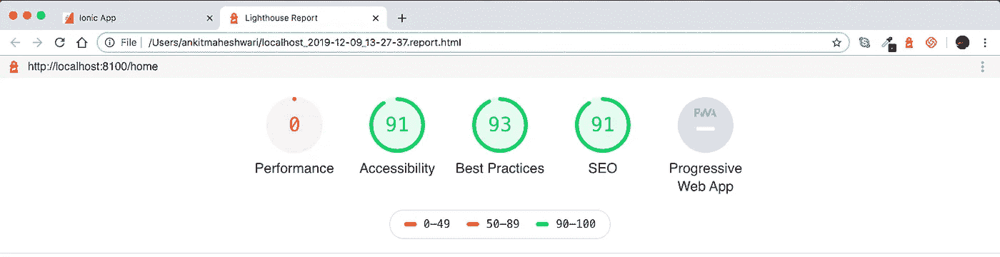*

*PWA has bad results (**0/100**)*

# *#2 运行:在本地生产服务器上运行 Ionic blank 应用程序。*

***这一次，我们将在构建应用时考虑性能。**通过运行…*

```
*sudo ionic build --prod*
```

*我们将执行性能增强的构建过程，并将在我们的 **/www** 文件夹中获得输出。*

> *(除了生产版本，我们还将使用更合适的 web 服务器运行我们的应用程序，而不是使用 Ionic CLI 自带的开发服务器。为此，我们将使用 `http-server`包。这个软件包使我们能够创建一个本地 web 服务器来提供您计算机上任何目录的内容。)*

*要安装`http-server`运行:*

```
*sudo npm install -g http-server*
```

*安装后，使用`http-server`实用程序真的很容易。*

*在项目文件夹内，通过运行以下命令启动 http 服务器:*

```
*http-server ./www -p 8888*
```

*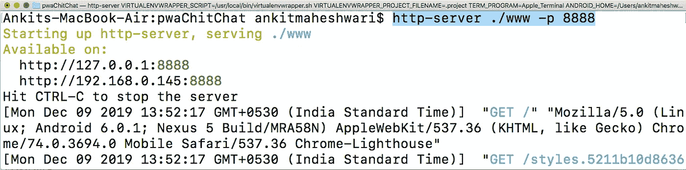*

*Run: [ `**http-server ./www -p 8888**` ] in your terminal/command-prompt*

*(这将在本地主机的端口 8888 上为我们的应用程序提供服务)然后通过简单地在 new-terminal/new-command-prompt 中运行命令来用 Lighthouse 执行审计:*

```
*lighthouse http://localhost:8888 --view*
```

*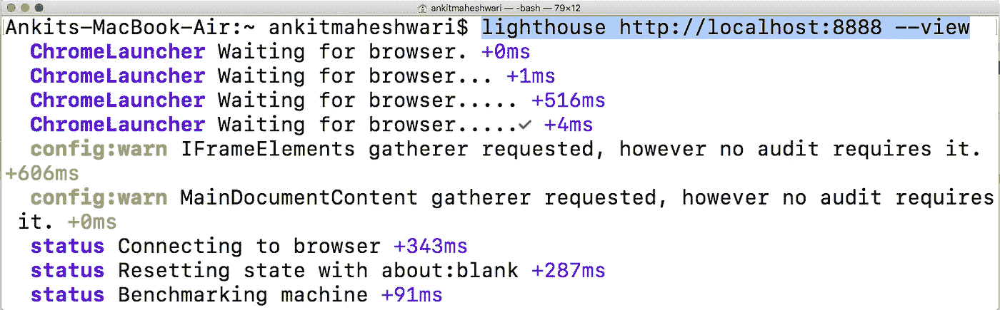*

*Run: [ `**lighthouse http://localhost:8888 --view**` ] in new terminal/command-prompt*

*看下面👇PWA 的初始审核结果不佳( **0/100** )，尽管我们将性能从 **0/100** 提高到 **72/100** ，但仍有进步空间。我们甚至还没有谈到构成 PWA 的任何原则。我们会马上报道。*

*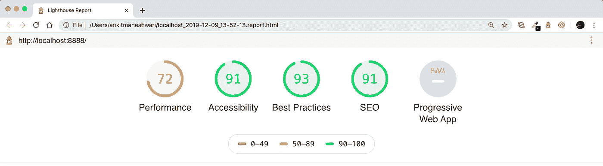*

*Improved performance from **0/100** to **72/100***

# *#3 运行:在本地生产服务器上运行 Ionic blank 应用程序——这次使用 PWA (@angular/pwa)*

*PWA 的两个主要要求是`Service Worker`和`Web Manifest`。虽然可以手动将这两者添加到应用程序中，但我强烈建议使用`@angular/pwa`包自动将服务人员和应用程序清单添加到应用程序中。要将此包添加到应用程序，只需运行:*

```
*sudo ng add @angular/pwa*
```

*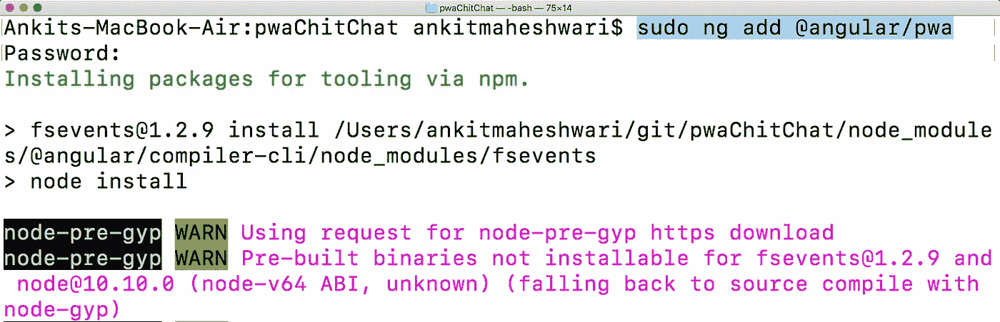*

*Run: [ `**sudo ng add @angular/pwa**` ] in your terminal/command-prompt*

> *[*点击此处*](https://medium.com/@AnkitMaheshwariIn/what-angular-is-5d27bffb1fb1) *了解更多我们有单独的文章来详细报道* [*棱角分明*](https://medium.com/@AnkitMaheshwariIn/what-angular-is-5d27bffb1fb1) *。**

***是时候看看 Ionic 应用程序在 PWA 功能上的表现了。**重新构建应用程序(以包含新的 PWA 功能),只需运行:*

```
*sudo ionic build --prod*
```

*然后通过运行以下命令启动 http 服务器:*

```
*http-server ./www -p 8888*
```

*最后，通过运行以下命令对 Lighthouse 进行审计:*

```
*lighthouse http://localhost:8888 --view*
```

*请看下面的“灯塔报告”页面👇**PWA 图标被激活** —这些检查验证渐进式 Web 应用程序的各个方面。*

*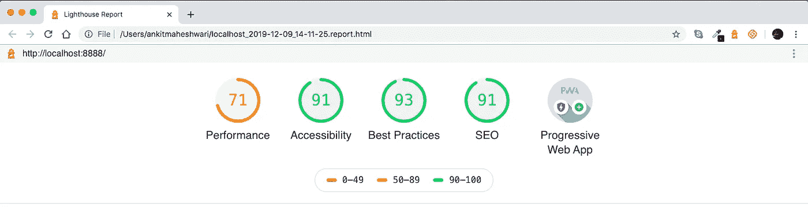*

*Here the ‘**Progressive Web App**’ icon is Activated!*

*我们也可以通过向下滚动“灯塔报告”页面来查看有关 PWA 的详细信息:*

*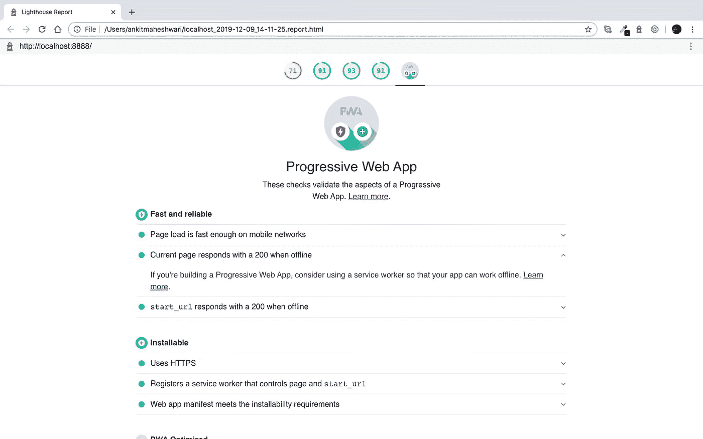*

*‘Lighthouse Report’ page shows the details about Progressive Web App*

*👏我们已经完成了工作👨‍💻用 Angular，Ionic 4/Ionic 框架构建渐进式 Web App (PWA)。*

# *#4 运行:Ionic blank 应用程序，PWA (@angular/pwa)部署到 Firebase 主机。*

*Firebase Hosting 非常容易使用，而且它是免费的，并为渐进式网络应用程序提供了许多好处，包括快速响应时间(感谢 CDN)，默认情况下启用 HTTPS，以及支持 HTTP2 推送。*

*跟我来，我会告诉你如何部署我们的离子 PWA 到 Firebase。*

# *开始前..*

***我们需要创建** [**设置一个 Firebase 项目**](https://medium.com/@AnkitMaheshwariIn/steps-to-setup-firebase-firestore-instruction-to-setup-firebase-firestore-database-c7cc49ce96de) **。**
[点击此处👆](https://medium.com/@AnkitMaheshwariIn/steps-to-setup-firebase-firestore-instruction-to-setup-firebase-firestore-database-c7cc49ce96de)了解安装 Firebase 的步骤(通过 web 在 Firebase Firestore 中创建新数据库。)*

*好了，我假设你已经按照上面的链接↑中的每一步设置了一个 Firebase 项目。*

*正确地[建立一个 Firebase 项目](https://medium.com/@AnkitMaheshwariIn/steps-to-setup-firebase-firestore-instruction-to-setup-firebase-firestore-database-c7cc49ce96de)之后，部署到 Firebase 就变得很容易了。*

*在部署到 Firebase 之前，我们应该始终准备生产版本。
让我们准备生产构建以提高性能。
要这样做，请遵循说明👇👇*

> *如果您正在构建 **Angular App** ，只需在您的命令提示符/终端中运行:*

```
*ng build --prod*
```

**您可能需要将“sudo”放在该命令的开头，以管理员身份执行该命令。或者，如果您是 Windows 用户，只需以管理员身份打开您的命令提示符。**

# *🎉要在本地测试您的角度生产制造:*

1.  *构建您的应用:`**ng build --prod**`*
2.  *安装为应用服务的 http-server:`sudo **npm i -g http-server**`*
3.  *cd(更改目录)放入
    的编译位置`**cd dist/my-project-name/**`*
4.  *使用`**http-server**`运行应用程序*
5.  *打开 http-server url，应该是这样的`[**http://127.0.0.1:8080/**](http://127.0.0.1:8080/)`*

> *如果您正在构建 **Ionic App** ，只需在您的命令提示符/终端中运行:*

```
*ionic build --prod*
```

**您可能需要将“sudo”放在该命令的开头，以管理员身份执行该命令。或者，如果您是 Windows 用户，只需以管理员身份打开您的命令提示符。**

*它到底是做什么的？ **— prod** 标志根据类型将整个项目最小化并优化为一个文件。它还会忽略你已经包含但没有使用的插件/导入。*

# *伟大的工作👏👏
我们现在准备将我们的项目部署到 Firebase🚀*

*只需运行以下命令即可部署应用程序:*

```
*firebase deploy*
```

**您可能需要将“sudo”放在该命令的开头，以管理员身份执行该命令。或者，如果您是 Windows 用户，只需以管理员身份打开您的命令提示符。**

*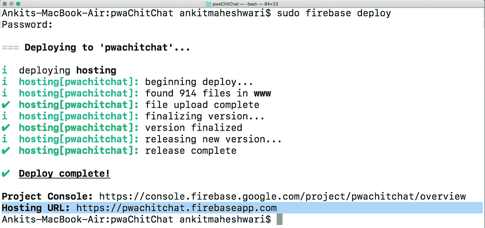*

*Run: [ `**firebase deploy**` ] in your terminal/command-prompt*

***一旦应用程序部署完毕**，运行以下命令对 Lighthouse 进行审计:*

```
*lighthouse PATH-TO-YOUR-FIREBASE-HOSTING-URL --view*
```

*这是我的 firebase 托管路径:(用你自己的路径替换下面的路径)*

```
*lighthouse https://pwachitchat.firebaseapp.com --view*
```

*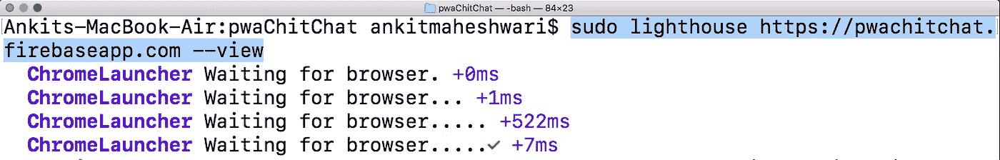*

*Run: [ `**lighthouse** PATH-TO-YOUR-FIREBASE-HOSTING-URL **--view**` ] in your terminal/command-prompt*

*🤩**祝贺你！**看下面👇Lighthouse 报告页面显示，我们使用 Ionic Framework 构建了一个渐进式 Web 应用程序，涵盖了所有原则——您可以选择向下滚动该页面并修复建议的问题，以便获得高达 100%的性能分数。*

*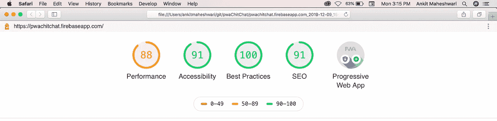*

*PWA Improved performance from **71/100** to **88/100***

*在你的移动 chrome 浏览器中打开 URL: `[https://pwachitchat.firebaseapp.com](https://pwachitchat.firebaseapp.com/)`(或者你的-FIREBASE-HOSTING-URL)。
这将要求您在主屏幕上添加应用程序 *→您可以随时从您的应用程序`/src`目录内的* `manifest.json`文件或`manifest.webmanifest`文件更改您的应用程序闪屏的 `*app-name*` *、* `*theme-color*` *、* `*background-color*` *。**

*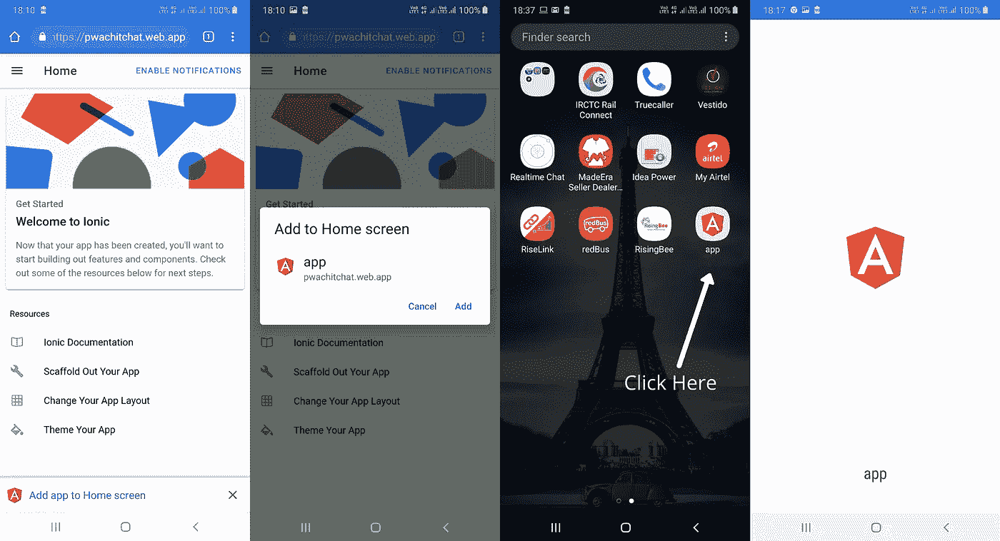*

***Steps to add ‘App’** on **‘Home Screen’***

# *iOS 上 PWAs 的功能*

*借助 iOS 上的网络平台，您可以访问:*

*   *地理定位*
*   *传感器(磁力计、加速计、陀螺仪)*
*   *照相机*
*   *音频输出*
*   *语音合成(仅连接耳机)*
*   *Apple Pay*
*   *WebAssembly，WebRTC，WebGL 以及其他许多实验性的特性都在一个旗帜下。*

# *PWAs 在 Android 上能做什么(在 iOS 上不能)*

*   *在安卓系统上，你可以存储超过 50 Mb 的数据*
*   *如果你不使用应用程序，Android 不会删除文件，但它可以在存储压力下删除文件。此外，如果用户大量安装或使用，PWA 可以请求永久存储。*
*   *BLE 设备的蓝牙接入*
*   *用于访问本机共享对话框的 Web 共享*
*   *语音识别*
*   *后台同步和网络推送通知*
*   *邀请用户安装应用程序的 Web 应用程序横幅*
*   *你可以自定义(一点点)闪屏和你想要的方向*
*   *使用 WebAPK 和 Chrome，用户不能安装一个以上的 PWA 实例*
*   *有了 WebAPK 和 Chrome，PWAs 出现在设置下，可以看到数据使用情况；在 iOS 上，所有内容都显示在 Safari 下。*
*   *通过 WebAPK 和 Chrome，PWA 管理其 URL 的意图，因此如果您获得 PWA 的链接，它将在独立模式下打开，而不是在浏览器窗口中打开。*

# *搞定了。🤩构建 PWA 就是这么简单。*

*再见👋👋*

> *请在评论框中随意评论…如果我错过了什么，或者什么是不正确的，或者什么对你不起作用:)*
> 
> *更多文章敬请关注:
> [https://medium.com/@AnkitMaheshwariIn](https://medium.com/@AnkitMaheshwariIn)*

*如果你不介意给它一些掌声👏 👏既然有帮助，我会非常感谢:)帮助别人找到这篇文章，所以它可以帮助他们！*

*永远鼓掌…*

**

# *下一步是添加—通过 Ionic4 和 Firebase 托管将通知推送到渐进式 Web 应用程序(PWA)。点击这里👇👇*

*[](https://medium.com/@AnkitMaheshwariIn/adding-push-notifications-to-progressive-web-app-pwa-with-ionic-4-and-firebase-hosting-e31784427f34) [## 使用 Ionic 4 和 Firebase 托管将推送通知添加到渐进式 Web 应用程序(PWA)。

### 我们可以通过添加推送通知让我们的产品或服务更具吸引力…

medium.com](https://medium.com/@AnkitMaheshwariIn/adding-push-notifications-to-progressive-web-app-pwa-with-ionic-4-and-firebase-hosting-e31784427f34)* 

**原载于 2019 年 12 月 22 日*[*【https://www.codewithchintan.com】*](https://www.codewithchintan.com/how-to-build-pwa-progressive-web-app-using-angular-ionic4-ionic-framework-and-firebase-hosting/)*。**

*【JavaScript 用简单的英语写的一句话:我们总是乐于帮助推广高质量的内容。如果你有一篇文章想用简单的英语提交给 JavaScript，用你的中级用户名发邮件到 submissions@javascriptinplainenglish.com[给我们，我们会把你添加为作者。](mailto:submissions@javascriptinplainenglish.com)*