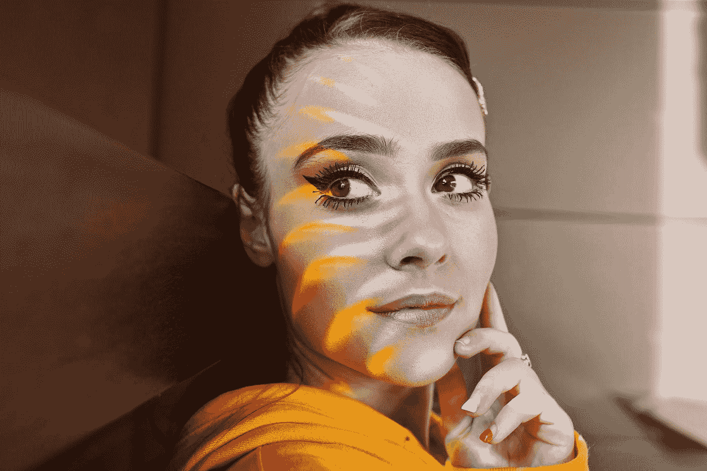
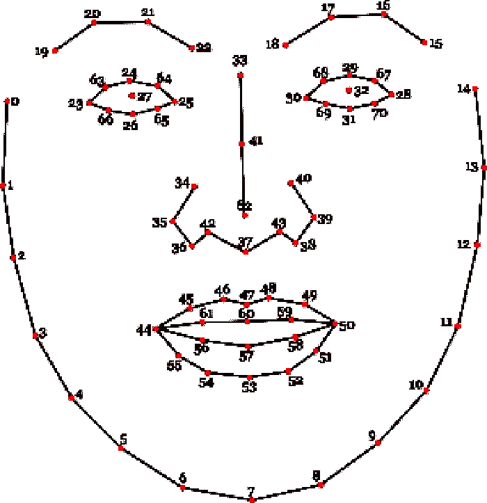
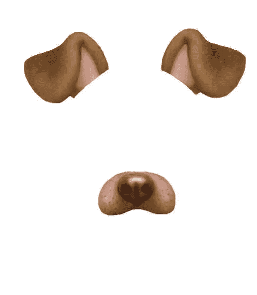

# 如何用 JavaScript 构建实时人脸检测

> 原文：<https://javascript.plainenglish.io/how-to-build-realtime-face-detection-in-javascript-64b083b7d88a?source=collection_archive---------6----------------------->

## 了解如何使用 JavaScript 构建实时人脸检测和应用过滤器，如 instagram。



Photo by [Aditya Ali](https://unsplash.com/@aditya_ali?utm_source=medium&utm_medium=referral) on [Unsplash](https://unsplash.com?utm_source=medium&utm_medium=referral)

读者你好！

今天在这篇文章中，我们讨论实时人脸检测以及如何应用 instagram 或 snapchat 功能等过滤器。在这个项目中，我们将创建一些超级酷的过滤器，如蜘蛛侠面具，狗过滤器等

# 检测人脸特征

在 JavaScript 中有一个名为 **clmtrackr 的库。**用于检测图像上的人脸。它还发现了鼻子、耳朵等…

一般来说，这个库提供了通用模型，它已经预先训练，并准备使用下列数量的功能。



Point map

如果我们用这个库处理一个图像，它将为地图上的每个点返回一个数组。每个点由 **x** 和 **y** 轴位置标识。如果你想替换任何东西，你可以用那个点上的数字。让我们开始建设这个惊人的项目。

# 基本代码结构

为了构建这个应用程序，我们将使用 **p5.js** 。这是一个 JavaScript 库，主要用于处理 canvas。它不是一个传统的用户界面库，但是当需要更新时，它将定义何时构建用户界面。它包含三个主要事件:

*   **preload** :用于执行在屏幕上构建任何 UI 前后加载的右库。
*   **设置**:在**预加载**之后，当我们准备构建初始 UI 时，也执行一次。
*   **draw** :循环内调用的函数，每次系统需要渲染屏幕时执行。

# 事先装好

现在我们将使用 preload 事件将图像加载到屏幕中。让我们看看下面的代码:

```
function preload() {
    // Spiderman Mask Filter asset
    imgSpidermanMask = loadImage("https://i.ibb.co/9HB2sSv/spiderman-mask-1.png");

    // Dog Face Filter assets
    imgDogEarRight = loadImage("https://i.ibb.co/bFJf33z/dog-ear-right.png");
    imgDogEarLeft = loadImage("https://i.ibb.co/dggwZ1q/dog-ear-left.png");
    imgDogNose = loadImage("https://i.ibb.co/PWYGkw1/dog-nose.png");
}
```

# 创建画布

为了提高响应速度，画布必须根据窗口大小动态调整大小。长宽比为 4∶3。这不是理想的选择，但是我们必须做一些假设来保持代码的效率。现在我们将使用下面的代码用 **P5.js** 函数 **createCanvas** 创建一个:

```
const maxWidth = Math.min(windowWidth, windowHeight);
pixelDensity(1);
outputWidth = maxWidth;
outputHeight = maxWidth * 0.75; // 4:3

createCanvas(outputWidth, outputHeight);
```

# 捕捉视频流

现在我们知道画布工作正常，然后我们需要通过我们的网络摄像头或相机捕捉视频。 **P5.js** 函数将使用 **videoCapture** 函数来实现这一点。

```
// webcam capture
videoInput = createCapture(VIDEO);
videoInput.size(outputWidth, outputHeight);
videoInput.hide();
```

# 构建过滤器选择

现在我们需要建立一个过滤器，我们必须为过滤器提供更多的选项。我们可以简单地使用这个项目的下拉功能。我们可以使用**P5 . js****create select()**函数来创建它。

```
// select filter
const sel = createSelect();
const selectList = ['Spiderman Mask', 'Dog Filter']; // list of filters
sel.option('Select Filter', -1); // Default no filter
for (let i = 0; i < selectList.length; i++)
{
    sel.option(selectList[i], i);
}
sel.changed(applyFilter);
```

# 创建图像捕捉

现在，对于图像捕捉，图像跟踪器是视频馈送的对象，它将识别面部的每一帧。跟踪器只需要设置一次。

```
// tracker
faceTracker = new clm.tracker();
faceTracker.init();
faceTracker.start(videoInput.elt);
```

# 绘制视频滤镜

为此我们需要更新 **P5.js** 中的 **draw** 事件。视频源到画布的输出将应用我们在其中被选择的任何过滤器。在我们的例子中，draw 函数非常简单。这将把复杂性推进到每个过滤器定义中。

```
function draw() {
  image(videoInput, 0, 0, outputWidth, outputHeight); // render video from webcam

  // apply filter based on choice
  switch(selected)
  {
    case '-1': break;
    case '0': drawSpidermanMask(); break;
    case '1': drawDogFace(); break;
  }
}
```

# 构建过滤器



Dog filter

构建过滤器的过程既简单又复杂。实际上，这取决于我们将要构建的过滤器。为了构建遮罩，我们需要将遮罩图像添加到屏幕的中心。首先，我们必须使用**facetraker . getcurrentposition()**来确保我们的 faceTracker 对象确实检测到一张人脸。

一旦检测到面部，我们必须使用 **P5.js** 来渲染图像，使用面部点 62 来使图像居中。然后用宽度和高度表示面部的大小，如下所示。

```
const positions = faceTracker.getCurrentPosition();
if (positions !== false)
{
    push();
    const wx = Math.abs(positions[13][0] - positions[1][0]) * 1.2; // The width is given by the face width, based on the geometry
    const wy = Math.abs(positions[7][1] - Math.min(positions[16][1], positions[20][1])) * 1.2; // The height is given by the distance from nose to chin, times 2
    translate(-wx/2, -wy/2);
    image(imgSpidermanMask, positions[62][0], positions[62][1], wx, wy); // Show the mask at the center of the face
    pop();
}
```

# 结论

我希望你喜欢它，并且学会了如何使用 JavaScript 库创建一个基本的过滤器。您可以自己创建更多令人惊叹的滤镜并添加到其中。

感谢阅读！