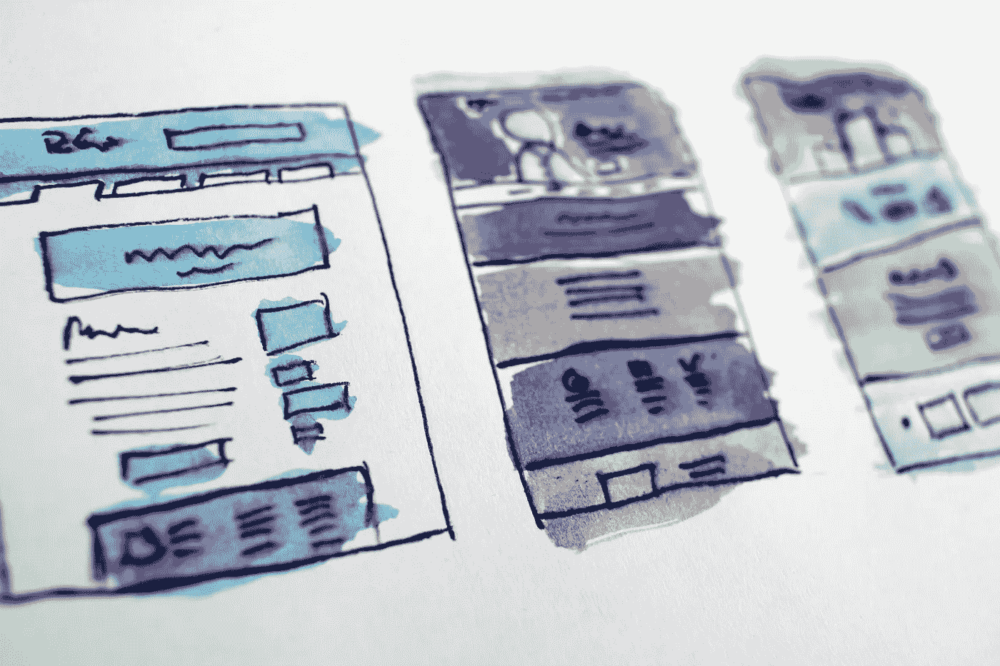
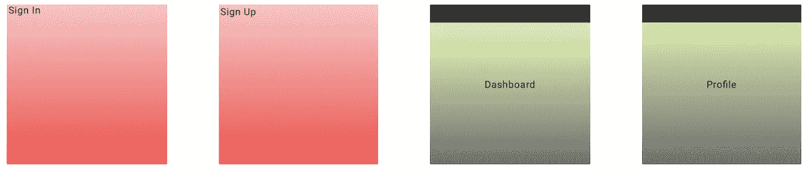

# 如何在 React JS 中构建可重用的布局

> 原文：<https://javascript.plainenglish.io/how-to-build-reusable-layouts-in-react-js-daf8adcbca79?source=collection_archive---------0----------------------->



在 web 开发过程中，我们经常会在应用程序的屏幕上遇到非常相似的布局，当我们使用 React JS 来构建这些布局时，这意味着我们将在许多组件中重复使用样式。

在下面这个简单的例子中，我们可以看到登录和注册页面共享红色渐变背景，其内容在左上角对齐，而仪表板和个人资料页面共享绿色渐变，组件和标题居中。



Example screens

在本教程中，我将向你展示一种在你的应用程序的页面之间非常有效地共享样式的技术。

# 重要的事情先来！

在本教程中，我将使用一个基础应用程序，在该应用程序中，我根据用户权限配置了路由和导航，这意味着只有经过身份验证的用户才能访问仪表板和个人资料页面。你可以在[这篇文章](https://medium.com/swlh/routing-and-navigation-in-react-cffc26e8a389)中看到我是如何做的。

> 虽然我建议您自己配置导航(这样您可以更好地了解幕后发生的一切)，但是您也可以在 codesandbox 上派生[这个模板](https://codesandbox.io/embed/react-basic-navigation-mk5lb?fontsize=14)，在 code sandbox 上已经为您配置了这个部分。

我们将在这个应用程序中使用[样式的组件](https://www.styled-components.com/docs/basics)(如果您以前从未使用过它，它是一个惊人的库，可以帮助我们在没有 react 中的 camelcase 语法的情况下样式化 react 组件，外加许多惊人的特性！).

# 重置 CSS

许多开发人员使用重置 CSS 从浏览器中移除默认样式。让我们开始创建我们的重置组件(不要忘记，所有的反应都是用组件完成的！)

创建文件`./src/styles/global.js`:

```
import { createGlobalStyle } from "styled-components";export default createGlobalStyle`
  @import url('<https://fonts.googleapis.com/css?family=Roboto:400,700&display=swap>');

  * {
    margin: 0;
    padding: 0;
    outline: 0; 
    border: 0;
    box-sizing: border-box;
  } *:focus {
    outline: 0;
  } html, body, #root {
    height: 100%;
  } body {
    -webkit-font-smoothing: antialiased;
  } body, input, button {
    font: 14px 'Roboto', sans-serif;
  } a {
    text-decoration: none;
  } ul {
    list-style: none;
  } button {
    cursor: pointer;
  }
`;
```

这个文件使用了 syled 组件`createGlobalStyle`。这将使它们在我们的应用程序的所有组件中可用。

下一步是将它们导入到我们路由器组件中的`./src/App.js`中。

```
import React from "react";
import { Router } from "react-router-dom";import history from "./services/history";
import Routes from "./routes";import GlobalStyles from "./styles/global";function App() {
  return (
    <Router history={history}>
      <Routes />
      <GlobalStyles />
    </Router>
  );
}export default App;
```

# 创建布局

我们将在一个名为`./src/pages/layouts/.`的文件夹中创建我们的基本布局。因为这里有两个模式，我们将创建一个默认布局供非认证页面使用，一个认证布局供认证页面使用。

# 默认布局

从默认布局开始，让我们保持我们在页面中使用的相同约定，并用布局的名称创建一个文件夹(出于约定，我们将用小写来命名它们)。在这个文件夹中，我们将有两个文件:

*   styles.js ( `./src/pages/_layouts/default/index.js` ) →这个样式化的组件将只有红色渐变和高度，表明它可以占据整个屏幕。

```
import styled from "styled-components";export const Wrapper = styled.div`
  background: linear-gradient(to bottom, #ffc5c5, #ff4949);
  height: 100%;
`;
```

*   index.js ( `./src/pages/_layouts/default/index.js` )→这个文件将导入我们之前创建的包装器组件，并返回包含子元素的组件。

```
import React from 'react'; 
import PropTypes from 'prop-types'; import { Wrapper } from './styles'; export default function DefaultLayout({ children }) {   
  return <Wrapper>{children}</Wrapper>; 
} DefaultLayout.propTypes = {   
  children: PropTypes.element.isRequired, 
};
```

如果您对我们在这里所做的感到困惑，让我提醒您一个 react 概念:当我们有一个包含子组件的组件时，父元素在一个名为 children 的属性中接收它们。

```
<Element>
  <SubElement1 />
  <SubElement2 />
</Element>
```

> 元素接收一个名为 children 的属性，顾名思义，它拥有关于其子组件的所有信息。这就是 React 组合元素构建页面的方式！

我们将提前看到如何调用这个 DefaultLayout。

# 授权布局

让我们使用默认布局中的相同逻辑来创建授权布局:

*   styles.js ( `./src/pages/_layouts/auth/index.js` ) →这里我们将导出两个样式化的组件:Header 和 Wrapper。

> *标题只是一个不同颜色的 div，所以我们可以区分它。*
> 
> *Wrapper 具有绿色渐变，占据整个屏幕，并使用 flex 布局将内容放置在中央。*

```
import styled from "styled-components";export const Wrapper = styled.div`
  background: linear-gradient(to bottom, #e7ffb3, #707070);
  height: 100%;
  display: flex;
  justify-content: center;
  align-items: center;
`;export const Header = styled.div`
  background: #333;
  height: 10vh;
`;
```

*   index.js ( `./src/pages/_layouts/auth/index.js` )→这个文件与 DefaultLayout 非常相似，除了它将头和包装一起返回。

```
import React from "react";
import PropTypes from "prop-types";import { Wrapper, Header } from "./styles";export default function AuthLayout({ children }) {
  console.log(children);
  return (
    <>
      <Header />
      <Wrapper>{children}</Wrapper>
    </>
  );
}AuthLayout.propTypes = {
  children: PropTypes.element.isRequired
};
```

# 应用布局

太好了！我们创建了我们需要的所有文件，但直到现在我们还看不到任何区别，因为我们没有在代码中调用新文件。

如果您检查我们的 Route 组件，我们将返回一个 react-router-dom 路由，将一个组件作为属性传递:

```
return <Route {...rest} component={Component} />;
```

我们将修改该返回，使其返回我们的布局，并将组件作为子组件:

```
import React from "react";
import PropTypes from "prop-types";
import { Route, Redirect } from "react-router-dom";import DefaultLayout from "../pages/_layouts/default";
import AuthLayout from "../pages/_layouts/auth";export default function RouteWrapper({
  component: Component,
  isPrivate,
  ...rest
}) {
  const signed = true; /**
   * Redirect user to SignIn page if he tries to access a private route
   * without authentication.
   */
  if (isPrivate && !signed) {
    return <Redirect to="/" />;
  } /**
   * Redirect user to Main page if he tries to access a non private route
   * (SignIn or SignUp) after being authenticated.
   */
  if (!isPrivate && signed) {
    return <Redirect to="/dashboard" />;
  } const Layout = signed ? AuthLayout : DefaultLayout; /**
   * If not included on both previous cases, redirect user to the desired route.
   */
  return (
    <Route
      {...rest}
      render={props => (
        <Layout>
          <Component {...props} />
        </Layout>
      )}
    />
  );
}RouteWrapper.propTypes = {
  isPrivate: PropTypes.bool,
  component: PropTypes.oneOfType([PropTypes.element, PropTypes.func]).isRequired
};RouteWrapper.defaultProps = {
  isPrivate: false
};
```

让我们来关注一下变化:

1.  请注意，现在我们正在导入我们的布局，我们将其中一个布局归属于一个名为 Layout 的变量，这取决于用户是否登录(请注意，我们可以有其他布局和其他逻辑来定义根据应用程序使用哪一个)。
2.  现在，我们使用一个名为 render 的属性，而不是直接传递组件。在这个属性中，我们可以将组件作为子组件返回我们的布局。

结果会是这样的:

Results after applying the layouts

# 结论

在您配置了应用程序的这一部分之后，一切都将在后台运行，因此您不需要更改任何其他内容来添加新的路线(除非您想要添加新的基本布局)。

使用可重用的布局是一个非常好的实践，因为它让您只需编写一次代码，就可以在应用程序的许多部分中使用它。我可以向您保证，当您的应用程序增长时，维护它会容易得多！

请注意，认证仍然是手动的，我们将在以后使用 Redux 的文章中介绍这部分的自动化。还要注意，我们的组件返回的只是一个带有名称的 h1 标签，但是在实际的应用程序中，您可以根据需要用其他组件来更改它们。

您可以在 codesandbox 上查看完整的实现:

Code implementation in codesandbox

希望这篇教程能对你的项目有所帮助！感谢阅读！