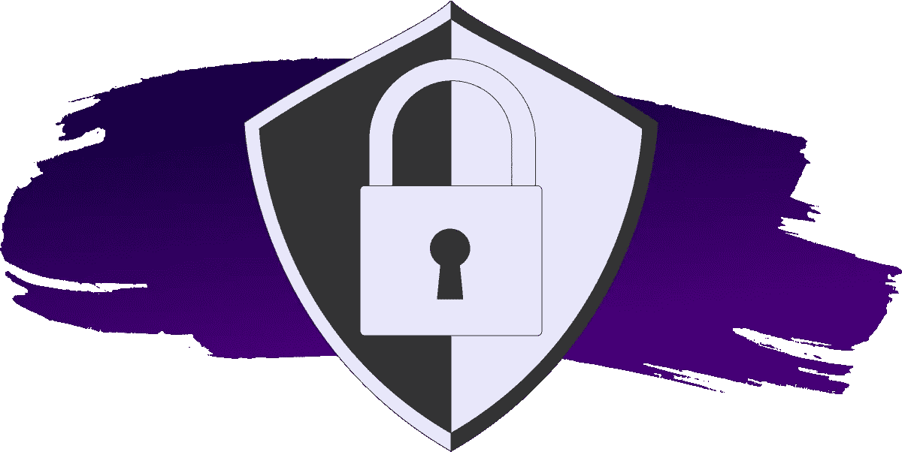

# 如何构建安全的 HTML 表单

> 原文：<https://javascript.plainenglish.io/how-to-build-secure-html-forms-5e05086538c7?source=collection_archive---------12----------------------->



这是系列文章的最后一篇，涵盖了为网络创建表单的各个方面。每篇文章都可以独立阅读，但我是按照最有意义的顺序写的。如果你没有读过其他的，我会鼓励你去看一看。

本系列的最后一篇文章可以说是最重要的。它涵盖了安全。虽然其他文章主要集中在前端，但安全性超出了这个范围。我们必须考虑当前用户、其他用户和我们自己的安全性。因此，我们将研究从前端到后端以及更远的整个应用程序体系结构。

# 加密流量(SSL)

在我们深入讨论之前，我将使用术语“SSL”来指代一种用于加密互联网流量的技术。从技术上讲，我指的是传输层安全性(TLS)，但“SSL”通常被使用并被理解为是同一意思。这就是为什么网站在 URL 栏上有一个绿色的小锁，以及为什么它们以“http ”( T2 的“T3 ”)而不是“http”(没有“s”)开头。

出于几个原因，安装 SSL 证书是最佳做法，安全性是最重要的。拥有 SSL 证书可以让您加密客户端(您的用户)和服务器(您)之间传递的数据。

窥探网络的黑客可以检查用户发送的数据包。如果没有 SSL 证书，这些数据很容易以纯文本形式读取。有了 SSL 证书，数据仍然可以被拦截，但它会以加密文本的形式发送，这几乎没有用。

*   无 SSL 证书:用户名:
    `NuggetTheMighty; password: ILoveSquirrels`
*   带有 SSL 证书(加密):
    `SIUFJaYQNtsn+y73mfBYv3fVfjJ2GdHl4A7XnTJXxgUyd4/TrU3nN+g3aJ4BVXSJL/E7`

这在创建表单时尤其重要，因为表单的全部目的是发送数据。我们有责任保护用户的数据。

获取和安装 SSL 证书过去需要花费大量时间、金钱和一些技术知识。今天，许多托管服务将免费为您提供并安装证书。在许多情况下，他们甚至会自动这样做。

如果您的托管服务不提供 SSL 证书，还有其他选择:

*   [Cloudflare](https://www.cloudflare.com/) 通过其 DNS 提供“灵活的”SSL。这很自由也很容易，但最好有自己的。
*   如果你的网站使用 [WordPress](https://wordpress.org/) ，有几个[插件](https://wordpress.org/plugins/ssl-zen/)会在一分钟内通过[设置一个证书，让我们加密](https://letsencrypt.org/)。
*   您可以使用 [Certbot](https://certbot.eff.org/) 通过[让我们加密](https://letsencrypt.org/)为您生成并安装一个证书。

如果您仍然没有 SSL 证书，因为您的主机没有提供证书，并且您没有对 DNS 或服务器代码的控制权…那么，您有点不走运。你将不得不切换主机，或者与你的服务器管理员交谈，或者做一些事情，因为这应该是当今任何项目的一个硬性要求。

# 了解 GET 与 POST

在之前的文章中，我说过您应该在表单中包含`method`属性。`method`属性告诉表单提交带有请求上的`GET`或`POST`HTTP 头[的数据。如果您省略了`method`，浏览器将默认使用`GET`方法。这很重要，因为在`GET`和`POST`请求之间有很大的不同。](https://developer.mozilla.org/en-US/docs/Web/HTTP/Headers)

# 获取请求

使用 GET 方法看一下下面的表单。当您提交表单时，数据将被提交给 example.com(剧透一下，它实际上不做任何事情)。

```
<form action="https://example.com" method="GET" target="_blank">
  <label for="data">Send some sweet data</label>
  <input id="data" name="some-sweet-data"/>
  <button>Submit</button>
</form>
```

需要注意的关键是提交表单后的 URL。虽然表单的`action`是“example.com”，但是投稿网址是“example.com？一些甜蜜的数据 =blahblahblah。这些查询参数对应于表单输入名称属性。这就是使用`GET`方法的表单传输数据的方式；查询字符串参数。

将数据作为 URL 参数传递与安全性相关，原因有两个:

1.  对于许多用户来说，URL 会保存在浏览器的历史记录中。考虑一下，如果 form 通过查询参数发送信用卡号，而用户在公共计算机上，比如在图书馆。他们的私人数据可能会出现在浏览器的历史记录中，供下一个用户查看。
2.  许多服务器保留接收流量的 URL 的日志。如果敏感信息出现在服务器日志文件中，任何有权访问这些文件的人都可以看到这些数据。

# 发布请求

幸运的是，您可以使用`POST`方法来发送数据，而不使用查询参数。让我们看看同样的表单，但是使用`POST`方法:

```
<form action="[https://example.com](https://example.com)" method="POST" target="_blank">
  <label for="data">Send some sweet data</label>
  <input id="data" name="some-sweet-data"/>
  <button>Submit</button>
</form>
```

注意提交这个表单也加载了 example.com，但是这次查询参数中没有任何内容。这是因为在`POST`请求中，数据是作为[请求](https://developer.mozilla.org/en-US/docs/Web/API/Request)主体的一部分发送的。这使得意外泄露私人信息变得更加困难。

根据经验，出于上面列出的原因，我在所有表单上使用`POST`方法。这个规则的少数例外是，如果我想让用户将他们提交的表单加入书签，或者与其他人共享。例如，查看将搜索提交给 [DuckDuckGo](https://duckduckgo.com/) 的表单:

提交表单后，DuckDuckGo 将在 URL 中打开一个查询参数。然后，如果你愿意，你可以复制这个网址并与同事分享，或者将它加入书签以备后用。除非您正在处理敏感数据，否则记住这种模式非常有用。

# 防止垃圾邮件

没有人喜欢垃圾邮件。我承认这和安全没什么关系。这里值得一提的是，任何时候我们向公共网页添加表单，都是在向垃圾邮件敞开大门。表格本来就是要填写的，但有时出于邪恶的原因，它们会被某人或某事填写。

那么我们如何预防呢？

# 蜜罐

一种防止垃圾邮件的基本方法叫做“蜜罐”，这个概念非常简单。如果您在表单中包含一个隐藏的输入，您就知道一个真正的人永远不会修改那个字段。因此，如果提交的表单包含该输入的数据，您可以认为它是一个机器人，并拒绝提交。

实际上，输入可能是这样的:

```
<input name="honeypot" class="visually-hidden" tabindex="-1" autocomplete="off">
```

*   `name`很重要，所以你知道在后端要检查什么。我用了“蜜罐”,但大多数人会建议称它为听起来更合法的东西。
*   我使用了一个`visually-hidden`类来隐藏用户的输入(你可以在关于[可访问性](https://austingil.com/how-to-build-html-forms-right-accessibility/)或[样式](https://austingil.com/build-html-forms-right-styling/)的文章中了解更多)。机器人仍然会看到它。
*   `tabindex="-1"`从键盘导航中移除输入。这对辅助技术用户来说很重要(在[可访问性文章](https://austingil.com/how-to-build-html-forms-right-accessibility/)中有更多相关信息)。
*   最后，我们想防止浏览器自动填充输入，所以我们禁用了`[autocomplete](https://developer.mozilla.org/en-US/docs/Web/HTML/Attributes/autocomplete)`。

关于这种方法的好消息是，它可以花费很少的时间和精力来实现。坏消息是，许多机器人足够聪明，可以判断输入何时是蜜罐，并跳过它。但是，即使这阻止了 10%的垃圾邮件，这种努力也是值得的。

# 安全挑战

防止垃圾邮件的一个更强大的方法是加入一个挑战，用户需要完成这个挑战来证明他们是人类。一些基本的例子是输入，要求你完成一个简单的数学问题，如“10 + 6 是多少？”。只有具有正确答案的数据才会被接受。

这种方法的问题是，再一次，机器人可以足够复杂来解决这些挑战。

垃圾邮件困境是一个不断演变的猫捉老鼠的游戏，随着时间的推移，挑战变得越来越复杂。首先是数学问题，然后检测图像中的字母或数字。

可能最熟悉的安全挑战是 [reCAPTCHA](https://developers.google.com/recaptcha/) 。这是谷歌现在拥有的一项服务，向用户展示一堆他们需要识别的图像。效果非常好，而且免费。如果你担心用户隐私，你可能不想使用谷歌产品。好消息是，还有另一项名为 [hCaptcha](https://www.hcaptcha.com/) 的服务，它是一种上门服务。安全挑战技术并非没有缺点:

*   它们的实现更具技术性。
*   您可能需要依赖第三方服务。
*   它们会对[用户体验](https://austingil.com/build-html-forms-right-user-experience/)产生负面影响。

# WAF 和 API

如果垃圾邮件成为您表单中的一个主要问题，您可能需要考虑寻求第三方服务。

一种选择是建立一个[网络应用防火墙(WAF)](https://en.wikipedia.org/wiki/Web_application_firewall) 。WAF 位于您的服务器前面，首先阻止不良行为者访问您的网站。

[Cloudflare](https://www.cloudflare.com/) 是我的首选供应商。他们在 DNS 级别工作，有一个非常慷慨的免费层。我在我拥有的每个域名上都使用这个，到目前为止，我还没有遇到任何垃圾邮件的问题。

另一种选择是使用 API 服务来测试传入的表单提交。我知道的最常见的是 [Akismet](https://akismet.com/development/api/) ，它是[automatic](https://automattic.com/)产品的一部分(他们制造 [WordPress](https://wordpress.org/) )。我在一些 WordPress 网站上用过这个，可以说效果不错。如果你不使用 WordPress，他们也有一个 API。CSS Tricks 有[一篇文章](https://css-tricks.com/spam-detection-apis/)，如果你对其他选项感兴趣，这篇文章会更深入地介绍第三方垃圾 API。

我不相信任何垃圾邮件预防技术是 100%有保证的。这个领域在不断发展，垃圾邮件发送者每年都变得更加先进。然而，这也不是我想要解决的那种问题，直到我有了它。在这种情况下，你可以从一些唾手可得的果实开始，逐步找到一个更复杂的解决方案。

考虑到工作量、用户体验、成本和其他因素，我会这样做:

1.  在您 DNS(或其他一些 WAF)上安装 Cloudflare
2.  使用蜜罐
3.  集成垃圾邮件检测 API
4.  设置 hCaptcha(出于用户体验的考虑，这是最后一招)

# 验证数据

验证是指当您强制您接收的数据与您期望的相匹配时。例如，如果我注册一个新用户，我想确保他们提供的电子邮件确实是一个电子邮件地址。

通常有两个地方可以验证数据:客户端和服务器端。

# 客户端验证

前端的验证通常用 HTML 属性或 JavaScript 来完成。

例如，如果我们想要一个输入，它必须以最大长度的电子邮件形式填写，我们可以这样实现它:

```
<form action="example.com" method="POST">
  <label for="email">Email
  <input id="email" name="email" type="email" required maxlength="20">

  <button type="submit">Submit</button>
</form>
```

如果用户试图在不满足我们要求的情况下提交表单，浏览器会阻止并向用户显示一条错误消息。

如果我们不想显示内置的验证 UI，我们可以在表单中添加`[novalidate](https://www.w3schools.com/TAGs/att_form_novalidate.asp)`属性。这将阻止默认的验证逻辑，我们可以用自己的逻辑替换它。

一种方法是使用表单的`checkValidity`方法来查看表单是否有任何无效输入。如果表单无效，我们可以对每个输入进行循环，并查看 [ValidityState API](https://developer.mozilla.org/en-US/docs/Web/API/ValidityState) 到底违反了什么规则:

```
const form = document.querySelector('form');
form.addEventListener('submit', (event) => {
  const isValid = form.checkValidity()

  if (!isValid) {
    const inputs = form.querySelectorAll('input')

    for (const input of inputs) {
      // Do some validation logic with the input
      console.log(input.validity)
    }
  }
})
```

`ValidityState`非常方便，因为它将为我们提供一个对象，其中每个键/值对代表一个验证属性及其有效性状态:

```
{
  badInput: Boolean
  customError: Boolean
  patternMismatch: Boolean
  rangeOverflow: Boolean
  rangeUnderflow: Boolean
  stepMismatch: Boolean
  tooLong: Boolean
  tooShort: Boolean
  typeMismatch: Boolean
  valid: Boolean
  valueMissing: Boolean
}
```

这会让我们走得很远。我们可以显示每个无效属性的特定错误消息，或者修改输入的类名(事实上， [Vuetensils](https://vuetensils.stegosource.com/) 就是这样进行验证的)。

我不能对你的实现做任何假设，所以你必须从这里开始。如果你需要更健壮的东西，你可以使用 NPM 上[众多 JavaScript 验证库中的一个。](https://www.npmjs.com/search?q=validation&ranking=popularity)

无论是您自己的实现还是第三方库，客户端都有一个主要缺陷。

任何技术用户都可以修改 HTML 验证属性，或者通过在表单外部发出 HTTP 请求来完全绕过客户端验证。这就是为什么**永远不要相信来自客户端**的数据是很重要的。让我重复一遍。

> *永远不要相信来自客户端的数据！*

客户端验证应该通过提供即时反馈来改善用户体验。它不应该是保护您的应用程序的唯一防线。

# 服务器端验证

因为我们不能信任来自客户端的数据，所以我们应该总是在服务器端验证数据。对于简单的应用程序，您可以创建自己的验证逻辑，但是对于严肃的项目，我建议使用专用的库。图书馆之所以伟大，有几个原因:

1.  验证是一个已经解决的问题。没有必要重新发明轮子。
2.  库通常比定制实现工作得更好，因为它们已经在更多的项目中进行了测试。
3.  一个库可以满足未来的验证需求。它们可以提供我们现在不需要但以后可能需要的功能。
4.  对于服务器端项目，我们不需要担心捆绑包的大小。添加更多依赖项对客户端的影响没有那么大。

目前我首选的验证库是[是的](https://www.npmjs.com/package/yup)。我*爱*它！

如何完成服务器端验证取决于你自己。在任何情况下，都需要考虑一些与前端相关的重要事项。当您在服务器上遇到验证错误时，请考虑以下几点:

*   用适当的 [HTTP 状态代码](https://developer.mozilla.org/en-US/docs/Web/HTTP/Status)(大多数情况下为`400`)进行响应。
*   提供某种关于什么是无效的明确信息。
*   如果有很多东西需要验证(比如 JSON 对象)，那么验证整个包。对于第一个无效值，不要立即抛出错误。回答所有的验证问题，以避免多次请求。
*   提供唯一的错误代码(即`{ error: INVALID_EMAIL }`)可以帮助前端为错误消息创建自己的字典。

# 整理/逸出数据

像验证一样，数据净化(也称为转义)是一种属于服务器的实践。净化数据是指转换或删除危险的数据。它不同于验证，因为你不会拒绝输入。你修改它，所以它是安全的使用。

例如，假设您有一个要求输入名字和姓氏的表单。用户可以输入以下内容:

名:`l33t; DROP TABLE user`
姓:`<script>alert('h4x0r')</script>`

这个人很可能是一个不应该被信任的骗子。此外，他们的数据可能会让你遭受两种类型的攻击: [SQL 注入](https://en.wikipedia.org/wiki/SQL_injection)和[跨站脚本(XSS)](https://en.wikipedia.org/wiki/Cross-site_scripting) 。

如果您尝试将用户的名字原样添加到数据库中，您可能会删除整个`user`表。你好 SQL 注入。如果您按原样保存姓氏，您的数据库会很好，但是如果您将姓氏添加到 HTML 中，它可能会将任意 JavaScript 注入到页面中。示例中的 JavaScript 是无害的，但是如果它传输了用户机密呢？哦，XSS 攻击。

本系列侧重于 HTML 表单，所以我们不会深入 XSS 或 SQL 注入。为了深入预防，我将推荐 [XSS](https://cheatsheetseries.owasp.org/cheatsheets/DOM_based_XSS_Prevention_Cheat_Sheet.html) 和 [SQL 注入](https://cheatsheetseries.owasp.org/cheatsheets/SQL_Injection_Prevention_Cheat_Sheet.html)的 [OWASP 备忘单系列](https://cheatsheetseries.owasp.org/)。

我想强调的一点是，我们可以通过净化数据来避免上述两种情况。我的建议还是那句话，依靠专门与数据库对话的库。

对于 SQL 数据库，我建议使用一个[对象关系映射(ORM)](https://en.wikipedia.org/wiki/Object%E2%80%93relational_mapping) 库，而不是编写原始 SQL。其中许多会自动清理数据。对于 JavaScript 项目，我非常喜欢 [Knex.js](http://knexjs.org/) 和 [Objection.js](https://vincit.github.io/objection.js/) 。

每当您向 HTML 添加用户生成的内容时，您必须净化字符串以避免 XSS 攻击。我以前用过的一个库是 XSS 的。您可以在几个不同的地方整理内容:

*   在将它保存到数据库之前。
*   从你的数据库中读取后。
*   在将它写入 HTML 文档之前。

最安全的地方是在将内容添加到 HTML 文档之前对其进行整理。然而，我喜欢遵循[零信任](https://en.wikipedia.org/wiki/Zero_Trust_Networks)模式，只假设最坏的情况。在这种情况下，最好三个都做。说我多疑吧。

同样值得一提的是，使用前端框架来创建 HTML 文档也会有所帮助。许多框架，如 [Vue.js](https://vuejs.org/) 和 [React](https://reactjs.org/) 会在将内容添加到页面之前自动对其进行转义，除非您明确告诉它们不要这样做。

# 正确处理 jwt

[JSON Web Tokens (JWT)](https://jwt.io/) 这是一项非常酷的技术，旨在解决向多个服务发送数据的现代挑战，同时避免使用集中式服务来检查数据的有效性。

换句话说，我们可以将用户的身份验证细节存储在 JWT 中，并且我们可以确定令牌的内容不能被更改。然后，我们可以将这个令牌发送给一个 API，该 API 不需要检查任何中央数据库来了解哪个用户发出了请求。API 可以简单地打开 JWT，查看用户的身份验证细节。太棒了。

身份验证是目前使用 jwt 的主要方式之一。然而，jwt 也有一些明显的缺点:

*   JWT 的内容对任何获得访问权限的人来说都是不隐藏的。
*   jwt 可以有一个截止日期，但是它们不能以编程方式失效。

出于这两个原因，我们在与 JWT 合作时应该特别深思熟虑。不幸的是，我看到的大多数教程都指导开发人员创建具有较长有效期的认证令牌(JWT)并将保存令牌存储在`localStorage`中。我对此有异议。

在客户端(`[localStorage](https://developer.mozilla.org/en-US/docs/Web/API/Window/localStorage)`、`[sessionStorage](https://developer.mozilla.org/en-US/docs/Web/API/Window/sessionStorage)`、)的 JWT 中存储敏感数据的问题。)在于页面上的任何 JavaScript 都可以访问它。它可能是一个跨站点脚本，也可能是任何不是我们自己编写的脚本:库和框架、来自公共 cdn 的资产、第三方代码片段，甚至是浏览器扩展。

我的另一个问题与令牌过期有关。如果一个具有“管理员”角色的用户登录到我们的应用程序，他们将收到一个 auth token，表明他们是“管理员”。因此，他们可以执行与“管理”相关的操作(如创建或删除其他用户)，直到令牌丢失或过期。如果我们的 auth token 有一周的到期时间，那么理论上我们所做的任何更改都需要一周才能完成。如果“ADMIN”角色是一个人为错误，而我们实际上打算将“GUEST”角色分配给这个用户，那该怎么办？你看出问题了吗？

这让我想到了处理 JWT 问题的基本原则:

1.  任何包含敏感/私人/认证数据(用户 ID、个人识别信息等)的 JWT 都只能存储在内存中。
2.  每个 JWT 都应该有一个截止日期。任何用于**认证**或**授权**(‘auth’)的 JWT 都应该有一个非常短的有效期(即 15 分钟、24 小时等。).

这些规则解决了我们的安全问题，但也给我们带来了一些用户体验挑战。通过只在内存中存储身份验证令牌，用户将不得不在每次加载应用程序时登录。如果我们的身份验证令牌使用 15 分钟的过期时间，那么用户将有效地每 15 分钟“注销”一次。

由 [Vladimir Novick](https://twitter.com/VladimirNovick) 撰写的优秀文章《[在前端客户端(GraphQL)](https://hasura.io/blog/best-practices-of-using-jwt-with-graphql/) 上处理 jwt 的终极指南》很好地解释了这些问题的解决方案。这有点复杂，但我会尽量用一个例子来简化事情:

*   您创建了两条身份验证路由。一个用于登录应用程序(`/login`)，一个用于生成新的认证令牌(`/refresh`)。
*   当用户登录时，返回包含授权请求所需的任何数据的 auth token(例如`{userId: 5, role: 'admin'}`)。它的有效期很短(例如 15 分钟)。
*   登录响应还返回一个刷新令牌。该令牌仅包含重新创建新的身份验证令牌所需的信息(例如，`{userId: 5}`)。它可以有一个更长的有效期，以匹配您希望用户保持“登录”的时间。假设一周。
*   用户通过将他们的凭证发送到登录路由来登录，作为回报，他们获得一个 auth 令牌和一个 refresh 令牌。
*   auth 令牌保存在内存中，refresh 令牌可以放在`localStorage`中(如果有人知道我的用户 ID，这通常并不重要)。
*   登录后，我们还将时间间隔设置为 14 分钟(小于身份验证令牌到期时间)。在这个时间间隔，我们将刷新令牌发送到`/refresh`路由，并将其交换为新的 auth 令牌。
*   这个新的身份验证令牌可以替换旧的身份验证令牌，并且用户保持“登录”。
*   最后一步是确保在应用程序启动时检查`localStorage`中现有的刷新令牌。如果有刷新令牌，我们在应用程序加载之前点击`/refresh`路径。这样，我们可以在多个会话中保持用户“登录”。

这个 JWT 登录流程相当复杂，但我希望我做到了。要完全描述它需要一篇专门的文章，所以我邀请你阅读我上面提到的文章。太棒了。

# 抵御 CSRF 袭击

[跨站点请求伪造(CSRF)](https://en.wikipedia.org/wiki/Cross-site_request_forgery) 攻击理解起来有点复杂，但它们的工作原理是诱骗用户代表攻击者发出请求。一个理论上的例子可能是最好的解释。

假设您的银行有一个表单，可以从您的帐户向另一个用户的帐户汇款。该表单通过向某个端点(如`yourbank.com/send-money`)发出一个`POST`请求来发送资金，该请求带有两个数据值:

*   `to`:收款的用户 ID
*   `amount`:你要发的金额(很明显)。

出于安全原因，这只有在您登录的情况下才有效(显然也是如此)。服务器可以通过[HTTP cookie](https://developer.mozilla.org/en-US/docs/Web/HTTP/Cookies)认证请求。

在这个假设的场景中，这个表单可能容易受到 CSRF 攻击。如果攻击者对银行后端的工作方式有足够的了解，他们可以创建一个伪装成按钮的表单。

```
<form action="[http://example.com/send-money](http://example.com/send-money)" method="POST"><input type="hidden" name="to" value="123456"/>
  <input type="hidden" name="amount" value="100"/><button type="submit"/>Click for Kittens!!!</button>
</form>
```

注意上面的表单是如何利用几个输入值来设置`to`和`amount`数据的。对于一个不知情的用户来说，这个表单在视觉上会呈现为一个承诺小猫的按钮(邪恶，我知道)。

如果您点击此按钮，它会将表单提交到您银行的`/send-money`端点，如果您已经在浏览器中使用有效的 cookie 登录，该 cookie 将与表单一起发送。这足以诱使用户向其他人汇款。

同样值得注意的是，这种攻击可能以多种方式发生。它可以存在于一个随机的网站上、电子邮件中、浏览器扩展中等等。如果启用了 JavaScript，这很有可能，它甚至可以在没有任何用户交互的情况下发生。那么，我们如何防范这种情况呢？

# CSRF 代币

防止这种情况发生的一种方法是使用“CSRF 代币”。这些是在服务器上生成的唯一值，只有服务器知道。它们被提供给表单，以便用作隐藏输入的值，如下所示:

```
<input type="hidden" name="csrf-token" value="d4f3e48f-7ae3-4398-ba24-0dca81383e6c">
```

包含 CSRF 令牌的输入就绪后，可以提交表单，后端可以检查令牌的有效性。任何包含有效令牌的表单都可以继续请求。任何带有无效或缺失令牌的表单都会被拒绝。

如果黑客想要创建与上面相同的表单，他们将无法生成自己的 CSRF 令牌(假设您有验证令牌的方法)。

这里棘手的部分是以别人无法做到的方式获得 CSRF 令牌。如果您在同一台服务器上创建表单，那么生成一个令牌并将其弹出到 HTML 中是非常容易的。如果您正在使用 API，那么您需要一个提供有效 CSRF 令牌的路径。您应该将此路由配置为只允许来自已知域的流量。这样，你可以从一个有效的域请求一个令牌，但是黑客将不能。

# 验证请求来源

防止 CSRF 攻击的一个基本但聪明的方法是检查请求的和/或报头。它们包含发出请求的 URL。

这些头文件最好的一点是它们是由浏览器设置的，不能以编程方式修改。所以别开玩笑了。如何访问这些头取决于您使用的技术。例如，如果我正在使用 [Express](https://expressjs.com/) ，我可以创建一个看起来像这样的[中间件](https://expressjs.com/en/guide/using-middleware.html#using-middleware):

```
app.use((request, response, next) => {
  const allowedHosts = new Set([request.headers.host]);
  let referer = request.headers.host;
  let origin = null;

  if (request.headers.referer) {
    referer = new URL(request.headers.referer).host;
  }
  if (request.headers.origin) {
    origin = new URL(request.headers.origin).host;
  }

  if (!allowedHosts.has((origin || referer))) {
    return next(new Error('Unallowed origin'));
  }

  next();
});
```

*   创建所有允许的主机的列表(在我们的例子中，只有我们相同的应用程序域是有效的)
*   检查`referer`和/或`origin`接头是否存在。如果有，获取他们的网址
*   如果`origin`和`referer`URL 都不在我们允许的主机列表中，我们拒绝该请求。

这个代码片段是一个很好的例子，但是出于生产目的，您可能需要更健壮的代码。无论如何，它可以用几行代码实现，这是我一直欣赏的。

关于 CSRF 攻击的更多细节，OWASP 有一篇优秀的文章有更多的描述。他们的备忘单系列中还有一篇文章，提供了更多防止 CSRF 攻击的细节。事实上，它们是与安全相关的极好资源，我强烈建议你花些时间通读它们的内容。

对于我的 JavaScript 开发伙伴来说， [Auth0](https://auth0.com/) 有一篇好文章[专门针对 Node.js 开发和 CSRF 预防。](https://auth0.com/blog/cross-site-request-forgery-csrf/)

# 安全 Cookies

如上所述，CSRF 攻击使用 cookies 作为其攻击媒介的一部分。因此，防范基于 cookie 的攻击的一个好方法是确保我们的 cookie 是安全的，这是有道理的。

对于那些不熟悉的人来说，cookie 是一个 HTTP 头。更具体地说，cookies 被分配了标题，看起来像这样:`Set-Cookie: <name>=<value>; <attributes>`。

一个例子可能是这样的:

```
Set-Cookie: sessionId=38afes7a8; Domain=example.com; Max-Age=2592000; Secure; HttpOnly; SameSite=strict;
```

与安全性相关的一些属性包括:

*   `Expires`和`Max-Age`:允许您设置 cookie 有效期的时间限制。
*   :确保仅在通过安全(HTTPS)连接发出请求时才发送 cookie。对防止[中间人攻击](https://en.wikipedia.org/wiki/Man-in-the-middle_attack)有用。
*   :防止 JavaScript 访问 cookie。有助于防止 XSS 袭击。
*   :可以设置为仅在请求来源与目标域匹配时发送 cookies。有助于防止 CSRF 袭击。

这些都是我认为与安全性相关的属性。但是如您所见，只有`SameSite` cookie 属性与 CSRF 攻击相关。这是一个相对较新的 web 平台，对于安全性来说是一个好消息。然而，因为它有点新，所以在旧的浏览器上不会有效。

如果你想了解更多关于使用 cookies 的信息，我推荐 [MDN docs](https://developer.mozilla.org/en-US/docs/Web/HTTP/Cookies) 。

# 结束语

我意识到这篇文章中的一些内容与写作形式无关。这里的一些建议根本不是直接相关的形式。不过，我希望你同意这是相关信息。当我们为 web 编写表单时，我们必须记住这些事情。即使我们不是实现这些变化的人，我们也应该从整体上考虑我们的软件，以保证我们自己和我们用户的安全。

这篇文章花了大约 20 个小时来研究和创作。向我展示你喜欢它的最好方式是[分享它](https://twitter.com/share?via=Stegosource)。你也可以[注册我的时事通讯](https://austingil.com/newsletter/)或者[在 Twitter 上关注我](https://twitter.com/Stegosource)如果你想第一个知道什么时候有新文章的话。

如果您错过了任何其他文章，请考虑阅读它们。我想你也会喜欢的。

*原载于*[*https://austingil.com*](https://austingil.com/how-to-build-html-forms-right-security/)*。*