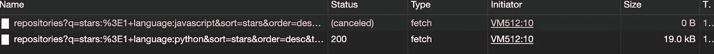

# 如何用 AbortController 取消异步承诺

> 原文：<https://javascript.plainenglish.io/how-to-cancel-async-promise-with-abortcontroller-1e266859615c?source=collection_archive---------4----------------------->

## 使用 AbortController 取消提取请求


Photo by [Joshua Aragon](https://unsplash.com/@goshua13?utm_source=medium&utm_medium=referral)

在本帖中，我们将探讨`AbortController`以及如何使用它来取消网络请求。

我们知道`fetch`是一个发送网络请求并返回承诺的方法，但是如果我们想取消这个正在进行的请求呢？

例如，考虑这样一个场景，我们想要实现一个在用户输入时显示结果的搜索功能，但是用户的输入速度会因人而异，我们想要取消前面的请求。我们可以通过使用`AbortController`最小化服务器请求的数量来做到这一点。

# 句法

`AbortController`是一个对象(控制器对象),允许您在需要时中止一个或多个请求(异步请求)。

*   `signal`允许在属性上设置事件监听器的属性。
*   `abort()`设置信号中止标志的方法

因此，当调用`abort()`方法时，它会在 DOM 请求完成之前取消它，并将 aborted 标志设置为 true。

# 使用

通常，为了取消获取请求，我们需要执行 3 个步骤:

1.  创建一个具有信号属性(只读属性)的`AbortController`实例

```
// creare new object instance of abortContoller let aborter = new AbortController();
```

2.传递`signal`属性作为信号的提取选项

```
// we get the signal and pass it to the fetch request as param
let signal = aborter.signal; // signal is read onlyconst url =
  "[https://api.github.com/search/repositories?q=stars:%3E1+language:javascript&sort=stars&order=desc&type=Repositories](https://api.github.com/search/repositories?q=stars:%3E1+language:javascript&sort=stars&order=desc&type=Repositories)";fetch(url, {
  method: "GET",
  signal
})
  .then((response) => response.json())
  .then((res) => {
    aborter = null;
    return res;
  })
  .catch((error) => {
    if (error.name === "AbortError") return;
    console.log("Error ", error);
  });
```

3.调用 abortController 的`abort()`方法来取消所有使用该信号的未决提取。

```
aborter.abort()
```

# 例子

Tُhe 以下代码片段显示了如何使用带有 fetch 的 abortController。以下是完整的示例:

```
let aborter = null;
const getRepos = (lang) => {
  // cancel pending request if there is any
  if (aborter) aborter.abort();
  aborter = new AbortController();
  let signal = aborter.signal;const url = `[https://api.github.com/search/repositories?q=stars:%3E1+language:${lang}&sort=stars&order=desc&type=Repositories`](https://api.github.com/search/repositories?q=stars:%3E1+language:${lang}&sort=stars&order=desc&type=Repositories`);return fetch(url, {
    method: "GET",
    signal
  })
    .then((response) => response.json())
    .then((res) => {
      aborter = null;
      return res;
    })
    .catch((error) => {
      if (error.name === "AbortError") return;
      console.log("Error ", error);
    });
};// the first call will be aborted
getRepos("javascript").then((res) => {
  console.log(res);
});
getRepos("python").then((res) => {
  console.log(res);
});
```

我们在函数作用域之外定义 aborter 变量的原因是，无论函数被调用了多少次，或者有多少请求仍在等待处理，它都将只显示最后一个提交的请求的结果。

这里你可以看到上面的例子，第一个调用被中止，第二个调用通过。



# 结论

在这篇文章中，我们看了一下`AbortController`以及如何使用它来取消网络请求，并给出了一个使用 fetch 的例子。