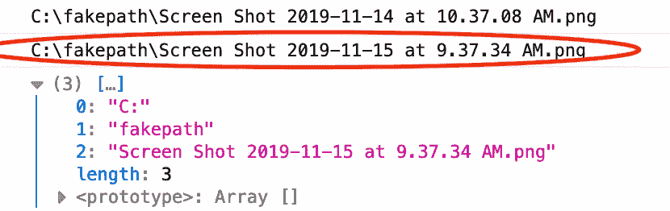

# 如何更改输入文件上传的浏览图像但保留文件名

> 原文：<https://javascript.plainenglish.io/how-to-change-the-browse-image-of-the-input-file-upload-but-keep-the-file-name-6c561721c9e?source=collection_archive---------3----------------------->


Photo by [NESA by Makers](https://unsplash.com/@nesabymakers?utm_source=unsplash&utm_medium=referral&utm_content=creditCopyText) on [Unsplash](https://unsplash.com/s/photos/html-input?utm_source=unsplash&utm_medium=referral&utm_content=creditCopyText)

如果你只是想要代码，直接跳到下面的代码栏！

我真的很难在网上找到一篇关于如何做到这一点的文章，所以我想我会分享我的最终答案(感谢帮助我的同事！)希望它能帮助其他人。

最后，我找不到一个好方法来在替换浏览图标时保留文件名，所以我不得不使用 jQuery 来替换它。我尽力避免使用 jQuery/Javascript，因为我认为这太难了，但实际上非常简单！

我最初试着用一个没有指针事件的 div 覆盖浏览图标(使我能够点击 div 到达下面的文件输入),但是这也带来了一些问题。这个输入在不同的浏览器和设备上有不同的显示，所以试图让我的 cover up div 正好在浏览图标的上面，同时显示文件名几乎是不可能的！

## 那么我是怎么做到的呢？

我将输入不透明度设置为 0，以将其完全隐藏在我的新文件上传图像之下(指针事件:无，所以我可以点击我的图像),并创建了一个新的文件名，用 jQuery 替换。

反正代码在下面！在 Codepen 上。

对于那些可能不理解它/想详细了解正在发生的事情的人，我也分解了下面的 Javascript。

```
$(document).on(‘change’, “.fileUploadWrap input[type=’file’]”,function(){
    if ($(this).val()) { var filename = $(this).val().split(“\\”);
       filename = filename[filename.length-1]; $(‘.fileName’).text(filename);
    }
 });
```

抱歉上面的格式！

## **jQuery 代码解释(见上图中的代码)**

1.  变更文档—当元素的值发生变更时，会发生变更事件(仅适用于、<textarea>和<select>元素)。因此，在这段代码的第一行中，我们将在。fileUploadWrap 值已更改。</select></textarea>

2.然后，我们通过使用(this)来获取文件名。val) —这是我们点击的文件输入。

3.。split()将一个字符串拆分成一个字符串数组。在这种情况下，它会在文件名中的任何“\”字符处拆分文件名字符串。中有两个' \\ '的原因是。split()是因为' \ '是一个特殊字符，我们需要对它进行转义。如果我们只有一个' \ '，javascript 不会读取它，也不会正确运行代码。额外的' \ '是你如何转义一个特殊字符，并把它变成一个字符串字符。如果你对此仍不确定，你可以在这里阅读更多信息。这意味着我们的文件名被分成三部分，见下图。

红色表示原始文件名，在下面的阵列中，您可以看到它是如何被拆分的。



4.然后，我们将 filename 变量更改为我们上传的文件的新文件名。我们之所以必须放入 filename.length-1，是因为我们不想显示完整的文件路径。我们只想要实际的文件名。当文件名长度减少-1 时，我们将删除部分 0 和 1，只保留 2 作为文件名。

5.最后，我们正在取代。带有上传文件名称的文件名文本。

编码快乐！