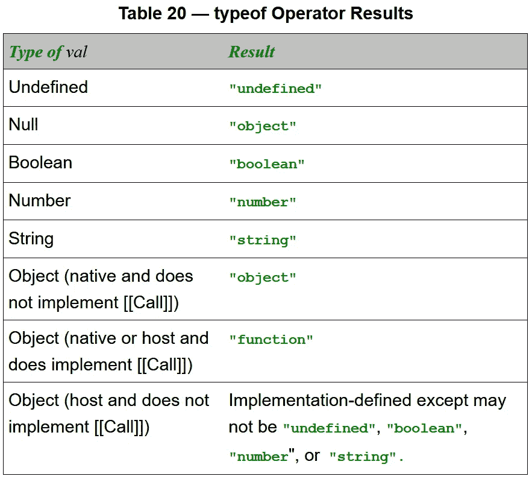

# 如何在 JavaScript 中检查函数

> 原文：<https://javascript.plainenglish.io/how-to-check-for-a-function-in-javascript-986248827790?source=collection_archive---------3----------------------->

## 想知道 JavaScript 中变量是不是函数？简单地使用`typeof` —包含函数的变量将总是返回`"function"`。

Photo by [Shahadat Rahman](https://unsplash.com/@hishahadat?utm_source=medium&utm_medium=referral) on [Unsplash](https://unsplash.com?utm_source=medium&utm_medium=referral)

JavaScript 的新程序员通常不熟悉函数可以存储在变量中的概念，就像任何原始类型一样。

存储在变量中的函数通常被称为*回调函数*，至少当该函数作为参数传递给另一个函数时是这样。

> 回调函数是作为参数传递给另一个函数的函数，然后在外部函数中调用该函数来完成某种例程或操作— [MDN 文档](https://developer.mozilla.org/en-US/docs/Glossary/Callback_function)

回调在现代 web APIs 中使用[通常带有异步承诺](https://medium.com/front-end-weekly/callbacks-promises-and-async-await-ad4756e01d90)。

# 检查功能

C 使用`[typeof](https://developer.mozilla.org/en-US/docs/Web/JavaScript/Reference/Operators/typeof)`关键字对函数进行检查，这将返回函数的字符串`"function"`。

使用`typeof`将适用于命名函数、赋给变量的匿名函数和赋给变量的命名函数。

查看代码示例:

# 包扎

J avaScript 函数可以使用`[function](https://developer.mozilla.org/en-US/docs/Web/JavaScript/Guide/Functions)`或`[class](https://developer.mozilla.org/en-US/docs/Web/JavaScript/Reference/Classes)`关键字调用，也可以使用[箭头函数](https://developer.mozilla.org/en-US/docs/Web/JavaScript/Reference/Functions/Arrow_functions)匿名创建。

所有 JavaScript 函数都可以赋给变量，函数可以像其他 JavaScript 数据类型一样传递给函数。

将函数作为变量传递给其他函数在 JavaScript 中非常常见，术语*回调函数*指的就是这种做法。

具体来说，回调函数是作为参数传递给另一个函数的函数，然后用于完成某种操作:

# 结论和进一步阅读

您可以使用 `[typeof](https://medium.com/better-programming/how-to-check-data-types-in-javascript-using-typeof-424d0520a329)` [关键字](https://medium.com/better-programming/how-to-check-data-types-in-javascript-using-typeof-424d0520a329)来检查函数[，如果给定任何 JavaScript 函数的名称，它将返回`"function"`。](https://medium.com/better-programming/how-to-check-data-types-in-javascript-using-typeof-424d0520a329)

 [## 如何使用 typeof 检查 JavaScript 中的数据类型

### 检查九个字符串之一:undefined、object (null)、boolean、number、bigint、string、symbol、function 或 object…

medium.com](https://medium.com/better-programming/how-to-check-data-types-in-javascript-using-typeof-424d0520a329) 

如果函数被分配给一个变量，检查`typeof`该变量的名称，是否使用 `[let](https://www.google.com/search?client=firefox-b-1-d&q=let+var+const+derek)` [、](https://www.google.com/search?client=firefox-b-1-d&q=let+var+const+derek) `[var](https://www.google.com/search?client=firefox-b-1-d&q=let+var+const+derek)` [或](https://www.google.com/search?client=firefox-b-1-d&q=let+var+const+derek) `[const](https://www.google.com/search?client=firefox-b-1-d&q=let+var+const+derek)`调用了[。](https://www.google.com/search?client=firefox-b-1-d&q=let+var+const+derek)

 [## 如何在 JavaScript 中使用 let、var 和 const

### 在 JavaScript 中有 3 种创建变量的方法:let 是块范围，var 是函数范围，const 是块范围…

medium.com](https://medium.com/javascript-in-plain-english/how-to-use-let-var-and-const-in-javascript-cdf42b48d70) 

如果函数是用 function 或 class 关键字命名的，但没有赋给变量，那么检查`typeof`函数的给定名称。

编码快乐！💻💯🏆💯🙌

# 额外资源

*   JavaScript 函数的 MDN 文档[指南](https://developer.mozilla.org/en-US/docs/Web/JavaScript/Guide/Functions)深入解释了函数:

 [## 功能

### 函数是 JavaScript 的基本构件之一。函数是一个 JavaScript 过程——一组…

developer.mozilla.org](https://developer.mozilla.org/en-US/docs/Web/JavaScript/Guide/Functions) 

*   [GeeksforGeeks](https://www.geeksforgeeks.org/how-to-check-a-variable-is-of-function-type-using-javascript/) 建议使用三种方法检查函数:`instanceof`、严格相等`===`或`object.prototype.toString`:

 [## 如何使用 JavaScript 检查变量是否为函数类型？- GeeksforGeeks

### JavaScript 中的函数是用来执行特定任务的一组语句。函数可以是一个已命名的函数…

www.geeksforgeeks.org](https://www.geeksforgeeks.org/how-to-check-a-variable-is-of-function-type-using-javascript/) 

*   [GeeksforGeeks](https://www.geeksforgeeks.org/how-to-check-a-function-is-defined-in-javascript/) 还包括检查一个函数是否被声明:

 [## 如何检查一个函数是在 JavaScript 中定义的？- GeeksforGeeks

### 工作是识别一个函数是否被定义。JavaScript typeof 运算符用于求解…

www.geeksforgeeks.org](https://www.geeksforgeeks.org/how-to-check-a-function-is-defined-in-javascript/) 

*   [Chris Coyler](https://css-tricks.com/author/chriscoyier/) 在检查一个函数是否存在时[更加简单](https://css-tricks.com/snippets/javascript/check-if-function-exists-before-calling/):`if (typeof yourFunctionName == ‘function’) {yourFunctionName();}`

 [## 在调用| CSS-Tricks 之前检查函数是否存在

### 当使用在站点的不同区域之间共享的脚本时，可能会有函数被调用的情况…

css-tricks.com](https://css-tricks.com/snippets/javascript/check-if-function-exists-before-calling/) 

# 附录:ES5 规范

如果你想精确一点，这里是`typeof`根据[ECMAScript(ES5)规范](http://es5.github.io/#x11.4.3)的确切工作方式——注意`"object"`和`"function"`:

 [## 注释版 ES5 http://es5.github.io/#x11.4.3

### 表 20 —运算符结果的类型

es5.github.io](http://es5.github.io/#x11.4.3) 

Source: [**http://es5.github.io/#x11.4.3**](http://es5.github.io/#x11.4.3)

德里克·奥斯汀博士是《T21 职业规划:如何在 6 个月内成为 6 位数的成功程序员》一书的作者，该书现已在亚马逊上出售。