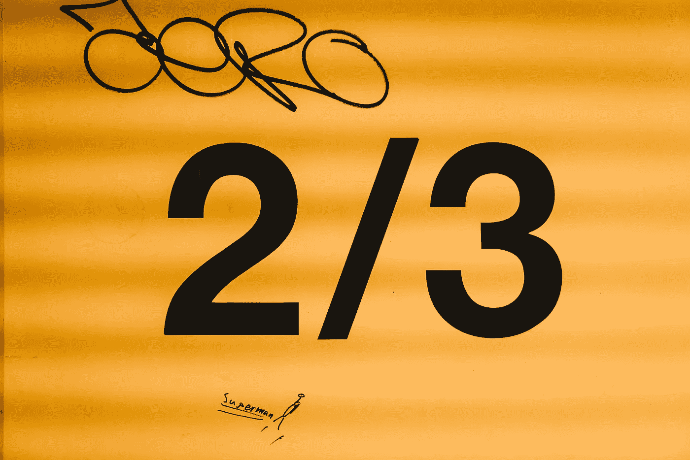
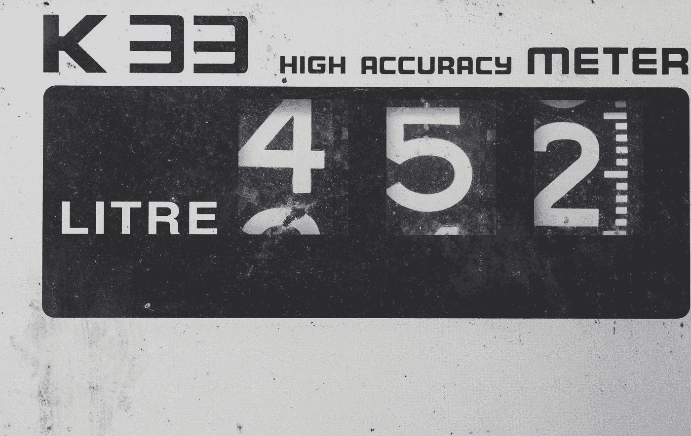

# 如何在 JavaScript 中检查数字

> 原文：<https://javascript.plainenglish.io/how-to-check-for-a-number-in-javascript-8d9024708153?source=collection_archive---------3----------------------->

## 数字是 JavaScript 中的一种基本类型，但是仅仅使用`typeof`并不能区分数字和 NaN 或 Infinity。

Photo by [Alex Chambers](https://unsplash.com/@alexchambers?utm_source=medium&utm_medium=referral) on [Unsplash](https://unsplash.com?utm_source=medium&utm_medium=referral)

因为 JavaScript 是一种动态类型语言，所以知道如何检查一个值是否属于原始类型 number 是很有用的。

检查一个数字最简单的方法是使用`[typeof](https://medium.com/better-programming/how-to-check-data-types-in-javascript-using-typeof-424d0520a329)`，它将返回数字原始类型的任意值的字符串`"number"`，包括`[NaN](https://medium.com/swlh/what-is-infinity-in-javascript-%EF%B8%8F-1faf82f100bc)`、`[Infinity](https://medium.com/swlh/what-is-infinity-in-javascript-%EF%B8%8F-1faf82f100bc)`和`[-Infinity](https://medium.com/swlh/what-is-infinity-in-javascript-%EF%B8%8F-1faf82f100bc)`。

一个数字可能显示为另一种类型的例子是在解析货币时，这表明我的代码中有一个错误:

在这种情况下，当我从`typeof`获得“`string`”的值时，我会知道我忘记了将字符串解析为数字。

Photo by [Samuel Zeller](https://unsplash.com/@samuelzeller?utm_source=medium&utm_medium=referral) on [Unsplash](https://unsplash.com?utm_source=medium&utm_medium=referral)

# 捕获失败的解析

如果我使用`[parseFloat()](https://developer.mozilla.org/en-US/docs/Web/JavaScript/Reference/Global_Objects/parseFloat)`来检查货币值，但是我忘记了去掉货币符号，我得到一个失败的解析和一个奇怪的结果:

哦，不。在这种情况下，看起来`typeof`并没有像我预期的那样工作——因为`NaN`值在 JavaScript 中被认为是数字。

Photo by [Gemma Evans](https://unsplash.com/@stayandroam?utm_source=medium&utm_medium=referral) on [Unsplash](https://unsplash.com?utm_source=medium&utm_medium=referral)

# 当`typeof`关键字返回“数字”时

检查 number 原语类型的一个显而易见的解决方案是使用 `typeof`关键字，如上所示。

但是`typeof`并不是一个完整的解决方案，因为 JavaScript 中有两个特殊的值:`[NaN](https://developer.mozilla.org/en-US/docs/Web/JavaScript/Reference/Global_Objects/NaN)`(“不是数字”)和`[Infinity](https://developer.mozilla.org/en-US/docs/Web/JavaScript/Reference/Global_Objects/Infinity)`。

对于我的货币例子，如果我的货币值是`NaN`或`Infinity`，我知道我有一个错误，但是`typeof`返回这两个值的`"number"`。

也许我的输入是使用货币符号编写的，我只是尝试使用`[parseFloat()](https://developer.mozilla.org/en-US/docs/Web/JavaScript/Reference/Global_Objects/parseFloat)`来获取值。这将导致`NaN`:

Photo by [Timo Kaiser](https://unsplash.com/@tkaiser?utm_source=medium&utm_medium=referral) on [Unsplash](https://unsplash.com?utm_source=medium&utm_medium=referral)

# 自定义`isNumber()`功能

一个健壮的、自定义的`isNumber()`函数会[使用](https://medium.com/better-programming/how-to-check-data-types-in-javascript-using-typeof-424d0520a329) `[typeof](https://medium.com/better-programming/how-to-check-data-types-in-javascript-using-typeof-424d0520a329)` [来检查原语类型](https://medium.com/better-programming/how-to-check-data-types-in-javascript-using-typeof-424d0520a329)，[检查](https://developer.mozilla.org/en-US/docs/Web/JavaScript/Reference/Global_Objects/Number/isFinite) `[NaN](https://developer.mozilla.org/en-US/docs/Web/JavaScript/Reference/Global_Objects/Number/isFinite)` [值](https://developer.mozilla.org/en-US/docs/Web/JavaScript/Reference/Global_Objects/Number/isFinite)，[检查](https://medium.com/better-programming/how-to-check-data-types-in-javascript-using-typeof-424d0520a329) `[Infinity](https://medium.com/better-programming/how-to-check-data-types-in-javascript-using-typeof-424d0520a329)`:

或者，在确信`NaN`和`Infinity`不会出现的情况下，只需检查`typeof==="number"`就足够了。

Photo by [🇨🇭 Claudio Schwarz | @purzlbaum](https://unsplash.com/@purzlbaum?utm_source=unsplash&utm_medium=referral&utm_content=creditCopyText) on [Unsplash](https://unsplash.com/s/photos/number?utm_source=unsplash&utm_medium=referral&utm_content=creditCopyText)

# 一句俏皮话

我喜欢俏皮话。我认为它们需要用注释来记录，但我认为它们实际上非常有用，而不仅仅是花哨。

下面是如何在 JavaScript 中检查数字的一行程序:

但是，在 JavaScript 中有一种更好的方法来检查有限的数字——助手函数`Number.isFinite()`与我编写的自定义`isNumber()`函数具有相同的行为。我在下一节中提供了一个例子。

Photo by [Bernard Hermant](https://unsplash.com/@bernardhermant?utm_source=medium&utm_medium=referral) on [Unsplash](https://unsplash.com?utm_source=medium&utm_medium=referral)

# 检查数字的最简单方法:`Number.isFinite()`

虽然记住 JavaScript 值`Infinity`、`-Infinity`和`NaN`都是数字原语类型是一种有益的方式，但是实际上没有必要编写自定义函数来检查数字。

> "方法确定传递的值是否是一个有限的数字."— [MDN 文档](https://developer.mozilla.org/en-US/docs/Web/JavaScript/Reference/Global_Objects/Number/isFinite)

`[Number.isFinite()](https://developer.mozilla.org/en-US/docs/Web/JavaScript/Reference/Global_Objects/Number/isFinite)`方法将为有限的数字返回`true`，为`Infinity`、`-Infinity`和`NaN` 返回`false`——这正是我们想要的:

还有全局`[isFinite()](https://developer.mozilla.org/en-US/docs/Web/JavaScript/Reference/Global_Objects/isFinite)`函数，它将执行类型强制(比如将字符串强制为数字)，如上所示。

我在《启动中的 `[Infinity](https://medium.com/swlh/what-is-infinity-in-javascript-%EF%B8%8F-1faf82f100bc)` [一文中深入讨论了这些方法:](https://medium.com/swlh/what-is-infinity-in-javascript-%EF%B8%8F-1faf82f100bc)

 [## JavaScript 中的无穷大是什么？♾️

### 无穷大确实是 JavaScript 中的一个值，代表数学上的无穷大(∞)。为它突然出现做好准备…

medium.com](https://medium.com/swlh/what-is-infinity-in-javascript-%EF%B8%8F-1faf82f100bc) 

Photo by [Bogomil Mihaylov](https://unsplash.com/@bogomi?utm_source=medium&utm_medium=referral) on [Unsplash](https://unsplash.com?utm_source=medium&utm_medium=referral)

# 检查变量是否是整数

到检查变量 A 是否为整数我可以使用[松散相等运算符](https://medium.com/better-programming/making-sense-of-vs-in-javascript-f9dbbc6352e3) `==`来查看解析后的值是否等于自身。

以下代码片段给出了一个如何检查整数的示例:

使用`typeof`可以将被强制转换为数字的字符串与实际数字区分开，[严格相等运算符](https://medium.com/better-programming/making-sense-of-vs-in-javascript-f9dbbc6352e3) `===`也是如此。

Photo by [Markus Spiske](https://unsplash.com/@markusspiske?utm_source=medium&utm_medium=referral) on [Unsplash](https://unsplash.com?utm_source=medium&utm_medium=referral)

# 去掉货币符号

或者一个更好、更健壮的函数，我可能想先去掉货币符号(比如美元符号和任何逗号)。

使用 JavaScript 中的正则表达式彻底地[解析货币超出了本文的范围，但是这段代码在解析之前删除了`$`和`,`:](https://www.regextester.com/97725)

注意，如果需要，全局函数`[parseInt()](https://developer.mozilla.org/en-US/docs/Web/JavaScript/Reference/Global_Objects/parseInt)`和`[parseFloat(](https://developer.mozilla.org/en-US/docs/Web/JavaScript/Reference/Global_Objects/parseFloat))`会将值强制转换为字符串，如果强制转换失败，将返回`NaN`。

还有函数`Numbers.parseInt()`和`Number.parseFloat()`，它们的行为完全相同。

[根据 MDN 文档](https://developer.mozilla.org/en-US/docs/Web/JavaScript/Reference/Global_Objects/Number/parseInt#Description)的说法，ECMAScript 2015 中添加了这些重复的函数，目的是“全球模块化”

Photo by [Toa Heftiba](https://unsplash.com/@heftiba?utm_source=medium&utm_medium=referral) on [Unsplash](https://unsplash.com?utm_source=medium&utm_medium=referral)

# JavaScript 实际上有单独的整数吗？

N o，JavaScript 只有一种类型的数字，内部表示为[一种 64 位浮点](https://www.w3schools.com/js/js_numbers.asp)表示。

该浮点是原始数据类型 [number](https://developer.mozilla.org/en-US/docs/Web/JavaScript/Reference/Global_Objects/number) ，还有一种称为 [BigInt](https://developer.mozilla.org/en-US/docs/Web/JavaScript/Reference/Global_Objects/BigInt) 的类型，可以用于任意大的数字。

全局函数`[parseInt()](https://developer.mozilla.org/en-US/docs/Web/JavaScript/Reference/Global_Objects/parseInt)`和`[parseFloat(](https://developer.mozilla.org/en-US/docs/Web/JavaScript/Reference/Global_Objects/parseFloat))`的预期和输出不同，但并不是因为 JavaScript 中实际上有独立的整数和浮点类型。

Photo by [Volkan Olmez](https://unsplash.com/@volkanolmez?utm_source=medium&utm_medium=referral) on [Unsplash](https://unsplash.com?utm_source=medium&utm_medium=referral)

# 结论

C 在 JavaScript 中检查一个数字并不特别复杂——只要知道`NaN`和`Infinity`都有`typeof`号,`typeof`基本上就是这样工作的。

在 JavaScript 中检查有限数字(即不是`NaN`或`Infinity`)的最简单方法是使用`Number.isFinite()`，它不会将值强制为数字，或者使用全局`isFinite()`，它会执行类型强制。

检查一个整数具体涉及使用`parseInt()`函数，然后使用`[==](https://medium.com/better-programming/making-sense-of-vs-in-javascript-f9dbbc6352e3)`(将键入强制的非数字值，如字符串到数字)或`[===](https://medium.com/better-programming/making-sense-of-vs-in-javascript-f9dbbc6352e3)`(仅当两个值都是数字时才返回真)将解析的值与其自身进行比较。

在头罩下，整数和浮点数都是相同的:JavaScript 只有一种类型的数字，[是数字基元类型](https://medium.com/javascript-in-plain-english/how-to-check-for-a-number-in-javascript-8d9024708153)。

Photo by [K. Mitch Hodge](https://unsplash.com/@kmitchhodge?utm_source=medium&utm_medium=referral) on [Unsplash](https://unsplash.com?utm_source=medium&utm_medium=referral)

# 进一步阅读

*   函数`[Number.isInteger()](https://developer.mozilla.org/en-US/docs/Web/JavaScript/Reference/Global_Objects/Number/isInteger)`不会将字符串强制转换为数字:

 [## Number.isInteger()

### Number.isInteger()方法确定传递的值是否为整数。Number.isInteger(value)要…

developer.mozilla.org](https://developer.mozilla.org/en-US/docs/Web/JavaScript/Reference/Global_Objects/Number/isInteger) 

*   [Sumit Kumar Pradhan](https://medium.com/u/257393218831?source=post_page-----8d9024708153--------------------------------) 写了关于在 [Dev.to](https://dev.to/skptricks/check-if-variable-is-a-number-in-javascript-1f10) 上检查数字的内容:

 [## 检查变量是否是 JavaScript 中的数字

### 这篇教程解释了如何在 JavaScript 中检查变量是否是一个数字…

开发到](https://dev.to/skptricks/check-if-variable-is-a-number-in-javascript-1f10) 

*   [克里斯·费迪南迪](https://gomakethings.com/about/)在他的[香草 JS 博客](https://gomakethings.com/converting-strings-to-numbers-with-vanilla-javascript/)上讨论解析数字:

 [## 用普通 JavaScript 将字符串转换成数字

### 在 JavaScript 中，你可以表示一个数字是一个实际的数字(例如 42)，或者作为字符串(例如'42').如果你要用…

gomakethings.com](https://gomakethings.com/converting-strings-to-numbers-with-vanilla-javascript/) 

*   正则表达式`^[0–9]+(\.[0–9]{1,2})?$` [匹配货币](https://www.regextester.com/97725):

 [## 金钱和金钱——正则表达式测试器/调试器

### 正则表达式到

www.regextester.com](https://www.regextester.com/97725) 

*   [Sarah Dayan](https://medium.com/u/20bd5f22250b?source=post_page-----8d9024708153--------------------------------) 在 [frontstuff](https://frontstuff.io/how-to-handle-monetary-values-in-javascript) 上写了关于用 JavaScript 解析金钱的文章:

 [## 如何在 JavaScript | frontstuff 中处理货币值

### 钱无处不在。银行应用、电子商务网站、股票交易平台，我们每天都与金钱打交道。我们也…

frontstuff.io](https://frontstuff.io/how-to-handle-monetary-values-in-javascript) 

Photo by [Alejandro Ortiz](https://unsplash.com/@alejandroortiz?utm_source=medium&utm_medium=referral) on [Unsplash](https://unsplash.com?utm_source=medium&utm_medium=referral)

德里克·奥斯汀博士是《职业规划:如何在 6 个月内成为成功的 6 位数程序员 的作者，该书现已在亚马逊上架。